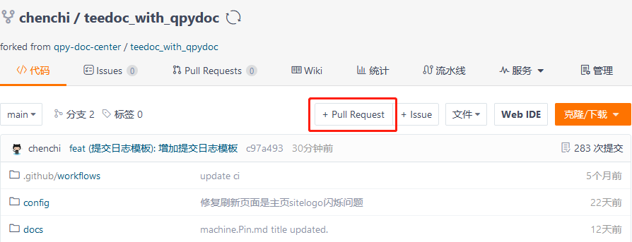

QuecPython doc website
=====

visit: [teedoc.neucrack.com](https://teedoc.neucrack.com/) or [teedoc.github.io](https://teedoc.github.io)


## Build locally

* Install Python3 first

    ```bash
    # On Windows system, just double-click Python exe installer.
    sudo apt install python3 python3-pip python3-venv
    ```

* Create virtual environment of Python3

    ```bash
    # On Windows system, use 'path\to\.pyenv3' instead.
    python3 -m venv path/to/.pyenv3
    ```

* Activate virtual environment of Python3

    ```bash
    # On Windows system, run 'path\to\.pyenv3\Scripts\activate.bat' instead under working directory.
    source path/to/.pyenv3/bin/activate
    ```

* Install teedoc

    ```bash
    pip3 install teedoc -i https://pypi.tuna.tsinghua.edu.cn/simple
    ```

* Get source files

    ```bash
    git clone https://gitee.com/qpy-doc-center/teedoc_with_qpydoc.git
    ```

* Install plugins

    ```bash
    cd teedoc_with_qpydoc
    teedoc install
    ```

* build and serve

    ```bash
    # Build static pages of website.
    ./build.sh

    # Build static pages of website and start service.
    ./build.sh -s
    ```

then visit [http://127.0.0.1:8000](http://127.0.0.1:8000)

## Commit and push

* Configure committing template

    ```bash
    # The configuration only takes effect in the current repository.
    # The command below should be executed everytime you clone this repository.
    git config commit.template ./commit.template

    # The configuration takes effect globally.
    # The command can ONLY be executed once (remember to copy commit.template file to a fixed path)
    git config --global commit.template path/to/commit.template
    ```

* Configure git editor

    ```bash
    # Configure Notepad++ as git editor
    git config --global core.editor "'C:\Program Files\Notepad++\notepad++.exe' -multiInst -notabbar -nosession -noPlugin"

    # Configure VSCode as git editor
    git config --global core.editor "code --wait"

    # Configure vim as git editor
    git config --global core.editor vim
    ```

    > Choose one you are familiar with.

* Check the status of project repository

    ```bash
    git status
    ```

* Add necessary files or directories those to be committed

    ```bash
    git add <files | dirs>
    ```

* Commit your modification

    ```bash
    # MUST NOT use '-m' option to append message directly!
    git commit
    ```

    > After this action, write your committing message in a pop-up editor window, and SAVE it before closing.

* Push your committing

    ```bash
    git push
    ```

* Create pull-request

Create pull-request according to pictures below:




## Note

* If you use `git commit -m` to commit accidentally, and havn't do a new committing, you can use `git commit --amend` to re-edit your committing message, and SAVE it before closing.

    > If you want to modify committing message that behind the newest one, please contact Chavis, because it is a bit complicated, you may don't know how to do it.
