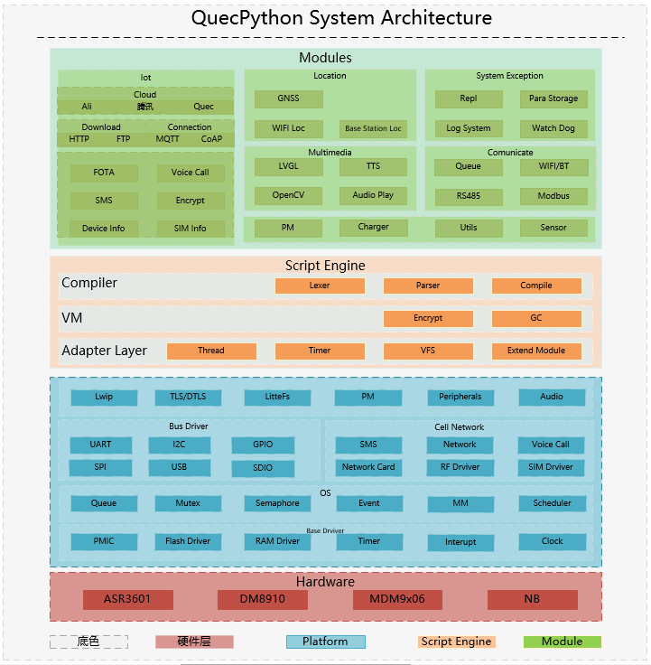

# QuecPython API 参考手册

**作者**

&emsp;&emsp;&emsp;QuecPython开发团队

**版本**

&emsp;&emsp;&emsp;1.12

QuecPython 由移远通信 QuecPython 开发团队基于开源项目 microPython 移植而来。其继承了 microPython 基础功能的同时，又扩充了我司通信模组相关的功能，开发者可以很好地使用 QuecPython 进行嵌入式物联网项目的开发。

或许你对 QuecPython 还比较陌生，然而一旦你对它有所接触，你就会立即发现它的魅力和它相较于其他嵌入式物联网项目开发方式的种种优越之处。

## QuecPython 概述

QuecPython 取 "Quectel + microPython" 之意，其兼容 Python3 的语法规范；最小 ROM 占用空间为150KB，最小 RAM 占用空间为 50KB。

得益于 Python 先天的优势，使得 QuecPython 具有`跨平台`、`无需编译`、`动态加载`、`提供丰富且成熟的应用框架`等诸多优势；同时 QuecPython 也提供了诸如`智能电表`、`智能定位器`、`公网对讲机`、`BMS通信云盒`及其它更多的解决方案（[点此查看详情](./url)<!--FIXME on url-->）。

QuecPython 团队也提供了丰富的开发工具，如QPYcom、VSCode插件、产测工具等，方便用户进行开发和生产测试。

## QuecPython 架构

近年来，物联网市场发展迅猛， 嵌入式设备的联网已是大势所趋。传统的嵌入式物联网项目开发仍然采取在基于C语言的RTOS内核上移植或开发功能组件的方式，此方式开发效率低，平台适配工作量大，对开发者能力要求较高。

QuecPython 则在系统中集成了丰富的嵌入式物联网项目常用的各种组件，用户只需要简单的调用 Python 接口即可快速实现功能。系统架构如下图所示：

## QuecPython API 参考手册

- [QuecPython标准库](./QuecPython标准库/README.md)
- [QuecPython类库](./QuecPython类库/README.md)
- [QuecPython组件库](./QuecPython组件库/README.md)
