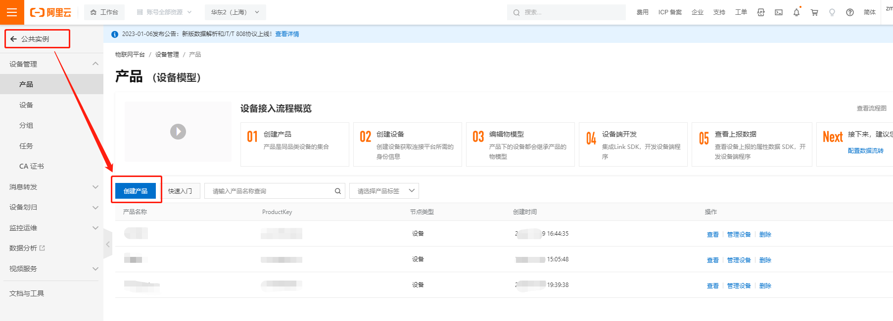

# 阿里云应用指导文档

## 1. 功能简介

基于MQTT协议连接到阿里云物联网平台，设备快速连云，支持“一机一密和“一型一密”两种认证方式。

## 2. 应用场景说明

通过阿里云物联网平台对同一产品下的设备进行管理，处理设备事件，完成消息转发，OTA升级等应用功能。

## 3. 功能应用流程

### 3.1. 阿里云物联网平台

详细文档请查看：https://help.aliyun.com/document_detail/145493.html

#### 3.1.1.名称解释

连接三元组：三元组指的是ProductKey（产品标识）DeviceName（设备名）DeviceSecret（设备密钥），是设备与物联网平台建立连接时的认证信息。

一机一密：每个设备烧录其唯一的设备证书（ProductKey、DeviceName 和 DeviceSecret），当设备与物联网平台建立连接时，物联网平台对其携带的设备证书信息进行认证。

一型一密：同一产品下所有设备可以烧录相同产品证书（即 ProductKey 和 ProductSecret ），设备发送激活请求时，物联网平台进行产品身份确认，认证通过，下发该设备对应的 DeviceSecret

#### 3.1.2.平台地址

- 阿里云：https://www.aliyun.com

  

  注册个人或者企业账号进行账号登录

#### 3.1.3.创建实例

- 进入物联网平台

  

- 选择实例，根据需求选择，试用选择公共实例即可

  

- 实例概览

  

#### 3.1.4.创建产品

- 点击实例进行产品创建

  

- 按需填写产品创建信息

  

- 产品列表展示

  

#### 3.1.5.查看产品信息

- 产品信息包含ProductKey 和 ProductSecret

  

#### 3.1.6.创建设备

- 选择产品进行设备创建

  

- 添加设备

  

- 手动编辑设备信息

  

- 设备创建完成后处于未激活状态

  

#### 3.1.7.查看设备信息

- 查看设备信息，设备信息包含ProductKey（产品标识）DeviceName（设备名）DeviceSecret（设备密钥）

  

### 3.2. QuecPython连接阿里云

QuecPython 官网地址：https://python.quectel.com

#### 3.2.1.开发环境搭建

- 驱动安装

  驱动下载地址：https://python.quectel.com/download

  选择对应平台的USB驱动进行安装

  

- QPYcom 图形化工具下载

  应用调试基于此工具，下载地址：https://python.quectel.com/download

  

- 模组固件下载

  根据所用的模组型号选择固件下载后烧录，此文档调试选择EC600N CNLE进行演示。

  

#### 3.2.2.设备调试

- 打开电脑设备管理器，查看端口

    

- 选择 Quectel USB MI05 COM Port串口，使用QPYcom工具打开该串口

  

- 查询SIM卡状态和拨号状态

  API 使用以及说明查阅Wiki文档：https://python.quectel.com/wiki/#/

  ```python
  >>> import sim
  >>> sim.getStatus()  # 返回1表示SIM状态正常
  1
  >>> import dataCall
  >>> dataCall.getInfo(1,2)  # 成功返回拨号信息
  (1, 0, [1, 0, '10.145.246.10', '211.138.180.2', '211.138.180.3'], [1, 0, '::', '::', '::'])
  >>> 
  ```

#### 3.2.3.设备连云

阿里云API 使用以及说明查阅Wiki文档：https://python.quectel.com/wiki/#/zh-cn/api/QuecPythonThirdlib

- 导入阿里云API

  ```python
  >>> from aLiYun import aLiYun
  ```

- 创建aliyun连接对象

  ```python
  >>> from aLiYun import aLiYun
  
  >>> productKey = "a1YoiRfLSbV"
  >>> DeviceName = "QuecPyhon_Dev"						
  >>> DeviceSecret = "a86aadbbe78de7b8248adfc09e458bb9"
  >>> productSecre = None
  >>>
  >>> ali_obj = aLiYun(productKey, productSecre, DeviceName, DeviceSecret)
  ```

- 注册事件回调函数

  ```python
  >>> def event_callback(topic, data):
  ...     print("aliyun callback recv: {}".format(data))
  ...     
  ...     
  ... 
  >>> ali_obj.setCallback(event_callback)
  ```

- 设置连接参数并连接平台,state为0时表示连接成功,连接成功后调用start方法

  ```python
  >>> clientID = "Quecpython"
  >>> clean_session = False
  >>> keepAlive = 300
  >>> reconn = True
  
  >>> state = ali_obj.setMqtt(clientID, clean_session=False, keepAlive=300,reconn=True)
  >>> state
  0
  >>> ali_obj.start()
  ```

  云端查看设备状态，由创建时未激活状态变成在线状态

  

#### 3.2.4.订阅Topic

- 根据平台订阅规则选择操作权限为订阅的Topic

  /a1YoiRfLSbV/${deviceName}/user/get：$ {deviceName}替换成我们的设备名称即可,例如"/a1YoiRfLSbV/QuecPyhon_Dev/user/get"

  

  ```python
  >>> ali_obj.subscribe("/a1YoiRfLSbV/QuecPyhon_Dev/user/get")
  0
  >>> 
  ```

#### 3.2.5.数据上行

- 发布主题消息到平台，Topic选择操作权限为发布的进行数据上报

  ```python
  >>> ali_obj.publish("/a1YoiRfLSbV/QuecPyhon_Dev/user/update", "Hello, Aliyun!")
  True
  >>> 
  ```

  云端查看设备上行消息

  

  

#### 3.2.6.数据下行

- 找到设备订阅的Topic，选择发布消息

  

  

  设备查看平台下行数据,通过我们注册的回调函数接收数据

  

## 4. 注意事项

- 设备进行云连接时需确认网络状态，例如SIM卡是否能够注网，设备是否拨号成功
- 确保所用模组包含阿里云连接API可供使用
- Topic注意操作权限

