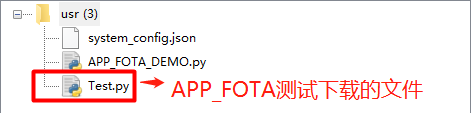
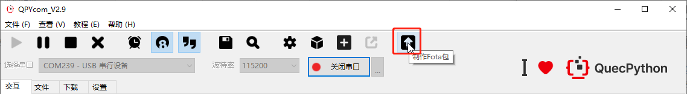
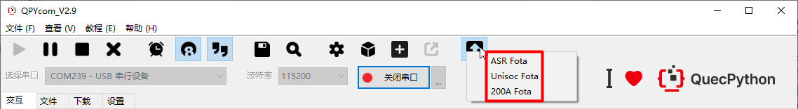
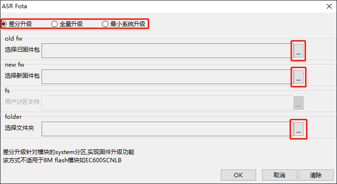
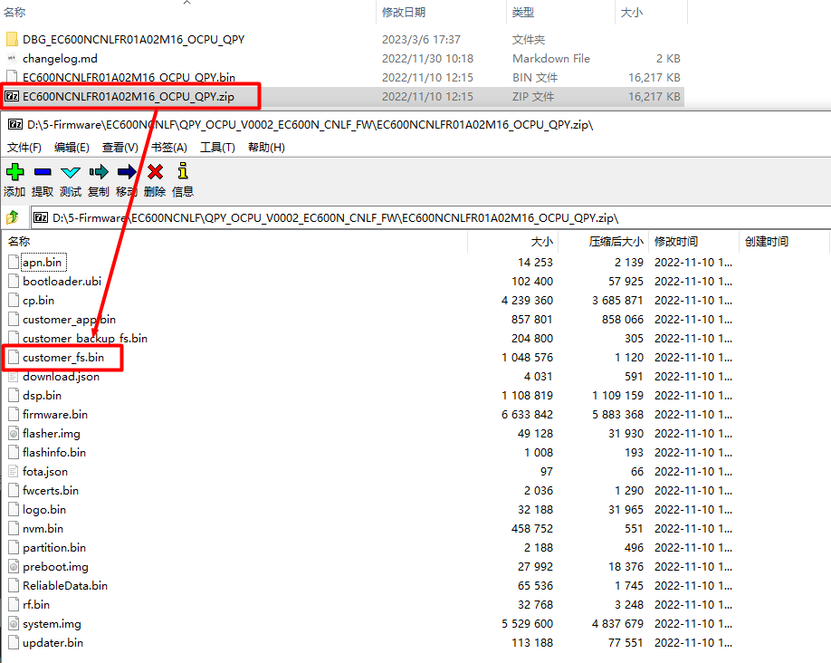

# OTA升级

OTA：Over-the-Air Technology空中下载技术，是通过移动通信的空中接口实现对移动终端设备进行远程管理的技术。QuecPython的OTA升级包含两部分：**OTA升级-文件**及**OTA升级-固件**。OTA升级功能测试需用到HTTP服务器作为升级内容的存放点，该部分内容本章节不做介绍，客户自行实现。本章节先介绍基本概念与理论，结合实际操作进行讲解OTA升级的使用。


## OTA升级-文件

### 什么是OTA升级-文件

OTA：Over-the-Air Technology空中下载技术，是通过移动通信的空中接口实现对移动终端设备进行远程管理的技术。

OTA升级-文件就是利用这项技术对模块进行文件升级。在QuecPython中该功能接口为[APP_FOTA](../../../API_reference/zh/QuecPython类库/app_fota.html)。为阅读体验以下均命名为APP_FOTA。

### 怎么使用APP_FOTA

#### 升级准备

在之前的引言中已经说到OTA升级需要使用到HTTP服务器作为升级内容的存放点。对于APP_FOTA而言，服务器需要存储客户需要升级文件内容。此部分工作由客户自主完成。目的就是得到一个可以访问下载到该文件的URL地址即可。

#### 硬件设计

APP_FOTA升级主要为网络侧与模块内部交互，除前提条件模块需要组网成功外无需其他外围硬件支持。

#### 软件应用

QuecPython中APP_FOTA功能支持单文件下载与批量文件下载。API接口分别为：**fota.download(url, file_name)**与**fota.bulk_download(info=[])**，有关API的详细介绍请参考[APP_FOTA](../../../API_reference/zh/QuecPython类库/app_fota.html)。

需要注意是：调用APP_FOTA接口后文件不是直接下载到**usr**分区（模块存放用户文件的分区），而是下载到一个临时的**.updater**文件夹中。该文件夹可能存在与**usr.updater**文件夹下，也可能存在于**./fota/usr/.updater**。但对于实际使用不需要关注这些。只需了解APP_FOTA后文件并非直接存在**usr**目录，需要**fota.set_update_flag()**设置升级标志位后重启模组才会自动将对应文件搬运至**usr**目录。

示例代码如下：

```python
import app_fota
from misc import Power
import utime as time


files = ["file_name.file_suffix"]
download_list = []
url = r"url_connection"

for file in files:
    download_list.append({'url': (url + file), 'file_name': '/usr/%s' % file})

if download_list:
    print("downlist: %d\r\n" % len(download_list), download_list)
    fota = app_fota.new()
    result = fota.bulk_download(download_list)
    fota.set_update_flag()

    print("update ....", result)
    time.sleep(1)
    Power.powerRestart()  # 重启模块
```

注：`file_name.file_suffix`替换为需要下载的文件名加后缀一起。`url_connection`替换为文件存放服务器的连接。

### APP_FOTA文件下载测试

使用QPYcom工具和模组进行交互，下载示例代码至模组进行运行。

APP_FOTA_DEMO运行前：


APP_FOTA_DEMO运行后：




## OTA升级-固件

### 什么是OTA升级-固件

OTA：Over-the-Air Technology空中下载技术，是通过移动通信的空中接口实现对移动终端设备进行远程管理的技术。

OTA升级-固件就是利用这项技术进行模块固件升级。在QuecPython中该功能接口为[FOTA](/../../../API_reference/zh/QuecPython类库/fota.html)。为阅读体验以下均命名为FOTA。

### 怎么使用FOTA

#### 硬件设计

[FOTA](/../../../API_reference/zh/QuecPython类库/fota.html)升级主要为网络侧与模块内部交互，除前提条件模块需要组网成功外无需其他外围硬件支持。

#### 软件应用

在之前的引言中已经提到OTA升级需要使用到HTTP服务器作为升级内容的存放点。对于FOTA而言是否就是存储需要升级的固件呢？答案不是。其主要原因也容易想到，无法就是固件太大与没内存缓存等。问题是不存储原始固件存储什么呢？答案是差分包。也是两版固件差异的部分。这样一来以上问题就得到了解决。

那问题来了，怎么制作差分包FOTA升级时怎么操作呢？下面我们分：`FOTA分类`；`差分包制作`；`软件设计`三个部分来分别介绍。

##### FOTA分类

FOTA类型分为三种：`差分升级`；`全量升级`；`最小系统升级`。下面就这三种FOTA类型的功能与支持的型号分别进行介绍。

| 序号 | FOTA类型     | 使用模组                            | 实现功能          |
| ---- | ------------ | ----------------------------------- | ----------------- |
| 1    | 差分升级     | ASR_16MFlash模组及ASR平台外所有模组 | 固件升级          |
| 2    | 全量升级     | ASR_16MFlash模组                    | 客户脚本升级      |
| 3    | 最小系统升级 | ASR平台所有模组                     | 固件+客户脚本升级 |

##### 差分包制作

为便于客户制作差分包简化流程，QuecPython团队将制作差分包功能集成到了QPYcom工具中。如下图添加制作FOTA包按钮进入制作FOTA工具。



选择模块对应的平台。



选择对应的FOTA类型后，依次选择旧/新固件包，选择差分包输出的文件夹，最后选择`OK`按钮即可生成对应的差分包。

**注：不同平台上传与生成的固件后缀有所不同。**



若是进行全量或是最小系统升级，会需要选择”用户分区文件“。该文件存在于ASR的固件包中。将官网提供的.bin后缀固件修改为.zip后缀。然后使用压缩工具打开，其中的`customer_fs.bin`文件就是我们这里上传的文件。

**注：只有ASR平台模组才会支持这两种升级类型。**



其他操作与上述差分升级流程类似，这里不做赘述。

##### 软件设计

首先将上面步骤制作的差分包上传至HTTP服务器中。然后模块执行如下代码进行FOTA升级。

```Python
# 差分升级
import fota
import utime

DEF_URL1 = 'url1_connection'

def result(args):
	print('download status:', args[0], 'download process:', args[1])
	
def run():
	fota_obj = fota() # 创建 Fota 对象
	print("进入升级状态......")
	res = fota_obj.httpDownload(url1=DEF_URL1, callback=result)
	if res != 0:
		print("httpDownload error")
		return
	print("wait httpDownload , update...")
	utime.sleep(2)

run()
```

```python
# 全量升级
import fota
import utime

DEF_URL1 = 'url1_connection'

def result(args):
    print('download status:', args[0], 'download process:', args[1])

def run():
    fota_obj = fota()  # 创建Fota对象
    print("httpDownload...")
    res = fota_obj.httpDownload(url1=DEF_URL1, callback=result)
    if res != 0:
        print("httpDownload error")
        return
    print("wait httpDownload , update...")
    utime.sleep(2)

run()
```

```python
# 最小系统升级
import fota
import utime

DEF_URL1 = 'url1_connection'
DEF_URL2 = 'url2_connection'

def run():
    fota_obj = fota()  # 创建Fota对象
    print("httpDownload...")
    res = fota_obj.httpDownload(url1=DEF_URL1, url2=DEF_URL2)
    if res != 0:
        print("httpDownload error")
        return
    print("wait httpDownload , update...")
    utime.sleep(2)

run()
```

注：`url_connection`替换为文件存放服务器的连接。

### FOTA文件下载测试

使用QPYcom工具和模组进行交互，下载示例代码至模组进行运行。

FOTA过程模块会反复重启，请耐心等待。