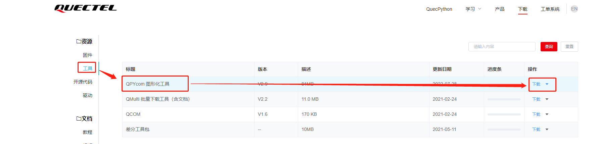
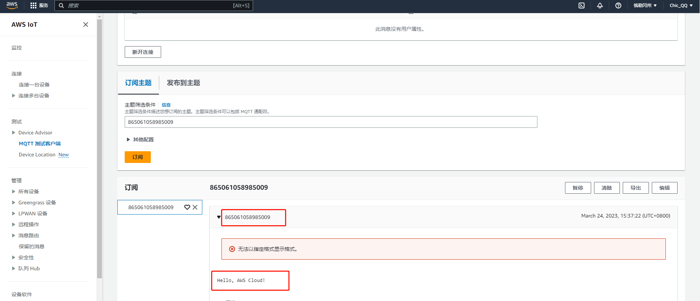

# 文档历史

**修订记录**

| **版本** | **日期**   | **作者**  | **变更表述** |
| -------- | ---------- | --------- | ------------ |
| 1.0      | 2023-04-24 | Pawn.zhou | 初始版本     |


# 亚马逊云应用指导文档

## 简介

基于MQTT协议连接到亚马逊云物联网平台，设备快速连云，支持“一机一密和“一型一密”两种认证方式。

## 应用场景说明

通过亚马逊物联网平台对同一产品下的设备进行管理，处理设备事件，完成消息转发，OTA升级等应用功能。

## 功能应用流程

### 亚马逊云物联网平台

详细文档请查看：https://docs.aws.amazon.com/iot/latest/developerguide/mqtt.html

#### 名称解释

连接三元组：三元组指的是ProductKey（产品标识）DeviceName（设备名）DeviceSecret（设备密钥），是设备与物联网平台建立连接时的认证信息。

一机一密：每个设备烧录其唯一的设备证书（ProductKey、DeviceName 和 DeviceSecret），当设备与物联网平台建立连接时，物联网平台对其携带的设备证书信息进行认证。

一型一密：同一产品下所有设备可以烧录相同产品证书（即 ProductKey 和 ProductSecret ），设备发送激活请求时，物联网平台进行产品身份确认，认证通过，下发该设备对应的 DeviceSecret

#### 平台地址

- 亚马逊云：https://aws.amazon.com/cn

  

  登录亚马逊云的物联网IoT Core（如果没有开通相关功能请自行开通）。
  
  

#### 创建策略

- 进入物联网平台

  

  

- 查看策略列表

  

#### 创建物品

- ioT 物品是云中的物理设备的表示形式

  

- 按需填写产品创建信息,选择自动生新证书

  

  

- 选择策略后下载设备证书，完成“创建物品，用证书连接AWS IoT平台，同一个证书可以用于多个设备，不同设备的Client ID保持唯一

  
  
  

#### 查看终端地址

- 亚马逊云服务地址，用于mqtt客户端连接，端口固定8883

  

### QuecPython连接亚马逊云

QuecPython 官网地址：https://python.quectel.com

#### 开发环境搭建

- 驱动安装

  驱动下载地址：https://python.quectel.com/download

  选择对应平台的USB驱动进行安装

  

- QPYcom 图形化工具下载

  应用调试基于此工具，下载地址：https://python.quectel.com/download

  

- 模组固件下载

  根据所用的模组型号选择固件下载后烧录，此文档调试选择EC600N CNLE进行演示。

  

#### 设备调试

- 打开电脑设备管理器，查看端口

    

- 选择 Quectel USB MI05 COM Port串口，使用QPYcom工具打开该串口

  

- 查询SIM卡状态和拨号状态

  API 使用以及说明查阅Wiki文档：https://python.quectel.com/doc/API_reference/zh

  ```python
  >>> import sim
  >>> sim.getStatus()  # 返回1表示SIM状态正常
  1
  >>> import dataCall
  >>> dataCall.getInfo(1,2)  # 成功返回拨号信息
  (1, 0, [1, 0, '10.145.246.10', '211.138.180.2', '211.138.180.3'], [1, 0, '::', '::', '::'])
  >>> 
  ```

#### 设备连云

MQTT API 使用以及说明查阅Wiki文档：https://python.quectel.com/doc/API_reference/zh

- 导入MQTT API

  ```python
  >>> from umqtt import MQTTClient
  ```

- 创建MQTT连接对象

  ```python
  >>> from umqtt import MQTTClient
  
  >>> CLIENT_ID = 'Quecpython_dev'
  >>> SERVER = 'ambzd54j67b7h-ats.iot.us-west-2.amazonaws.com'						
  >>> PORT = 8883
  >>> USER = None
  >>> PASSWORD = None
  >>> certificate_content = "" 	# 数字证书 (certificate.crt)
  >>> private_content = ""   		# 私钥	(private.pem)
  >>> mqtt_obj = MQTTClient(client_id=CLIENT_ID, server=SERVER, port=PORT,user=USER,password=PASSWORD,keepalive=30,ssl=True,ssl_params={"cert": certificate_content,"key": private_content})
  ```

- 注册事件回调函数

  ```python
  >>> def event_callback(topic, data):
  ...     print("Subscribe Recv: Topic={},Msg={}".format(topic.decode(),msg.decode()))
  ...     
  ...     
  ... 
  >>> mqtt_obj.set_callback(event_callback)
  ```

- 发起连接

  ```python
  >>> mqtt_obj.connect()
  ```
  

#### 订阅Topic

- 自定义Topic，这里测试以设备IMEI为Topic

  

  ```python
  >>> mqtt_obj.subscribe("865061058985009")
  0
  ```
#### 数据上行

- 发布主题消息到平台

  ```python
  >>> mqtt_obj.publish("865061058985009", "Hello, AWS Cloud!")
  True
  >>> 
  ```

  云端查看设备上行消息

  


#### 数据下行

- 找到设备订阅的Topic，选择发布消息

  

  设备查看平台下行数据,通过我们注册的回调函数接收数据

  

## 注意事项

- 设备进行云连接时需确认网络状态，例如SIM卡是否能够注网，设备是否拨号成功
- 确保所用模组包含MQTT连接API可供使用

