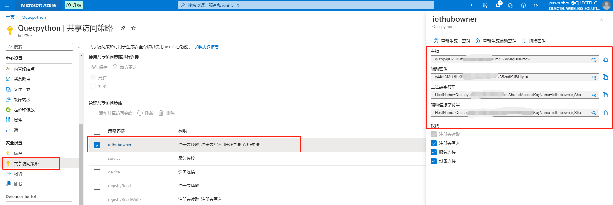

# 文档历史

**修订记录**

| **版本** | **日期**   | **作者**  | **变更表述** |
| -------- | ---------- | --------- | ------------ |
| 1.0      | 2023-04-24 | Pawn.zhou | 初始版本     |


# QuecPython接入微软云操作文档

## 简介

基于MQTT协议连接到微软云物联网平台，设备快速连云，支持“一机一密和“一型一密”两种认证方式。

## 应用场景说明

通过微软物联网平台对同一产品下的设备进行管理，处理设备事件，完成消息转发，OTA升级等应用功能。

## 功能应用流程

### 微软云物联网平台

详细文档请查看：https://learn.microsoft.com/zh-cn/azure/iot-hub/iot-hub-mqtt-support

#### 名称解释

连接三元组：三元组指的是ProductKey（产品标识）DeviceName（设备名）DeviceSecret（设备密钥），是设备与物联网平台建立连接时的认证信息。

一机一密：每个设备烧录其唯一的设备证书（ProductKey、DeviceName 和 DeviceSecret），当设备与物联网平台建立连接时，物联网平台对其携带的设备证书信息进行认证。

一型一密：同一产品下所有设备可以烧录相同产品证书（即 ProductKey 和 ProductSecret ），设备发送激活请求时，物联网平台进行产品身份确认，认证通过，下发该设备对应的 DeviceSecret

#### 平台地址

- 微软云：https://azure.microsoft.com/zh-cn

  

  创建账号登陆到微软云平台
  
  

#### 创建资源组

- 进入物联网平台

  

- 创建资源组

  

  

  

- 填写资源组信息

  
  
  
  
  

#### 添加IOT中心

- 当前创建资源组添加IOT中心

  

  

- 搜索选择iot中心

  

- 按需填写IOT中心

  

- 设置共享访问策略，查看连接密钥

  


#### 创建IOT设备

- 基于创建的IOT中心添加设备

  

- 按需填写设备创建信息

  

- 设备列表展示

  

#### 查看设备信息

- 设备信息包含连接连接密钥

  

### QuecPython连接微软云

QuecPython 官网地址：https://python.quectel.com

#### 开发环境搭建

- 驱动安装

  驱动下载地址：https://python.quectel.com/download

  选择对应平台的USB驱动进行安装

  

- QPYcom 图形化工具下载

  应用调试基于此工具，下载地址：https://python.quectel.com/download

  

- 模组固件下载

  根据所用的模组型号选择固件下载后烧录，此文档调试选择EC600N CNLE进行演示。

  

#### 设备调试

- 打开电脑设备管理器，查看端口

    

- 选择 Quectel USB MI05 COM Port串口，使用QPYcom工具打开该串口

  

- 查询SIM卡状态和拨号状态

  API 使用以及说明查阅Wiki文档：https://python.quectel.com/doc/API_reference/zh

  ```python
  >>> import sim
  >>> sim.getStatus()  # 返回1表示SIM状态正常
  1
  >>> import dataCall
  >>> dataCall.getInfo(1,2)  # 成功返回拨号信息
  (1, 0, [1, 0, '10.145.246.10', '211.138.180.2', '211.138.180.3'], [1, 0, '::', '::', '::'])
  >>> 
  ```

#### 设备连云

- 连接Token生成，使用Device Explorer Twin工具生成token（Device Explorer Twin工具可以通过 visual studio生成）

  获取云端设备信息

  

  生成SAS Token

  

  从生成的SAS令牌中提取user与password

  ```python
  UserName: {iothubhostname}/{device_id}/api-version=2018-06-30
      	  Quecpython.azure-devices.net/QuecPython_dev/api-version=2018-06-30
  password:生成的密钥中取大括号中的为password;
      SharedAccessSignature={SharedAccessSignature sr=Quecpython.azure-devices.net%2Fdevices%2FQuecPython_dev&sig=9EGbbDlOHbqF1iHjZiUBrFldqdVBL4bdRadP6OBg%2BMQ%3D&se=1679817565}
  ```

  

MQTT API 使用以及说明查阅Wiki文档：https://python.quectel.com/doc/API_reference/zh

- 导入MQTT API

  ```python
  >>> from umqtt import MQTTClient
  ```

- 创建MQTT连接对象

  ```python
  >>> from umqtt import MQTTClient
  
  >>> CLIENT_ID = 'QuecPython_dev'  # 设备名称
  >>> SERVER = 'Quecpython.azure-devices.net'						
  >>> PORT = 8883
  >>> USER = "Quecpython.azure-devices.net/QuecPython_dev/api-version=2018-06-30"
  >>> PASSWORD = "SharedAccessSignature sr=Quecpython.azure-devices.net%2Fdevices%2FQuecPython_dev&sig=9EGbbDlOHbqF1iHjZiUBrFldqdVBL4bdRadP6OBg%2BMQ%3D&se=1679817565"
  
  >>> mqtt_obj = MQTTClient(client_id=CLIENT_ID, server=SERVER, port=PORT,user=USER,password=PASSWORD,keepalive=60,ssl=True)
  ```

- 注册事件回调函数

  ```python
  >>> def event_callback(topic, data):
  ...     print("Subscribe Recv: Topic={},Msg={}".format(topic.decode(),msg.decode()))
  ...     
  ...     
  ... 
  >>> mqtt_obj.set_callback(event_callback)
  ```

- 发起连接

  ```python
  >>> mqtt_obj.connect()
  ```

## 注意事项

- 设备进行云连接时需确认网络状态，例如SIM卡是否能够注网，设备是否拨号成功
- 确保所用模组包含MQTT连接API可供使用

