# 文档历史

**修订记录**

| **版本** | **日期**   | **作者** | **变更表述** |
| -------- | ---------- | -------- | ------------ |
| 1.0      | 2021-09-29 | Chic     | 初始版本     |
| 1.1      | 2022-02-16 | Chic     | 改进设备调试 |
| 1.2      | 2023-04-24 | Pawn     | 文档格式更新 |


# QuecPython  接入华为云

## 简介

文档主要介绍如何使用HuaweiCloud华为云，HuaweiCloud设备接入服务（IoTDA）是华为云的物联网平台，提供海量设备连接上云、设备和云端双向消息通信、批量设备管理、远程控制和监控、OTA升级、设备联动规则等能力，并可将设备数据灵活流转到华为云其他服务。

下面主要从QuecPython的MQTT连接方式讲解，通过阅读本文，您将了解到QuecPython连接HuaweiCloud的过程操作和验证实验理论。

## 应用场景说明

通过华为云物联网平台对同一产品下的设备进行管理，处理设备事件，完成消息转发，OTA升级等应用功能。

## 功能应用流程

### 华为云物联网平台

打开华为云连接 [www.huaweicloud.com](http://www.huaweicloud.com)

#### 名称解释

连接三元组：三元组指的是ProductKey（产品标识）DeviceName（设备名）DeviceSecret（设备密钥），是设备与物联网平台建立连接时的认证信息。

一机一密：每个设备烧录其唯一的设备证书（ProductKey、DeviceName 和 DeviceSecret），当设备与物联网平台建立连接时，物联网平台对其携带的设备证书信息进行认证。

一型一密：同一产品下所有设备可以烧录相同产品证书（即 ProductKey 和 ProductSecret ），设备发送激活请求时，物联网平台进行产品身份确认，认证通过，下发该设备对应的 DeviceSecret

#### 进入平台

在首页点击【产品】---【IoT物联网】---【设备接入IoTDA】

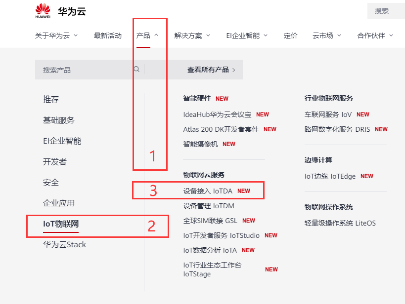

#### 创建产品

点击【产品】---【创建产品】

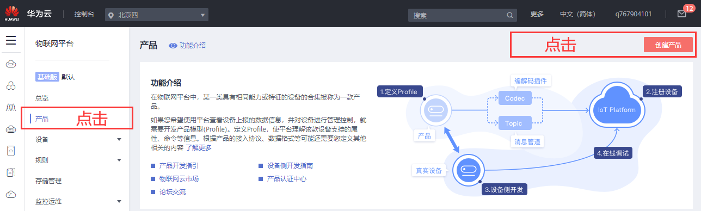

产品的“协议类型”选择MQTT

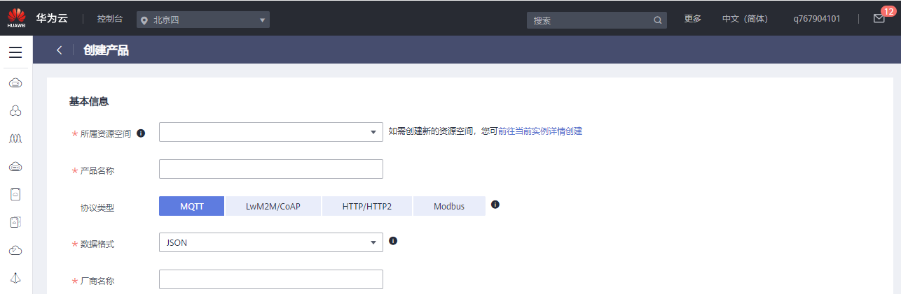

产品【模型定义】

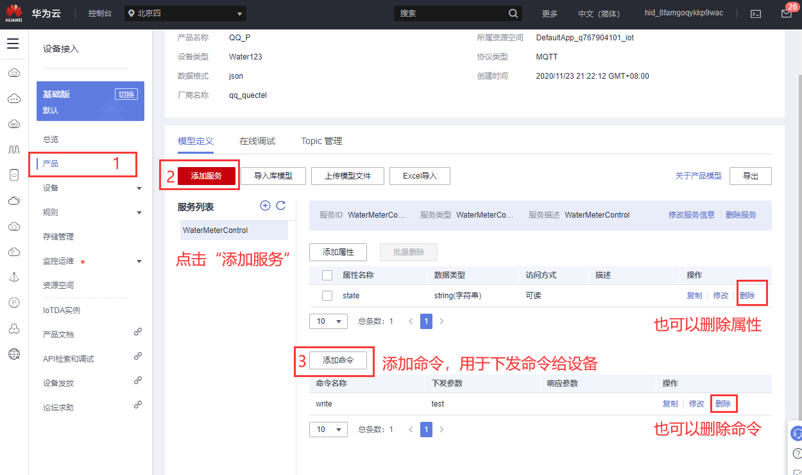

#### 添加设备

点击【设备】---【所有设备】

>   [https://console.huaweicloud.com/iotdm/?region=cn-north-4\#/dm-portal/device/all-device](https://console.huaweicloud.com/iotdm/?region=cn-north-4#/dm-portal/device/all-device)

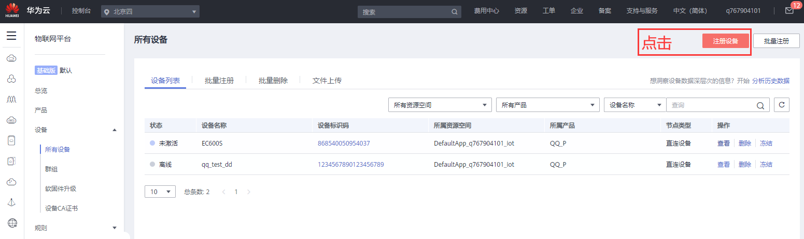

注册设备后自动生成的【设备ID】和【设备密钥】，记下来用于下一步骤生成连接平台的信息。

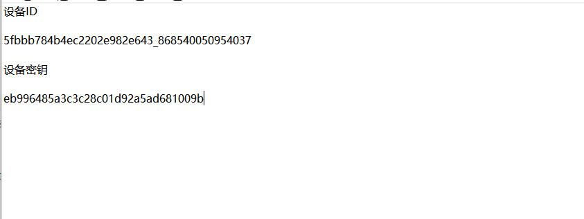

#### 生成连接信息

访问[这里](https://iot-tool.obs-website.cn-north-4.myhuaweicloud.com/)，填写[注册设备](https://support.huaweicloud.com/qs-iothub/iot_05_0006.html#ZH-CN_TOPIC_0251997880__li1261073102011)后生成的设备ID（DeviceId）和密钥（DeviceSecret），生成连接信息（ClientId、Username、Password）。

<https://iot-tool.obs-website.cn-north-4.myhuaweicloud.com/>

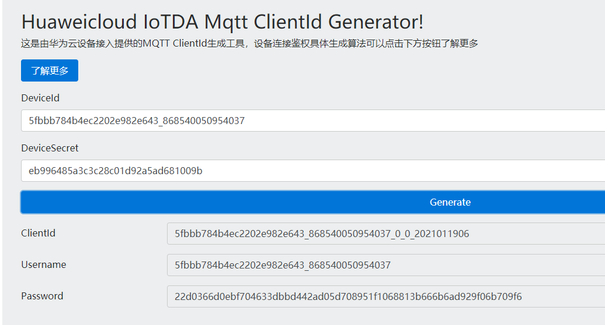

```python
CLIENT_ID = b'5fbbb784b4ec2202e982e643_868540050954037_0_0_2021011909'

SERVER = b'a15fbbd7ce.iot-mqtts.cn-north-4.myhuaweicloud.com'

PORT = 1883

USER = b'5fbbb784b4ec2202e982e643_868540050954037'

PASSWORD =b'8001a12405743199b3396943a2ed397286117a9ebab4f5dfda8dd6fafe341d94'
```

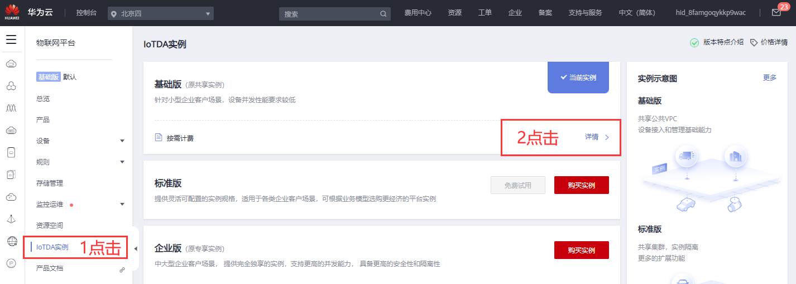

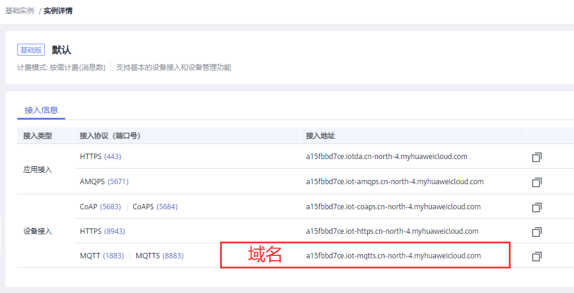

说明：

针对不支持用域名接入的设备，通过在cmd命令框中执行“ping
域名”获取IP地址，用IP地址接入平台。由于IP地址不固定，您需要将IP地址做成可配置项。

a15fbbd7ce.iot-mqtts.cn-north-4.myhuaweicloud.com

1883

使用生成工具生成的clientId格式，默认不校验时间戳：设备ID_0_0\_时间戳。

-   当采用“HMACSHA256”校验时间戳方式时，会先校验消息时间戳与平台时间是否一致，再判断密码是否正确。

-   当采用“HMACSHA256”不校验时间戳方式时，鉴权消息也必须带时间戳，但不检验时间是否准确，仅判断密码是否正确。

#### 上报数据

填写接口地址，此处以“\$oc/devices/{device_id}/sys/properties/report”为例，如“\$oc/devices/5e4e2e92ac-164aefa8fouquan1/sys/properties/report”。

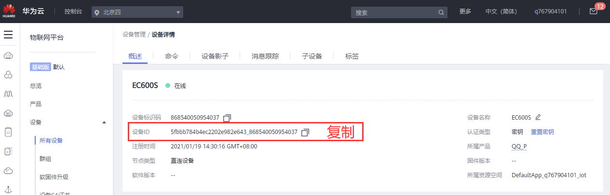

\$oc/devices/{device_id}/sys/properties/report

\$oc/devices/5fbbb784b4ec2202e982e643_868540050954037/sys/properties/report

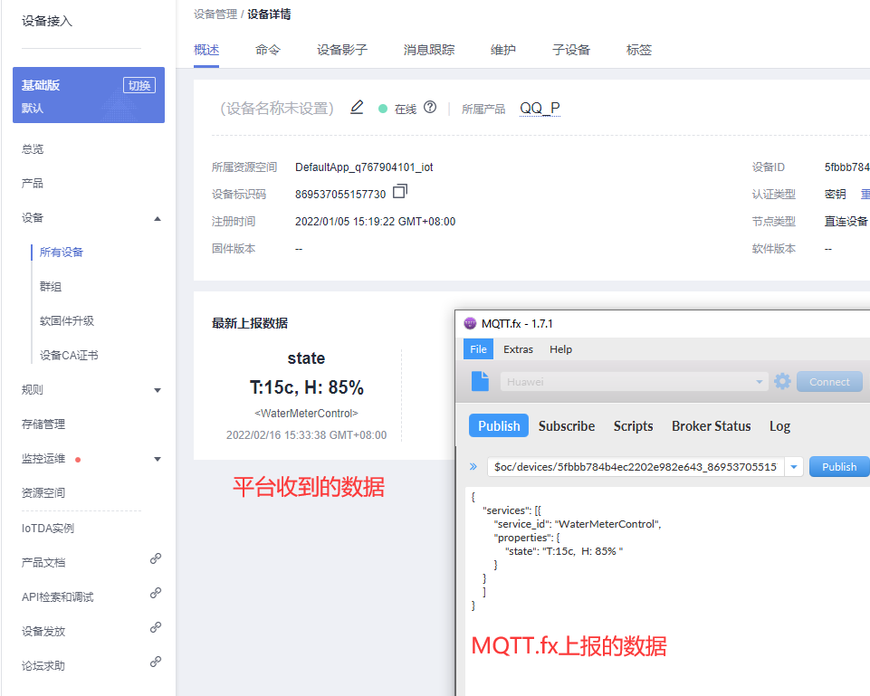

#### 下发数据

下发数据只能通过应用端的API请求。

URI

请求方法 POST

URI /v5/iot/{project_id}/devices/{device_id}/messages

传输协议 HTTPS

下发数据说明：

<https://support.huaweicloud.com/api-iothub/iot_06_v5_0059.html>

API调试页面：

<https://apiexplorer.developer.huaweicloud.com/apiexplorer/debug?product=IoTDA&api=CreateMessage>

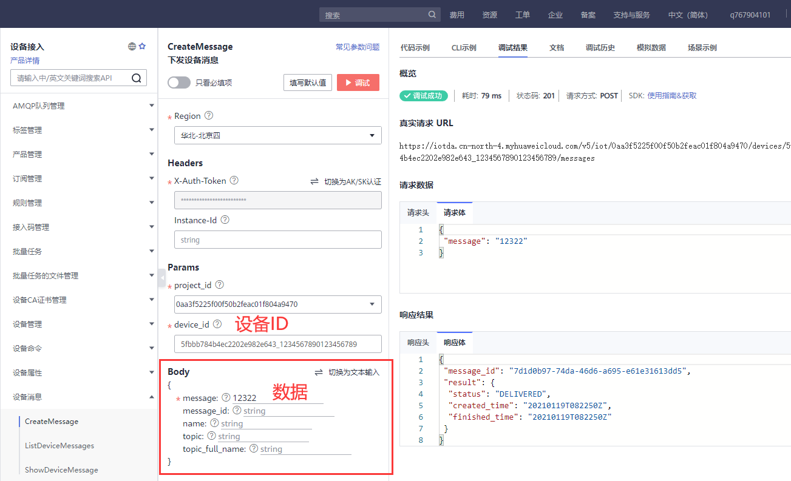

Topic: \$oc/devices/{device_id}/sys/messages/down

\$oc/devices/5fbbb784b4ec2202e982e643_1234567890123456789/sys/messages/down

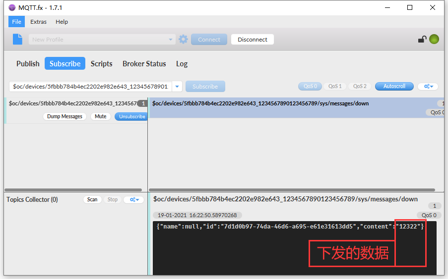

#### 下发命令

$oc/devices/{device_id}/sys/commands/request_id={request_id}

- 设备侧订阅带{request_id}参数的topic时，可以使用通配#。如设备侧订阅命令下发请求的topic $oc/devices/{device_id}/sys/commands/request_id={request_id}时，可以用$oc/devices/{device_id}/sys/commands/#


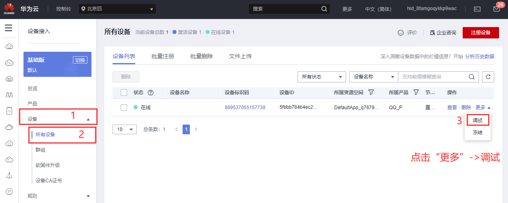

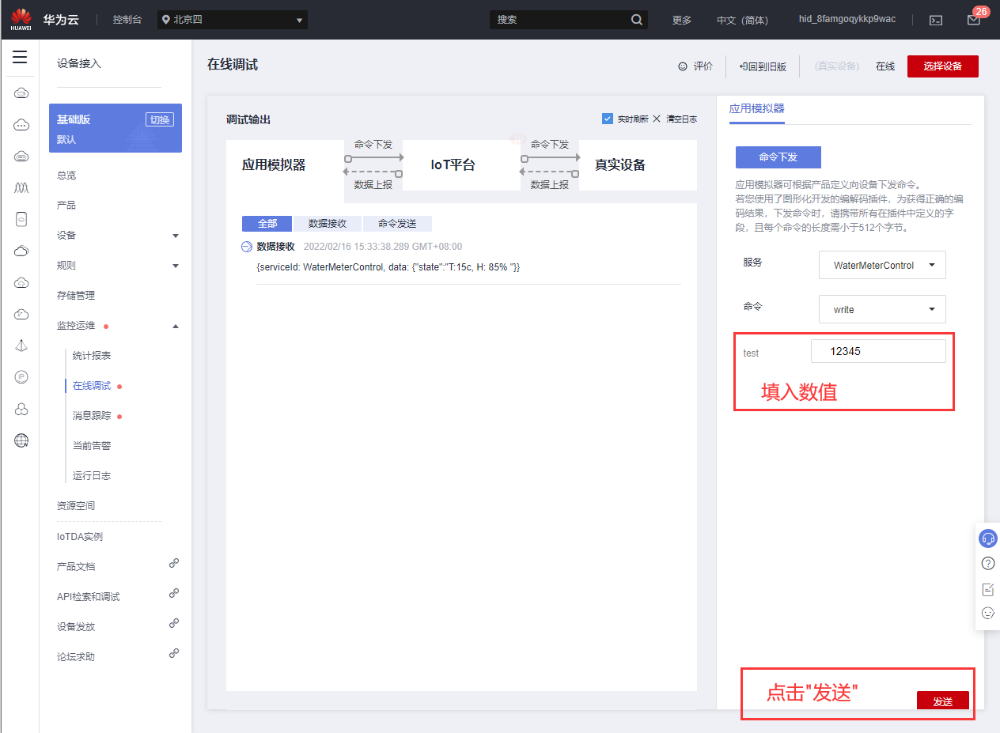

$oc/devices/{device_id}/sys/commands/request_id={request_id}

$oc/devices/5fbbb784b4ec2202e982e643_869537055157730/sys/commands/#

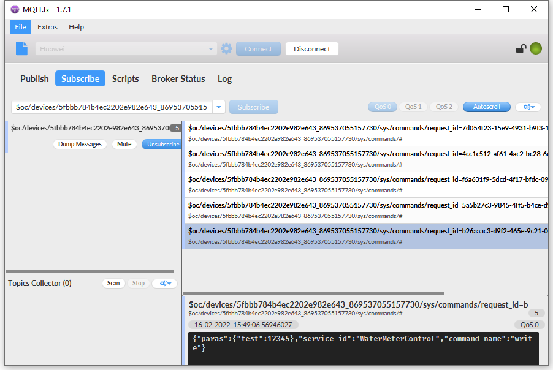

#### 响应命令

下行： $oc/devices/{device_id}/sys/commands/request_id={request_id}

上行：$oc/devices/{device_id}/sys/commands/response/request_id={request_id}

平台下发命令后，需要设备及时将命令的执行结果返回给平台，如果设备没回响应，平台会认为命令执行超时。

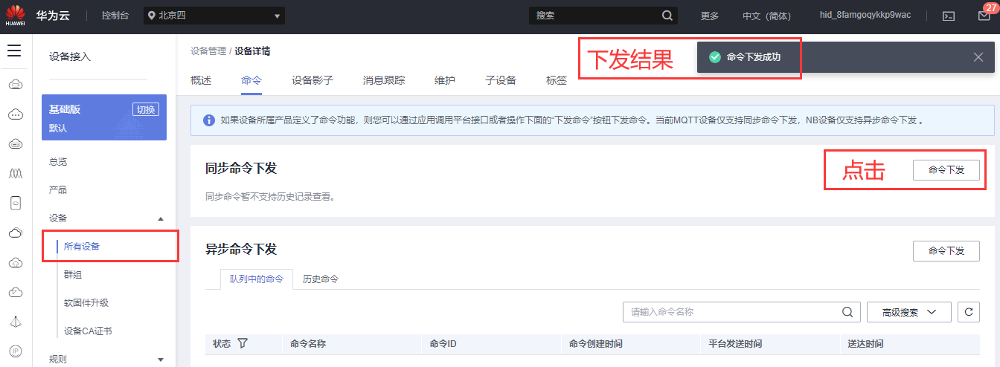

## 软件设计

在HuaweiCloud平台取得ClientId、Username、Password之后，即可通过QuecPython的umqtt连接云平台，连接云平台的地址和端口固定不变，接下来就可以编写代码实验了。

示例代码：

```python
import checkNet
from umqtt import MQTTClient
import modem
from machine import UART
import sim
import hmac
from hashlib import sha256
import utime

IMEI = modem.getDevImei()
E_SN = modem.getDevSN()
ESIM = sim.getImsi()

DeviceName = IMEI
DeviceSecret = 'ac4263b86eaf6442997a'
DeviceID = "5fbbb784b4ec2202e982e643"

CLIENT_ID = DeviceID + "_" + DeviceName + "_0_0_2022010507"
SERVER = "a15fbbd7ce.iot-mqtts.cn-north-4.myhuaweicloud.com"
PORT = 1883
USER = DeviceID + "_" + DeviceName
PASSWORD = hmac.new(
    "2022010507".encode('utf-8'),
    DeviceSecret.encode('utf-8'),
    digestmod=sha256).hexdigest()
DEVICE_ID = DeviceID + "_" + DeviceName

state = 0

def sub_cb(topic, msg):
    global state
    global c
    print(
        "Subscribe Recv: Topic={},Msg={}".format(
            topic.decode(),
            msg.decode()))
    topic = topic.decode()
    msg = b'''{
        "result_code": 0
    }'''
    if r'/sys/commands/request_id=' in topic:
        c.publish('$oc/devices/{}/sys/commands/response/request_id={}'.format(DEVICE_ID,(topic.split("=")[-1])),msg)
    state = 1


def MQTT_Init():
    global c
    c = MQTTClient(
        client_id=CLIENT_ID,
        server=SERVER,
        port=PORT,
        user=USER,
        password=PASSWORD,
        keepalive=30)

    c.set_callback(sub_cb)
    try:
        c.connect()
        c.subscribe('$oc/devices/{}/sys/commands/#'.format(DEVICE_ID))

        msg = b'''{
            "services": [{
                "service_id": "WaterMeterControl",
                "properties": {
                    "state": "T:15c,  H: 85% "
                }
            }
            ]
        }'''
        c.publish('$oc/devices/{}/sys/properties/report'.format(DEVICE_ID), msg)
    except BaseException:
        print('except')
    print('Waiting command')
    while True:
        c.wait_msg()
        if state == 1:
            utime.sleep_ms(300)
            break

    c.disconnect()


def main():
    MQTT_Init()


if __name__ == "__main__":
    main()

```

接下来就可以下载验证了，python代码不需要编译，直接通过QPYcom工具把.py文件下载到模块中运行。

## 下载验证

下载.py文件到模组运行：

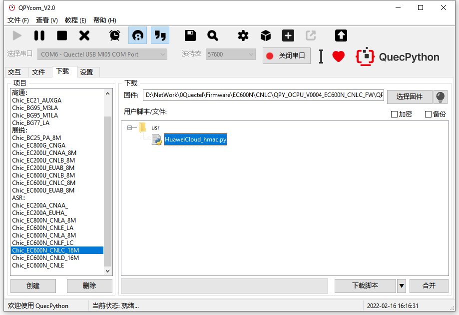

下载之后，手动让脚本运行起来。

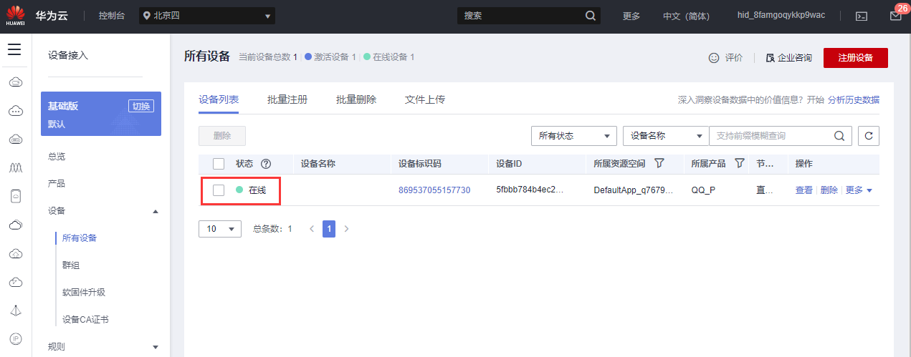

发送数据后，看到实验结果：

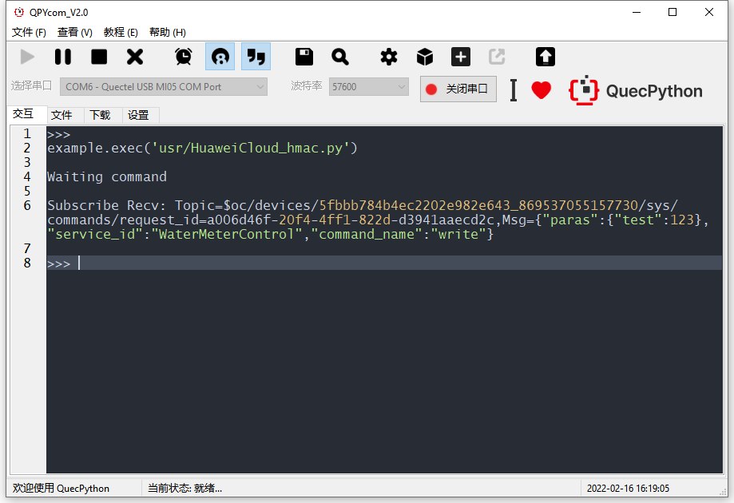


