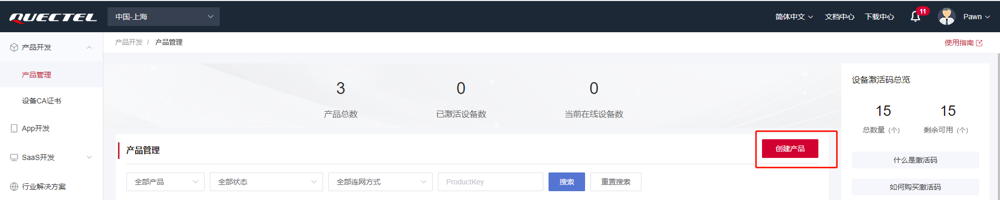

# 文档历史

**修订记录**

| **版本** | **日期**   | **作者**  | **变更表述** |
| -------- | ---------- | --------- | ------------ |
| 1.0      | 2023-04-24 | Pawn.zhou | 初始版本     |


# 移远云应用指导文档

## 简介

基于Quecthing SDK连接到移远云物联网平台，设备快速连云，设备认证方式支持 一型一密.

## 应用场景说明

通过移远云物联网平台对同一产品下的设备进行管理，处理设备事件，完成消息转发，OTA升级等应用功能。

## 功能应用流程

### 移远云物联网平台

详细文档请查看：https://iot-cloud-docs.quectelcn.com/homepage

#### 名称解释

连接三元组：三元组指的是ProductKey（产品标识）DeviceName（设备名）DeviceSecret（设备密钥），是设备与物联网平台建立连接时的认证信息。

一机一密：每个设备烧录其唯一的设备证书（ProductKey、DeviceName 和 DeviceSecret），当设备与物联网平台建立连接时，物联网平台对其携带的设备证书信息进行认证。

一型一密：同一产品下所有设备可以烧录相同产品证书（即 ProductKey 和 ProductSecret ），设备发送激活请求时，物联网平台进行产品身份确认，认证通过，下发该设备对应的 DeviceSecret

#### 平台地址

- 移远云：https://aiot.quectel.com

  

  进入开发者中心注册个人或者企业账号进行登录

#### 创建产品

- 点击创建产品

  

- 按需填写产品创建信息

  

- 产品列表展示

  

#### 查看产品信息

- 产品信息包含ProductKey 和 ProductSecret

  

### QuecPython连接移远云

QuecPython 官网地址：https://python.quectel.com

#### 开发环境搭建

- 驱动安装

  驱动下载地址：https://python.quectel.com/download

  选择对应平台的USB驱动进行安装

  

- QPYcom 图形化工具下载

  应用调试基于此工具，下载地址：https://python.quectel.com/download

  

- 模组固件下载

  根据所用的模组型号选择固件下载后烧录，此文档调试选择EC600N CNLE进行演示。

  

#### 设备调试

- 打开电脑设备管理器，查看端口

    

- 选择 Quectel USB MI05 COM Port串口，使用QPYcom工具打开该串口

  

- 查询SIM卡状态和拨号状态

  API 使用以及说明查阅Wiki文档：https://python.quectel.com/doc/API_reference/zh

  ```python
  >>> import sim
  >>> sim.getStatus()  # 返回1表示SIM状态正常
  1
  >>> import dataCall
  >>> dataCall.getInfo(1,2)  # 成功返回拨号信息
  (1, 0, [1, 0, '10.145.246.10', '211.138.180.2', '211.138.180.3'], [1, 0, '::', '::', '::'])
  >>> 
  ```

#### 设备连云

QuecPython 接入方案详细文档请查看：https://iot-cloud-docs.quectelcn.com/deviceDevelop/cellular/speediness/QuecPython/speediness-quecpython-02.html

回调函数中返回的事件状态码请查阅：https://iot-cloud-docs.quectelcn.com/deviceDevelop/subDevice/d_c_sub/QuecPython/sub-quecpython-api-01.html

- 设备上电后首先导入quecIot模块，初始化Quecthing。

  ```python
  >>> import quecIot
  >>> quecIot.init()
  
  True
  >>> 
  ```

- 注册事件回调函数

  ```python
  >>> def queciot_even_cb(data):
  ...     print("quecIot callback recv: {}".format(data))
  ...     
  ...     
  ... 
  >>> quecIot.setEventCB(queciot_even_cb)
  True
  >>> 
  ```

- 设备认证方式支持 一型一密，配置设备信息时，只需将您创建产品时获取到的 **PK、PS** 写入该方法传参中。

  ```python
  >>> quecIot.setProductinfo("p11pAr", "d0VIZmVJUmVaQzZq")
  
  True
  >>> 
  ```
  
- QuecPython提供设备一键连接接入开发者中心，接入后即可在开发者中心建立安全，稳定的通信并实现设备管理，监测，控制等操作

  ```python
  >>> quecIot.setConnmode(1)
  True
  >>> 
  quecIot callback recv: (1, 10200)   # 设备认证成功
  quecIot callback recv: (2, 10200)	# 接入成功
  quecIot callback recv: (3, 10200)	# 订阅成功
  ```
  
  云端查看设备状态，由创建时未激活状态变成在线状态
  


#### 数据上行

- 发布主题消息到平台，Topic选择操作权限为发布的进行数据上报

  ```python
  >>> quecIot.passTransSend(1, 'Hello Quectel')
  True
  >>> 
  quecIot callback recv: (4, 10200) # 消息ACK
  ```
```


```

云端查看设备上行消息


#### 数据下行

- 点击设备调试，编辑下行数据

  

  设备查看平台下行数据,通过我们注册的回调函数接收数据

  

## 注意事项

- 设备进行云连接时需确认网络状态，例如SIM卡是否能够注网，设备是否拨号成功
- 确保所用模组包含Quecthing连接API可供使用
- 使用前可先阅读API文档：https://iot-cloud-docs.quectelcn.com/deviceDevelop/subDevice/d_c_sub/QuecPython/sub-quecpython-example-01.html