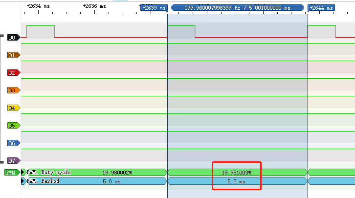

# PWM - 脉宽调制

## PWM 简介

### 什么是 PWM

[PWM](https://baike.baidu.com/item/脉冲宽度调制/10813756?fromtitle=PWM&fromid=3034961&fr=aladdin) 代表脉冲宽度调制（Pulse Width Modulation），是一种常见的电子信号调制技术。它通过改变信号的脉冲宽度来控制电路或设备的输出功率或速度。PWM 信号是一个周期性的信号，包含一个固定频率的基准信号和一个可变的占空比信号。占空比指的是脉冲宽度与周期之间的比率，它控制着信号的平均电平，从而控制电路或设备的输出功率或速度。

PWM 技术在电子工程、控制系统和机械工程等领域得到广泛应用。例如，在电机控制中，PWM 信号可以用来控制电机的转速和转向。在电源管理中，PWM 信号可以用来调节直流-直流转换器的输出电压和电流。在 LED 灯控制中，PWM 信号可以用来控制 LED 的亮度和颜色。

需要注意的是，在使用 PWM 技术时，需要选择适当的频率和占空比，以满足具体应用的需求。同时，还需要考虑 PWM 信号的稳定性和噪声等因素，以确保电路或设备的正常运行和可靠性。

### 怎么使用 PWM

使用 PWM 技术需要通过特定的电路或芯片来生成 PWM 信号，支持 QuecPython 开发的模组大部分都具有此功能，具体可见 [PWM 功能 API 文档](../../../API_reference/zh/QuecPython类库/misc.PWM.html) 确认是否支持此功能，可以按照以下步骤进行：

#### 硬件设计

根据上述 [PWM 功能 API 文档](../../../API_reference/zh/QuecPython类库/misc.PWM.html) 介绍的引脚号和模组的硬件设计文档（从 [下载区](/download/) 获取）设计好硬件电路即可。设计硬件电路注意需要注意电平转换，以及电平转换电路的最大输出频率。

如模组本身不支持或支持的数量不够用，则可以使用模组支持的任意一个 [GPIO](../../../API_reference/zh/QuecPython类库/machine.Pin.html) 结合 [定时器](../../../API_reference/zh/QuecPython类库/machine.Timer.html) 来粗略模拟输出 PWM 信号，硬件设计相同，软件实现可见下文。

#### 软件应用

当使用模组自带 PWM 功能时：

```python
>>>from misc import PWM
>>>pwm = PWM(PWM.PWM0, PWM.ABOVE_MS, 1, 5)
>>>pwm.open()
```

当自行模拟 PWM 功能时需要注意 QuecPython 对于时序控制并不是很精确，请自行根据需求实现相关代码。

#### PWM 功能测试

在命令行中执行上面三行代码即可让模组的 PWM0 引脚输出一个周期为 5ms，占空比为 20%的方波，借助 [逻辑分析仪](https://baike.baidu.com/item/逻辑分析仪/2364388?fr=aladdin) 我们可以看到输出的波形。交互界面及逻辑分析仪获取到的波形如下图。




如上图所示，填写的参数和实际抓取到的波形是能够对应上的，有关 API 具体参数含义可以仔细阅读 API 介绍文档进行理解。

对于 QuecPython 的 PWM API 需要注意的是，填的参数不能超出填写范围，否则将会出现报错，这是常见问题。

一般使用 PWM 功能主要步骤是：

1. 设置 PWM 参数：根据具体应用需求，设置 PWM 信号的频率和占空比等参数。频率决定信号的周期，占空比决定信号的平均电平和电路或设备的输出功率或速度。对于 QuecPython API，则需要填写高电平时间和周期来决定占空比和频率。即占空比 = 高电平时间/周期，频率 = 1 秒/周期（单位：秒）。
2. 连接 PWM 输出：将 PWM 信号的输出端口连接到需要控制的电路或设备，如电机、LED 等。通常需要使用适当的电路元件，如电容、电感、MOSFET 或三极管等，来控制 PWM 信号的幅值和波形。
3. 调试和优化：根据实际情况，调试 PWM 电路或程序，以确保 PWM 信号的稳定性和准确性。可以通过示波器、数字万用表等仪器来监测 PWM 信号的波形和电平等参数，进行优化和调整。

需要注意的是，在使用 PWM 技术时，需要根据具体应用需求选择合适的 PWM 芯片或电路，即选择合适的模组，并合理设置参数和连接电路。同时，还需要注意 PWM 信号的稳定性、可靠性和噪声等因素，以确保电路或设备的正常运行和安全性。

## PWM 功能应用实例

在本文中，我们将使用 QuecPython 板载的 PWM 功能，实现一个呼吸灯的效果。呼吸灯是一种灯光效果，类似于人类呼吸时的变化。它可以在各种电子设备中使用，例如嵌入式系统、智能家居、玩具等。

### 准备工作

我们需要使用 QuecPython 开发板、以及一个直插式 LED 灯（部分板载贴片式 LED 即可测试，详情请看电路原理图确认）。将 LED 灯连接到 QuecPython 开发板上。将 LED 的长脚连接到开发板的 PWM0 引脚，将短脚连接到开发板的 GND 引脚。

### 代码实现

以下是实现呼吸灯效果的 QuecPython 代码。代码中的注释将帮助您理解代码的工作原理。

```python
# 导入所需模块
from misc import PWM
from utime import sleep_ms

# 设置 PWM 通道和频率
PWM_CHANNEL = PWM.PWM0
PWM_FREQ_Hz = 50

# 初始化 PWM 占空比和周期时长
pwm_duty = 100    # PWM 占空比初始值为 100%
cycleTime = 1000 // PWM_FREQ_Hz   # 周期时长（单位：ms）

while True:
    # 根据当前 PWM 占空比计算高电平时间
    highTime = cycleTime * pwm_duty // 100

    # 创建 PWM 对象并打开
    pwm = PWM(PWM_CHANNEL, PWM.ABOVE_MS, highTime, cycleTime)
    pwm.open()

    # 根据 PWM 占空比的变化情况更新 PWM 占空比值
    if pwm_duty >= 100:
        pwm_duty_change_step = -10   # 如果 PWM 占空比达到了 100%，则向负方向降低
    if pwm_duty <= 0:
        pwm_duty_change_step = 10    # 如果 PWM 占空比达到了 0%，则向正方向增加
    pwm_duty += pwm_duty_change_step   # 更新 PWM 占空比

    # 等待一段时间，再进行下一次循环操作
    sleep_ms(100)
```

这段代码通过使用 `misc` 模块和 `utime` 模块中的函数实现对 PWM（脉冲宽度调制）信号的控制。PWM 信号的特点是占空比可以调整，因此可以通过占空比来控制输出的平均电压。在这段代码中，先选择一个 PWM 通道（`PWM_CHANNEL = PWM.PWM0`）和设定 PWM 信号的频率（`PWM_FREQ_Hz = 50`）。然后通过循环语句不断改变 PWM 信号的占空比，从而使输出的电平产生周期性的变化。

具体来说，代码循环中的每个步骤如下：

1. 根据当前的 PWM 占空比值计算出 PWM 信号的高电平时间（`highTime = cycleTime * pwm_duty // 100`）。这里 `cycleTime` 表示一个 PWM 信号的周期时长，单位为毫秒，由设定的 PWM 频率和公式 `cycleTime = 1000 / PWM_FREQ_Hz` 计算得出。`pwm_duty` 表示当前的 PWM 占空比，范围在 0%~100%之间。因此，当 `pwm_duty` 为 100%时，高电平时间等于一个周期的时长；当 `pwm_duty` 为 0%时，高电平时间为 0。
2. 创建一个 PWM 对象，并指定输出方式为“高电平持续时间大于等于给定时间”（`PWM.ABOVE_MS`），同时将高电平时间和周期时长设置为计算得到的值。然后通过 `open()` 方法打开 PWM 输出。
3. 根据当前 PWM 占空比的变化趋势更新 PWM 占空比值。当 PWM 占空比达到 100%时，向负方向（即减小 PWM 占空比）变化；当 PWM 占空比达到 0%时，向正方向（即增加 PWM 占空比）变化。
4. 等待一段时间（这里是 100 毫秒），然后进入下一次循环。

这样，即可实现对 PWM 信号的控制，从而产生周期性变化的平均电压输出。

## 总结

PWM 功能在此做了详细的介绍，如有疑问或更好的建议欢迎联系我们，也可以直接向我们提交文档贡献，后续本文将继续完善和补充更多应用案例。
