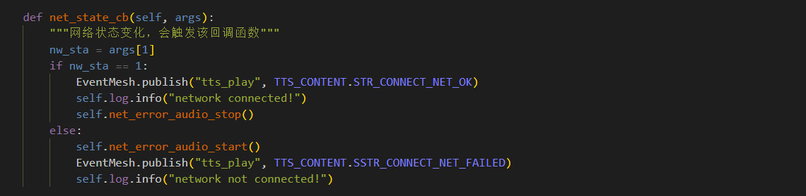

# QuecPython云喇叭软件使用指导

## 概述

QuecPython云喇叭方案使用EventMesh框架开发，此文档主要描述云喇叭软件设计框架,包含核心组件功能描述，系统初始化流程的介绍等，方便更快理解本框架，并且介绍使用QuecPython完整运行云喇叭软件框架，包括相应配置项该如何配置以及如何基于该demo进行二次开发等

> 完整代码和文档见GitHub仓库
>
> [云喇叭方案GitHUb仓库](https://github.com/QuecPython/solution-billSpeaker)

## 系统框架

### 硬件系统框架

硬件系统框架如下：

Module侧支持SIM，GPIO，UART，AUDIO等功能


### 软件系统框架

软件系统框架如下:

1. APP层实现处理云喇叭核心业务，解析上下行数据（交易数据、OTA、其他业务数据等）
2. EventMesh为事件处理器，通过支持事件订阅发布的机制来完成功能流转
3. Module侧接收外部事件或数据通过EventMesh驱动来处理执行


### 功能组件

组件对象关系描述:

下图用于描绘项目软件代码中各组件对象之间的依赖关系与继承关系，各个组件对象为云喇叭的业务组件构成

图中以云喇叭作为总对象，将云喇叭所依赖的功能对象联系到一起，核心的对象拥有哪些方法，依赖哪些功能类，具体如下图所示：


## 系统组件

### EventMesh

服务和驱动通过EventMesh进行数据通信, 所有的Event都是从EventStore里面过来的, 服务提供方将接口和topic注册到EventMesh中，服务调用方通过topic从EventMesh中调用对应的接口，通过以上订阅和发布事件（topic）的行为来代替直接调用函数，不同业务之间的消息流转都通过EventMesh来完成

以下组件部分代码参考 [云喇叭方案](https://github.com/QuecPython/solution-billSpeaker)

订阅事件：

```python
from usr import EventMesh

def test(event, msg):
	return msg

# 订阅事件
EventMesh.subscribe("test_event", test)
```

发布事件：

```python
# 发布事件
EventMesh.publish("test_event", "TEST_OK")
```


### AudioManager

- 功能描述

控制设备音频输出，包含TTS语音播报，音频文件播放，音频音量设置等功能。

- 实现原理

1.创建类方法会在该类初始化方法内完成audio功能的初始化，将原始音量等级简化成5个等级，方便使用。

2.初始化类方法后将对外暴露的方法通过事件注册到EventMesh中，完成音量初始化设置。

3.Audio播放音频文件接口 & TTS播放输入内容接口，通过QuecPython提供的audio API直接使用，API详细使用描述参考wiki文档。


### ConfigStoreManager

配置文件管理模块主要用于处理设备参数持久化保存，提供参数读取于参数更新的方法，通过该方法与模组文件系统交互

- 功能描述

配置文件一般读、写两个接口,在业务的各个部分中都有读取和写入的需求,所以为了让业务模块可以调用到这两个接口，在业务模块初始化之前就需要初始化配置文件管理模块 

- 实现原理

1.  初始化类方法时会判断配置文件是否存在，不存在则创建一个JSON文件，文件创建成功后将默认参数写入文件中。
2.  若文件已存在，则会比对默认参数有无新增，若有新增同步更新到配置文件
3.  该类方法对外通过EventMesh注册读取和写入两个事件


### LteNetManager

- 功能描述

该功能主要用于模组网络初始化以及网络状态管理，设备默认为自动拨号注网，如需调整为手动拨号或者需要使用设置的

APN进行拨号请参考API手册进行修改，下面做简要描述

- 实现原理

1. 该类方法初始化时会等待设备注网完成，且注册网络变化回调函数，通过checkNet API返回值判断设备找网状态，找网成功后会通过事件发布的方式启动TCP连接，若找网失败则会尝试重新找网。


2. 网络状态异常处理，当设备网络状态发生变化时我们可以通过注册回调的方式来通知到应用层，如下所示


3. 网络状态出现异常重连的示例：
网络异常后会先尝试使用Cfun切换来重新找网，若cfun失败可考虑重启模组，若需要做次数限制则通过配置文件记录一个值来控制。


### DeviceInfoManager

- 功能描述

该功能用于获取设备的一些基础信息，例如设备IMEI，SIM card的ICCID，固件、软件的版本号，信号值等。

- 实现原理

类函数初始化时会将获取设备信息的函数注册成事件对外提供，可直接通过事件发布的方式使用。


### OtaManager

- 功能描述

该功能用于对APP应用程序代码通过远程升级更新，目前接口提供文件下载解压升级流程，OTA升级只需通过EventMesh或者直接调用接口即可

- 实现原理

通过事件发布的方式调用升级方法，触发升级任务可以通过云平台下发或者TCP主动查询版本触发，下载完成后设备会重启完成升级

### AliYunManage

- 功能描述

该模块功能用于将设备通过MQTT协议连接到阿里云IOT平台，提供连接，断开连接，数据上下行等功能。

- 实现原理

1. 创建类方法会在类初始化方法内完成类属性的初始化，类属性包含连接云平台的三元组，保活时间等

2. 初始化类方法后将对外暴露的方法通过事件注册到EventMesh中

3. 发起连接请求

4. 下行数据回调函数


### DeviceActionManager

- 功能描述

此模块用于设备状态控制，可以控制设备开关机，重启，待机状态，以及外设控制等。

- 实现原理

1. 初始化类方法后将对外暴露的方法通过事件注册到EventMesh中。

2. 外部业务调用通过对应的事件主题来调用对应的功能接口


### RGBLight

- 功能描述

该模块用于设备Led灯状态管理，通过GPIO使能控制Led的开关和闪烁动作。

- 实现原理

1. 创建类方法会在__init__内完成类属性的初始化和led灯GPIO管脚的初始化。

2. 初始化类方法后将对外暴露的方法通过事件注册到EventMesh中

## 系统初始化流程

系统初始化流程说明：
1.	云喇叭所有功能类进行初始化。
2.	所有的类方法都会约定必须有初始化前后或实例化前后要完成的事件注册或功能处理，所以我们通过一个APP类将所有的类方法在装载时和start时会将每个类方法的初始化前后动作执行完。


## 业务流程

云喇叭的主要业务流程在模组和云端的消息交互部分，比如云端下发播放指令、云端下发升级命令等

