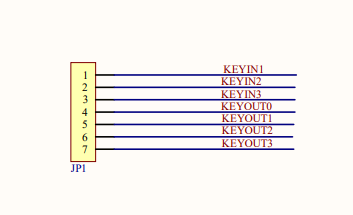
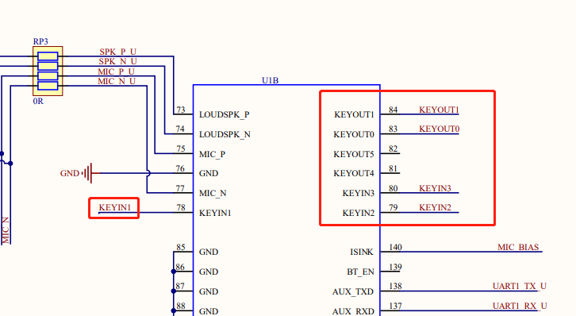
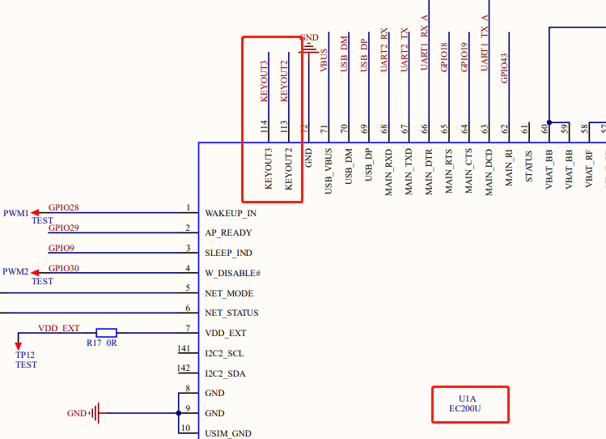

# KeyPad - 矩阵键盘

本文将介绍什么是矩阵键盘，以及如何在QuecPython平台上使用keypad矩阵键盘功能。

## 什么是矩阵键盘

矩阵键盘是一种常见的输入设备，通常用于电子设备和计算机中。它由多个按键组成，按键排列成一个矩阵形式，并通过连接线与控制器相连。

其基本工作原理是通过行列扫描技术来检测按键的状态。具体来说，矩阵键盘中的按键被分为若干行和列，行列交叉部分形成了一个二维矩阵。控制器会依次扫描每一行或每一列，当检测到某一个按键被按下时，在该按键所处的行和列之间建立联系，从而确定该按键的位置和状态。

这种工作原理使得矩阵键盘具有很高的灵活性和可编程性，因为可以通过编程设置哪些按键被映射到哪些行和列上。此外，矩阵键盘还具有体积小、成本低、反应速度快等优点，因此被广泛应用于各种类型的电子设备中。

## 如何使用矩阵键盘

### 1. 硬件准备

在使用keypad矩阵键盘功能之前，需要准备以下硬件：

- QuecPython开发板
- keypad矩阵键盘模块

将keypad矩阵键盘模块连接到开发板的矩阵键盘接口上，具体支持的模块和引脚对应关系请查看[矩阵键盘](../../../API_reference/zh/QuecPython类库/machine.KeyPad.html)API文档，同时需要注意，并不是所有开发板均引出了矩阵键盘引脚，请自行查看开发板原理图或资源列表，本文以QuecPython_EC2X_EVB_V1.0为例，开发板上搭载EC200UCNAA型号模块。如自行设计PCB则需要API文档和模块硬件设计手册同时参考，但引脚定义以API文档为准，电路特性以硬件设计手册为准。

### 2.硬件电路

本文使用的搭载EC200U的开发板中矩阵键盘相关原理图接线：








通过API文档和上图我们可以知道EC200U系列模块支持4行3列的矩阵键盘，其中KEYOUT对应的是软件中的行号，从0开始，KEYIN对应的是软件中的列号，从1开始。

由于开发板只是引出了引脚，所以我们还需要自行购买矩阵键盘模块，使用杜邦线进行连接，连接的实物图如图所示：


### 3. 示例代码

下面是一个完整的示例代码：

```python
import machine  # 导入 'machine' 模块以便于使用硬件组件
import utime    # 导入 'utime' 模块以便于进行时间相关的任务

keypad = machine.KeyPad()  # 初始化一个名为 'keypad' 的 KeyPad 类对象。

keypad.init()   # 初始化 keypad 对象

# 定义回调函数，此函数将在按下或释放按键时被触发
def keypadCallback(return_list):
    '''
    return_list[0]: 1表示按下，0表示抬起
    return_list[1] : row 行
    return_list[2] : col 列
    '''
    if return_list[0] == 1:
        print("按下的按键位置在第 {} 行 {}列".format(return_list[1], return_list[2]))
    elif return_list[0] == 0:
        print("释放的按键位置在第 {} 行 {}列".format(return_list[1], return_list[2]))


# 将回调函数设置为先前定义的 'keypadCallback' 函数
keypad.set_callback(keypadCallback)
print('开始测试，请按下按键')

# 程序等待60秒钟
utime.sleep(60)

keypad.deinit()      # 取消初始化 keypad 对象
print('已退出！')      # 打印一条消息表示程序已经退出。
```

以上代码会在按键按下或释放时进行打印，关于API的详细说明参见[矩阵键盘](../../../API_reference/zh/QuecPython类库/machine.KeyPad.html)。

### 5.典型问题解答

买到的EVB没有引出引脚怎么进行测试？

EVB没有引出是不方便测试的，可以自行设计PCB板进行测试验证。

按键工作一会后失灵了是怎么回事？

检查创建的矩阵键盘对象是否是全局变量，如是局部变量请修改为全局变量。

KEYOUT一定是代表行，KEYIN一定是代表列吗？

矩阵键盘的KEYOUT不一定是行，它可以是列或其他任何方向。矩阵键盘的KEYIN和KEYOUT可以组成一个矩阵，其中KEYIN是行，KEYOUT是列，也可以反过来，KEYIN是列，KEYOUT是行。因此，KEYOUT的方向取决于键盘的设计和实现。

设计EC600N模块的矩阵键盘硬件电路时，55号引脚需要接地，但是会导致通电开机模块就进入下载模式怎么办？

严格按照硬件设计手册说明选择下拉电阻，仍不能解决可以采用软件扫描方式实现矩阵键盘功能，此方法将不受限于硬件引脚功能，可以在多种模块上兼容使用，其他模块类似处理。

如下是软件实现矩阵键盘的示例代码：

```python
# 导入所需的模块
from machine import Pin
from utime import sleep_ms

# 定义键盘矩阵的行列数及按键对应的字符
NUM_ROWS = 3
NUM_COLS = 3

key_matrix = [
['1', '2', '3'],
['4', '5', '6'],
['7', '8', '9'],
]

# 定义行列引脚
row_pins = [Pin(Pin.GPIO11, Pin.OUT, Pin.PULL_DISABLE, 0), Pin(Pin.GPIO12, Pin.OUT, Pin.PULL_DISABLE, 0), Pin(Pin.GPIO13, Pin.OUT, Pin.PULL_DISABLE, 0)]
col_pins = [Pin(Pin.GPIO9, Pin.IN, Pin.PULL_PU, 1), Pin(Pin.GPIO8, Pin.IN, Pin.PULL_PU, 1), Pin(Pin.GPIO14, Pin.IN, Pin.PULL_PU, 1)]

# 定义全局变量，用于判断按键是否被按下或释放
key_pressed = False
key_released = False

# 扫描键盘矩阵的函数
def scan_keys():
    
    global key_pressed, key_released

    # 循环扫描每一列
    for i in range(NUM_COLS):
        row_pins[i].write(0)

        # 循环扫描每一行
        for j in range(NUM_ROWS):
            # 如果检测到按键被按下且之前未被按下，则将全局变量设置为按下状态，并返回按键对应的字符
            if not col_pins[j].read() and not key_pressed:
                key_pressed = True
                key_released = False
                return key_matrix[j][i]

        row_pins[i].write(1)

    # 如果按键被按下且之前未被释放，则将全局变量设置为释放状态，并返回 None
    if key_pressed and not key_released:
        key_released = True
        key_pressed = False

    return None

# 循环检测键盘矩阵
while True:
    key = scan_keys()
    # 如果检测到按键被按下，则打印出按键对应的字符
    if key is not None:
        print('Key pressed:', key)
    sleep_ms(50)
```

此示例代码仅供参考，实际使用还请自行完善逻辑。

# 总结

本文介绍了如何在QuecPython平台上使用keypad矩阵键盘功能，并列举了比较常见的问题类型，以及自行实现矩阵按键功能的示例，如有疑问或更好的建议欢迎联系我们，也可以直接向我们提交文档贡献，后续本文将继续完善和补充更多应用案例。