# HeliosServices

1.背景

2.新框架解决那些问题/特性/优势

3.能帮助客户解决那些问题 可举例

4.简单说明框架如何使用，目录结构解析，使用教程

5.一个简单的例子 举例论证新框架的易用性和为什么要用新框架

​	用新框架连阿里云，设备端喂狗、拉GPIO、组包发数据

描述一下开发过程中的痛点  ---> 为解决这些痛点开发了新框架来解决这些问题-->如何解决问题/解决了那些问题

（比如支持日志服务、解决线程通信问题、支持看门狗组件、支持腾讯云组件、阿里云组件）


`获取地址`:  [源码](https://gitee.com/quecpython/helios-service)


## 入门

### 背景

QuecPython目前一直没有一个应用层框架来实现统筹的消息注册,消息监听,事件管理, 组件通信,会话等功能, 解决一直存在的重复工作量和安全稳定性问题，为了迎合QuecPython的发展, 简化用户对底层网络, 日志, 移远云服务, 定位, 媒体等复杂的数据处理和数据保护等操作,特此我们专门开发了一套应用编程框架来简化复杂的创建、维护的等操作。

我们想通过数据驱动来改善我们目前复杂的编码过程, 顺着这个出发点QuecPython应用编程框架--HeliosService 正式面世！

### 优势

尽管python开发已经相当便捷且功能强大，而QuecPython又在python的基础上极大的拉低了嵌入式开发的门槛，但是仍然会有很多新手开发者在想要开发自己的项目时不知从何入手亦或是在搭建项目框架、编写项目代码时遇到形形色色的问题（以上种种俗称踩坑），为了避免开发者重复踩坑，提升开发者开发效率，于是集结了众多前人的踩坑经验以及官方开发者的满腔心血而开发出的HeliosService顺应天时而生。

那么HeliosService新框架给QuecPython带来了哪些变革呢？

HeliosService将常用的功能整合成服务，并提供统一的API来供客户调用，用户在实现网络、日志、异常、线程通信、队列等功能时更加便捷，另外提供了丰富的第三方组件，例如中断拦截器、GPIO读写拦截器、定时拦截器、看门狗拦截器，极大的减轻了用户的开发难度。

**设计的初衷**

- 将用户和操作一些主动行为变为被动行为的
- 业务之间的解耦, 所以我们特此讲系统的一些组件设计成发布订阅的模式
- 开发者订阅相关只需要关注的服务, 即可获取相关的状态
- 提供消息队列,客户可以通过消息队列来定制自己的组件
- 提供会话中心, 脱离系统服务外支持客户自定义TOPIC发布订阅的服务
- 容器化, 我们提供启动器, 所有的服务和组件获取都通过容器来获取,而不再逐个依赖进行加载
- 简化客户的操作, 和解耦业务之间的依赖使我们的和兴目标

而新框架又解决了哪些问题呢？让我们走进下一章。

### 解决的问题

**携带发布订阅BUS总线**

  - 支持消息和处理的绑定
  - 异步的消息处理机制
  - 用户不需关心对应的处理函数,只管向对应的topic发消息即可

**携带消息队列广播机制**

  - 可自定义消息类型,执行异步和同步模式,支持事件派发和事件管理, 支持标准队列和观察者模式)
  - 解决了两个线程之间传递消息,以及多个事件广播的问题
  - 给模块进行了标准化的解耦过程, 提供了统一稳定的事件管理中心来保证通信的质量

**NET(网络)**

  - 提供网络服务(解决了客户网络的依赖, 客户只需要注册回调接口, 就可以发现注网的状态, 也支持主动查询, 设置APN等操作)
  - 支持断网通知, 断网重连通知等,支持订阅消息
  - 支持网络主动查询

**LOG(日志)**

  - 提供标准化的日志系统(解决日志标准化的问题, 提供日志标准化的输出并携带时间,同样支持异步和同步的配置, 支持云端发送, 落盘等行为)
  - 支持不同uart口输出, 落盘输出等
  - 支持订阅消息发布消息

**CLOUD(移远云服务)**

  - 提供基于移远云的OTA升级和日志发送接口(临终遗言日志上报, OTA的升级, OTA组件等
  - 同样支持异步和同步模式)
  - 支持自动化固件升级
  - 支持自动化文件升级
  - 支持提交云端日志可配合我们日志系统使用

**MEDIA(媒体服务)**

  - 提供媒体功能(支持发布异步的媒体消息, 统一媒体消息管理等等)
  - 支持异步tts, audio播报
  - 支持tts,audio消息发布,消息广播,消息订阅
  - 支持tts, audio播报的自动管理,保证消息播报的可靠性

**EXCEPTION(异常服务)**

  - 提供异常服务支持
  - 支持同步异步消息
  - 支持异常消息订阅, 异常消息发送

**PM(低功耗服务)**

  - 可选的功耗管理
  - 默认低功耗模式
  - 支持高刷唤醒

**SYS_BUS(发布订阅总线)**

  - 支持自定义topic实现发布订阅
  - 支持发布订阅, 通过自动化的线程渠道去分配线程处理业务
  - 支持高并发的处理

**Queue(标准队列)**

  - 支持不同线程中消息的传递
  - 阻塞实现, 支持多线程的put ,get 原子操作

### 使用说明

**代码目录结构**

```python
usr																		    # 用户分区
├─main.py 																	# 用户代码（程序入口）
├─bin																		# 脚本和启动器（下面放着一些共有服务和一些公有的组件）
│  ├─cloud_service.py														  # 云服务组件
│  ├─exception_service.py       											   # 异常服务组件
│  ├─guard.py                   									            # 全局监控和配置文件的启动容器
│  ├─log_service.py             								       		    # 日志服务组件
│  ├─media_service.py           							  				    # 媒体服务组件
│  ├─net_service.py             								 			    # 网络服务组件
│  ├─pm_service.py              	    										# 低功耗服务组件
│  └─components                 								 				# 该目录下存放一些公共组件
│  │   ├─abstract_service.py   							  						# 服务抽象类
│  │   ├─blinker_min.py        								 					
│  │   ├─monitor.py            													
│  │   ├─OTA.py                													# OTA升级组件
│  │   └─service_models.py     							 						# 服务模型基类
│  └─third_party                											
│       ├─ql_interrupter.py   								   					# 第三方服务组件,外部中断/看门狗等
│       └─ ...
├─etc                            												# 配置文件目录（非必须存在）
│   ├─app_config                												# app业务服务配置文件目录
│   └─system_config             												# 系统服务配置文件目录
├─log                            												# 日志存储服务（非必须存在，选择日志存储为本地时自动创建）
└─utils                            												# 通用工具目录
   ├─JsonParserUtils.py          												# josn处理utils
   ├─resolver.py                												# 时间格式化处理器
   └─service_utils.py             												# 单例模式类实现
```

> 
>
> 第三方的组件会持续更新增加新内容

#### 搭配工具使用说明

> 新框架需要搭配QPYcom_V1.7版本使用

以上所有目录和文件可通过QPYcom下载到模块中，用户编辑好自己的代码之后下载到模块中即可进行调试，下载方式参考下图

第一种方式，下载页面配置项目，优势是一键导入目录结构之后再次下载调试点击下载脚本按钮即可，方便后续调试

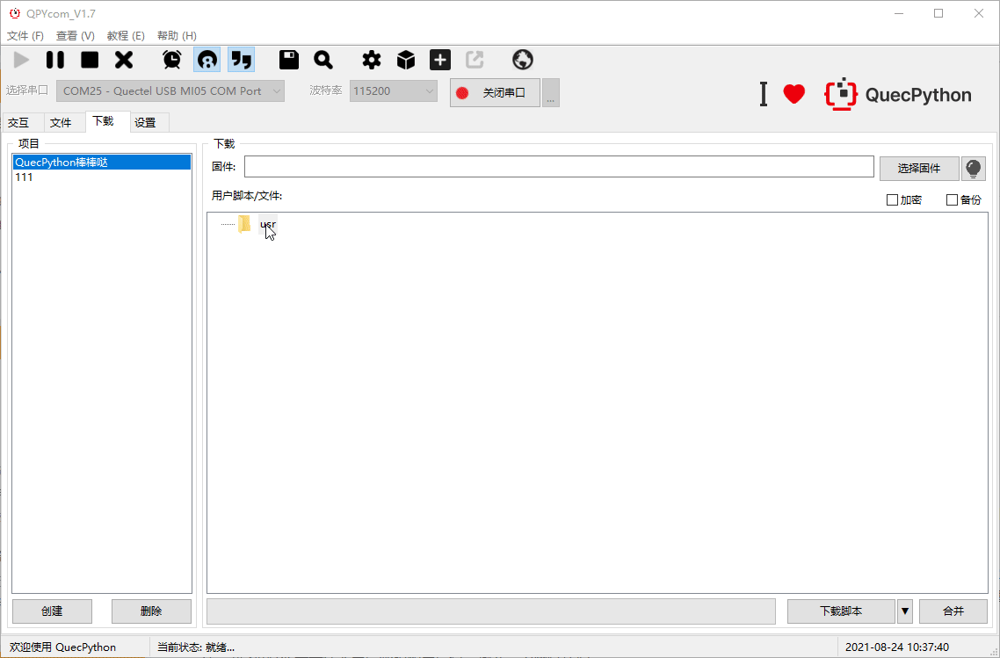

第二种方式，文件页面从左侧本地文件树拖拽到右侧模块文件树，等待下载完成即可，优势是直接拖拽操作简单便捷

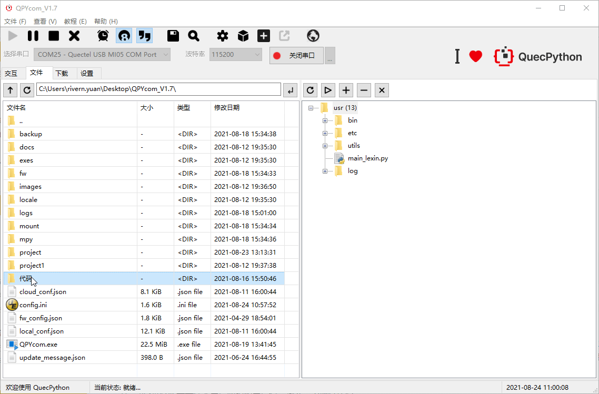

> 上述两种方案均可下载框架代码至模块中

#### api使用说明

参见api说明文档

### 举个栗子

#### 读取配置文件示例

```python
# 初始化全局的guard环境
from usr.bin.guard import GuardContext
guard_context = GuardContext()
# 刷新容器并启动的所有服务
guard_context.refresh()
# 读取配置文件示例
config = guard_context.service_config["cloud"] # 读取/usr/etc/app_config/cloud/config.json 配置文件内容返回的字典对象
```

网络服务和日志服务示例

```python
from usr.bin.guard import GuardContext

def net(*args, **kwargs):
	"""网络回调函数"""
	app_log.debug("net_callback,args:{},kwargs:{}".format(args, kwargs))
			
if __name__ == '__main__':
    # 初始化全局容器
    guard_context = GuardContext()
    guard_context.refresh()
    # 获取网络服务&日志服务
    net_service = guard_context.get_server('net')
    log_service = guard_context.get_server('log')
	# 订阅网络服务
    net_service.subscribe(net)

    # 获取app_log
    app_log = guard_context.get_logger("app_log")
    app_log.debug("net status: {}".format(net_service.get_net_status()))
```

#### 第三方组件示例

GPIO读写拦截器

```python
from ql_interrupter import PinInterrupter 
from machine import Pin, ExtInt
pin_inter = PinInterrupter(Pin.GPIO1, trige_mode=Pin.OUT, pull_mode=Pin.PULL_DISABLE, mode=0) # 初始化
pin_inter.write(1) # 设置PIN脚电平输出为高
```

看门狗示例

```python
from ql_interrupter import WatchDog
from machine import Pin, ExtInt
import sys_bus
# 初始化watch dog
wd = WatchDog(Pin.GPIO15, 1, 10000)
wd.start()
def topic1_cb(topic, msg):
	pass
def topic2_cb(topic, msg):
	pass
# 订阅喂狗后，硬件狗拉GPIO 告知模块喂狗成功
sys_bus.subscribe("WDT_KICK_TOPIC", topic1_cb)
# 订阅喂狗后的回调
sys_bus.subscribe("WDT_KICK_TOPIC_FEED", topic2_cb)
```

> 更多示例代码和演示参考API说明


## 进阶

### 概述

进阶篇,我们主要描述各个功能是如何使用的, 从入门篇我们已经帮环境搭好了, 从现在起, 我们将正式开始和使用上述功能, 并展示使用成果

### 使用文档

#### 容器

主要是包裹和集成所有服务和配置的集中化管理的东西, 下面演示起核心使用, 其他功能请查看API文档

##### 启动容器

- [OK] 为启动成功
- [FAILED]为服务启动失败
- sys 和 app 代表服务所属的分区,sys是系统级别的, app是用户级别的
- 启动成功的服务我们就可以调用了, 我们也可以查看所有启动成功的服务

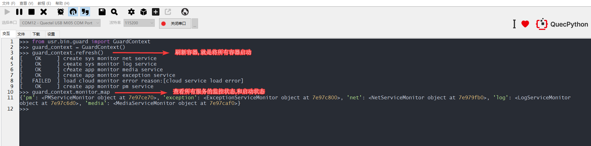

##### 网络服务

###### 应用场景

- 当拨号状态异常或者从异常中恢复时, 会触发网络服务的主动通知
- 当空口状态异常或从异常中恢复时, 会触发网络通知

###### 基本使用

- 我们可以获取到sim, net, dataCall对象无需导入
- 我们可以订阅网络状态

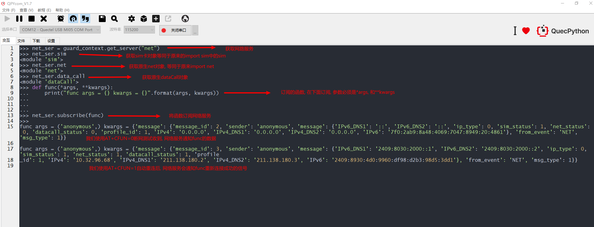

###### 输出订阅者的数据

当我们订阅网络服务的时候, 网络的波动我们会收到相关通知, 通知为我们订阅的函数

```python
from usr.bin.guard import GuardContext

guard_context = GuardContext()

guard_context.refresh()

net_ser = guard_context.get_server('net')

# 触发事件为用户网络异常, 网络重新上线, 服务异常

def func(*args, **kwargs)
	"""
	 args: ('anonymous',)无需关注
	 kwargs:
		{
			'message': {
				'message_id': 2, 															# 消息id
				'sender': 'anonymous', 														# 发送人
				'message': {
                    'IPv6_DNS1': '::', 											            # IPV6的DNS1
                    'IPv6_DNS2': '::', 													    # IPV6的DNS2
                    'ip_type': 0,                                                           # 只需关注0是ipv4                                *
                    'sim_status': 1,                                                        # sim卡状态1是存在0是sim卡不存在                  *
                    'net_status': 0,                                                        # 空口网络状态, 良好 1 网络不成功失败0			    *
                    'datacall_status': 0,                                                   # 拨号状态,                                      *
                    'profile_id': 1,                                                        # PDP INDEX
                    'IPv4': '0.0.0.0', 														# IPV4地址
                    'IPv4_DNS1': '0.0.0.0', 											    # IPV4dns1
                    'IPv4_DNS2': '0.0.0.0',                                                 # IPV4dns2
                    'IPv6': '7f0:e6b8:8948:4069:7047:8849:20:4861'                          # IPV6地址
				}, 
				'from_event': 'NET',                                                       # 从哪个事件来的
				'msg_type': 1                                                              # 消息类型
				}
		}
		加*号的需要用户去关注
	"""

    print("args = {} kwargs = {}".format(args, kwargs))
# 订阅网络服务
net_ser.subscribe(func)
```

###### 检测联网

- 开启后可检查网络状态, 返回值请参考`HeliosService API文档`

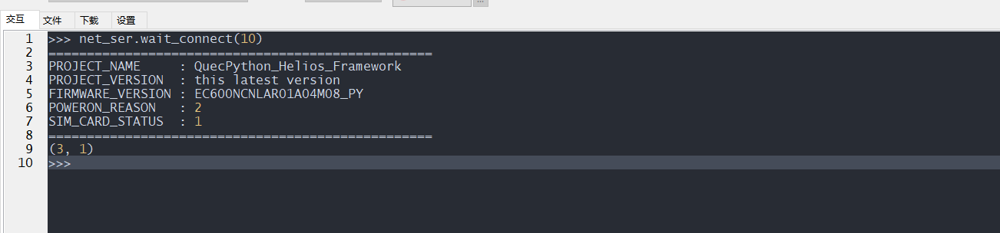

###### 其他功能

请参考AP文档进行调用

##### 日志服务

###### 基本使用

- 获取一个带命名的日志客户端
- 输出日志
- 设置日志输出级别

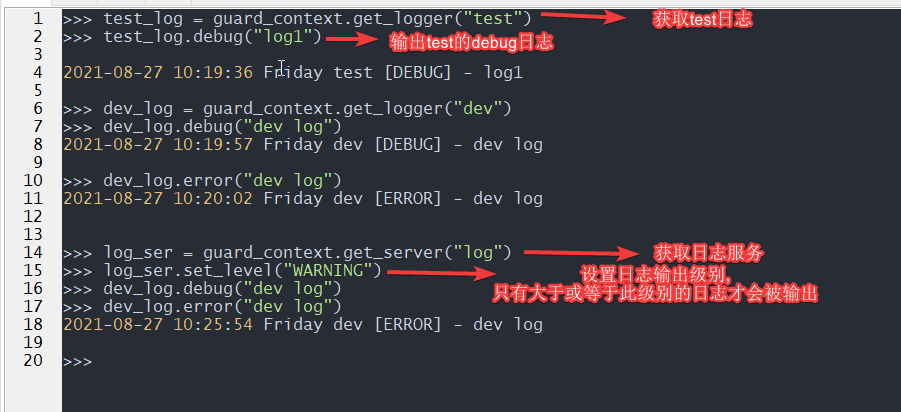

- 订阅日志

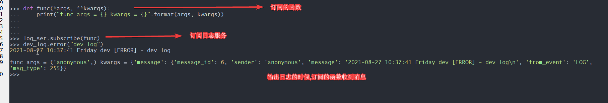

###### 输出订阅者的数据

当我们订阅日志服务的时候我们, 当我们打印日志的时候会通知为我们订阅的函数

```python
from usr.bin.guard import GuardContext

guard_context = GuardContext()

guard_context.refresh()

log_ser = guard_context.get_server('log')

def func(*args, **kwargs)
	"""
	 args: ('anonymous',)无需关注
	 kwargs:
	 	{
	 	 'message': {
	 	      'message_id': 4,                                                  # 消息id
	 	      'sender': 'anonymous', 							                # 消息发送人
	 	      'message': <LogFormatUtil object at 7e7142c0>,                    # LogFormatUtil对象
	 	      'from_event': 'LOG', 												# LOG模块来的事件
	 	      'msg_type': 255                                                   # 消息类型
	 	      }
	 	}
	"""
    """
  	 	## LogFormatUtil拥有以下属性, 
	 	获取日志信息
	 	log_data = kwargs['message']['message']                                # 查看log message数据
	 	log_data.time                                                          # 查看log time时间
	 	log_data.tag												           # 查看日志标签例如 NET...
	 	log_data.level													       # 查看日志输出等级
	 	log_data.content                                                       # 查看日志的内容
	 	log_data.log_format                                                    # 获取我们的标准输出
    """
    print("args = {} kwargs = {}".format(args, kwargs))
    
    

# 订阅日志服务
log_ser.subscribe(func)
    
logger = guard_context.get_logger("test")

logger.debug("this is a test msg")

```


###### 其他功能

请参考API文档进行调用


##### 媒体服务

###### 基本使用

- 获取原生tts,audio
- 订阅消息
- 设置模式
- 设置pa `参考API文档`

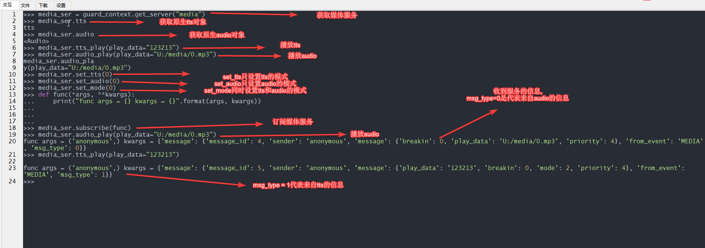


###### 发布tts消息

tts播放媒体格式

>  **media_ser.tts_play(priority=4, breakin=0, mode=2, play_data="")**

- 参数

| 参数      | 参数类型 | 参数说明                                                     |
| --------- | -------- | ------------------------------------------------------------ |
| priority  | int      | 播放优先级，支持优先级0~4，数值越大优先级越高                |
| breakin   | int      | 打断模式，0表示不允许被打断，1表示允许被打断                 |
| mode      | int      | 编码模式，1 - UNICODE16(Size end conversion)，2 - UTF-8，3 - UNICODE16(Don't convert) |
| play_data | string   | 待播放字符串                                                 |

- 返回值
  - 无


###### 发布audio消息

音频文件播放，支持mp3、amr和wav格式文件播放。支持优先级0~4，数字越大优先级越高，每个优先级组可同时最多加入10个播放任务，与TTS播放共用同一个播放队列, 

会默认播报, 

订阅的消息也会同时收到,播报的事件和数据

>  **media_ser.audio_play(priority=4, breakin=0,  play_data="")**

- 参数

| 参数      | 参数类型 | 参数说明                                      |
| --------- | -------- | --------------------------------------------- |
| priority  | int      | 播放优先级，支持优先级0~4，数值越大优先级越高 |
| breakin   | int      | 打断模式，0表示不允许被打断，1表示允许被打断  |
| play_data | string   | 待播放的文件名称，包含文件存放路径            |

返回值

- 无


###### 输出订阅者的数据

当订阅者想拿到发布的tts数据时,可以通过订阅媒体服务,会拿到以下相关参数, 当然我们系统已经有默认播放的动作了

```python
from usr.bin.guard import GuardContext

guard_context = GuardContext()

guard_context.refresh()

media = guard_context.get_server('media')

def func(*args, **kwargs):
	"""
	 args: ('anonymous',)无需关注
	 kwargs:
	 	{
	 	 'message': {
		 	 'message_id': 2,                                                     # message_id消息id
		 	 'sender': 'anonymous',                                               # 发送人
		 	 'message': {
		 	 	'play_data': 'test',                                              # 数据内容		 	
		 	 	'breakin': 0,                                                     # 是否可以被打断[注意audio播放无此属性, 只有tts播放时候才会有此属性]
		 	 	'mode': 2, 														  # 播放模式
		 	 	'priority': 4                                                     # 优先级别
		 	 	}, 
		 	 'from_event': 'MEDIA',                                               # 事件类型
		 	 'msg_type': 1                                                        # 消息类型 1为tts消息 0为audio消息
		 	 }
	 	}
	"""
    print("args {} kwargs {}".format(args, kwargs))
media.subscribe(func)   
# 发布tts消息  media订阅者将收到此消息
media.tts_play(play_data="test")
```


###### 其他功能

- ###### 请查看API文档

##### 低功耗服务

###### 基本使用

- 默认是开启低功耗模式
- 存在投票机制
- 查看偷拍不为0即无法进入休眠
- 可以取消投票, 每一张投票都需要一次取消

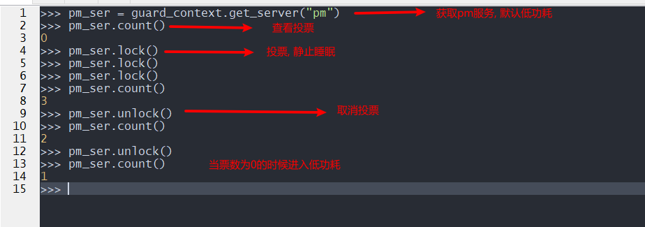

###### 其他功能

请查看API相关文档

##### 移远云服务

###### 基本使用

- 提供日志上传至移远云
- OTA单文件升级

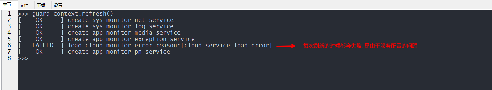

创建cloud服务的config.json cloud服务是在app_config下面的

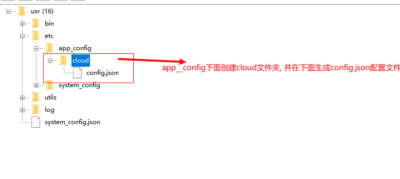

cloud服务config.json的内容

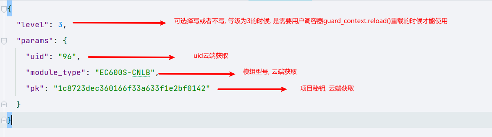

由于当时设置的level是3即使这里创建成功也是不能使用的, 所以我们需要, reload服务才会开启自动升级服务, 设计的初衷是让一些服务的启动等级变低, 客户去控制器启动顺序

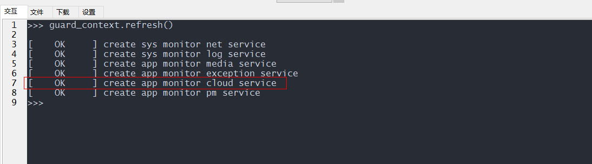

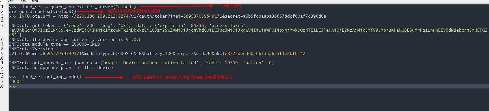

- 提交日志

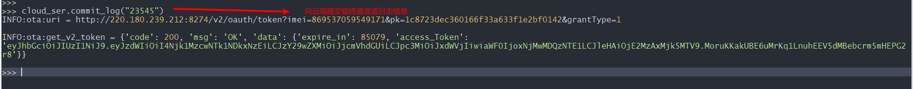

###### 其他功能

请查看API文档


##### 异常服务

###### 基本使用

- 订阅异常服务
- 发布异常

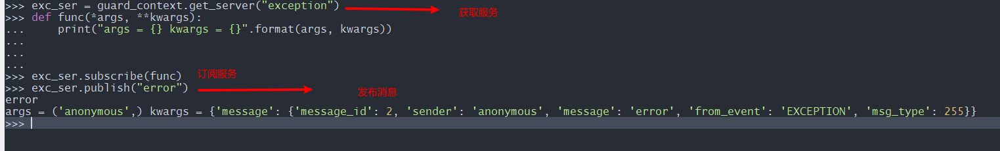

###### 输出订阅者的数据

当我们订阅了异常服务, 输出给订阅者的数据

```python
from usr.bin.guard import GuardContext

guard_context = GuardContext()

guard_context.refresh()

ex= guard_context.get_server('exception')

def func(*args, **kwargs):
	"""
	 args: ('anonymous',)无需关注
	 kwargs:
	 	{
	 	 'message': {
		 	 'message_id': 2,                                                     # message_id消息id
		 	 'sender': 'anonymous',                                               # 发送人
		 	 'message': 'this is a error msg',                                    # 异常的消息
		 	 'from_event': 'EXCEPTION',                                           # 事件类型
		 	 'msg_type': 255                                                      # 消息类型无需关心
		 	 }
	 	}
	"""
    print("args {} kwargs {}".format(args, kwargs))

ex.subscribe(func)
# 发送异常信息
ex.publish("this is a error msg")
```


#### 三方组件

主要有gpio, 中断, 定时器, 看门狗的封装, 还有安全组件,  断点续传的组件(网络挂掉的时候暂存到本地，恢复之后重新发)等

请查看相关API文档


#### sys_bus使用

- 订阅topic的函数
- 发布数据

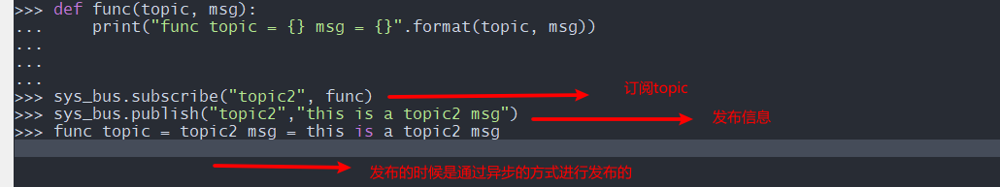

#### 裁剪说明

- 圈出来的, 带_service下坠的都是可以裁剪的, 如果不想用此服务, 删除即可

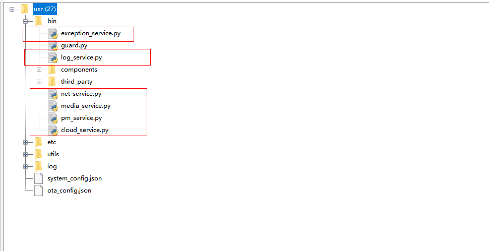

## 高级

### 概述

此篇主要说的是, helios services的软件设计的思考, 和后续将要支持的功能, 以及通过我们软件设计知道内部的通信原理, 了解和理解内部的机制等等...


### 软件架构设计

#### 架构设计

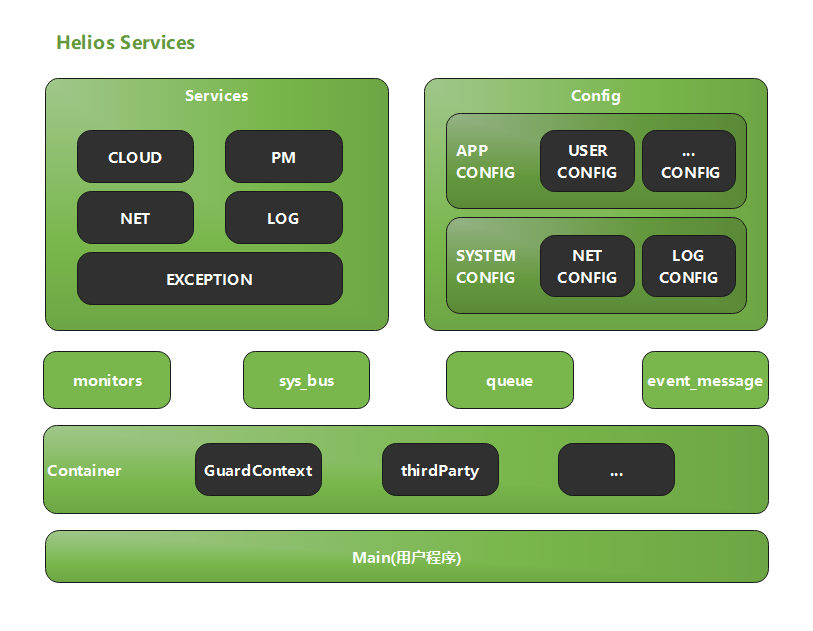

名词解释:

- `Services`: 服务组件
- `Config`: 配置存储
  - `app_config`: 存储用户配置文件的目录
  - `system_config`: 系统配置文件的目录
- `monitos`: 监控器,监控各个服务的状态
- `sys_bus`: 会话的处理总线主要处理, 生产者和消费者模型, 目前支持异步模式
- `queue:` 普通队列, 用于线程间通信
- `event_message`: 异步的带有命名空间的高级消息队列 

- `GuardContext`: 上下文容器, 统一管理所有的服务和配置, 还有监控等组件, 提供服务, 配置, 监控等获取的接口
- `third_party`: 三方组件目录, 拥有我们提供和封装的一些组件以便客户敏捷开发和二次开发

#### 设计原理

##### 服务设计原理

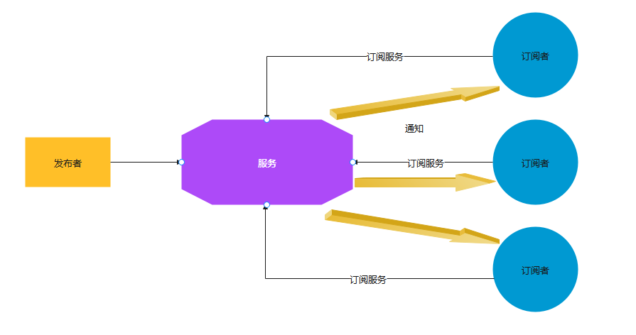

1. 我们将写好的一些针对系统级别的提供了一些服务, 这些服务的发布者可能来自可以接受系统底层的回调, 和用户主动发布给不同的订阅者获取等
2. 例如用户只需要订阅网络服务, 当网络信号异常或者网络信号不好时或者网络断开重连时, 网络服务会发起自动重连, 并且通知所有订阅了网络服务函数,  通知当前网络的状态相关信息, 订阅者即可收到相关信息进行处理
3. 例如日志服务等是需要用户自己承当发布者的作用的
4. 发布者和订阅者是毫无关系的, 发布者无需关注订阅者, 只用把发布的数据给用户即可
5. 发布者发布到服务, 服务再到订阅者是异步的, 我们同时也提供了同步的配置和支持
6. 服务的中间本质实现是一个, `带命名空间的高级的消息队列`+其他一些组件来组成的

优点:

- 我们替客户实现好了一些系统级别的服务, 并支持后续迭代, 解决了客户客户还需要维护系统接别的代码问题, 只提供对外的API供客户调用
- 降低了业务之间的耦合, 订阅者和发布者之间的解耦
- 订阅者,只需要订阅服务, 或者使用服务, 既能使用我们维护并提供的功能

缺点:

- 我们限定死了服务的类型, 客户无法的到定制, 比如我现在有个需求是, 想自己业务上有两个或者多个业务解耦, 客户无法实现自己的服务, 这些服务都是我们写好的, 解决方案`sys_bus`
- 首先我们是由一个高级消息队列组成, 所以有可能存在服务还在, 但是消息队列崩溃的现象, 所以我们在服务崩溃的时候给他拉起来, 解决方案`monitor`


**示例:**

订阅服务

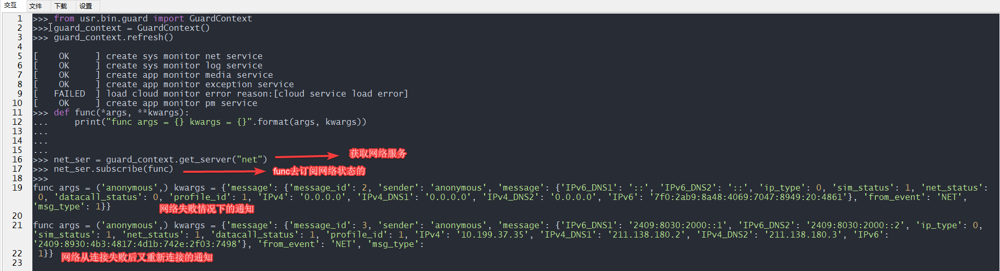

##### sys_bus实现原理

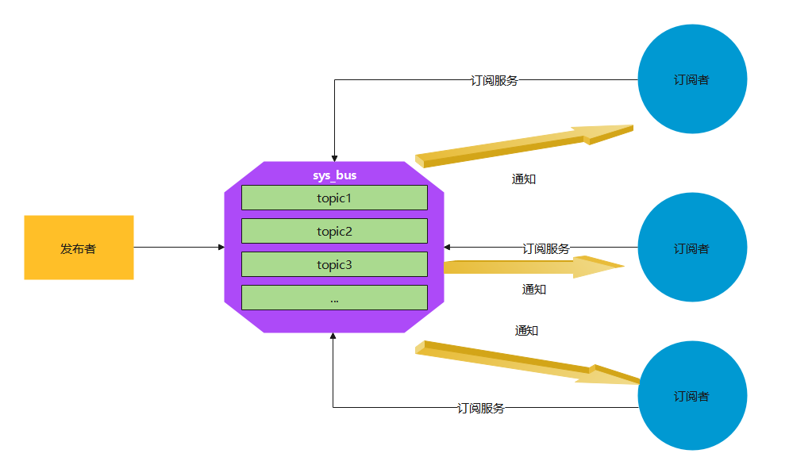

上面服务是我们通过服务的形式来给用户体现的, 缺点中我们也明确了,  用户无法定制服务, 反之sys_bus即可实现用户定制服务的需求

- 异步的模式, 用户可以订阅和发布,还有解绑服务
- 将发布和订阅分离, 模块化分离, 支持多个发布者, 和服务的区别是,这里发布者和订阅者都是用户去维护的
- 用户只需要关注topic而不用关注sys_bus等本身和订阅者本身
- 优点:
  - 客户可以自己定制和发布相关的数据等
  - 我们帮客户维护了sys_bus的稳定性
- 缺点:
  - 过于灵活可能会导致, 用户的一些订阅代码需要用户自己去维护

示例:

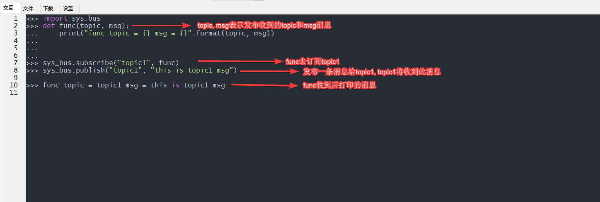

##### monitor设计原理

- 负责监控每个服务在每隔15秒给服务一个心跳, 如果, 服务, 收到这个心跳包, 会将这个发给的指定的接收人的, monitor接收到心跳包, 即认为, 服务运行正常
- 可以设置, 当服务几次运行失败后执行什么样的行为, 例如:设置当服务心跳连续多次失败后, 重启设备或者停止该服务等行为, [目前默认底层做了处理, 用户无需设置]

**示例**


##### config设计原理

为了方便配置文件的读取和设置等, 将配置文件路径统一放到了config下面设置按照下列规则的config.json文件


- app_config [用户配置文件夹]
  - 下面对应的是用户配置的配置文件, 如上图所示, app_config下面存在
    - 例如:cloud文件夹, cloud文件夹下面存在一个config.json, 我们将映射文件自动读取文件给cloud服务装载它config.json中的内容, 当cloud服务不存在, 我们将自动保存配置文件和服务的映射关系, 通过`guard_context.service_config`获取服务和映射的config.json的内容
- system_config [系统配置文件夹]
  - 配置系统级别的服务, 我们会按照系统级别的配置文件作为提供对外, 我们会读取系统服务的配置文件, 当服务存在时, 我们可以自动装配, 服务不存在是我们会保存相关映射关系, 用户可以通过`guard_context.system_config`获取映射内容

**示例:**

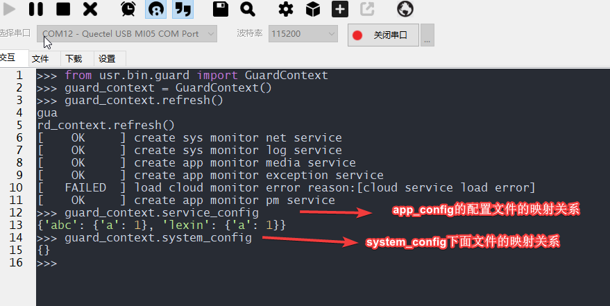

- 我们可以看出上面app_config下面存在
  - lexin
    - config.json
  - abc
    - config.json
  - 我们可以看到读取的service_config下面
    - {'abc': {'a': 1}, 'lexin': {'a': 1}}
    - abc和lexin就是我们的文件夹名字, 对应的value就是我们config.json中的内容
- system_config也是通app_config的对应关系一致
- 注意: 如若想读取必须按照此类调教key是文件夹名,value读取的是config.json中的内容书写

##### queue设计原理

普通队列用作消息通信, 创建队列后获取数据的时候会阻塞, 当有数据信号的时候将会被唤醒

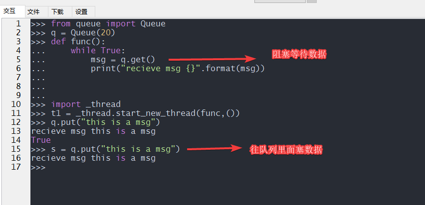

#### 三方组件和容器设计


##### GuardContext设计原理

上面说了那么多组件设计后, 我们说下, 我们说下容器设计

- 因为目前存在很多服务, 很多配置, 为了方便客户不用这导入一下那导入一下, 并且做统一化管理, 特此容器化了所有组件

- 用户只需要关注容器设计即

##### ThirdParty设计

请查看第三方组件API文档

