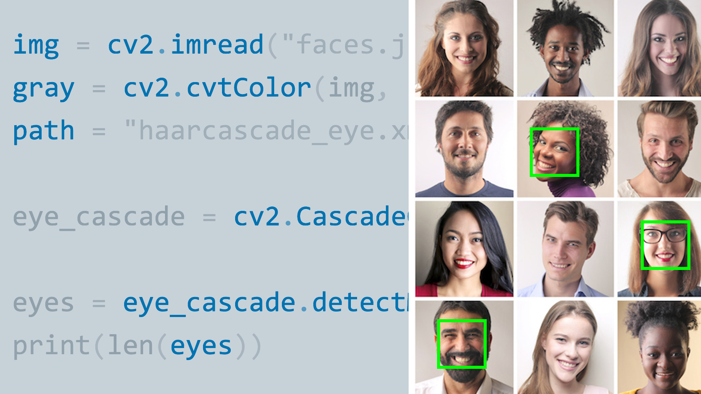
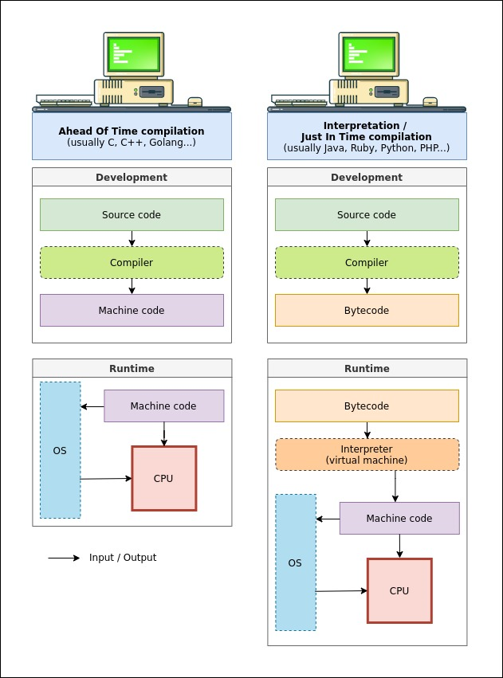
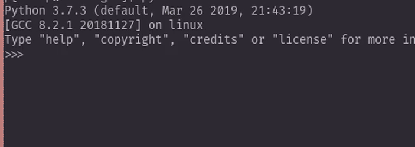
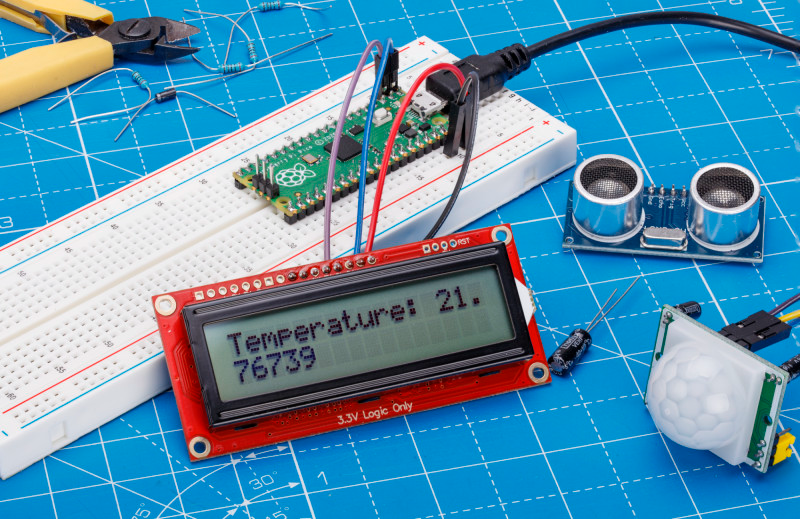
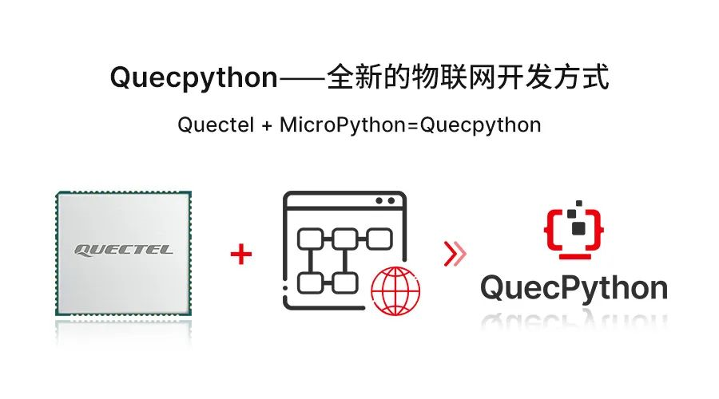
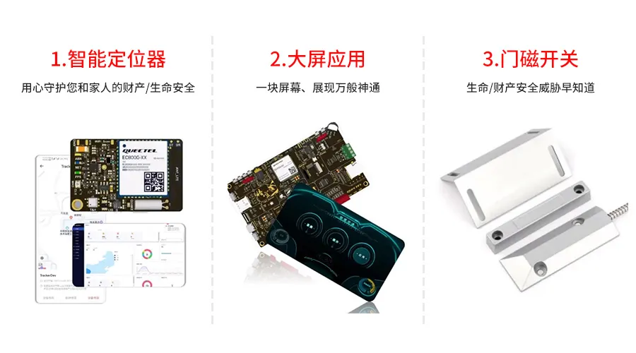
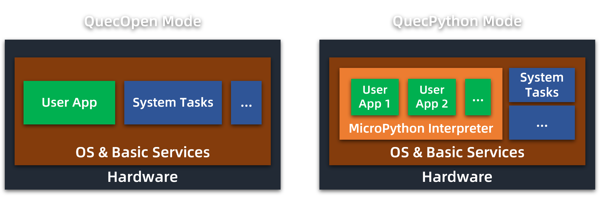

# QuecPython 简介

本文将从 Python 语言本身讲起，对 QuecPython 的起源、结构和特性进行阐述。通过本文的介绍，用户可以对 QuecPython 拥有相对全面的了解。

## 从 Python 到 MicroPython

Python 是一个高层次的结合了解释性、编译性、互动性和面向对象的脚本语言。作为一种代表极简主义的编程语言，和传统的 C/C++、Java、C# 等语言相比，Python 对代码格式的要求相对宽松。在开发 Python 程序时，可以专注于解决问题本身，而不用顾虑语法的细枝末节。

以下两个例子对比了 Python 语言和 C 语言对同一功能的实现方式的区别。可以看出，Python 语法较为简洁，易于掌握，可读性较高。

.. tabset:: 读取并显示键盘输入

    ## 使用 C 语言
    
    ```c
    #include<stdio.h>

    int main(){
        int number;
        float decimal;
        char string[20];
        scanf("%d", &number);
        scanf("%f", &decimal);
        scanf("%s", string);
        
        printf("%d\n", number);
        printf("%f\n", decimal);
        printf("%s\n", string);
        
        return 0;
    }
    ```
    
    ## 使用 Python 语言
    
    ```python
    number = int(input())
    decimal = float(input())
    string = input()

    print(number)
    print(decimal)
    print(string)
    ```

.. tabset:: 简单的 for 循环

    ## 使用 C 语言
    
    ```c
    #include<stdio.h>

    int main()
    {
        for(int i = 0; i < 10; i++){
            printf("%d\n", i);
        }
    }
    ```
    
    ## 使用 Python 语言
    
    ```python
    for i in range(0, 10):
        print(i)
    ```

作为一种解释型语言，Python 具备较好的可移植性，可在多种不同软硬件平台上运行。使用 Python 编写的程序不需提前编译成二进制代码，可以直接从源代码运行。此外，Python 具有脚本语言中最丰富和强大的功能库。这些库覆盖了文件 IO、GUI、网络编程、数据库访问等绝大部分应用场景。用 Python 语言开发程序时，许多功能可以通过调用库实现，开发者通常无需从零编写。当前，Python 语言因其语法简单、功能丰富的特点，已被广泛应用于服务器、数据库、图像处理、人工智能等领域。

<center>
    
    <br>
    <div style="color: orange; border-bottom: 1px solid #d9d9d9; display: inline-block; color: #999; padding: 2px;">
        使用几行 Python 代码就可以实现人脸识别
    </div>
</center>

MicroPython 是 Python 语言的精简高效实现，可理解为一个可以运行在微处理器上的 Python 解释器。它使得用户可以编写 Python 脚本来控制硬件。MicroPython 继承了 Python 的完备的 REPL 交互功能，可以通过 REPL 串口随时输入代码执行，便于测试。MicroPython 还内置了文件系统，用户可以随意向设备端上传任意文件内容，并对目录结构进行修改。基于这一点，设备端可以同时储存多个程序脚本和其他文件，用户可根据需要手动选择并运行，类似于手机 App 的机制，极为灵活。此外，得益于 Python 解释型语言的特性，用户在使用 MicroPython 进行开发时，无需因为代码的更改而反复编译代码和烧录固件，仅需将修改过的代码重新上传至设备内即可。

.. details:: 关于解释器
    :open: false

    解释器（Interpreter）是一个和编译器（Compiler）相对的概念。作为一种解释型语言，Python 的源码是在运行中（而非运行前）被转换为机器可识别和执行的二进制形式。实现这一流程的工具称为解释器。
    
    <center>
        
        <br>
        <div style="color: orange; border-bottom: 1px solid #d9d9d9; display: inline-block; color: #999; padding: 2px;">
            解释型语言和编译型语言的执行流程差异
        </div>
    </center>
    
    对于初学者而言，解释器可以粗略地理解为 Python 脚本的运行环境。目前，在电脑端，CPython 是最为常用的 Python 解释器。绝大部分资料和工具中涉及的“Python”默认指的就是 CPython。在嵌入式领域，除了 MicroPython，CircuitPython、PikaPython 等解释器也受到国内开发者的欢迎。
    
    关于 Python 代码执行机制的更多讲解，可以参考 [编译器与解释器的区别和工作原理](https://zhuanlan.zhihu.com/p/39141067)、[浅谈字节码 + 虚拟机](https://blog.csdn.net/qq_39478403/article/details/106298611) 等在线资料，或是阅读 Python 的专业书籍。

.. details:: 关于 REPL
    :open: false

    REPL，全称 Read-Eval-Print Loop，即“读取-求值-输出”循环，是一种简单的交互式编程环境。REPL 通常会提供一个 CLI（Command-Line Interface，命令行界面），接收用户的输入，解析并执行后，再将结果返回给用户。从功能和使用方法上，它类似于 Windows 的命令提示符（CMD）或 macOS / Linux 的 Shell。
    
    <center>
        
        <br>
        <div style="color: orange; border-bottom: 1px solid #d9d9d9; display: inline-block; color: #999; padding: 2px;">
            Python 的 REPL 环境
        </div>
    </center>    
    
    REPL 的优势在于可以使得探索性的编程和调试更加便捷，因为“读取-求值-输出”循环通常会比经典的“编辑-编译-运行-调试”模式要更加方便快捷。REPL 对于学习一门新的编程语言具有很大的帮助，因为它能立刻对初学者的尝试做出回应。

<center>
    
    <br>
    <div style="color: orange; border-bottom: 1px solid #d9d9d9; display: inline-block; color: #999; padding: 2px;">
        使用 MicroPython 开发 Raspberry Pi Pico
    </div>
</center>

目前，MicroPython 已经支持在包括 STM32、Raspberry Pi Pico、ESP32 在内的数十种硬件平台上运行。

## 认识 QuecPython

<center>
    
</center>

移远将 MicroPython 移植到了多款 4G 和 NB-IoT 模块上，并增加了大量与无线通信相关的功能库，称之为 QuecPython。在 [前文](./wireless-modules.md) 中，我们介绍了基于脚本语言的模块二次开发方式，QuecPython 正是这样的一种开发方式。基于 QuecPython，用户可以使用 Python 脚本对移远通信模块进行快速便捷的二次开发，轻松实现远程控制、数据上云等常用物联网功能。

与传统的单片机开发和 QuecOpen（CSDK）开发相比，QuecPython 开发的最大优势在于其简便性。下图分别展示了传统开发方式和 QuecPython 开发方式的大致流程。不难看出，QuecPython 由于采用了脚本语言，只需要在首次开发时前模块内烧录专门的 QuecPython 固件，此后当代码编写和修改完成时即可立即运行，无需繁琐的编译和烧录步骤，显著提升了代码调试的速度。

<center>
    
    <br>
    <div style="color: orange; border-bottom: 1px solid #d9d9d9; display: inline-block; color: #999; padding: 2px;">
        基于 QuecOpen 和 QuecPython 的模块开发流程对比
    </div>
</center>

QuecPython 的另一优势在于内置了丰富而实用的各类功能库。除了 MicroPython 的核心标准库外，QuecPython 还提供了包括语音通话、短信、MQTT、基站定位等在内的一系列与物联网相关的功能库，并实现了针对阿里云、腾讯云等主流云平台的支持。用户仅需不到 20 行代码就可以实现与阿里云的简单对接。

<center>
    
    <br>
    <div style="color: orange; border-bottom: 1px solid #d9d9d9; display: inline-block; color: #999; padding: 2px;">
        基于 QuecPython 开发的典型产品
    </div>
</center>

目前，QuecPython 方案已经在智能家电、工业控制、智慧交通等场景得到应用。各类公司基于 QuecPython 方案推出的产品包括车载定位器、DTU、4G 对讲机等数十种。同时，因为 QuecPython 上手难度低、开发周期短的特性，它也非常适合用于产品快速原型验证和课程实验等领域。

## QuecPython 和传统开发方式的差异

很多 QuecPython 的初学者此前曾有过各类软硬件平台的开发经验。但 QuecPython 作为一类全新的物联网开发方式，与传统开发方式之间存在着较大的差异。在正式上手开发前，有必要了解这些差异。

### 和传统单片机开发的差异

#### 原理和特性差异

- QuecPython 与传统的单片机（如 STM32）开发不同，并不是裸机开发，而是建立在完备的操作系统之上的。裸机开发的大部分经验无法直接适用于 QuecPython 开发，开发者应避免被过往经验误导。
- QuecPython 作为脚本开发方式，屏蔽了大量的底层细节，传统单片机开发中涉及的堆栈、寄存器、DMA、NVIC 等概念在 QuecPython 开发中通常不会出现。
- QuecPython 由于采用脚本语言开发，其实际执行速度较慢，因此对于一些对性能和时间精度（时序）要求较高的场合，如脉冲计数、ADC 波形采集、单总线传感器（如 DS18B20）操作等，传统单片机可以实现，但 QuecPython 无法胜任。
- QuecPython 的执行速度受语言本身影响较大，因此无需过度关注芯片主频等因素。但脚本运行过程中，剩余的运行内存（RAM）是会动态变化的，开发和调试时应密切关注可用内存，避免内存溢出导致程序崩溃。

#### 开发流程差异

与单片机开发相比，QuecPython 更类似于手机 App 的开发方式。一般的 Android 应用开发需要首先准备一台刷入了 Android 系统的手机，然后在电脑端编写应用 APK，最后将 APK 拷贝到手机里运行。QuecPython 也有着与之相似的流程。

- **环境搭建**：QuecPython 作为脚本语言开发方式，不存在传统意义上的 SDK，无需构建专门的开发环境。用户仅需在模块内手动烧入专门的包含有 QuecPython 脚本语言解释器的固件即可进行开发。
- **代码编写**：QuecPython 无需 Keil 等专用 IDE，代码（脚本文件）的编写可在 VSCode、PyCharm 乃至记事本等普通文本编辑器中完成。
- **程序下载**：脚本文件编写完成后，无需编译，也无需使用单独的烧录器和仿真器，直接通过 USB 线缆将脚本文件拷贝到模块内即可调试和运行，和 U 盘拷文件一样极为简单。
  - 像手机一样，模块内可同时存储多个脚本（App）和其他资源文件，用户可根据需求对脚本文件进行非常灵活的调用和运行。
- **调试运行**：QuecPython 并不具备传统单片机的断点、单步运行、内存分析等调试手段，而是通过脚本执行的效果（或报错信息）来判断其状态。

### 和 QuecOpen 开发的差异

<center>
    
    <br>
    <div style="color: orange; border-bottom: 1px solid #d9d9d9; display: inline-block; color: #999; padding: 2px;">
        QuecPython 与 QuecOpen 在系统架构上的差异示意图
    </div>
</center>

- **开发难度**：与 QuecOpen 相比，QuecPython 开发门槛低，资料丰富且开放，入门快速。开发过程中无需反复编译和烧录固件，易于调试。同时内置大量成品功能库，基础功能无需自行开发，整体开发周期显著短于 QuecOpen，开发成本也较低。
- **性能**：从架构上看，QuecPython 在 QuecOpen 的基础上移植了 MicroPython 解释器，作为底层系统上的一个任务运行。实际的用户脚本在 MicroPython 解释器中进行解析和执行。这一机制使得 QuecPython 的性能低于 QuecOpen。
- **资源和灵活性**：QuecPython 由于屏蔽了底层的各类细节，在降低了编程的难度和复杂度的同时，也使得开发的灵活性有所下降。用户可接触到的资源和功能数量少于 QuecOpen，也无法直接对内置的功能组件进行修改和自定义。
- **外设接口**：QuecPython 与 QuecOpen 在外设接口（如 GPIO、I2C 等）的数量、编号、初始电平等方面有所差异。在查阅《硬件设计手册》《兼容设计手册》等资料时应尤为注意，避免将 QuecOpen 的相关数据直接应用于 QuecPython 开发中。QuecPython 开发请以在线文档为准。

### 和标准 AT 开发的差异

QuecPython 开发和传统 AT 指令开发的差别，我们已经在 [前文](./wireless-modules.md) 中进行了详细的介绍。简而言之，两者可视作两种相互独立的开发方式，是”二选一“而非共存的关系。

- QuecPython 并不是在 AT 指令开发的基础上增加的新功能，而是一种基于脚本语言的针对模块的二次开发（OpenCPU）方式。
- QuecPython 固件中仅保留了最基础的 AT 指令交互功能，而且需要通过特殊方式（USB 虚拟 AT 串口、特定的硬件串口或部分固件中内置的 `atcmd` 库）才能使用，大部分功能性 AT 指令都会失效或返回异常结果。
- 在给模块烧录完 QuecPython 固件后，继续使用 AT 指令控制模块很可能导致 QuecPython 程序运行发生异常。因此在大部分情况下，当模块烧录完 QuecPython 固件后，请勿继续使用 AT 开发。
- 可以通过给模块重新烧录标准固件的方式恢复其内置的 AT 功能。

### 和电脑端 Python 的差异

QuecPython 移植自 MicroPython，而 MicroPython 作为一种面向资源有限的嵌入式环境所开发的编程语言，在许多方面与在电脑端运行的 CPython 存在差异。

#### 语法和设计理念差异

- QuecPython（MicroPython）与 Python 的 3.4 版本在核心语法上保持兼容性，但在一些高级用法和内置类型的属性上与 Python 存在区别。MicroPython 在 [官方文档](https://docs.micropython.org/en/latest/genrst/index.html) 中系统阐述了这些差异，但是并不完整。一些细节区别需要在开发过程中才可能经历到。
- MicroPython 面向资源受限的环境做了很多精简设计。其中一个典型的设计理念是，用户可以在已有功能库的基础上自行实现的功能，则不再集成到系统内。例如，在电脑端的 Python 开发中，用户普遍使用 `datetime` 库实现格式化的日期时间输出。而在 MicroPython 中，作者认为用户可以基于 `utime` 库提供的日期和时间信息，自行拼凑和格式化，完成输出，因此不再内置类似 `datetime` 库的功能。

#### 功能库差异

- 和传统的电脑端 Python（CPython）开发不同，QuecPython 虽然也内置了时间设置、文件管理等一系列基础的功能库（标准库），但数量远少于 CPython。这些标准库的名称和使用方法也存在很多区别，并不能完全兼容。例如，用于解析 JSON 文件的 `json` 库，在 QuecPython 中被 `ujson` 库取代，内置的函数（方法）也只有 `dump()` `dumps()` `load()` `loads()` 四种。因此，在电脑端 Python 开发中涉及到库的经验，几乎都无法直接应用于 QuecPython 开发。
- 除了基础库外，QuecPython 还内置了许多与模块硬件、物联网等相关的功能库。这些库中绝大部分都需要依赖模块底层的功能，因此只能在模块中运行。
- QuecPython 没有内置 pip 功能，无法实现功能库的快速在线安装，只能手动移植。
- 电脑端 Python 开发中常用的功能较为复杂的库，如 OpenCV、PyQt、Flask、NumPy、Scrapy 等，都不支持在 QuecPython 环境中直接运行。

#### 开发工具差异

- 由于 QuecPython 和 CPython 在语法细节上存在差异，且 QuecPython 的大部分功能库无法在电脑端运行，因此，在 QuecPython 程序开发过程中，电脑端的各类工具，如 VSCode 和 PyCharm 等，只能起到简单的代码编辑作用，编写完成的脚本需要手动下载到模块内才能实现运行和调试。
- 目前 VSCode 和 PyCharm 等工具内置的语法提示和补全功能都是以 CPython 为基础的，可能不一定适用于 QuecPython，因此对于从未接触过 Python 语言的初学者而言，不建议在编写代码时使用过于智能的 IDE 工具，避免这些内置提示造成误导。

### 和 MicroPython 的差异

QuecPython 本质上是运行于移远通信模块之上的 MicroPython。由于 MicroPython 缺少完善的统一规范，根据开发者和硬件平台的不同，其内置的功能（库）数量和各类功能函数的用法均可能存在差异。部分 QuecPython 用户此前曾有过使用 MicroPython 开发 ESP32、ESP8266、STM32 等芯片的经验。为了便于这类用户完成平台迁移，将 QuecPython 与 MicroPython 的已知差异罗列如下。

- 部分 MicroPython 的标准库或专用库，如 `framebuf`、`network` 等，在 QuecPython 中未实现或未内置。
- 部分 MicroPython 标准库，如 `utime` 等，在 QuecPython 中的实现方式和功能完整度可能与 ESP32 等平台不同，致使性能或其他细节特性存在差异。
- QuecPython 的部分功能排布与 MicroPython 不同。例如，ADC 功能在 MicroPython 中普遍包含于 `machine` 库内，而在 QuecPython 中则包含于 `misc` 库内。
- 涉及具体硬件接口，如 UART、I2C、SPI 的 API，在 MicroPython 和 QuecPython 中有较大差异，不能直接混用。
- QuecPython 目前尚未内置 `upip` 功能，无法实现功能库的快速在线安装，只能手动移植。
- QuecPython 不保证与 Thonny、uPyCraft 等 MicroPython 上位机工具之间的兼容性。

综上所述，能在 ESP32 等平台上正常运行的 MicroPython 代码，通常无法在不经任何修改的情况下直接复制到移远的 QuecPython 环境中运行。因此，应避免将其他 MicroPython 硬件平台的资料和开发经验直接代入到 QuecPython 开发中。
