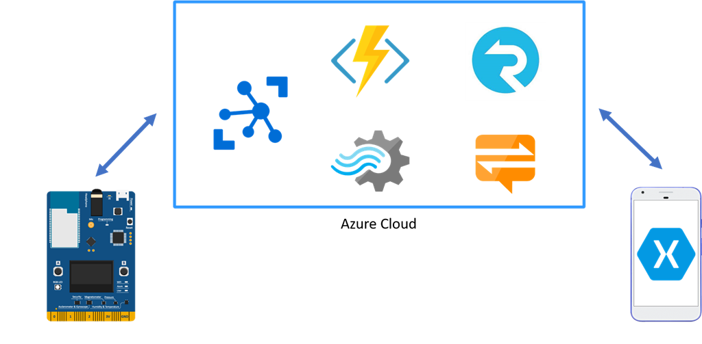

# 物联网和低代码开发

## 初识物联网

### 物联网的概念

20 世纪末，随着计算机网络和通信技术的兴起，互联网开始走进并融入人们的生活。传统互联网通常以人作为主体，数据的产生和传输都在人的控制下进行，数据的应用结果也在具体的人身上得到反映。以网络短视频为例，拍摄、上传和观看等环节都离不开用户的主动参与，而短视频平台对用户产生的数据进行分析和处理后，再根据偏好情况推送相关内容，最终受影响的依旧是用户本身。可以看出，传统物联网的大部分流程都是围绕人在运行和发展的。

    
     
    

        以人为主体的传统互联网
    

随着技术的不断演进，物与物之间信息传输和交换的需求日趋增加，物联网（Internet of Things, IoT）的概念应运而生。

现代物联网在本质上属于互联网的延伸。它将传统互联网的基础设施作为信息传递的载体，打破了时间和空间的限制，让“物”成为了数据产生和消费的主体，极大地拉近了“人与物”“物与物”的距离。以智慧农业灌溉为例，土壤中预埋的湿度传感器将土壤水分信息定时地上传到云端平台，当平台的程序监测到土壤缺水时，按照预设的规则，远程启动田间的灌溉设备，从而控制土壤含水量在合适水平。在这个场景中，无需人的参与，所有的流程都是靠物与物之间的交互完成，涉及的数据也是与“物”本身直接相关的。

    
     
    

        以物为主体的物联网
    

当前，物联网的涵义和外延仍在不断的变化和发展中，因此还没有一个清晰准确的定义。不过，从上面的介绍中，可以大致看出物联网的特点：物联网是以“物”为主体的互联网，在形式和内容上处处体现着“物”的特征。因此，物联网应用的整体架构和开发方式也与传统的互联网应用有着显著的区别。

如今，随着经济和科技的快速发展，20 多年前关于“万物互联”的幻想开始走入现实。从身边的各类智能设备、智能家居，到智慧地球和“元宇宙”的最新概念，物联网为这些技术变革提供了坚实有力的支撑。

### 物联网的体系结构

“下班前，打开手机中的开关，控制空调启动，到家后，即可享受舒适的室内温度。”这是日常生活中司空见惯的物联网应用场景。大部分物联网应用都和远程开空调一样，在用户层面的感知十分简单纯粹。但实际上，要实现这样一个简单的物联网应用，并不是一件容易的事。

一个完整的物联网应用，需要涉及到较多的技术、环节和角色。从数据流向和功能角度，物联网生态系统的体系结构可被大致分成四个层级。各层级执行属于自身的特定的功能，同时也通过各种渠道与其他层级之间进行互动，进而实现完整的物联网功能。

#### 终端层

终端层（Terminal Layer），又称感知层（Perception Layer）或感知控制层，是物联网体系中最基础的一层。终端层的核心功能是与物理世界的交互，进而实现对现实对象（环境参数、设备状态等）的感知和对具体设备的控制。

    
     
    

        当代智能家居中的典型终端：智能灯泡
    

终端层是绝大部分物联网实体设备（如传感器）的所在地。传感器通过将现实世界的物理量转换为电信号，实现信息采集和识别的重要作用。实际的物联网设备中，除了传感器，通常还具备用于协调和控制所有功能和部件运行的主控和用于网络接入的通信模块等部件。

#### 网络层

网络层（Network Layer）是负责将终端层的设备收集的数据传输到平台层，以及将平台层的控制指令发送回终端层的双向通信的桥梁。从功能维度，网络层又可分为接入层（Access Layer）和传输层（Transport Layer）。

接入层主要涉及传统 OSI 模型中的物理层和数据链路层的功能，简单来说，就是设备接入网络、实现互联的各种方式。从介质上，可分为有线网络接入和无线网络接入两类。有线网络接入方式包括以太网、串行通信（如 RS-232、RS-485 等）和 USB 等。无线网络接入方式包括 Wi-Fi、蓝牙、蜂窝网络等。物联网无线通信的相关概念将在下一节进行详细阐述。

    
     
    

        在很多场景中，无线路由器是网络的入口
    

传输层建立在接入层之上，包括了数据上报和下发的通信协议。与互联网终端相比，目前大部分物联网终端设备在处理性能、存储容量、网络速率等方面的可用资源较少，因而在通信时倾向于选择占用资源更少的通信协议，如 MQTT（Message Queuing Telemetry Transport）和 CoAP（Constrained Application Protocol）等。

#### 平台层

平台层（Platform Layer）是物联网架构的中间层，是数据被处理、存储和分析的地方。在过去，这一层一般由独立的服务器构成。随着微服务和云计算等技术的发展，现代的物联网平台层通常包括了基于云的系统性平台、数据分析引擎和中间件，使开发者能够在物联网基础设施之上构建和部署应用程序。

    
     
    

        ThingsBoard 平台的微服务架构
    

平台层在功能上作为承接设备和行业应用的中间服务，在整个物联网体系架构中起着承上启下的作用，承载了抽象化的业务逻辑和标准化的核心数据模型。一个典型的平台层不但可以实现设备的快速接入，还可以提供强大的模块化能力，满足行业应用场景下的各类需求。

除了提供基本的设备接入和管理功能外，成熟的物联网平台层通常还包括安全管理、监控运维等功能，为实际应用提供更多的方便。

#### 应用层

应用层（Application Layer）是物联网架构的顶层，是物联网数据真正产生价值的地方，也是物联网与人产生直接关联的层次。应用层包括网络和移动应用程序、仪表板和其他用户界面，使用户能够监测和控制设备，访问数据，并执行其他任务。在大部分场景中，应用层承接平台层的数据并进行分析和处理，再将结果应用于各类自动化流程，或是在与用户的交互中予以呈现。应用层还可以包括机器学习和人工智能算法，使系统能够从数据中不断学习，并随着时间的推移而对结果进行优化。

### 典型的物联网工程

为了更好地让读者理解物联网的体系结构和相关技术，我们再次以前文中提到的远程开启空调为例，介绍一个典型的物联网工程的内容和开发流程。

#### 需求分析

对于大部分工程项目，了解和细化需求是开发的第一步。在没有充分理解需求的基础上盲目启动开发工作往往会影响开发效率和最终效果，甚至造成不可挽回的损失。

在空调这个项目里，最初了解到的需求也许只有“远程开空调”这一项。面对这种需求，大部分人会设想的场景和流程是：

> 在手机或平板电脑上按下某个 App 中的按键，App 发送指令给服务器，服务器再发送命令给用户家中的某个本地设备，本地设备控制空调启动。

    
     
    

        设想中的空调远程控制
    

显然，其中包含的信息过于模糊，并含有大量先入为主的猜测，并不足以支持一个完整项目的开发。因此，需要通过与需求者（客户）的深入沟通，对内容和整体流程进行细化。对于这种类型的项目而言，要了解的内容包括但不限于：

- 远程控制所用的设备：Android 智能手机 / iPhone / 普通 PC / ……
- 用户交互所用的软件：专门的 App / 微信小程序 / 网页控制 / ……
- 空调的型号及控制方式：红外 / 蓝牙 / ……
- 云平台的类型：公有云 / 私有云 / 独立服务器 / ……
- “本地设备”的类型：智能插座 / 家庭网关 / ……
- “本地设备”的通信方式：Wi-Fi / 蓝牙 / Matter / 4G / ……
- 用户的其他功能需求：定时开关 / 自动开关机 / 自动省电 / ……
- ……

经过细化，最终的业务流程可能会变成：

> 用户通过操作 Android 智能手机上安装的独立 App，远程向部署在阿里云平台上的云端程序发送包括直接启动、定时开关等指令。云端程序根据不同的用户指令，直接或定时发送信息给部署于用户房间内的智能插座。智能插座通过 Wi-Fi 网络接收信息，然后通过红外遥控的形式，控制 xx 型号空调开启对应的工作模式。

乍一看，开发难度好像增加了不少。但需求细节的增加，为实际的开发指明了更加清晰完整的路径。

#### 框架建立

结合上文介绍的物联网四层架构和刚刚梳理的需求细节，开发者可以开始构建起大概的工程框架。可以看出，这个工程的主要开发工作量集中在以下三个板块。

1. 终端层（智能硬件）：开发一个智能插座，负责实现与云平台的交互和对空调的控制。
2. 平台层（核心逻辑）：部署相应的平台，并在其上实现相应的判断和控制算法。
3. 应用层（手机 App）：通过智能手机 App 完成对空调的远程控制，并能通过 App 轻松查询空调运行的实时状态。

事实上，大部分物联网工程的开发内容也都包括这三个方面。通俗地说，物联网工程开发，很多时候就是数据的“两头”（数据的产生侧和消费测）和“中间”（整体逻辑）的开发。

    
     
    

        常见的物联网应用结构
    

#### 开发内容梳理

在工程的整体框架清晰之后，就可以针对每一个部分的功能进行进一步的分析，整理出具体的开发路径和开发内容。

对于设备端的开发，从总体上看是实现一个基于 Wi-Fi 的智能插座。所以，在开发过程中，开发者需要通过控制 Wi-Fi 芯片或模块实现智能插座应有的网络配置、连接以及与云平台双向通信的功能。此外，这个智能插座还需要实现对空调的红外遥控，因此开发者需要在其中集成红外发射管，并对其发射功率、安装角度等进行考量，同时对空调的红外编码进行研究。

    
     
    

        典型的智能插座的结构
    

应用端的开发相对来说更为简单。基于 Android 系统开发智能手机 App，给用户提供图形化的操作界面，接收用户指令并发送到云端，同时从云端获取状态信息并在界面上进行显示。这个流程与普通的 App 开发相比没有显著差异。

云端的开发是整个项目的核心。具体来说，需要设计完备的机制，实现设备的接入以及各类数据和指令的上传、下发和存储，同时还需要提供智能手机 App 可访问的设备操作 API。此外，应用的核心控制逻辑，如定时启停等操作，一般也都在云端实现。好在目前大部分现有的商业云平台都已经搭建了成熟的基础架构，让用户可以方便地实现物联网数据上云操作。

需要注意的是，本节为了便于读者理解，只介绍了构成完整物联网业务逻辑的最核心的开发内容。一个真正成熟可商用的物联网项目，在开发过程中还会涉及到更多的功能，如设备监控、固件更新等等，开发工作量通常也远大于业余项目。

#### 实际开发流程

实际开发通常从硬件设计开始。在明确功能需求的基础上，对元件和其他物料进行选型，然后进行 PCB 设计和制造。对于一个智能插座而言，除了满足基本的功能需要，整体的体积、抗干扰能力等也是需要考虑的范畴。因此，硬件设计本身是一项门槛较高、专业性较强的工作。

之后，需要对物联网云平台进行配置。正如前文所言，大部分现有的商业云平台都已经搭建了成熟的基础架构，开发者需要根据不同平台的说明，创建相应的产品和（虚拟）设备，并完成属性和接口的配置，便于后期将设备与平台进行对接。

完成云平台配置后，就进入了真正的代码开发阶段。包括设备端的嵌入式软件开发和手机端的 App 开发。对于一般的嵌入式软件而言，除了实现设备所需的各类功能外，通常还需要根据实际需求，对功耗、稳定性等方面进行不断的迭代和优化。

最后，在所有软硬件开发结束，并完成最终产品的装配后，进入测试阶段。在这一阶段，一般会根据产品的功能和相关规范进行相关的量产测试，如设备功能测试、老化测试、射频测试等。对于业余项目而言，测试通常是非必须的，但对于商业项目，只有经过充分的测试，才能尽可能地规避内在风险，减少产品上市后出现问题的可能性。

## 低代码开发

从前文的介绍可以看出，对于物联网项目开发而言，涉及的专业知识较多，开发工作量也较大。如何降低开发难度，让更多人参与到物联网开发中来，低代码开发无疑是最好的选择。

### 低代码开发的由来

低代码（Low-Code）开发是近年来流行的一种全新的软件开发方式。在低代码开发过程中，开发者可以使用预先生成的模板、组件和其他工具来创建软件应用程序，显著降低人工编写的代码总量和代码的复杂度。与传统的开发模式相比，这类方法使开发者能够更快、更省力地完成项目开发。

低代码开发的概念起源于解决传统软件开发的挑战的需要。传统的软件开发往往需要专业的编程知识和大量的资源来完成。低代码开发的诞生是为了简化应用程序开发过程，使其更容易被包括编程经验有限的非专业用户在内的多数开发者所接受和实现。

低代码开发的核心思想是让开发者只关注业务逻辑，而不需要把精力浪费在非业务层面。有过 Microsoft Visual Basic / Visual C++ 或工业组态软件使用经验的用户通常很容易理解这一点。在 Microsoft Visual Basic 中，通过简单的拖拽就可以绘制完备的用户界面。开发者只需开发事件处理相关的业务代码，而无需关注界面相关代码。在组态软件中，除了界面可以通过拖拽绘制外，很多的业务逻辑也被包装为功能块的形式，开发者通过拖拽和简单配置即可实现完整的系统功能。这些“积木式开发”的方式其实就反映了低代码开发的核心思想。

    
     
    

        使用组态工具管理网络设备
    

低代码开发的最显著的特点在于对项目开发的加速作用。在项目开发中引入低代码技术后，传统的、需要消耗大量时间完成的冗长的编程工作将大幅减少，开发者因而可以更快、更省力地创建应用程序。这一特点使得低代码在快速迭代和原型设计中得到广泛应用，开发者可以便捷地修改和测试新的想法，而无需花费大量时间和精力。

低代码开发的另一重要优势在于保证了程序的质量。“积木式开发”中，开发者实际做的是对于各类预先开发的功能模块的串联和排布，通常不会涉及到具体的技术细节的修改，因而可以从源头上规避开发者主观因素导致的程序质量问题。对于一般的开发者来说，只要低代码运行环境和各功能模块的质量有所保证，利用低代码开发方式开发的应用在可靠性上会远高于传统开发方式开发的应用。

当前，低代码开发在包括网络和移动应用开发、流程自动化和数据集成等在内的多个领域中已经得到广泛应用。在网络和移动应用开发中，低代码开发可用于创建自定义用户界面、工作流程和数据模型。在流程自动化中，低代码开发可用于自动化重复性任务和简化业务流程。在数据集成方面，低代码开发可用于创建不同系统和应用程序之间的自定义集成。

    
     
    

        Node-RED，一种已经在物联网领域得到广泛应用的低代码平台
    

此外，低代码开发在实体企业中也受到了越来越广泛的欢迎。低代码开发可以帮助企业以较低的成本实现传统生产系统的现代化，并加速数字化转型工作。通过赋予非专业用户创建应用程序和自动化流程的能力，低代码开发技术可以帮助组织变得更加灵活，对不断变化的业务需求做出反应。

### 物联网和低代码

低代码开发技术目前已经在物联网生态系统的平台层和应用层得到了广泛的使用。借助低代码开发技术，平台开发者和用户可以轻松地对物联网数据在云端的流向进行控制（即“云组态”），并快速构建包括手机 App 在内的各种终端应用方式。随着各类编程框架的发展，低代码开发也开始在终端层，即具体的物联网设备开发中得到使用。

在实际的物联网项目落地和推广应用过程中，普遍存在着开发量和成本之间的矛盾。对于一个具体的物联网应用场景，如智能养殖，需要接入云端的传感器和智能仪表数量和种类繁多，物理链路多样，通信协议各有不同，显著增加了开发周期和开发成本，同时大量的设备对于长期维护来说也带来了挑战。而大部分物联网场景对于系统的整体成本较为敏感。这一矛盾为物联网项目的快速落地实施带来了巨大的阻碍。而低代码开发凭借其低成本、短周期、高稳定性的优势，成为了解决这一问题的钥匙。

从技术层面而言，物联网设备开发通常属于嵌入式系统（Embedded System）开发的范畴，在传统理念中，通常需要掌握多个领域的知识才能胜任。低代码开发技术的引入极大地降低了这一门槛，使得非专业用户也可以参与到开发中来。同时，模块化的开发方式也降低了开发者犯错的可能性，并为后续的维护提供了便利。随着物联网应用数量的不断增加，碎片化程度不断加深，人们对于能实现从端到云的物联网全链条开发的全栈工程师的需求也愈发迫切。低代码开发将进一步在这一领域展现其不可替代的价值。

### 常见的低代码编程语言和框架

物联网设备的低代码开发通常指的是使用简易的程序语言（如脚本语言）将各个模块和功能粘接在一起，以个性化、定制化的方式去快速实现开发者的需求。目前，在物联网领域常用的低代码框架种类较多，如基于 C++ 语言的 Arduino，基于 JavaScript 语言的 Johnny-Five，基于 Lua 语言的 NodeMCU，基于 Python 语言的 MicroPython 等。尽管它们在基础语法上存在较大差异，但它们的开发特性都是类似的：采用面向对象的思想进行代码设计，屏蔽了硬件、网络等方面的底层细节；同时赋予了灵活调用现有功能模块的能力。

    
     
    

        在 ESP8266 模块上使用 MicroPython 点亮 OLED 屏幕
    

以 GPIO（General Purpose Input/Output，通用输入输出）开发为例，开发者通常无需查看原理图，理解电路层面的连接关系；不需要了解各类引脚的类型和速度模式，也不需要搞清楚电平上下拉等知识；更不需要手动编写传统嵌入式开发必不可少的时钟配置和系统初始化等代码。开发者只需按照实际的业务需求直接编写 GPIO 状态控制逻辑即可，开发门槛和代码量都得到了显著降低。
