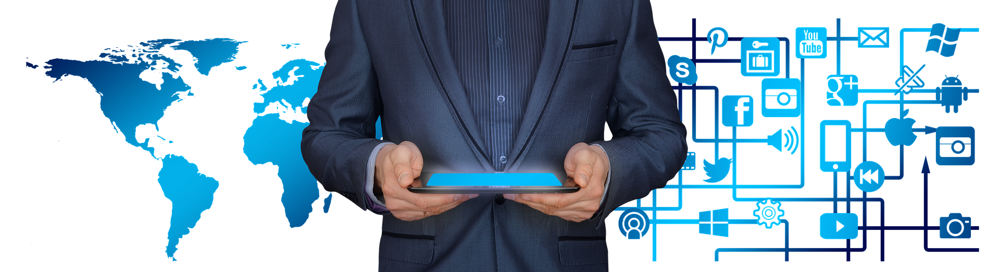

# 物联网和低代码开发

## 初识物联网

### 物联网的概念

20 世纪末，随着计算机网络和通信技术的兴起，互联网开始走进并融入人们的生活。传统互联网通常以人作为主体，数据的产生和传输都在人的控制下进行，数据的应用结果也在具体的人身上得到反映。以网络短视频为例，拍摄、上传和观看等环节都离不开用户的主动参与，而短视频平台对用户产生的数据进行分析和处理后，再根据偏好情况推送相关内容，最终受影响的依旧是用户本身。可以看出，传统互联网的大部分流程都是围绕人在运行和发展的。

    
     
    

        以人为主体的传统互联网
    

随着技术的不断演进，物与物之间信息传输和交换的需求日趋增加，物联网（Internet of Things, IoT）的概念应运而生。

物联网是一个将所有物体连接起来组成的物-物相连的互联网络。它利用各种信息传感器、射频识别技术、全球定位系统、红外线感应器、激光扫描器等各种装置与技术，实时采集任何需要监控、连接、互动的物体或过程，采集其声、光、热、电、力学、化学、生物、位置等各种需要的信息，通过各类可能的网络接入，实现物与物、物与人的泛在连接，实现对物品和过程的智能化感知、识别和管理。

现代物联网在本质上属于互联网的延伸。它将传统互联网的基础设施作为信息传递的载体，打破了时间和空间的限制，让“物”成为了数据产生和消费的主体，极大地拉近了“人与物”“物与物”的距离。以智慧农业灌溉为例，土壤中预埋的湿度传感器将土壤水分信息定时地上传到云端平台，当平台的程序监测到土壤缺水时，按照预设的规则，远程启动田间的灌溉设备，从而控制土壤含水量在合适水平。在这个场景中，无需人的参与，所有的流程都是靠物与物之间的交互完成，涉及的数据也是与“物”本身直接相关的。

    
     
    

        以物为主体的物联网
    

当前，物联网的涵义和外延仍在不断的变化和发展中，因此还没有一个清晰准确的定义。不过，从上面的介绍中，可以大致看出物联网的特点：物联网是以“物”为主体的互联网，在形式和内容上处处体现着“物”的特征。因此，物联网应用的整体架构和开发方式也与传统的互联网应用有着显著的区别。

如今，物联网已经成为一种新型信息基础设施和社会经济发展模式。它在工业、农业、环境、交通、物流、安保等基础设施领域，在家居、医疗健康、教育、金融与服务业、旅游业等与生活息息相关的领域，都有着广泛的应用和创新，有效地推动了这些方面的智能化发展，使得有限的资源更加合理地使用分配，从而提高了行业效率，也大大地提高了人们的生活质量。

随着经济和科技的快速发展，20 多年前关于“万物互联”的幻想开始走入现实。从身边的各类智能设备、智能家居，到智慧地球和“元宇宙”的最新概念，物联网为这些技术变革提供了坚实有力的支撑。

### 物联网的体系结构

“下班前，打开手机中的开关，控制空调启动，到家后，即可享受舒适的室内温度。”这是日常生活中司空见惯的物联网应用场景。大部分物联网应用都和远程开空调一样，在用户层面的感知十分简单纯粹。但实际上，要实现这样一个简单的物联网应用，并不是一件容易的事。

一个完整的物联网应用，需要涉及到较多的技术、环节和角色。从数据流向和功能角度，物联网生态系统的体系结构可被大致分成四个层级。各层级执行属于自身的特定的功能，同时也通过各种渠道与其他层级之间进行互动，进而实现完整的物联网功能。

#### 终端层

终端层（Terminal Layer），又称感知层（Perception Layer）或感知控制层，是物联网体系中最基础的一层。终端层的核心功能是与物理世界的交互，进而实现对现实对象（环境参数、设备状态等）的感知和对具体设备的控制。

    
     
    

        当代智能家居中的典型终端：智能灯泡
    

终端层是绝大部分物联网实体设备（如传感器、RFID 等）的所在地。传感器通过将现实世界的物理量转换为电信号，实现信息采集和识别的重要作用。实际的物联网设备中，除了传感器，通常还具备用于协调和控制所有功能和部件运行的主控和用于网络接入的通信模块等部件。

#### 网络层

网络层（Network Layer）是负责将终端层的设备收集的数据传输到平台层，以及将平台层的控制指令发送回终端层的双向通信的桥梁。从功能维度，网络层又可分为接入层（Access Layer）和传输层（Transport Layer）。

接入层主要涉及传统 OSI 模型中的物理层和数据链路层的功能，简单来说，就是设备接入网络、实现互联的各种方式。从介质上，可分为有线网络接入和无线网络接入两类。有线网络接入方式包括以太网、串行通信（如 RS-232、RS-485）和 USB 等。无线网络接入方式包括 Wi-Fi、蓝牙、蜂窝网络（如 2G/3G/4G/5G，将在 [下一节](./wireless-modules.md) 进行详细介绍）、低功耗广域网（如 LoRaWAN、NB-IoT）等。

    
     
    

        在很多场景中，无线路由器是网络的入口
    

传输层建立在接入层之上，包括了数据上报和下发的通信协议。与互联网终端相比，目前大部分物联网终端设备在处理性能、存储容量、网络速率等方面的可用资源较少，因而在通信时倾向于选择占用资源更少的通信协议，如 MQTT（Message Queuing Telemetry Transport）和 CoAP（Constrained Application Protocol）等。这些协议都是基于发布/订阅（Publish/Subscribe）模式的，可以实现设备和平台之间的双向通信，同时也支持数据加密和压缩等功能。

#### 平台层

平台层（Platform Layer）是物联网架构的中间层，是数据被处理、存储和分析的地方。在过去，这一层一般由独立的服务器构成。随着微服务和云计算等技术的发展，现代的物联网平台层通常包括了基于云的系统性平台、数据分析引擎和中间件，使开发者能够在物联网基础设施之上构建和部署应用程序。

    
     
    

        ThingsBoard 平台的微服务架构
    

平台层在功能上作为承接设备和行业应用的中间服务，在整个物联网体系架构中起着承上启下的作用，承载了抽象化的业务逻辑和标准化的核心数据模型。一个典型的平台层不但可以实现设备的快速接入，还可以提供强大的模块化能力，满足行业应用场景下的各类需求。

除了提供基本的设备接入和管理功能外，成熟的物联网平台层通常还包括安全管理、监控运维、规则引擎、边缘计算等功能，为实际应用提供更多的方便。

#### 应用层

应用层（Application Layer）是物联网架构的顶层，是物联网数据真正产生价值的地方，也是物联网与人产生直接关联的层次。应用层包括网络和移动应用程序、仪表板和其他用户界面，使用户能够监测和控制设备，访问数据，并执行其他任务。在大部分场景中，应用层承接平台层的数据并进行分析和处理，再将结果应用于各类自动化流程，或是在与用户的交互中予以呈现。应用层还可以包括机器学习和人工智能算法，使系统能够从数据中不断学习，并随着时间的推移而对结果进行优化。

### 典型的物联网工程

为了更好地让读者理解物联网的体系结构和相关技术，我们再次以前文中提到的远程开启空调为例，介绍一个典型的物联网工程的内容和开发流程。

#### 需求分析

对于大部分工程项目，了解和细化需求是开发的第一步。在没有充分理解需求的基础上盲目启动开发工作往往会影响开发效率和最终效果，甚至造成不可挽回的损失。

在空调这个项目里，最初了解到的需求也许只有“远程开空调”这一项。面对这种需求，大部分人会设想的场景和流程是：

> 在手机或平板电脑上按下某个 App 中的按键，App 发送指令给服务器，服务器再发送命令给用户家中的某个本地设备，本地设备控制空调启动。

    
     
    

        设想中的空调远程控制
    

显然，其中包含的信息过于模糊，并含有大量先入为主的猜测，并不足以支持一个完整项目的开发。因此，需要通过与需求者（客户）的深入沟通，对内容和整体流程进行细化。对于这种类型的项目而言，要了解的内容包括但不限于：

- 远程控制所用的设备：Android 智能手机 / iPhone / 普通 PC / ……
- 用户交互所用的软件：专门的 App / 微信小程序 / 网页控制 / ……
- 空调的型号及控制方式：红外 / 蓝牙 / ……
- 云平台的类型：公有云 / 私有云 / 独立服务器 / ……
- “本地设备”的类型：智能插座 / 家庭网关 / ……
- “本地设备”的通信方式：Wi-Fi / 蓝牙 / Matter / 4G / ……
- 用户的其他功能需求：定时开关 / 自动开关机 / 自动省电 / ……
- ……

经过细化，最终的业务流程可能会变成：

> 用户通过操作 Android 智能手机上安装的独立 App，远程向部署在阿里云平台上的云端程序发送包括直接启动、定时开关等指令。云端程序根据不同的用户指令，直接或定时发送信息给部署于用户房间内的智能插座。智能插座通过 Wi-Fi 网络接收信息，然后通过红外遥控的形式，控制 xx 型号空调开启对应的工作模式。

乍一看，开发难度好像增加了不少。但需求细节的增加，为实际的开发指明了更加清晰完整的路径。

#### 框架建立

结合上文介绍的物联网四层架构和刚刚梳理的需求细节，开发者可以开始构建起大概的工程框架。可以看出，这个工程的主要开发工作量集中在以下三个板块。

1. 终端层（智能硬件）：开发一个智能插座，负责实现与云平台的交互和对空调的控制。
2. 平台层（核心逻辑）：部署相应的平台，并在其上实现相应的判断和控制算法。
3. 应用层（手机 App）：通过智能手机 App 完成对空调的远程控制，并能通过 App 轻松查询空调运行的实时状态。

事实上，大部分物联网工程的开发内容也都包括这三个方面。通俗地说，物联网工程开发，很多时候就是数据的“两头”（数据的产生侧和消费测）和“中间”（整体逻辑）的开发。

    
     
    

        常见的物联网应用结构
    

#### 开发内容梳理

在工程的整体框架清晰之后，就可以针对每一个部分的功能进行进一步的分析，整理出具体的开发路径和开发内容。

对于设备端的开发，从总体上看是实现一个基于 Wi-Fi 的智能插座。所以，在开发过程中，开发者需要通过控制 Wi-Fi 芯片或模块实现智能插座应有的网络配置、连接以及与云平台双向通信的功能。此外，这个智能插座还需要实现对空调的红外遥控，因此开发者需要在其中集成红外发射管，并对其发射功率、安装角度等进行考量，同时对空调的红外编码进行研究。

    
     
    

        典型的智能插座的结构
    

应用端的开发相对来说更为简单。基于 Android 系统开发智能手机 App，给用户提供图形化的操作界面，接收用户指令并发送到云端，同时从云端获取状态信息并在界面上进行显示。这个流程与普通的 App 开发相比没有显著差异。

云端的开发是整个项目的核心。具体来说，需要设计完备的机制，实现设备的接入以及各类数据和指令的上传、下发和存储，同时还需要提供智能手机 App 可访问的设备操作 API。此外，应用的核心控制逻辑，如定时启停等操作，一般也都在云端实现。好在目前大部分现有的商业云平台都已经搭建了成熟的基础架构，让用户可以方便地实现物联网数据上云操作。

需要注意的是，本节为了便于读者理解，只介绍了构成完整物联网业务逻辑的最核心的开发内容。一个真正成熟可商用的物联网项目，在开发过程中还会涉及到更多的功能，如设备监控、固件更新等等，开发工作量通常也远大于业余项目。

#### 实际开发流程

实际开发通常从硬件设计开始。在明确功能需求的基础上，对元件和其他物料进行选型，然后进行 PCB 设计和制造。对于一个智能插座而言，除了满足基本的功能需要，整体的体积、抗干扰能力等也是需要考虑的范畴。因此，硬件设计本身是一项门槛较高、专业性较强的工作。

之后，需要对物联网云平台进行配置。正如前文所言，大部分现有的商业云平台都已经搭建了成熟的基础架构，开发者需要根据不同平台的说明，创建相应的产品和（虚拟）设备，并完成属性和接口的配置，便于后期将设备与平台进行对接。

完成云平台配置后，就进入了真正的代码开发阶段。包括设备端的嵌入式软件开发和手机端的 App 开发。对于一般的嵌入式软件而言，除了实现设备所需的各类功能外，通常还需要根据实际需求，对功耗、稳定性等方面进行不断的迭代和优化。

最后，在所有软硬件开发结束，并完成最终产品的装配后，进入测试阶段。在这一阶段，一般会根据产品的功能和相关规范进行相关的量产测试，如设备功能测试、老化测试、射频测试等。对于业余项目而言，测试通常是非必须的，但对于商业项目，只有经过充分的测试，才能尽可能地规避内在风险，减少产品上市后出现问题的可能性。

## 低代码开发

从前文的介绍可以看出，对于物联网项目开发而言，涉及的专业知识较多，开发工作量也较大。如何降低开发难度，让更多人参与到物联网开发中来，低代码开发无疑是最好的选择。

### 低代码开发的由来

低代码（Low-Code）开发是近年来流行的一种全新的软件开发方式。在低代码开发过程中，开发者可以使用预先生成的模板、组件和其他工具来创建软件应用程序，显著降低人工编写的代码总量和代码的复杂度。与传统的开发模式相比，这类方法使开发者能够更快、更省力地完成项目开发。

低代码开发的概念源于对传统软件开发面临的挑战的解决需求。传统的软件开发往往需要专业的编程知识和大量的资源来完成，而且开发周期较长，维护成本较高。低代码开发的出现是为了简化和加速应用程序开发过程，使其更容易被不同层次和背景的开发者所掌握和使用，包括那些没有太多编程经验的非专业用户。

低代码开发的核心思想是让开发者只关注业务逻辑，而不需要把精力浪费在非业务层面。这一思想可以追溯到第四代编程语言和上世纪 90 年代至 21 世纪初流行的快速应用程序开发（Rapid Application Development，RAD）工具。有过 Microsoft Visual Basic / Microsoft Visual C++ 或工业组态软件使用经验的用户通常很容易理解这一点。在 Microsoft Visual Basic 中，通过简单的拖拽就可以绘制完备的用户界面。开发者只需开发事件处理相关的业务代码，而无需关注界面相关代码。在组态软件中，除了界面可以通过拖拽绘制外，很多的业务逻辑也被包装为功能块的形式，开发者通过拖拽和简单配置即可实现完整的系统功能。这些“积木式开发”的方式其实就反映了低代码开发的核心思想。

    
     
    

        使用组态工具管理网络设备
    

低代码开发有许多优势，其中最显著的是对项目开发效率的提升作用。由于低代码开发提供了可重用组件等功能，传统的、需要消耗大量时间完成的冗长的编程工作将大幅减少，开发者因而可以更快、更省力地创建应用程序。这一优势使得低代码在快速迭代和原型设计中得到广泛应用，开发者可以便捷地修改和测试新的想法，而无需花费大量时间和精力。

低代码开发的另一重要优势在于保证了程序的质量。“积木式开发”中，开发者实际做的是对于各类预先开发的功能模块的串联和排布，通常不会涉及到具体的技术细节的修改，因而可以从源头上规避开发者主观因素导致的程序质量问题。对于一般的开发者来说，只要低代码运行环境和各功能模块的质量有所保证，利用低代码开发方式开发的应用在可靠性上会远高于传统开发方式开发的应用。

当前，低代码开发在包括网络和移动应用开发、流程自动化和数据集成等在内的多个领域中已经得到广泛应用。在网络和移动应用开发中，低代码开发可用于创建自定义用户界面、工作流程和数据模型。在流程自动化中，低代码开发可用于自动化重复性任务和简化业务流程。在数据集成方面，低代码开发可用于创建不同系统和应用程序之间的自定义集成。

    
     
    

        Node-RED，一种已经在物联网领域得到广泛应用的低代码平台
    

此外，低代码开发在实体企业中也受到了越来越广泛的欢迎。低代码开发可以帮助企业以较低的成本实现传统生产系统的现代化，并加速数字化转型工作。通过赋予非专业用户创建应用程序和自动化流程的能力，低代码开发技术可以帮助组织变得更加灵活，对不断变化的业务需求做出反应。

总之，低代码开发是一种革命性的软件开发方式，它可以让更多的人参与到应用程序的开发过程中，提高开发效率和质量，降低开发成本和难度，满足各种业务场景的需求。

### 物联网和低代码

低代码开发技术已经在物联网生态系统的平台层和应用层发挥了重要作用。借助低代码开发技术，平台开发者和用户可以通过可视化的界面和拖拽式的操作，轻松地对物联网数据在云端的流向进行控制（即“云组态”），并快速构建包括手机 App 在内的各种终端应用方式。这样，无论是对于物联网平台的搭建，还是对于物联网数据的利用，都可以大大提高效率和灵活性，降低复杂度和风险。随着各类编程框架的发展，低代码开发也开始在终端层，即具体的物联网设备开发中得到使用。

在实际的物联网项目落地和推广应用过程中，普遍存在着开发量和成本之间的矛盾。对于一个具体的物联网应用场景，如智能养殖，需要接入云端的传感器和智能仪表数量和种类繁多，物理链路多样，通信协议各有不同，显著增加了开发周期和开发成本，同时大量的设备对于长期维护来说也带来了挑战。而大部分物联网场景对于系统的整体成本较为敏感。这一矛盾为物联网项目的快速落地实施带来了巨大的阻碍。低代码开发凭借其低成本、短周期、高稳定性的优势，成为了解决这一问题的钥匙。

物联网设备开发是一个典型的嵌入式系统（Embedded System）开发场景，在传统理念中，通常需要掌握多个领域的知识才能胜任。例如，开发者需要了解硬件设计、电路原理、嵌入式软件、本地和远程通信、中间件、应用程序、分析、机器学习等等。这些知识不仅涉及不同的技术栈，而且需要不断更新和学习。这就导致了物联网设备开发的门槛很高，人才很稀缺，成本很高昂。而低代码开发技术的引入极大地降低了这一门槛，使得非专业用户也可以参与到开发中来。同时，模块化的开发方式也降低了开发者犯错的可能性，并为后续的维护提供了便利。随着物联网应用数量的不断增加，碎片化程度不断加深，人们对于能实现从端到云的物联网全链条开发的全栈工程师的需求也愈发迫切。低代码开发将进一步在这一领域展现其不可替代的价值。

### 物联网设备的低代码开发

物联网设备的低代码开发是一种利用简单易用的编程语言（如脚本语言）和框架，在物联网设备上快速构建和部署应用程序的方法。正如前文所述，低代码开发可以降低物联网设备开发的门槛，提高开发效率，适应多变的业务需求。

#### 常见的低代码硬件开发框架

目前，市面上有许多不同类型的低代码开发框架，它们各有优势和特点，可以根据不同的场景和设备进行选择。

##### Arduino

Arduino 是一个基于 C++ 语言的开源开发框架，它为开发者提供了丰富的库和模块，让他们可以方便地控制各种传感器和执行器，实现各种创意项目和原型设计。

作为近年来物联网嵌入式开发领域的重要技术之一，Arduino 具有良好的互操作性和可移植性，能够与多种硬件平台和网络协议兼容。同时，Arduino 也是运算能力和内存资源较为有限的物联网硬件的首选编程框架，因为它可以优化性能和节省空间，提高开发效率和质量。此外，Arduino 还具有价格便宜、开源特性、易用性和社区支持等优点，这些优点使得 Arduino 更加受到开发者的青睐和信赖。

##### Johnny-Five

Johnny-Five 是一个基于 JavaScript 的机器人和物联网编程框架，它可以让开发者用熟悉的语言和工具来控制各种硬件设备，同时享受 Node.js 生态系统的优势。它使用 Firmata 协议与硬件平台进行通信，支持 Tessel 2、Raspberry Pi、Intel Edison、Particle Photon 等多种主流的开发板。

Johnny-Five 提供了丰富的组件库，可以轻松控制各种传感器、执行器、显示器等常用的硬件模块。它具有强大的事件驱动模型，可以响应硬件的状态变化，实现交互式和智能化的功能。它具有灵活的插件机制，可以扩展新的硬件支持或功能，满足不同的需求和场景。它还有友好的文档和示例，可以帮助开发者快速入门和学习，提高开发效率和质量。

##### NodeMCU

如果你想在低成本的 Wi-Fi 芯片上开发物联网应用程序，NodeMCU 是一个不错的选择。NodeMCU 是一个开源的物联网开发框架，它基于 Lua 语言，可以让你使用简洁清晰的语法编写和运行网络应用程序。Lua 是一种高级的脚本语言，它主要面向数据的物联网解决方案，可以快速地处理和分析大量复杂数据，提高物联网系统的性能和效率。

NodeMCU 支持多种网络服务和云平台，如 HTTP、MQTT、CoAP 等，可以方便地连接和控制各种物联网设备。你可以使用 NodeMCU 实现智能家居、远程监控、数据采集等功能。NodeMCU 还提供了丰富的库函数和示例代码，可以帮助你快速入门和学习。

NodeMCU 可以在 ESP8266 和 ESP32 等低成本的 Wi-Fi 芯片上运行，这些芯片集成了 Wi-Fi 功能和低功耗微控制器，适合物联网应用开发。除此之外，NodeMCU 还有以下优点：它可读性强，易于维护和修改，也便于与其他开发者交流和协作；它与面向对象、结构化和函数式编程高度兼容，可以灵活地适应不同的编程风格和需求；它可以通过与 C/C++ 混合编程或使用 JIT 编译器等方式来提升运行速度。

##### MicroPython

MicroPython 是 Python 的“精简版”，它适应了资源有限的设备，同时保留了 Python 的语法和交互式编程体验，使得 Python 语言能够在微控制器和小型嵌入式系统上运行。这意味着开发者可以使用熟悉的 Python 语法和工具来编写和调试代码，而不需要学习新的语言或环境。MicroPython 还继承了 Python 的 REPL（Read-Eval-Print Loop）模式，即开发者可以在设备上直接输入代码并立即看到执行结果，这有助于快速测试和验证想法。

为了方便 Python 开发者和教育者使用，MicroPython 支持多种硬件接口和库。例如，MicroPython 可以通过 SPI、I2C、UART 等接口与传感器、显示器、马达等外部设备通信，也可以通过网络模块实现无线连接和远程控制。此外，MicroPython 还提供了一些专门针对微控制器和嵌入式系统的库，如 `machine`、`network`、`uasyncio` 等。

    
     
    

        在 ESP8266 模块上使用 MicroPython 点亮 OLED 屏幕
    

关于 MicroPython 的更多信息，我们将在本章的 [第 3 节](about-qpy.md) 进行介绍。

#### 低代码硬件开发的特性

尽管低代码硬件开发框架的种类繁多、适用场景多样，但作为低代码技术，它们都具备着一些相似的特性。

##### 面向对象

面向对象是一种编程范式，它将数据和操作数据的方法封装在一起，形成一个对象。对象之间可以通过消息传递进行交互，实现复杂的功能。面向对象的编程语言和框架可以让开发者更容易地理解和操作硬件设备，因为它们都被抽象为具有属性和行为的对象。例如，Arduino 中的 LED 灯可以被看作是一个对象，它有一个引脚属性和一个亮度属性，它有一个设置引脚和设置亮度的方法。使用 Arduino 语言，我们可以很容易地创建一个 LED 灯对象，并且调用它的方法来控制它的状态。

##### 屏蔽细节

屏蔽细节是一种编程技巧，它隐藏了不必要或不相关的信息，只暴露出必要或相关的信息，从而简化了编程过程。屏蔽细节的编程语言和框架可以让开发者无需关心硬件设备的底层实现细节，只需要关注其功能和接口，从而降低了开发难度和出错率。例如，NodeMCU 中的网络服务模块可以让开发者无需了解 Wi-Fi 芯片的底层驱动和协议栈，只需要调用简单的函数就可以实现网络连接和数据传输。

> 以 GPIO（General Purpose Input/Output，通用输入输出）开发为例，开发者通常无需查看原理图，理解电路层面的连接关系；不需要了解各类引脚的类型和速度模式，也不需要搞清楚电平上下拉等知识；更不需要手动编写传统嵌入式开发必不可少的时钟配置和系统初始化等代码。开发者只需按照实际的业务需求直接编写 GPIO 状态控制逻辑即可，开发门槛和代码量都得到了显著降低。

##### 模块化

模块化是一种编程原则，它将一个大型的程序分解为多个相互独立的小型模块，每个模块都有自己的功能和接口，可以被重复使用和组合。模块化的编程语言和框架可以让开发者灵活地调用现有的功能模块，根据不同的需求组合不同的模块，实现复杂的功能。例如，MicroPython 中的硬件接口模块可以让开发者轻松地使用各种硬件设备，如 I2C、SPI、UART 等，只需要导入相应的模块并创建相应的对象就可以进行通信和控制。

通过以上分析，我们可以看出低代码开发框架具有以下优势：简化了编程过程，提高了开发效率；抽象了硬件设备，增强了可移植性；利用了现有资源，扩展了功能性。总而言之，低代码开发框架是一种适应时代变化和技术进步的编程范式，它可以让更多人参与到创新和制作中来，实现自己的想法和梦想。
