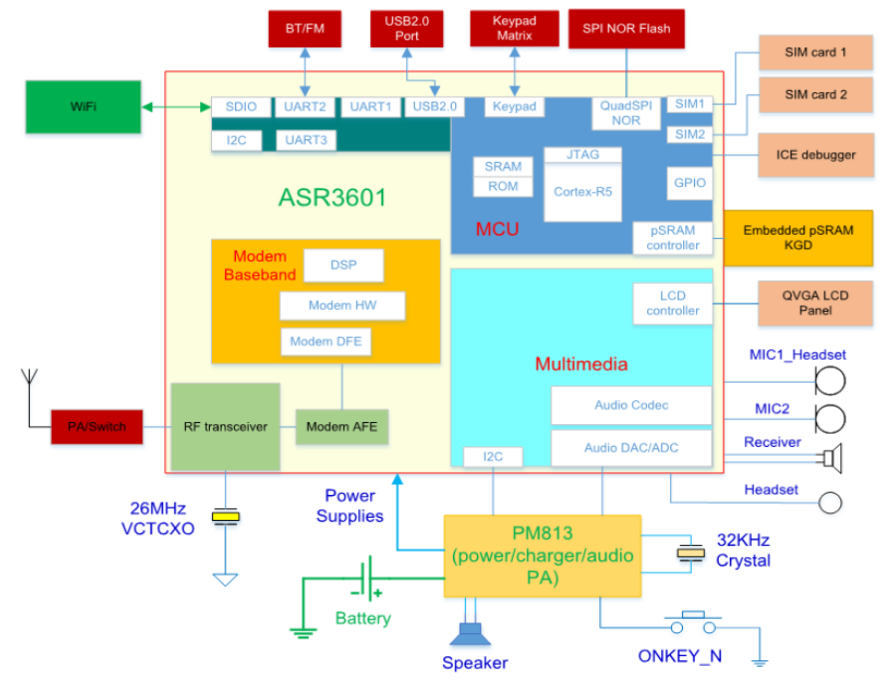
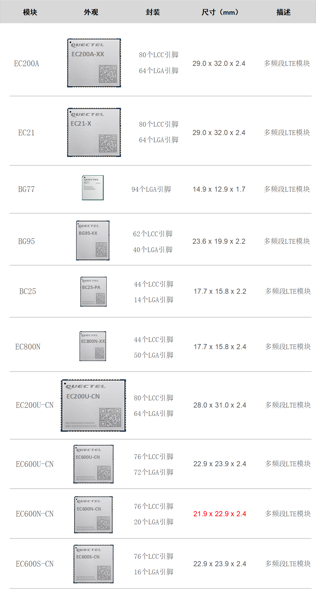

## 硬件支持

目前重点支持：

ECx00U：U代表展锐8910平台

ECx00N：N代表ASR1603平台

ECx00S：S代表ASR1601平台

EC100Y：Y代表ASR3601平台

EC100Y内核是ASR3601，系统为ThreadX硬实时嵌入式源代码操作系统。

## 详细信息

| 型号         | 网络制式                                                 | 频段                                                         | CPU    | Flash size (Kbytes)     | RAM size (Kbytes) | GPIO | ExtInt | Timer | RTC  | WDT  | ADC  | UART | I2C  | SPI  | SD   | LCD  | LVGL | Camera | Volte | POC  | WIFI | BLE  | FOTA | Supply voltage (V) | Maximum operating temperature range (°C) |
| ------------ | -------------------------------------------------------- | ------------------------------------------------------------ | ------ | ----------------------- | ----------------- | ---- | ------ | ----- | ---- | ---- | ---- | ---- | ---- | ---- | ---- | ---- | ---- | ------ | ----- | ---- | ---- | ---- | ---- | ------------------ | ---------------------------------------- |
| BC25 PA      | 全网通，移动，联通，电信                                 | LTE-FDD: B3/B5/B8                                            |        | free：≈0.105M           | free：≈450K       | 16   | 17     | 4     | √    | ×    | 1    | 2    | 2    | 1    | *    | ×    | *    | *      | *     | *    | ×    | *    | √    | 2.1-3.6V           | -40 to +85°C                             |
| EC800N CN-LA | 全网通，移动4G，联通4G，电信4G                           | LTE-FDD: B1/B3/B5/B8 LTE-TDD: B34/B38/B39/B40/B41    | 624MHz | total：8M   free：≈0.5M | free：≈450K       | 37   | 38     | 4     | √    | √    | 4    | 3    | 1    | 2    | √    | √    | √    | √      | *     | *    | √    | ×    | √    | 3.4-4.5V           | -35 to +85°C                             |
| EC200U CN-LB | 全网通，移动4G，联通4G，电信4G                           | LTE-FDD: B1/B3/B5/B8 LTE-TDD: B34/B38/B39/B40/B41    | 624MHz | total：8M   free：≈0.3M | free：≈450K       | 17   | 17     | 4     | √    | √    | 3    | 2    | 2    | 2    | *    | √    | √    | √      | *     | √    | √    | √    | √    | 3.4-4.3V           | -40 to +105°C                            |
| EC200U EU-AB | 全网通，移动4G，联通4G，电信4G，移动2G，联通2G，电信2G， | LTE-FDD: B1/B3/B5/B8 LTE-TDD: B34/B38/B39/B40/B41 GSM: 900/1800 MHz | 624MHz | total：8M   free：≈0.3M | free：≈450K       | 17   | 17     | 4     | √    | √    | 3    | 2    | 2    | 2    | *    | √    | √    | √      | *     | √    | √    | √    | √    | 3.4-4.3V           | -40 to +105°C                            |
| EC600U CN-LB | 全网通，移动4G，联通4G，电信4G                           | FDD B1/B3/B5/B8 TDD B34/B38/B39/B40/B41                  | 624MHz | total：8M   free：≈0.3M | free：≈450K       | 16   | 16     | 4     | √    | √    | 4    | 2    | 2    | 2    | *    | √    | √    | √      | *     | √    | √    | √    | √    | 3.4-4.3V           | -40 to +105°C                            |
| EC600U CN-LC | 全网通，移动4G，联通4G，电信4G                           | FDD B1/B3/B5/B8 TDD B34/B38/B39/B40/B41                  | 624MHz | total：8M   free：≈0.3M | free：≈450K       | 16   | 16     | 4     | √    | √    | 4    | 2    | 2    | 2    | *    | √    | √    | √      | *     | √    | √    | ×    | √    | 3.4-4.3V           | -40 to +105°C                            |
| EC600U EU-AB | 全网通，移动4G，联通4G，电信4G                           | FDD B1/B3/B5/B7/B8/B20/B28 TDD B38/B40/B41 GSM B2/B3/B5/B8 | 624MHz | total：8M   free：≈0.3M | free：≈450K       | 16   | 16     | 4     | √    | √    | 4    | 2    | 2    | 2    | *    | √    | √    | √      | √     | √    | √    | √    | √    | 3.4-4.3V           | -40 to +105°C                            |
| EC600N CN-LD | 全网通，移动4G，联通4G，电信4G                           | FDD B1/B3/B5/B8 TDD B34/B38/B39/B40/B41                  | 624MHz | total：16M   free：≈1M  | free：≈450K       | 29   | 29     | 4     | √    | √    | 1    | 3    | 1    | 2    | √    | √    | √    | √      | √     | *    | √    | ×    | √    | 3.4-4.3V           | -40 to +105°C                            |
| EC600N CN-LC | 全网通，移动4G，联通4G，电信4G                           | FDD B1/B3/B5/B8 TDD B34/B38/B39/B40/B41                  | 624MHz | total：16M   free：≈1M  | free：≈450K       | 29   | 29     | 4     | √    | √    | *    | 3    | 1    | 2    | √    | √    | √    | √      | √     | *    | √    | ×    | √    | 3.4-4.3V           | -40 to +105°C                            |
| EC600N CN-LA | 全网通，移动4G，联通4G，电信4G                           | FDD B1/B3/B5/B8 TDD B34/B38/B39/B40/B41                  | 624MHz | total：8M   free：≈0.3M | free：≈450K       | 29   | 29     | 4     | √    | √    | *    | 3    | 1    | 2    | √    | √    | √    | √      | *     | *    | √    | ×    | √    | 3.4-4.3V           | -40 to +105°C                            |
| EC600S CN-LA | 全网通，移动4G，联通4G，电信4G                           | FDD B1/B3/B5/B8 TDD B34/B38/B39/B40/B41                  | 624MHz | total：16M   free：≈1M  | free：≈450K       | 29   | 29     | 4     | √    | √    | 1    | 3    | 1    | 2    | ×    | √    | ×    | √      | √     | ×    | √    | ×    | √    | 3.4-4.3V           | -40 to +105°C                            |
| EC600S CN-LB | 全网通，移动4G，联通4G，电信4G                           | FDD B1/B3/B5/B8 TDD B34/B38/B39/B40/B41                  | 624MHz | total：8M   free：≈0.3M | free：≈350K       | 29   | 29     | 4     | √    | √    | 1    | 3    | 1    | 2    | ×    | √    | √    | √      | ×     | ×    | √    | ×    | √    | 3.4-4.3V           | -40 to +105°C                            |

标*号表示：正在开发中

标√号表示：支持

其他：不支持

**支持常用的传感器、执行单元和输入设备**

- 传感器：
  - 照度传感器（BH1750、OPT3001、GL5516、GL5528）
  - 三轴加速度传感器（ADXL346、BMA250、LIS2DH12TR）
  - 温湿度传感器（HDC1080、HDC2080、AHT10、DHT11）
  - 可燃气体传感器
  - CO2气体传感器
  - GNSS定位模块
  - ...

- 执行单元：

  - 功放
  - 电机
  - LED
  - LCD（ILI9225、ST7735、ST7789、SSD1306、UC1628）
  - ...

- 输入设备：

  - 麦克风
  - 摄像头（GC032A、BF3901）
  - 矩阵键盘
  - ...

  

## 模组封装尺寸

