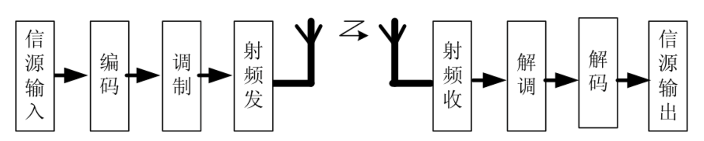
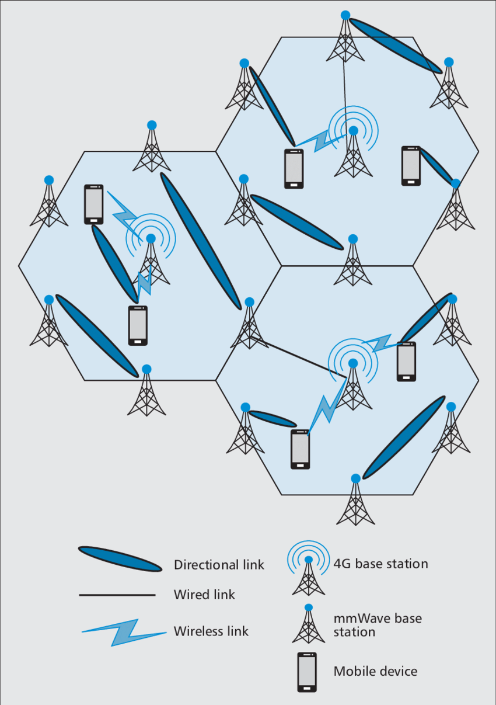
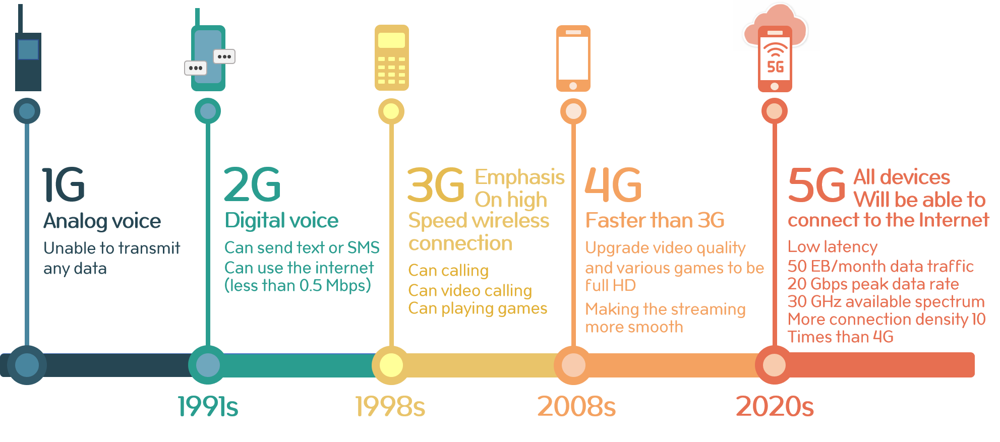
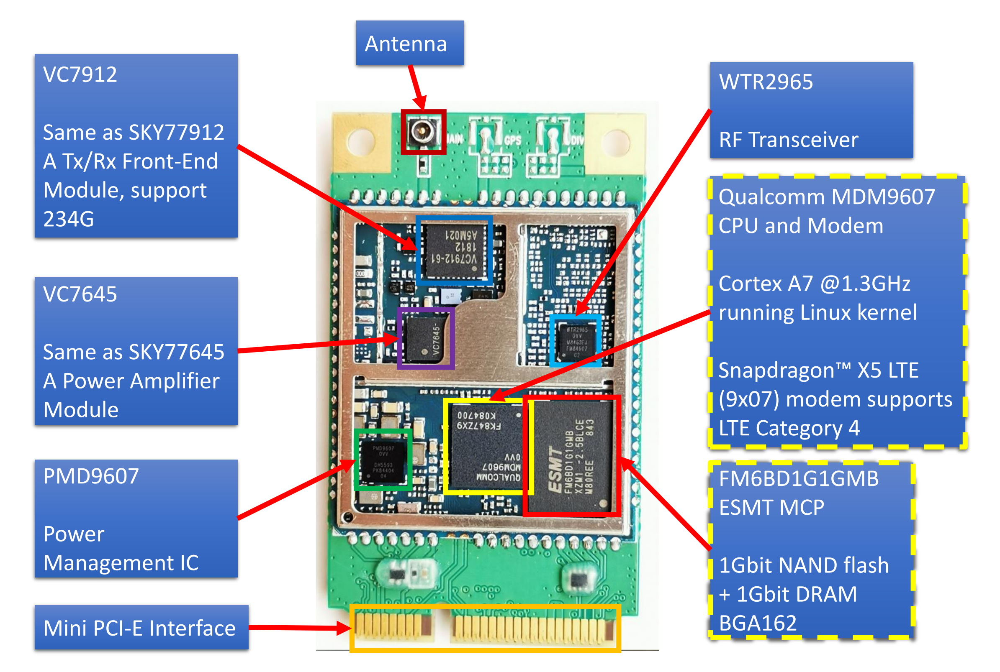
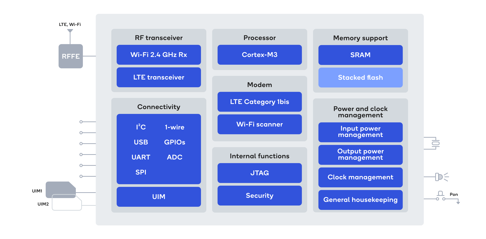
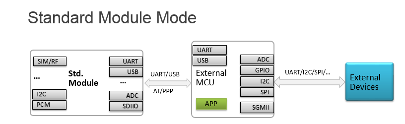
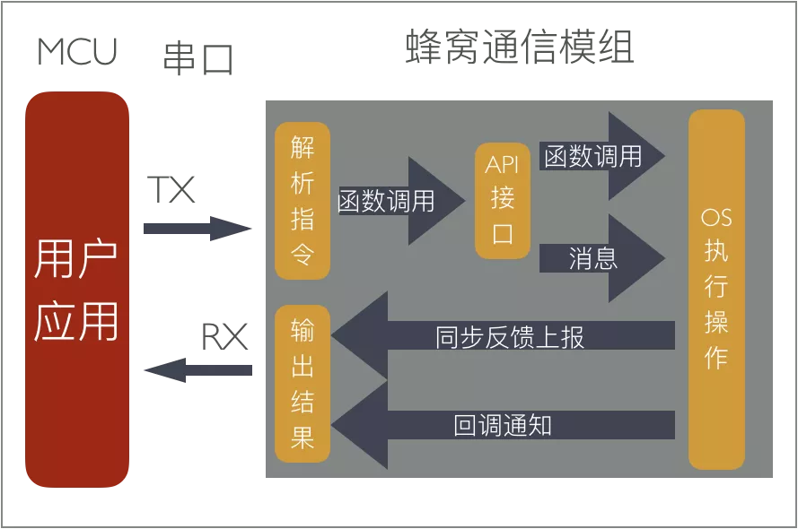
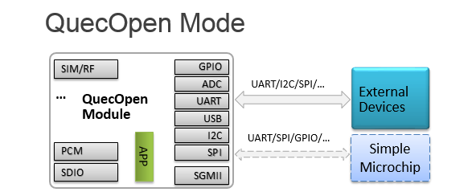

# 无线通信模块简介

QuecPython 是运行在无线通信模块上的开发框架。对于首次接触物联网开发的用户而言，无线通信模块可能是一个相对陌生的概念。本文主要针对无线通信和蜂窝网络本身，以及模块的概念、特性和开发方式进行简要的介绍。

## 无线通信和蜂窝网络

### 物联网对无线通信的需求

在 [上一节](./iot-and-low-code.md) 中，我们介绍了物联网的四层结构。其中的网络层承担着设备接入和数据传输的重要功能。由于物联网设备数量较多，分布的空间范围极大，采用有线以太网方式接入网络显然无法满足需要。因此，大部分物联网设备都具备了无线通信的功能，即通过无线电波作为载体进行信号传输。当前，我们身边常见的无线通信方式包括 Wi-Fi、蓝牙等十余种，不同方式的通信速率和通信距离存在显著差异。

.. details:: 关于通信

    物联网无线通信的种类繁多，面向场景多样，因此在具体的功能结构和技术细节上存在较大的差异，但他们的基本流程和模式是类似的。为了便于理解，我们不妨使用人和人之间的通信进行类比。
    
    设想这样一个场景，在没有现代电子科技的情况下，位于两座相邻的山顶上的两人如何实现互相通信？
    
    <center>
        
        <br>
        <div style="color: orange; border-bottom: 1px solid #d9d9d9; display: inline-block; color: #999; padding: 2px;">
            两座孤单的山头
        </div>
    </center>
    
    最简单直接的方法是互相喊叫，利用声音作为信息载体和空气作为传输媒介。但当两人的距离远到一定程度时，声音会衰减或被干扰，这种方法就不太可行了。此时，通过视觉信号进行交流是更好的方式。因此，两人可以使用彩色旗帜或火把作为信息载体和光线作为传输媒介来传递信息。不过，这一方法还有一个前提：双方都需要建立一种共识，了解并遵守不同的旗帜或者火光所代表的含义。这样，两人就可以在相距较远的山头实现低效但相对可靠的通信了。
    
    <center>
        
        <br>
        <div style="color: orange; border-bottom: 1px solid #d9d9d9; display: inline-block; color: #999; padding: 2px;">
            使用旗语互相交流
        </div>
    </center>
    
    这个简陋的双人通信流程包含了通信系统的基本要素：信源、信宿、信道、信息载体和编码规则。信源是产生和发送信息的一端，信宿是接收和处理信息的一端，信道是信号在信源和信宿之间传输的通道，信息载体是承载信息的物理量，编码规则是约定好的信息表示方式。
    
    现代通信同样包含类似的要素，只是更加复杂和高效。有过使用电话线进行拨号上网经历的用户对于“猫”（Modem，调制解调器）应该不会感到陌生。电话线及电话网络是被设计成用于传输 300 Hz 到 3400 Hz 的模拟音频信号的，并不适合直接传输网络数据。要使得计算机之间可以通过电话线实现双向通信，需要满足两个基本条件：
    
    - 通过操作系统和网卡，实现用户原始数据与可在网络设备间互相传输和辨识的标准数据形式之间的相互转换。这种通过规范化数据格式，使之符合某一标准或共识，从而提升信息传输效率和系统有效性的方法通常称为编码（Coding），在接收端则称为解码（Decoding）。
    - 通过“猫”，实现数字信号与可通过电话线传输的模拟信号之间的相互转换。这种通过对原始信号进行各种转换，使之能借助不同的通信介质（或载体）进行传播的方法通常称为调制（Modulation），在接收端则称之为解调（Demodulation）。调制和解调的目的是为了适应信道的特性，克服信道的干扰，提高信号的传输质量。
    
    除了电话线之外，还有许多其他的通信介质，如无线电波、光纤、卫星等。不同的通信介质有不同的特点和优势，需要采用不同的编码和调制技术。例如，无线电波可以在空气中传播，不需要物理连接，但容易受到其他无线电波的干扰，需要采用频率复用、编码复用、正交复用等技术来分配和利用频谱资源。光纤可以传输高速高容量的光信号，具有低损耗、高带宽、抗干扰等优点，但需要特殊的光电转换设备，需要采用脉冲编码调制、相位调制、频移键控等技术来实现光与电之间的转换。卫星可以覆盖广阔的地区，实现远程通信，但需要高功率的发射器和接收器，需要采用多址接入、跳频扩频、正交相移键控等技术来实现卫星与地面之间的通信。
    
    通信技术是一门涉及多个学科领域的综合性科学，它包括信息论、信号处理、电路理论、微波技术、天线技术、网络技术等方面。当然，作为用户和普通开发者，我们无需了解太多细节，各类终端设备和通信模块已经帮助我们处理好了一切。我们需要关注的，只是具体通信方式的选择和使用方法。
    
    <center>
        
        <br>
        <div style="color: orange; border-bottom: 1px solid #d9d9d9; display: inline-block; color: #999; padding: 2px;">
            无线通信系统简略框图
        </div>
    </center>
    
    > 需要注意的是，为降低入门难度，本节的讲解并不全面和严谨。对于无线通信原理以及各类物联网无线通信方式的具体内容，本文不做系统介绍。有兴趣的读者可以自行参考《通信原理》《无线通信原理与应用》《物联网》等教材进行自学。

不同的物联网应用场景，对于无线通信的需求存在很大差别。下表展示了当前常见的物联网无线通信技术的特性和使用场景差异。

| 通信技术 | 速率 | 传输距离 | 功耗 | 成本 | 应用场景                                                     |
| :------: | :--: | :------: | :--: | :--: | ------------------------------------------------------------ |
|  Wi-Fi   |  高  |    短    |  高  |  中  | <ul> <li> 室内无线上网 </li> <li> 智能家居 </li> </ul>              |
|   蓝牙   |  中  |    短    |  中  |  低  | <ul> <li> 资产追踪 </li> <li> 定位标签 </li> <li> 医疗传感器 </li> <li> 智能手表 </li> </ul> |
|  Zigbee  |  低  |    短    |  低  |  低  | <ul> <li> 无线传感器 </li> <li> 智能家居 </li> </ul>                |
|   UWB    |  高  |    短    |  高  |  高  | <ul> <li> 高精度定位 </li> </ul>                                 |
|    4G    |  高  |    长    |  高  |  高  | <ul> <li> 可移动通信 </li> <li> 车辆追踪 </li> <li> 智慧城市 </li> </ul> |
|  NB-IoT  |  低  |    长    |  低  |  中  | <ul> <li> 远程抄表 </li> <li> 井盖检测 </li> </ul>                  |
|   LoRa   |  低  |    长    |  低  |  中  | <ul> <li> 园区覆盖 </li> <li> 近海渔船检测 </li> </ul>              |

### 蜂窝网络的概念

蜂窝网络（Cellular Network，又称移动网络 Mobile Network）是一种无线通信技术，它能够让移动设备（如手机、平板电脑等）在不同的地理区域内进行语音、数据和多媒体等业务的传输。蜂窝网络是现代移动电话和个人通信系统的基础架构之一，也是推动社会信息化进程的重要力量。

<center>
    
    <br>
    <div style="color: orange; border-bottom: 1px solid #d9d9d9; display: inline-block; color: #999; padding: 2px;">
        5G 毫米波蜂窝网络结构示意图
    </div>
</center>

如上图所示，蜂窝网络的核心思想是将一个大的服务区域划分为许多个小区（Cell），每个小区内部安装一个基站（Base Station），负责与小区内的移动设备进行无线通信。这些基站之间通过有线或无线的方式连接起来，形成一个覆盖整个服务区域的网络。在传统理论中，这些小区被设计为六边形、圆形或正方形，以六边形最为常见。小区之间彼此连接，实现区域的完整覆盖，形如蜂巢，这也是该项技术被译为蜂窝网络的原因。如今，在实际场景中，很多基站的覆盖区域已经不再是蜂窝形状，但这个称谓依旧流传了下来。

<center>
    
    <br>
    <div style="color: orange; border-bottom: 1px solid #d9d9d9; display: inline-block; color: #999; padding: 2px;">
        从 1G 到 5G 的演进
    </div>
</center>

.. details:: 从 1G 到 5G

    蜂窝网络最早由美国贝尔实验室在 1947 年提出，并在 1979 年在日本首次商用。最初的蜂窝网络只能提供模拟语音电话业务，被称为第一代（The 1st Generation，1G）移动通信系统。1G 移动通信系统采用频分多址接入（Frequency Division Multiple Access，FDMA）技术，将不同用户分配到不同频率的信道上。1G 移动通信系统虽然开创了移动通信的时代，但也存在很多缺点，如频谱利用率低、业务种类有限、无高速数据业务、保密性差以及设备成本高等。
    
    为了解决模拟系统中存在的问题，在 20 世纪 90 年代初，第二代（The 2nd Generation，2G）移动通信系统即数字移动通信技术出现了。2G 移动通信系统采用数字调制技术，并使用时分多址接入（Time Division Multiple Access，TDMA）或者码分多址接入（Code Division Multiple Access，CDMA）技术。2G 移动通信系统相比 1G 系统有了很大的改进，如系统容量、保密性和语音通话质量都大幅提升，并且开始提供数据业务。2G 移动通信系统最具代表性的是欧洲的全球移动通信系统（Global System for Mobile Communication，GSM），它使得全球范围内的漫游成为可能，并成为世界上最广泛使用的标准之一。
    
    随着互联网的发展，人们对数据业务的需求也越来越高。为了提高数据传输速率，在 2G 系统的基础上又出现了一些增强技术，如通用分组无线服务（General Packet Radio Service，GPRS）、增强型数据速率 GMS 演进（Enhanced Data for GSM Evolution，EDGE）等。这些技术被称为 2.5G 或 2.75G，它们在 2G 系统的基础上提供了更高的数据传输速率，但仍然不能满足人们对高速宽带数据业务的需求。
    
    2001 年，以数字多媒体移动通信为目的的第三代（The 3rd Generation，3G）移动通信系统进入商用阶段。3G 移动通信系统采用更先进的宽带码分多址技术（Wideband Code Division Multiple Access，WCDMA），并在更高频段使用更大的系统带宽进行数据发送，因而其数据传输速率得到进一步提升。3G 移动通信系统可以同时传输语音和数据信息，支持图像、音乐、视频等多媒体业务。3G 移动通信系统的主要代表有北美的 CDMA2000、欧洲和日本的 WCDMA、中国的时分同步的码分多址技术（Time Division-Synchronization Code Division Multiple Access，TD-SCDMA）等。这些技术都是基于国际电信联盟（International Telecommunication Union，ITU）制定的国际标准 IMT-2000（International Mobile Telecommunications 2000）。
    
    随着 3G 网络的发展，出现了一些增强技术，如高速下行分组接入（High Speed Downlink Packet Access，HSDPA）、高速上行分组接入（High Speed Uplink Packet Access，HSUPA）和增强型高速分组接入 (High-Speed Packet Access+，HSPA+)等。这些技术被称为 3.5G 或 3.75G，它们在 3G 系统的基础上提供了更高的数据传输速率和更好的用户体验。
    
    2011 年，以数字宽带数据移动互联网通信为目的的第四代（The 4th Generation，4G）移动通信系统正式发布。4G 移动通信系统基于扁平化网络架构设计，在 3G 的长期演进（Long Term Evolution，LTE）基础上进行升级。LTE 系统采用正交频分多址（Orthogonal Frequency-Division Multiple Access，OFDMA）、自适应调制编码（Adaptive Modulation and Coding，AMC）和多天线（Multiple-input Multiple-output，MIMO）等关键技术，大大提高了频谱效率和网络性能。4G 移动通信系统拥有非常高的数据传输速度，是 3G 网络的 50 倍以上，其视频图像的传输效果与高清电视相当。4G 移动通信系统最具代表性的是以时分双工（Time Division Duplexing）/频分双工（Frequency Division Duplexing，FDD）为工作模式的高级长期演进技术（Long Term Evolution Advanced，LTE-A）技术。LTE-A 技术在 LTE 技术的基础上采用了载波聚合（Carrier Aggregation，CA）、中继和多点协同传输（Coordinated Multiple Point，CoMP）等技术，在提高网络容量和覆盖范围方面有了突破性进展。
    
    随着智能终端、物联网、云计算等新兴技术和应用的快速发展，人们对移动通信的需求也越来越高。为了满足未来人类信息社会的需求，第五代（The 5th Generation，5G）移动通信系统应运而生。5G 移动通信系统不仅提供了更高的数据传输速率、更低的时延和更高的可靠性，还支持海量的连接和多样化的业务场景。当前，5G 移动通信系统已渗透到工业、医疗、交通等领域，与各种设备和物体深度融合，实现万物互联，为社会经济发展和人类生活质量提供强大的支撑。

蜂窝网络作为一种无线通信技术，从诞生至今已经经历了五代的发展，每一代都对应着不同的技术和标准，为用户提供了更高的数据传输速度，更好的语音通话质量，以及一系列新特性和新功能。从 1G 的模拟语音通信，到 5G 的全场景互联，蜂窝网络已经成为现代社会运转的必不可少的信息基础设施之一。

### 物联网和蜂窝网络

与其他无线通信方式相比，蜂窝通信方式依托电信运营商的已有网络，无需手动在应用现场进行网络部署，显著降低了联网的难度和工作量。在农业、环保、安防等物联网应用领域，蜂窝网络已成为首选的无线通信方式之一。

上文提到，蜂窝网络制式多样、标准繁多。物联网需要什么样的蜂窝网络呢？这就要看具体的应用场景和需求了。一般来说，大部分物联网应用场景都包含以下的一些特点：

- 物联网设备很多，连接数量很大。例如，一个智能城市可能需要连接数以万计的传感器和设备。
- 物联网设备很小，功耗很低。例如，一个智能水表可能只有几厘米大小，需要长时间工作而不用经常更换电池。
- 物联网设备很分散，覆盖范围很广。例如，一个智能农业系统可能需要覆盖数百平方公里的农田和牧场。
- 物联网设备很简单，数据量很小。例如，一个智能停车场系统可能只需要上报车位的占用情况，每次只有几个字节。

根据这些特点，我们可以看出，物联网对蜂窝网络的要求主要有以下几个方面：

- **大连接**：能够支持每个小区同时连接数千甚至数万个设备。
- **低功耗**：能够让设备在低电量下长时间工作，延长电池寿命。
- **广覆盖**：能够提供更强的信号穿透力和覆盖范围，覆盖城市和乡村的各种环境。
- **低成本**：能够降低设备和运营的成本，提高物联网的普及率和可持续性。

而对于速度和带宽，物联网并不需要太高的要求。因为物联网设备传输的数据量相对较小，不需要类似手机和其他智能设备的高速率和高带宽。而且速度和带宽与功耗和成本是相互制约的，提高速度和带宽往往会带来功耗和成本的增加。由此可见，传统的手机 4G 和 5G 网络在很多场合是无法满足物联网应用的需要的。

目前，在国内，物联网领域应用最多的蜂窝通信标准包括 LTE Cat.4，LTE Cat.1 和 NB-IoT。以下的表格对比了它们的特点。

|   特点   |                       LTE Cat.4                        |                         LTE Cat.1bis                         |                       NB-IoT                       |
| :------: | :----------------------------------------------------: | :----------------------------------------------------------: | :------------------------------------------------: |
| 下行速率 |                        150 Mbps                        |                          10.3 Mbps                           |                      250 kbps                      |
| 上行速率 |                        50 Mbps                         |                           5.2 Mbps                           |                      250 kbps                      |
| 网络覆盖 |                     全球 LTE 网络                      |                        全球 LTE 网络                         |           需要部署新的基站或升级现有基站           |
|  移动性  |                      支持高速移动                      |                      支持 100 km/h 移动                      |                     不支持移动                     |
|   延迟   |                         毫秒级                         |                            毫秒级                            |                        秒级                        |
|   成本   |                          较高                          |                             较低                             |                        较低                        |
|   功耗   |                          较高                          |                             较低                             |                        较低                        |
| 应用场景 | 高清视频监控、路由器、销售终端等需要高速数据传输的场景 | 共享支付、工业控制、车载支付、公网对讲、POS 等需要中速数据传输的场景 | 水表、电表、气表等需要低速数据传输且固定不动的场景 |
| 语音支持 |                 支持 VoLTE（语音通话）                 |                    支持 VoLTE（语音通话）                    |                   不支持语音通话                   |
| 天线配置 |                2x2 MIMO（多输入多输出）                |                   1x1 SISO（单输入单输出）                   |              1x1 SISO（单输入单输出）              |
|   带宽   |                         20 MHz                         |                           1.4 MHz                            |                      180 kHz                       |

## 初识模块

无线通信模块，简称模块（Module，亦称模组或单元），是实现数据上云和远程通信的必不可少的组件，在各类物联网场景中已经得到了极为广泛的应用。从功能上看，它是在本地设备和网络之间构建连接的桥梁。像电脑插上 USB 网卡就可以开始上网一样，在嵌入式系统中加入了模块，系统就具有了连接无线网络的可能性。

<center>
    
    <br>
    <div style="color: orange; border-bottom: 1px solid #d9d9d9; display: inline-block; color: #999; padding: 2px;">
        搭载移远 EC20 模块的某物联网产品主板
    </div>
</center>

很多初次接触模块的用户会对模块这样一个被金属壳笼罩着的奇怪器件感到陌生，它与传统的芯片和分立器件存在很大的不同。实际上，模块的本质就是一种小型的 PCBA（Printed Circuit Board Assembly，组装电路板）。当我们去掉模块表面的金属屏蔽罩，其内部依旧是熟悉（但更为密集）的 PCB 电路结构。

<center>
    
    <br>
    <div style="color: orange; border-bottom: 1px solid #d9d9d9; display: inline-block; color: #999; padding: 2px;">
        某 4G 模块的内部图像
    </div>
</center>

有过嵌入式系统开发经验的用户对于“核心板”或者 SoM（System on Module）应该不会陌生。模块同样可理解为一种将无线通信所需的各类器件集成在一起，用于完成本地电路与云端服务的通信功能的高密度、小体积、带屏蔽罩的“核心板”。在本文开头的关于通信的介绍中，我们讲到了编码（解码）和调制（解调）的概念。在无线通信，尤其是蜂窝通信中，这些步骤往往会演变和拓展得极为复杂。模块的作用即是帮助我们完成这些复杂的步骤，实现简单高效的通信。

模块的内部结构较为复杂。如下图所示，可以看到包含主芯片（高通 MDM9607）、存储器、电源管理芯片、功率放大器、射频前端等多种集成器件，以及大量密集分布的小尺寸封装的电阻、电容等元件。显然，模块的复杂度和精密度是远超传统电路板的。

<center>
    
    <br>
    <div style="color: orange; border-bottom: 1px solid #d9d9d9; display: inline-block; color: #999; padding: 2px;">
        EC20 Mini PCIe 模块的元件组成
    </div>
</center>

主芯片（Main Chip），部分厂家称之为基带（Baseband）芯片或调制解调器（Modem）芯片，是整个模块的核心。它的角色、功能和特性与手机中的 SoC（System on Chip，片上系统）十分相似。随着技术的发展和芯片制造工艺的提升，在现代模块中，主芯片通常已经集成了应用处理器（Application Processor，AP）、基带和射频的相关功能，运行着完备的操作系统（RTOS 或 Linux），对外提供包括 GPIO、USB 等在内的各种接口，并能够根据需求完成各类通信操作。从这个意义上看，模块既像一台没有屏幕和电池的手机，又像一种功能较为复杂的单片机。

<center>
    
    <br>
    <div style="color: orange; border-bottom: 1px solid #d9d9d9; display: inline-block; color: #999; padding: 2px;">
        高通最新的 QCX216 4G Modem 芯片功能框图
    </div>
</center>

## 模块的应用模式

对于同一台 Android 手机，不同人有不同的用法。一些用户会安分地使用出厂自带的系统和功能，另一些则热衷于解锁、刷机、root 等操作，更进一步地去开发和挖掘设备的潜力。和手机类似，模块也有这样的两类应用模式：标准模式和二次开发模式。

### 标准模式

和普通手机一样，模块在出厂时通常都会内置操作系统和应用程序。对于许多用户来说，直接使用模块出厂预置功能就可以满足大部分的网络通信需求。这种无需对模块进行开发和调整，直接作为成品功能单元进行使用的方式称为标准模式或传统模式，是当前应用最普遍的模块使用方式。

<center>
    
    <br>
    <div style="color: orange; border-bottom: 1px solid #d9d9d9; display: inline-block; color: #999; padding: 2px;">
        标准模式示意图
    </div>
</center>

如上图所示，在标准模式中，模块与主控（MCU，如 STM32）之间通过 UART 或 USB 接口相连接，基于 AT 指令进行双向交互。不难看出，MCU 是整套系统的核心，通信模块是作为 MCU 的一个独立的功能外设的角色而存在的。系统的主要业务逻辑（用户应用，App）在 MCU 中运行，其他外设（图中的 External Devices）通过 UART、I2C 等接口与 MCU 相连，受 MCU 控制。

.. details:: 关于 AT 指令

    AT 指令是目前业界历史最悠久，使用领域最广泛的通讯指令集之一。它构建起了一套用户和模块间的完备的双向通信机制：用户（或 MCU）通过向模块发送 AT 指令，控制模块执行包括联网、通话、定位等在内的各类功能，模块则将执行结果和状态返回给用户。这种“一发一收”的机制和相对单一的处理方式非常适合在资源有限的嵌入式环境中使用。如今，市面上的绝大多数模块在出厂时都内置了 AT Server 程序，可以接收、解析和执行特定的 AT 指令。
    
    <center>
        
        <br>
        <div style="color: orange; border-bottom: 1px solid #d9d9d9; display: inline-block; color: #999; padding: 2px;">
            AT 指令的运行模式
        </div>
    </center>

对于开发者而言，在基于标准模式使用模块时，主要的开发工作量在于主控中运行的用户 App。其业务代码中需要包含较为复杂的 AT 指令发送和返回值解析功能，例如对 URC（Unsolicited Result Code，非请求结果码）的处理等，因而对于初学者难度较大。

除了 AT 指令功能，模块在标准模式下还可以作为无线网卡，为主控或其他上位机提供包括 PPP 拨号上网在内的一系列网络服务，此处不做赘述。

### 二次开发模式

在前文中我们曾提到，模块就像是功能较为复杂的单片机。事实上，模块所搭载的主芯片为了满足无线通信的需要，通常具有较高的性能和较多的资源，同时也配备了包括 GPIO、ADC、I2C 等在内的丰富的外设接口，只不过在标准模式下，这些资源对于用户通常不是直接可用的。如果能够“解锁”这一限制，模块的应用潜力将极大提升，这就需要对模块进行二次开发。

二次开发的本意是在软件本身提供的一些基本功能和接口的基础上，进行组合和扩展，开发出新的功能来满足用户的特殊需求。具体到模块开发上，二次开发模式允许开发者在底层操作系统的基础上调用 API 编写并运行自己的应用，充分调用模块的各种资源，实现更多的可能性。

<center>
    
    <br>
    <div style="color: orange; border-bottom: 1px solid #d9d9d9; display: inline-block; color: #999; padding: 2px;">
        二次开发模式示意图
    </div>
</center>

二次开发最重要的意义在于使模块在一定程度上具备了取代标准模式中的主控的能力，因而这种模式又被称为 OpenCPU 或 OpenMCU（不同厂家可能有不同的专门称呼，如移远称之为 QuecOpen）。如上图所示，与标准模式相比，OpenCPU 模式由于将模块本身作为主控使用，用户应用（App）直接置于模块内部运行，外设（图中的 External Devices）与模块直接相连，整个系统中无需外部处理器（MCU）或只需简单的外部芯片（图中的 Simple Microchip），因而可以有效地达到精简硬件设计、降低器件成本、缩小产品尺寸的目的。在单片机价格居高不下的当下，OpenCPU 方案受到了众多公司的青睐。

但是，OpenCPU 方案也具有较为明显的局限性。由于这一模式通常需要用户直接在模块底层运行的操作系统的基础上进行开发，技术门槛较高，传统的、不具备系统级开发经验的单片机开发者很难适应。其次，由于 OpenCPU 技术支持难度大，模块厂家通常只向大客户提供相关的工具和资料，入门较为不便。最后，不同厂家、不同型号的模块，其 OpenCPU 开发环境和开发工具存在较大差别，用户编写的程序在不同模块间的移植存在一定的难度。

### 使用脚本语言开发模块

传统的 OpenCPU 开发通常使用 C 语言，因此也被称作 CSDK 开发。用户需要直接修改和控制底层的操作系统，具有较高的难度和一定的风险性。在 [前文](./iot-and-low-code.md) 中，我们介绍了低代码开发方式和它在物联网领域的应用。目前，已经有部分模块厂商通过在 CSDK 的基础上移植解释器 / 虚拟机的方式，使得用户可以使用 Lua、Python 等脚本语言对模块进行二次开发。

与 C 语言相比，脚本语言在语法和使用方式上普遍较为简单，开发者无需花费太多时间和精力即可掌握，并可相对轻松地实现业务逻辑，便于项目的快速开发和功能迭代。同时，对于低代码开发方式而言，开发者通常无需考虑内存回收、基础任务调度等底层细节，显著降低了模块二次开发的技术门槛。最后，对于不同型号的模块，只要它们运行的是同一种脚本语言解释器，用户编写的程序通常只需少量修改（甚至无需修改）即可完成移植。

如下的示例分别是在 EC100Y-CN 模块上使用 C 语言和 Python 语言实现 LED 闪灯的代码。可以看出，脚本语言更加简单直观，易于编写、便于理解。

.. tabset:: LED 闪灯代码

    ## 使用 QuecOpen（CSDK）
    
    ```c
    #include "ql_application.h"
    #include "ql_gpio.h"
    #include <stdio.h>
    
    static quec_gpio_cfg_t led_gpio_cfg[] = 
    {
        {GPIO_PIN_NO_75, PIN_DIRECTION_OUT, PIN_NO_EDGE, PIN_PULL_DISABLE, PIN_LEVEL_LOW}
    };
    
    static void led_test(void *argv)
    {
        ql_gpio_init(led_gpio_cfg[0].gpio_pin_num, led_gpio_cfg[0].pin_dir, led_gpio_cfg[0].pin_pull, led_gpio_cfg[0].pin_level);
    
        while (1)
        {
            ql_gpio_set_level(led_gpio_cfg[0].gpio_pin_num, PIN_LEVEL_LOW);
            ql_rtos_task_sleep_s(1);
            ql_gpio_set_level(led_gpio_cfg[0].gpio_pin_num, PIN_LEVEL_HIGH);
            ql_rtos_task_sleep_s(1);
        }
    }
    
    application_init(led_test, "led_test", 2, 2);
    ```
    
    ## 使用 QuecPython
    
    ```python
    from machine import Pin
    import utime as time
    
    led = Pin(Pin.GPIO15, Pin.OUT, Pin.PULL_DISABLE, 0)
    
    def led_test():
        while 1:
            led.write(0)
            time.sleep(1)
            led.write(1)
            time.sleep(1)
    
    if __name__ == "__main__":
        led_test()
    ```

当然，由于使用脚本语言开发时屏蔽了很多底层细节，因而在灵活性和可控性上不如传统的 C 语言开发。此外，脚本语言与 C 语言相比，本身性能相对较差、执行速度较慢，因而在部分对于性能和实时性要求较高的场景下不适合使用。

## 选择合适的开发方式

下表比较了标准模式，CSDK 二次开发和脚本二次开发在多个维度的差异。用户可根据实际需求选择最适合自己的开发方式。

|   特性   | 标准模式 | 二次开发（CSDK） | 二次开发（脚本语言） | 备注                                                         |
| :------: | :------: | :--------------: | :------------------: | :----------------------------------------------------------- |
| 物料成本 |    ⭐⭐    |        ⭐         |          ⭐           | <ul> <li> 二次开发时，可将模块作为系统主控使用，节省单片机部分的成本。</li> </ul> |
| 上手门槛 |    ⭐     |       ⭐⭐⭐        |          ⭐           | <ul> <li> 模块厂商通常只面向大客户提供 CSDK 开发技术支持和其他相关服务。</li> </ul> |
| 开发难度 |    ⭐     |       ⭐⭐⭐        |          ⭐           | <ul> <li> CSDK 开发需要开发者拥有 RTOS 或 Linux 开发经验，普通单片机开发者很难快速掌握。</li> <li> 标准模式仅需用户掌握单片机串口通信和字符串处理方法，无特殊要求。</li> <li> 脚本语言开发方式仅需用户掌握基础语法，无特殊要求。</li> </ul> |
| 开发周期 |    ⭐     |       ⭐⭐⭐        |          ⭐           | <ul> <li> CSDK 开发的复杂度决定了其较长的开发周期和较高的开发成本。</li> </ul> |
| 维护成本 |    ⭐⭐    |       ⭐⭐⭐        |          ⭐           | <ul> <li> 脚本语言的模块化开发的特性有助于保证其长期运行的稳定性，同时普遍内置了 OTA 功能，便于执行远程升级。</li> </ul> |
|  灵活性  |    ⭐     |       ⭐⭐⭐        |          ⭐⭐          | <ul> <li> 标准模式下，开发者通常只能调用串口、ADC 等有限的功能。</li> <li> 使用脚本语言开发时，开发者可以通过内置的功能库调用大部分的模块资源。</li> <li> 使用 CSDK 开发时，开发者可以根据自身需求和想法直接控制所有可用资源。</li> </ul> |
|   性能   |    -     |       ⭐⭐⭐        |          ⭐⭐          | <ul> <li> 脚本语言的性能远低于 C 语言，因此在对于运行速度、时间精度（时序）、资源数量等要求较高的少部分场合，不建议采用脚本语言开发。</li> </ul> |
|   功耗   |    ⭐     |        ⭐⭐        |          ⭐⭐          | <ul> <li> 一般的 4G 模块在自主休眠时的功耗水平在 mA 级别。</li> <li> 在标准模式下，可以通过使用系统主控切断模块供电的方式实现最大限度的省电，最低功耗可达前者的 1/10。</li> </ul> |
| 生态系统 |   ⭐⭐⭐    |        ⭐         |         ⭐⭐⭐          | <ul> <li> 标准 AT 指令开发和脚本开发在网络上都具有较多的公开资料和教程。</li> <li> CSDK 开发通常不具备开放生态。</li> </ul> |
