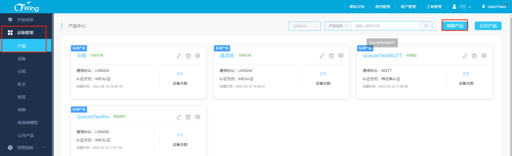
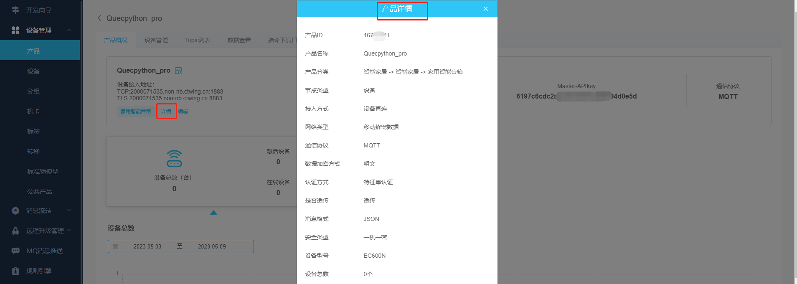
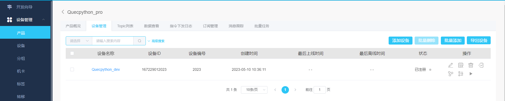

# 文档历史

**修订记录**

| **版本** | **日期**   | **作者**  | **变更表述** |
| -------- | ---------- | --------- | ------------ |
| 1.0      | 2023-05-10 | Pawn.zhou | 初始版本     |


# 电信云应用指导文档

## 简介

基于MQTT协议连接到电信云物联网平台，设备快速连云，支持“一机一密和“一型一密”两种认证方式。

## 应用场景说明

通过电信云物联网平台对同一产品下的设备进行管理，处理设备事件，完成消息转发，OTA升级等应用功能。

## 功能应用流程

### 电信云物联网平台

详细文档请查看：https://www.ctwing.cn/czlks/11#/callback

#### 名称解释

连接三元组：三元组指的是ProductKey（产品标识）DeviceName（设备名）DeviceSecret（设备密钥），是设备与物联网平台建立连接时的认证信息。

一机一密：每个设备烧录其唯一的设备证书（ProductKey、DeviceName 和 DeviceSecret），当设备与物联网平台建立连接时，物联网平台对其携带的设备证书信息进行认证。

一型一密：同一产品下所有设备可以烧录相同产品证书（即 ProductKey 和 ProductSecret ），设备发送激活请求时，物联网平台进行产品身份确认，认证通过，下发该设备对应的 DeviceSecret

#### 平台地址

- 电信云：https://www.ctwing.cn/

  

  注册个人或者企业账号进行账号登录

#### 创建产品

- 进入控制台

  

  在开发向导中点击开通服务

  

  

  开通通用组件服务

  

  

- 按需填写产品信息

  

- 产品列表展示

  


#### 查看产品信息

- 产品信息包含产品ID和MasterKey

  

#### 创建设备

- 选择产品进行设备创建

  

- 设备创建完成，初始状态为已注册，登陆成功后则显示已激活

  

#### 查看设备信息

- 查看设备信息，设备信息包含设备ID,DeviceSecret（特征串）

  

### QuecPython连接电信云

QuecPython 官网地址：https://python.quectel.com


#### 开发环境搭建

- 驱动安装

  驱动下载地址：https://python.quectel.com/download

  选择对应平台的USB驱动进行安装

  

- QPYcom 图形化工具下载

  应用调试基于此工具，下载地址：https://python.quectel.com/download

  

- 模组固件下载

  根据所用的模组型号选择固件下载后烧录，此文档调试选择EC600N CNLE进行演示。

  

#### 设备调试

- 打开电脑设备管理器，查看端口

    

- 选择 Quectel USB MI05 COM Port串口，使用QPYcom工具打开该串口

  

- 查询SIM卡状态和拨号状态

  API 使用以及说明查阅Wiki文档：https://python.quectel.com/doc/API_reference/zh

  ```python
  >>> import sim
  >>> sim.getStatus()  # 返回1表示SIM状态正常
  1
  >>> import dataCall
  >>> dataCall.getInfo(1,2)  # 成功返回拨号信息
  (1, 0, [1, 0, '10.145.246.10', '211.138.180.2', '211.138.180.3'], [1, 0, '::', '::', '::'])
  >>> 
  ```

#### 设备连云

MQTT API 使用以及说明查阅Wiki文档：https://python.quectel.com/doc/API_reference/zh

- 导入MQTT API

  ```python
  >>> from umqtt import MQTTClient
  ```

- 创建MQTT连接对象

  设备需将平台添加设备时提供的设备ID写入MQTT报文的ClientId字段，特征串写入设备Password字段

  ```python
  >>> from umqtt import MQTTClient
  
  >>> CLIENT_ID = '167229012023'
  >>> SERVER = '167229012023.non-nb.ctwing.cn'						
  >>> PORT = 1883
  >>> USER = "Quecpython_dev"
  >>> PASSWORD = "j0XmVK84hCs7fakLzTLI2htAngyVLivTAQzFNQbuiYI"
  
  >>> mqtt_obj = MQTTClient(client_id=CLIENT_ID, server=SERVER, port=PORT,user=USER,password=PASSWORD,keepalive=30)
  ```

- 注册事件回调函数

  ```python
  >>> def event_callback(topic, data):
  ...     print("Subscribe Recv: Topic={},Msg={}".format(topic.decode(),msg.decode()))
  ...     
  ...     
  ... 
  >>> mqtt_obj.set_callback(event_callback)
  ```

- 发起连接

  ```python
  >>> mqtt_obj.connect()
  ```

- 云端查看设备状态，由创建时已注册状态变成激活状态

  

#### 订阅Topic

- 订阅统一主题，

  

  ```python
  >>> mqtt_obj.subscribe("device_control")
  0
  ```
#### 数据上行

- 发布主题消息到平台，Topic字段填写任意主题

  ```python
  >>> import ujson
  >>> mqtt_obj.publish("device_test", ujson.dumps({"quec": "Hello, Ctwing cloud!"}))
  True
  >>> 
  ```


云端查看设备上行消息

  


## 注意事项

- 设备进行云连接时需确认网络状态，例如SIM卡是否能够注网，设备是否拨号成功
- 确保所用模组包含MQTT连接API可供使用