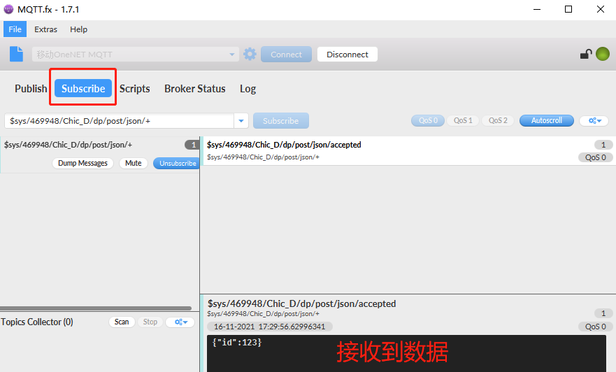

# 文档历史

**修订记录**

| **版本** | **日期**   | **作者**  | **变更表述** |
| -------- | ---------- | --------- | ------------ |
| 1.0      | 2021-11-16 | Chic.YE   | 初始版本     |
| 1.1      | 2021-12-08 | Chic.YE   | 更正平台链接 |
| 1.2      | 2023-04-24 | Pawn.zhou | 文档格式更新 |


# QuecPython 接入移动云

## 简介

文档主要介绍如何使用“MQTT物联网套件”，MQTT物联网套件为开发者提供高效、稳定、安全的设备接入服务，具有海量接入、数据存储、设备管理、设备直接命令、设备状态同步、消息分发等功能，支持用户通过规 则引擎对接OneNET增值服务，灵活地实现服务的扩展。

## 应用场景说明

通过移动云物联网平台对同一产品下的设备进行管理，处理设备事件，完成消息转发，OTA升级等应用功能。

## 功能应用流程

### 移动云物联网平台

移动云首页：[https://open.iot.10086.cn](https://open.iot.10086.cn)

#### 进入平台

点击【产品服务】---【MQTT物联网套件】


#### 添加产品


#### 添加设备

点击“Chic_演示产品”进入产品概况


左侧栏目点击【设备列表】，再点击右边的“添加设备”


设置设备名称：


添加后，设备列表显示所有设备


#### 获取设备信息

“设备名称”、“access_key”、“产品ID”三个参数用于下个步骤生成连接Password；

在“设备列表”中的设备，点击“详情”


可以看到“设备名称”、“access_key”


在“产品”中的设备，点击“详情”

左侧栏目点击【产品概况】可看到“产品ID”


#### 生成Password

直接使用官方提供Python语言的token算法生成Password

[https://open.iot.10086.cn/doc/mqtt/book/manual/auth/python.html](http://docs-aliyun.cn-hangzhou.oss.aliyun-inc.com/assets/attach/189223/cn_zh/1605168543507/MQTT_Password.7z?spm=a2c4g.11186623.2.19.373573a8XfigN5&file=MQTT_Password.7z)

token分两种：一型一密、一机一密

```python
import base64
import hmac
import time
from urllib.parse import quote

# 场景	res参数格式	示例	说明
# API访问	products/{pid}	products/123123
# 设备连接	products/{pid}/devices/{device_name}	products/123123/devices/mydev	需使用设备级密钥
product = 0
device = 1
TYPE = device
# TYPE 用于选择一型一密，还是一机一密

def token(id, access_key, deviceName=None):
    global product
    global device
    global TYPE

    version = '2018-10-31'

    if TYPE == product:
        res = 'products/%s' % id  # 通过产品ID访问产品API
    elif TYPE == device:
        res = ('products/%s/devices/%s' % (id, deviceName))

    # 用户自定义token过期时间
    et = str(int(time.time()) + 36000000)

    # 签名方法，支持md5、sha1、sha256
    method = 'sha1'

    # 对access_key进行decode
    key = base64.b64decode(access_key)

    # 计算sign
    org = et + '\n' + method + '\n' + res + '\n' + version
    sign_b = hmac.new(key=key, msg=org.encode(), digestmod=method)
    sign = base64.b64encode(sign_b.digest()).decode()

    # value 部分进行url编码，method/res/version值较为简单无需编码
    sign = quote(sign, safe='')
    res = quote(res, safe='')

    # token参数拼接
    token = 'version=%s&res=%s&et=%s&method=%s&sign=%s' % (
        version, res, et, method, sign)

    return token


if __name__ == '__main__':
    # MQTT
    id = '469948'  # 产品ID
    if TYPE == product:
        access_key = 'kKsubaG7FzMgzR6N3eUD53319Qu+K4MCvw6KzOYc5eI='  # 产品access_key
    elif TYPE == device:
        access_key = 'rs2FaE5BuygJZkWKDA5okKt1RFpwOx53hbu6hwyCS4U='  # 设备access_key
    deviceName = 'Chic_D'
    print(token(id, access_key, deviceName))
```

#### mqttfx连接平台

[开发指南_开发者文档_OneNET (10086.cn)](https://open.iot.10086.cn/doc/mqtt/book/device-develop/manual.html)

获取平台服务器IP地址、端口：


连接成功！


#### 上报和下发数据

[上传数据点_开发者文档_OneNET (10086.cn)](https://open.iot.10086.cn/doc/mqtt/book/example/datapoints.html)

topic 命名规则如下：

$sys/{pid}/{device-name}/dp/post/json/+

本例中，订阅topic为：

`$sys/469948/Chic_D/dp/post/json/+`

点击Subscribe，完成topic订阅


topic 命名规则如下：

$sys/{pid}/{device-name}/dp/post/json

本例中，发布 topic 名称为：

`$sys/469948/Chic_D/dp/post/json`

payload示例如下：

```json
{
    "id": 123,        
    "dp": {             
        "temperatrue": [{     
            "v": 30,
        }],
        "power": [{     
            "v": 4.5,        
        }]
    }
}
```


点击Publish，发布消息，已订阅的设备立即收到消息




## 软件设计

示例代码：

```python
from umqtt import MQTTClient

# 连接协议	证书	地址	端口	说明
# MQTT	证书下载	mqttstls.heclouds.com	8883	加密接口
# MQTT	  -	        mqtts.heclouds.com	    1883	非加密接口

# 参数	是否必须	参数说明
# clientId	是	设备名称
# username	是	平台分配的产品ID
# password	是	填写经过 key 计算的 token

SERVER = b'mqtts.heclouds.com'
PORT = 1883
CLIENT_ID = b'Chic_D'
USER = b'469948'
PASSWORD = b'version=2018-10-31&res=products%2F469948%2Fdevices%2FChic_D&et=1673053248&method=sha1&sign=prIMDQ23WFI6PMj2IWpaRJJL4eE%3D'

IMEI = None  # modem.getDevImei()
SUB_TOPIC = '$sys/469948/Chic_D/dp/post/json/+'
PUB_TOPIC = '$sys/469948/Chic_D/dp/post/json'

def GetDevImei():
    global IMEI
    # IMEI = modem.getDevImei()
    IMEI = '001'
    print(IMEI)

state = 0

def sub_cb(topic, msg):
    global state
    print(
        "Subscribe Recv: Topic={},Msg={}".format(
            topic.decode(),
            msg.decode()))
    state = 1


def MQTT_Init():
    # 创建一个mqtt实例
    c = MQTTClient(
        client_id=CLIENT_ID,
        server=SERVER,
        port=PORT,
        user=USER,
        password=PASSWORD,
        keepalive=30)  # 必须要 keepalive=30 ,否则连接不上
    # 设置消息回调
    c.set_callback(sub_cb)
    # 建立连接
    try:
        c.connect()  # c.connect(clean_session=True)
    except Exception as e:
        print('!!!,e=%s' % e)
        return
    print('connected')

    # 订阅主题
    c.subscribe(SUB_TOPIC.format(IMEI))
    # 发布消息
    Payload = '''
    {
        "id": 123,
        "dp": {
            "temperatrue": [{
                "v": 30,
            }],
            "power": [{
                "v": 4.5,
            }]
        }
    }'''
    c.publish(PUB_TOPIC.format(IMEI), Payload)

    while True:
        c.wait_msg()
        if state == 1:
            break

    # 关闭连接
    c.disconnect()


def main():
    # GetDevImei()
    MQTT_Init()


if __name__ == "__main__":
    main()
```

接下来就可以下载验证了，python代码不需要编译，直接通过QPYcom工具把.py文件下载到模块中运行。

## 下载验证

下载.py文件到模组运行：


下载之后，手动让脚本运行起来。


