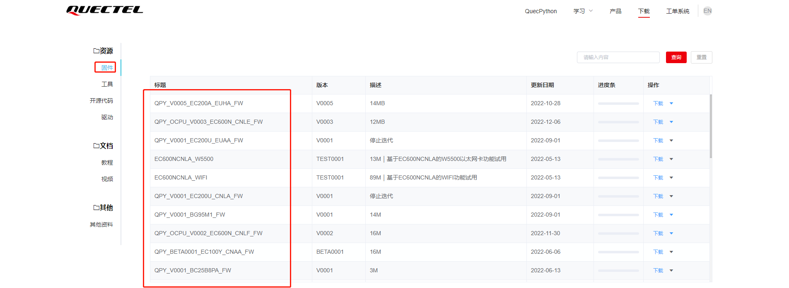

# 文档历史

**修订记录**

| **版本** | **日期**   | **作者**  | **变更表述** |
| -------- | ---------- | --------- | ------------ |
| 1.0      | 2023-04-24 | Pawn.zhou | 初始版本     |


# 腾讯云应用指导文档

## 简介

基于MQTT协议连接到腾讯云物联网平台，设备快速连云，支持“一机一密和“一型一密”两种认证方式。

## 应用场景说明

通过腾讯云物联网平台对同一产品下的设备进行管理，处理设备事件，完成消息转发，OTA升级等应用功能。

## 功能应用流程

### 腾讯云物联网平台

详细文档请查看：https://cloud.tencent.com/document/product/1081

#### 名称解释

连接三元组：三元组指的是ProductKey（产品标识）DeviceName（设备名）DeviceSecret（设备密钥），是设备与物联网平台建立连接时的认证信息。

一机一密：每个设备烧录其唯一的设备证书（ProductKey、DeviceName 和 DeviceSecret），当设备与物联网平台建立连接时，物联网平台对其携带的设备证书信息进行认证。

一型一密：同一产品下所有设备可以烧录相同产品证书（即 ProductKey 和 ProductSecret ），设备发送激活请求时，物联网平台进行产品身份确认，认证通过，下发该设备对应的 DeviceSecret

#### 平台地址

- 腾讯云：https://cloud.tencent.com

  

  注册个人或者企业账号进行账号登录

#### 创建产品

- 进入物联网平台

  

  

  点击开发平台进入iot Hub查看产品，没有则创建

  

  

- 按需填写产品信息

  

- 产品列表展示

  


#### 查看产品信息

- 产品信息包含ProductKey 和 ProductSecret

  

#### 创建设备

- 选择产品进行设备创建

  

- 添加设备

  

- 手动编辑设备信息

  

- 设备创建完成后处于未激活状态

  

#### 查看设备信息

- 查看设备信息，设备信息包含DeviceName（设备名称）DeviceSecret（设备密钥）

  

### QuecPython连接腾讯云

QuecPython 官网地址：https://python.quectel.com

#### 开发环境搭建

- 驱动安装

  驱动下载地址：https://python.quectel.com/download

  选择对应平台的USB驱动进行安装

  

- QPYcom 图形化工具下载

  应用调试基于此工具，下载地址：https://python.quectel.com/download

  

- 模组固件下载

  根据所用的模组型号选择固件下载后烧录，此文档调试选择EC600N CNLE进行演示。

  

#### 设备调试

- 打开电脑设备管理器，查看端口

    

- 选择 Quectel USB MI05 COM Port串口，使用QPYcom工具打开该串口

  

- 查询SIM卡状态和拨号状态

  API 使用以及说明查阅Wiki文档：https://python.quectel.com/doc/API_reference/zh

  ```python
  >>> import sim
  >>> sim.getStatus()  # 返回1表示SIM状态正常
  1
  >>> import dataCall
  >>> dataCall.getInfo(1,2)  # 成功返回拨号信息
  (1, 0, [1, 0, '10.145.246.10', '211.138.180.2', '211.138.180.3'], [1, 0, '::', '::', '::'])
  >>> 
  ```

#### 设备连云

腾讯云API 使用以及说明查阅Wiki文档：https://python.quectel.com/doc/API_reference/zh

- 导入腾讯云API

  ```python
  >>> from TenCentYun import TXyun
  ```

- 创建腾讯云连接对象

  ```python
  >>> from TenCentYun import TXyun
  
  >>> productID = "UMNSX09J5Y"
  >>> DeviceName = "Quecpython_dev"						
  >>> DeviceSecret = "osj/SKJsa9cjyuM1KeHr8Q=="
  >>> productSecre = None
  >>>
  >>> txy_obj = TXyun(productID, DeviceName, DeviceSecret, productSecre)
  ```

- 注册事件回调函数

  ```python
  >>> def event_callback(topic, data):
  ...     print("tencent callback recv: {}".format(data))
  ...     
  ...     
  ... 
  >>> txy_obj.setCallback(event_callback)
  ```

- 设置连接参数并连接平台,state为0时表示连接成功,连接成功后调用start方法

  ```python
  >>> clean_session = False
  >>> keepAlive = 300
  >>> reconn = True
  
  >>> state = txy_obj.setMqtt(clean_session=False, keepAlive=300,reconn=True)
  >>> state
  0
  >>> txy_obj.start()
  ```
  
- 云端查看设备状态，由创建时未激活状态变成在线状态

  

#### 订阅Topic

- 发布主题消息到平台，Topic选择操作权限为发布的进行数据上报

  ${productID}/${deviceName}/event：${productID}替换成我们的产品标识，$ {deviceName}替换成我们的设备名称即可,例如"UMNSX09J5Y/Quecpython_dev/event"

  

  ```python
  >>> txy_obj.subscribe("UMNSX09J5Y/Quecpython_dev/data")
  0
  >>> 
  ```

#### 数据上行

- 发布主题消息到平台，Topic选择在规则引擎中配置的data或其它自定义主题

  ```python
  >>> txy_obj.publish("EY293KGSLY/Quecpython_dev/data", "Hello, TenCent cloud!")
  True
  >>> 
  ```

  云端查看设备上行消息

  


## 注意事项

- 设备进行云连接时需确认网络状态，例如SIM卡是否能够注网，设备是否拨号成功
- 确保所用模组包含腾讯云连接API可供使用
- Topic注意操作权限

