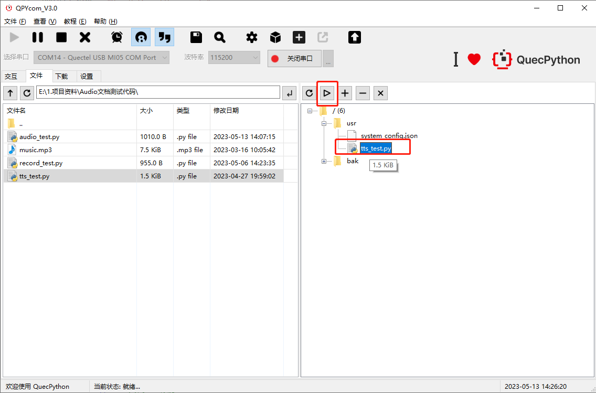

# 音频和TTS

文档主要基于EC600N介绍如何使用QuecPython来进行Audio、Record、TTS功能使用，**其他模组操作类同**。Audio：音频播放功能，支持mp3、amr和wav格式音频文件及音频流播放；Record：录音功能；TTS：Text-To-Speech 即文本到语音播放。

## 如何使用音频和TTS功能

### 硬件准备
在使用Audio、Record、TTS功能之前，需要准备以下硬件：
- 开发板
- 电话听筒
  
目前音频输出通道最多支持3种：听筒、耳机、喇叭。不同模块支持输出通道可能不同，具体模块所支持通道详见[Audio](https://python.quectel.com/doc/API_reference/zh/QuecPython%E7%B1%BB%E5%BA%93/audio.Audio.html)。目前开发板硬件只引出了听筒这一路，只是简单测试功能已经完全够用。开发板与听筒连接方式见下图：


### 软件设计

软件相关API介绍参考链接：[Audio](https://python.quectel.com/doc/API_reference/zh/QuecPython%E7%B1%BB%E5%BA%93/audio.Audio.html)

### 示例代码

#### Audio
```python
# -*- coding: UTF-8 -*-
import audio
from machine import Pin
import utime

def audio_cb(event):
    if event == 0:
        print('audio-play start.')
    elif event == 7:
        print('audio-play finish.')

aud = audio.Audio(0)
aud.setCallback(audio_cb)
# 设置pa
aud.set_pa(Pin.GPIO15,2)
# 播放MP3
aud.play(2, 1, 'U:/music.mp3')
# 等待播放完成
utime.sleep_ms(5000) 
aud.stop()

```

#### Record
```python
# -*- coding: UTF-8 -*-
import utime
import audio
from machine import Pin


flag = 1
'''
使用听筒播放录音文件，参数选择0
'''
aud = audio.Audio(0)
tts = audio.TTS(0)

aud.setVolume(11)

def record_callback(args):
    global flag
    print('file_name:{}'.format(args[0]))
    print('file_size:{}'.format(args[1]))
    print('record_sta:{}'.format(args[2]))

    record_sta = args[2]
    if record_sta == 3:
        print('The recording is over, play it')
        tts.play(1, 0, 2, '录音结束,准备播放录音文件')
        aud.play(1, 0, record.getFilePath('recordfile.wav'))
        flag = 0
    elif record_sta == -1:
        print('The recording failure.')
        tts.play(1, 0, 2, '录音失败')
        flag = 0

record = audio.Record()
record.end_callback(record_callback)
record.start('recordfile.wav', 10)

while 1:
    if flag:
        utime.sleep_ms(200)
    else:
        break

```


#### TTS
```python
# -*- coding: UTF-8 -*-
'''
@Description: example for class TTS
@FilePath: example_tts_file.py
'''
import log
from audio import TTS
import utime


'''
下面两个全局变量是必须有的，用户可以根据自己的实际项目修改下面两个全局变量的值
'''
PROJECT_NAME = "QuecPython_TTS_example"
PROJECT_VERSION = "1.0.0"

# 设置日志输出级别
log.basicConfig(level=log.INFO)
tts_Log = log.getLogger("TTS")

#定义回调函数
def UsrFunc(event):
    if event == 2:
        print("开始播放")
    elif event == 3:
        print("停止播放")
    elif event == 4:
        print("播放完成")

if __name__ == '__main__':
    # 参数1：device （0：听筒，1：耳机，2：喇叭）
    tts = TTS(0)

    #注册用户回调函数
    tts.setCallback(UsrFunc)

    # 获取当前播放音量大小
    volume_num = tts.getVolume()
    tts_Log.info("Current TTS volume is %d" %volume_num)
    
    # 设置音量为6
    volume_num = 6
    tts.setVolume(volume_num)

    #  参数1：优先级 (0-4)
    #  参数2：打断模式，0表示不允许被打断，1表示允许被打断
    #  参数3：模式 低四位：（1：UNICODE16(Size end conversion)  2：UTF-8  3：UNICODE16(Don't convert)），高四位：wtts_enable，wtts_ul_enable， wtts_dl_enable
    #  参数4：数据字符串 （待播放字符串）
    tts.play(1, 1, 2, 'QuecPython') # 执行播放
    tts.play(1,1,tts.wtts_enable|tts.wtts_ul_enable|2, '12345')
    tts.close()   # 关闭TTS功能

```

### 运行效果
#### Audio
1. 将上面的Audio的示例代码保存在audio_test.py文件中保存，打开QPYcom导入audio_test.py、music.mp3。运行audio_test.py，如下图：


2. 在听筒中可听到music.mp3内容，QPYcom交互界面查看输出结果如下：


#### Record
1. 将上面的Record的示例代码保存在record_test.py文件中保存，打开QPYcom导入record_test.py。运行record_test.py，如下图：


2. QPYcom交互界面查看输出结果如下,当录音结束后会自动播放录音：


#### TTS
1. 将上面的TTS的示例代码保存在tts_test.py文件中保存，打开QPYcom导入tts_test.py。运行tts_test.py，如下图：




1. 在听筒中可听到文本的读音，QPYcom交互界面查看输出结果如下：


