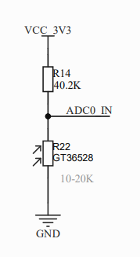
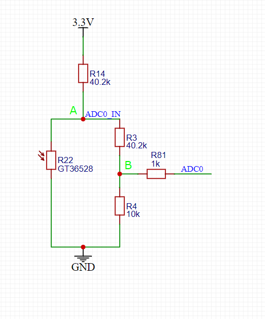

# ADC - 电压采集功能

本文主要介绍什么是 ADC、怎么使用 ADC、ADC 可以做什么等相关问题。

## ADC 简介

### 什么是 ADC

ADC(Analog to Digital Converter) 即模拟数字转换器即 [A/D 转换器](https://baike.baidu.com/item/A%2FD转换器/4883848?fromModule=lemma_inlink)，对于嵌入式应用开发来说，可以简单理解为：在单片机或我们的模组上有一个引脚可以读取电路中的电压值。一般软件开发人员主要关注如何读出 ADC 引脚的电压值，并将电压值做一些运算从而间接得出外部传感器当前所测量的环境值，如温度值、亮度值等。

### 怎么使用 ADC

#### 硬件设计

对于嵌入式产品开发来说，可靠的硬件电路是软件开发的前提条件。

ADC 相关电路设计需要参考每个型号模组的硬件设计手册和参考设计手册，可以在主页的 [下载区](/download/) 检索下载，但具体功能引脚仍需以 QuecPython 的 [ADC 功能 API](../../../API_reference/zh/QuecPython类库/misc.ADC.html) 介绍的引脚号为准。关于 ADC 功能常见的应用电路也可以通过搜素引擎了解更多信息。简单应用电路也可参考 QuecPython 的学习开发板，开发板可以通过天猫旗舰店、京东旗舰店等移远通信官方销售渠道获取，开发板的硬件设计同样是参考的上述硬件文档，开发板的原理图也可以在主页的 [下载区](/download/) 检索下载。

#### 软件应用

使用 QuecPython 开发的模组，想要读取 ADC 引脚的电压需要先完成 QuecPython 开发环境的搭建，再参考 [ADC 功能的 API 介绍文档](../../../API_reference/zh/QuecPython类库/misc.ADC.html) 进行如下命令行测试即可打印出 ADC 通道 0 引脚当前的电压值，单位为毫安 (mA)。

```python
>>>from misc import ADC
>>>adc = ADC()
>>>adc.open()
>>>voltage = adc.read(ADC.ADC0) 
>>>print("ADC channel 0 voltage = {}mA".format(voltage))
```

### ADC 功能测试

使用 QPYcom 工具和模组进行交互，下面实例是基于 ADC0。


## ADC 功能应用实例

亮度传感器是一种能够检测周围环境亮度的传感器。在 QuecPython 平台上，您可以使用光敏电阻或光敏二极管作为亮度传感器，并使用相应的代码来读取其值。在本文档中，我们将讨论如何在 QuecPython 平台上使用光敏电阻作为亮度传感器。

### 所需材料

- QuecPython 模块（选择支持 ADC 的模块即可，参见 [ADC](../../../API_reference/zh/QuecPython类库/misc.ADC.html))
- 光敏电阻
- 高精度电阻（具体以硬件设计手册为准）
- 充足的导线（杜邦线即可）
- 如有自带光敏电阻的 QuecPython 开发板上述材料均包含

### 电路连接

以 QuecPython 开发板为例，以下是 EC600X_QuecPython_EVB_V3.1 版本开发板光敏电阻电路连接图：

<div style="display:flex;">           </div>

如上两图所示，左边图中的 R22 即为光敏电阻，型号为 GT36528，右图为连接到 QuecPython 模块 ADC 引脚的电路，模块型号为 EC600U。

上图电路可等效为下图所示电路：



### 原理分析

想要得到当前光照度，首先我们需要知道光敏电阻在当前光照条件下的电阻值，再根据电阻值与光照度之间的关系计算得出光照度，电阻值我们不能直接通过 API 接口读出，但我们可以使用 ADC 的 API 读出电路中光敏电阻的电压值，再通过欧姆定律我们就可以计算得出光敏电阻的阻值，又由于 ADC 的测量电压范围有限，所以我们设计了电子电路进行分压，将电路中某一点的电压限制在 ADC 的测量范围内，再测量电路中这一点的电压，间接换算出光敏电阻的阻值，具体分析和计算原理如下。

如上图所示等效电路， R3 和 R4 为串联关系，R22 与 R3、R4 组合的整体为并联关系，R14 与 R22、R3、R4 组成的整体为串联关系，根据欧姆定律及并联分流的特点我们可以得出，A 点的电流为通过 R22 支路的电流和通过 R3、R4 支路的电流之和，则可以列出如下表达式。

$$
\frac{V_{3.3}-V_A}{R_{14}}=\frac{V_A}{R_{22}}+\frac{V_A}{R_{3}+R_{4}}
$$

再经过换算我们可以得出光敏电阻 R22 的数学表达式如下：

$$
R_{22}=\frac{(R_3+R_4)R_{14}V_{A}}{(R_3+R_4)(V_{3.3}-V_A)-(R_{14}V_A)}
$$

到这里，也许有些人会有疑问，R81 为什么没有被计算到？因为 R81 接到的是 ADC 引脚，我们可以认为只是接到了一个电压表上，所以并不会分压，无需加入计算中。即 ADC0 测得的电压即为 B 点的电压，那么 B 点电压对于我们来说是可以通过 API 变为已知的。但是在上述表达式中又并未用到 B 点电压，是怎么回事呢？

从上述表达式中我们可以看出，表达式右侧的所有变量只有 A 点电压是未知量，左侧是待求量，一个表达式中有两个未知量是求不出结果的，所以我们需要将未知量 A 点电压变为已知量，此时就用到了已知量 B 点电压。我们再根据欧姆定律和串并联电路的知识可以知道，R22 所在支路的电压和 R3、R4 所在支路的电压是相同的，并且是 A 点电压。又由于整个支路是串联的，则支路上每一点电流是相同的，我们根据欧姆定律可以得出如下表达式：

$$
\frac{V_A}{R_3+R_4}=\frac{V_B}{R_4}
$$

由上述表达式我们可以换算得出 A 点电压和 B 点电压的关系：

$$
V_A =\frac{R_3+R_4}{R4}V_B
$$

将上述表达式整理再统一单位后代入真实数值我们可以得到表达式：

$$
V_A = 5.02V_B
$$

再将这一结果和真实数值代入 R22 的表达式可以得到如下表达式：

<div style="text-align: left">

$$
\begin{aligned}
R_{22}&=\frac{(R_3+R_4)R_{14}V_{A}}{(R_3+R_4)(V_{3.3}-V_A)-(R_{14}V_A)}\\
&=\frac{((40.2+10)*1000)* 40.2 *1000* 5.02 *V_B}{((40.2+10)* 1000)*(3.3-5.02* V_B)-(40.2 *1000* 5.02*V_B)}\\
&=\frac{10130560800 *V_B}{165660-453808* V_B}
\end{aligned}
$$

### 代码实现

在写代码之前我们需要了解到光敏电阻阻值和光照亮度之间的数学关系，一般需要通过实验测试得到，此示例仅展示我们如何获取光敏电阻的阻值，单位为欧姆，在代码中计算时一定记得统一为国际单位制再进行计算。

```python
from misc import ADC
import utime

class lightSensor():
    def __init__(self, ADC_channel):
        self.adc = ADC()
        self.adc_channel = ADC_channel
        self.adc.open()

    def readResistanceValue(self):
        Vb = self.adc.read(self.adc_channel)/1000
        R22 = (10130560800*Vb) / (165660-(453808*Vb))
        return R22

if __name__ == "__main__":

    gt36528 = lightSensor(ADC.ADC0)

    while True:
        resistanceValue = gt36528.readResistanceValue()
        print("resistance value = {} Ohm".format(resistanceValue))
        utime.sleep(1)
```

## 总结

ADC 功能的一般常见用法在此做了详细的介绍，如有疑问或更好的建议欢迎联系我们，也可以直接向我们提交文档贡献，后续本文将继续完善和补充更多应用案例。
