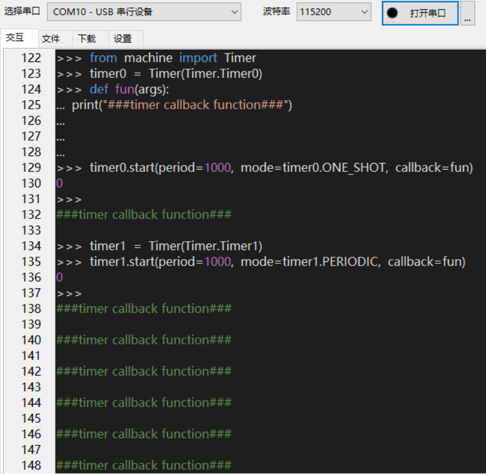
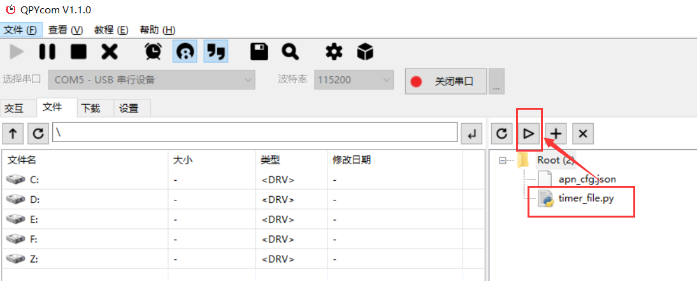
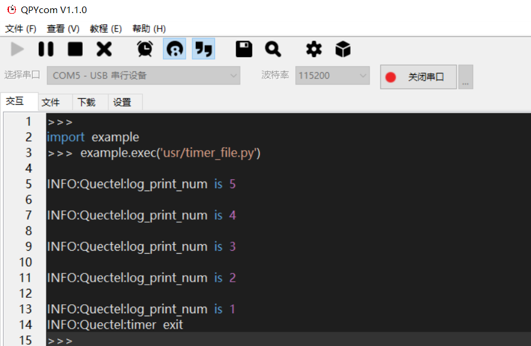
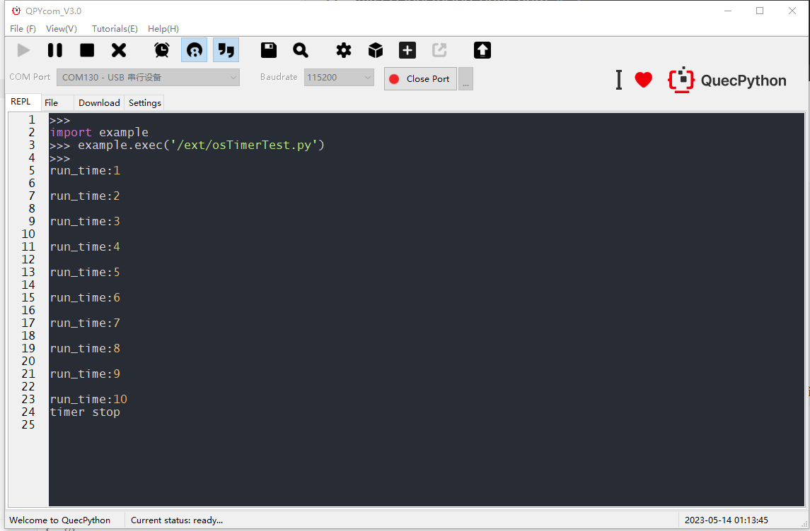

# Timer - 定时器

文档主要介绍如何使用QuecPython\_Timer。

## 定时器简介

定时器最常用的就是定时与计数，即可以作为精准延时处理，也可以在接通一个时钟源的前提下，统计总共有多少脉冲。通过本文你将了解到machine.Timer和osTimer的所有设置参数及使用方法。

### 硬件定时器简介

一般由专门的硬件电路来实现，数量和硬件资源相关，设置时写入到期时间，置位使能寄存器即可开始计时，爆发时触发硬件中断，从而执行注册到硬件中断上的回调。

### osTimer简介

一般由RTOS创建，通过系统tick来计时，数量几乎没有硬性限制，但由于会占用RAM空间，实际上可用数量与RAM大小挂钩。爆发时在RTOS内产生系统中断，从而执行注册到系统中断上的回调。

### 硬件描述

目前machine.Timer开放共4个定时器，没有硬件定时器的型号底层由RTOS定时器实现，用法保持一致，具体请参阅硬件支持文档进行确认：[硬件支持](https://python.quectel.com/doc/doc/Quecpython_intro/zh/Qp_Product_intro/Hardware_Support.html)

osTimer统一使用RTOS定时器

### 软件设计

参阅[machine.Timer相关API介绍](..\..\..\API_reference\zh\QuecPython_classlib\machine.Timer.md)和[osTimer相关API介绍](..\..\..\API_reference\zh\QuecPython_classlib\osTimer.md)


## 定时器功能应用示例

### machine.Timer应用示例

#### 常量说明

| 常量           | 说明                       |
|----------------|----------------------------|
| Timer.Timer0   | 定时器0                    |
| Timer.Timer1   | 定时器1                    |
| Timer.Timer2   | 定时器2                    |
| Timer.Timer3   | 定时器3                    |
| Timer.ONE_SHOT | 单次模式，定时器只执行一次 |
| Timer.PERIODIC | 周期模式，定时器循环执行   |

#### 创建Timer对象

timer = Timer(Timer)。创建Timer对象接口参数介绍如下：

| 参数  | 类型 | 说明                                     |
| ----- | ---- | ---------------------------------------- |
| Timer | int  | 定时器号。EC600S支持定时器Timer0\~Timer3 |

#### 启动定时器

timer.start(period, mode, callback)：启动对应的定时器，接口参数介绍如下：

| 参数     | 类型     | 说明                                                                                 |
|----------|----------|--------------------------------------------------------------------------------------|
| period   | int      | 中断周期，单位毫秒                                                                   |
| mode     | int      | 运行模式 Timer.ONE_SHOT 单次模式，定时器只执行一次 Timer.PERIODIC 周期模式，循环执行 |
| callback | function | 定时器执行函数                                                                       |

返回值：启动成功返回整型值0，失败返回整型值-1。

#### 关闭定时器

timer.stop()：关闭对应的定时器，无参数。

返回值：成功返回整型0，失败返回整型-1

#### 交互操作

使用QPYcom工具和模组进行交互，下面实例是基于Timer0和Timer1。Timer2和Timer3配置类似。




<div align="left">

注意：

1.  from machine import Timer即为让Timer模块在当前空间可见。
2.  只有from machine import Timer模块，才能使用Timer内的函数和变量。
3.  上述操作没有连接任何外设，仅作为熟悉指令参考。


#### 软件实现

配套demo的参考代码为文档同目录下的timer_file.py文件。下载.py文件到模组运行，代码如下： <a href="code/timer_file.py" target="_blank">点击下载代码</a>

```python
import log
from machine import Timer
log.basicConfig(level=log.INFO)  # 设置日志输出级别
Timer_Log = log.getLogger("Quectel")  # 获取logger对象
log_print_num = 5
state = 1
timer0 = Timer(Timer.Timer1)
# 创建一个执行函数，并将timer实例传入
def timer_test(t):
    global log_print_num
    global state
    Timer_Log.info('log_print_num is %d' % log_print_num)
    log_print_num -= 1
    if log_print_num <= 0:
        Timer_Log.info('timer exit')
        state = 0
        timer0.stop()  # 结束该定时器实例
timer0.start(period=1000, mode=timer0.PERIODIC, callback=timer_test)  # 启动定时器
while state:
    pass

```


#### 运行效果

1.  打开QPYcom运行timer\_file.py，如下图：

 


2. 在QPYcom交互界面查看输出结果如下：





### osTimer应用示例

osTimer使用比machine.Timer简单的多，只需要start和stop，代码实现如下：

```python
import osTimer

#osTimer回调原型，参数无意义，仅在形式上存在，不使用
def test_cb(args):
    global run_time
    run_time = run_time + 1
    print('run_time' + str(run_time))
    if run_time >= 10:
        print('timer stop')
        timer.stop()#定时器循环10次停止

run_time = 0
timer = osTimer() #创建定时器
timer.start(1000, 1, test_cb) #第一个参数为时间（单位ms）；第二个参数0代表单次执行；1代表循环执行；第三个代表定时器回调
```

执行结果：



## 总结

定时器功能在此做了详细的介绍，如有疑问或更好的建议欢迎联系我们，也可以直接向我们提交文档贡献，后续本文将继续完善和补充更多应用案例。