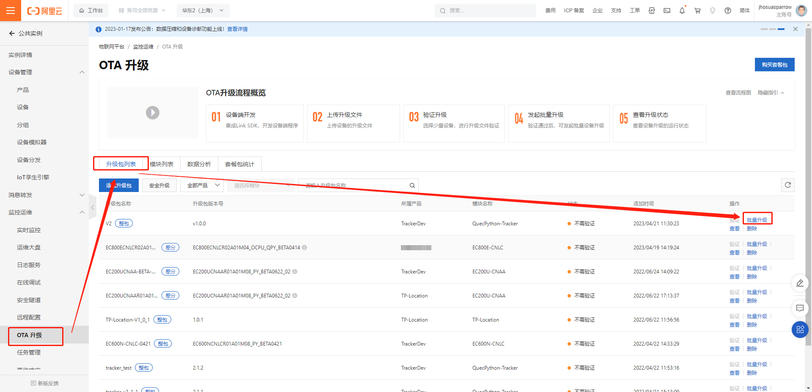
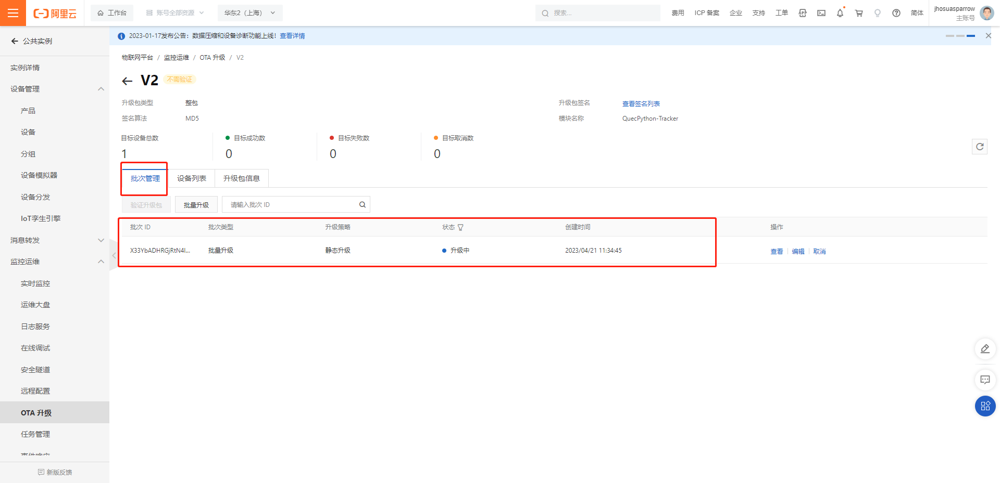

# OTA升级指导说明

本文主要介绍基于QuecPython模组的固件升级与软件升级方法, 描述了`fota`与`app_fota`模块的功能如何使用进行设备升级, 以及一些注意事项。 

QuecPython模组的固件升级与软件升级支持不同平台, 本文以阿里云物联网平台为例介绍如何进行OTA升级操作, 后续会更新其他平台的OTA操作流程。

## 制作升级包

### 固件升级包

设备固件升级建议使用差分升级, 不建议使用全量升级, 目前只有 **EC600NCNLC/LF** 支持全量升级, 其他型号的模组只支持差分升级, 差分升级包制作方法请联系移远售后客服。

### 软件升级

软件直接使用Python脚本进行升级即可, 无需进行特殊转换。

## 阿里云物联网平台

以下为阿里云物联网平台创建OTA升级计划的操作步骤说明, 阿里云物联网平台OTA升级功能详细说明, 可参考官网文档[阿里云物联网平台-运维监控-OTA升级](https://help.aliyun.com/document_detail/130990.html?spm=a2c4g.58328.0.0.1f0e3ed6i3ApkS)

### 创建OTA升级计划

同一产品可以根据升级的功能模块的不同, 创建升级模块名称, 通常有分为两类

- 固件模块, 又称为FOTA升级, 建议以模组的版本命名, 如: EC800E-CNLC
- 软件升级(Python脚本升级), 又称为SOTA升级, 可自行命名, 如: QuecPython-XXX

### 创建FOTA(固件)升级计划

#### 添加升级模块


#### 添加升级包


#### 创建升级计划


#### 查看升级结果


### 创建SOTA(软件)升级计划

#### 添加升级模块


#### 添加升级包

**注意:** *阿里云使用Python脚本创建升级包, 需要将脚本后缀名`.py`改为`.bin`之后才可上传, 可以上传多个文件*


#### 创建升级计划




#### 查看升级结果





### 设备端升级功能开发

阿里云物联网平台对接可以使用我们现场的`aliYun`模块进行开发即可, 该模块基于MQTT协议进行通信, 无需自行封装阿里云的功能接口。

以下示例中用到的相关模块功能可在[QuecPython API 参考手册](https://python.quectel.com/doc/API_reference/zh/index.html)中查看详细说明。

阿里云MQTT协议下发升级数据说明见[阿里云物联网平台-基于Alink协议开发-OTA升级](https://help.aliyun.com/document_detail/89307.html?spm=a2c4g.89307.0.0.12272110cm6wc6)

**示例:**

```python
import uos
import fota
import app_fota
import modem
import ujson
from misc import Power
from aliYun import aLiYun

# 定义软件名称
PROJECT_NAME = "QuecPython-XXX"
# 定义软件版本
PROJECT_VERSION = "1.0.0"
# 获取固件型号
FIRMWARE_NAME = uos.uname()[0].split("=")[1]
# 获取固件版本号
FIRMWARE_VERSION = modem.getDevFwVersion()

# 初始化aLiYun功能
ProductKey = "xxx"
ProductSecret = "xxx"
DeviceName = "xxx"
DeviceSecret = "xxx"
MqttServer = "xxx"
cloud = aLiYun(ProductKey, ProductSecret, DeviceName, DeviceSecret, MqttServer)

# 初始化OTA相关Topic
# 设备模块版本信息上报topic
ota_topic_device_inform = "/ota/device/inform/%s/%s" % (ProductKey, DeviceName)
# 设备OTA升级计划下发topic
ota_topic_device_upgrade = "/ota/device/upgrade/%s/%s" % (ProductKey, DeviceName)
# 设备升级进度上报topic
ota_topic_device_progress = "/ota/device/progress/%s/%s" % (ProductKey, DeviceName)
# 设备OTA升级计划查询topic
ota_topic_firmware_get = "/sys/%s/%s/thing/ota/firmware/get" % (ProductKey, DeviceName)
# 设备OTA升级计划查询应答topic
ota_topic_firmware_get_reply = "/sys/%s/%s/thing/ota/firmware/get_reply" % (ProductKey, DeviceName)

# 设置MQTT连接
client_id = modem.getDevImei()
clean_session = True
cloud.setMqtt(client_id, clean_session)


ota_module = None
# 订阅Topic回调函数
def sub_cb(topic, data):
    if topic in (ota_topic_device_upgrade, ota_topic_firmware_get_reply):
        # OTA升级
        global ota_module
        data = ujson.loads(data)
        ota_module = data["module"]
        ota_version = data["version"]
        if ota_module == FIRMWARE_NAME:
            # FOTA升级
            _fota = fota()
            _fota.httpDownload(url1=data.get("url"), callback=fota_callback)
        elif ota_module == PROJECT_NAME:
            # SOTA升级
            ota_data = [{"url": i["fileUrl"], "filename": "/usr/" + i["fileName"].replace(".bin", ".py")} for i in data.get("files", [])]
            _app_fota = app_fota.new()
            res = _app_fota.bulk_download(ota_data)
            # SOTA上报升级结果
            ota_process = 100 if not res else -1
            if ota_process == 100:
                _app_fota.set_update_flag()
            process_data = {
                "id": 5,
                "params": {
                    "step": ota_process,
                    "desc": "desc",
                    "module": ota_module,
                }
            }
            cloud.publish(ota_topic_device_progress, ujson.dumps(process_data), qos=1)
            # 升级完成之后需要重启设备
            Power.powerRestart()


# FOTA升级进度回调函数
def fota_callback(args):
    print("Download status: %s, Download process: %s" % tuple(args))
    ota_process = None
    if args[0] in (0, 1, 2) and args[1] == 100:
        ota_process = 100
    else:
        ota_process = -1
    if ota_process is not None:
        # FOTA上报升级结果
        process_data = {
            "id": 5,
            "params": {
                "step": ota_process,
                "desc": "success",
                "module": ota_module,
            }
        }
        cloud.publish(ota_topic_device_progress, ujson.dumps(process_data), qos=1)
        # 升级成功后会自动重启, 此处可无需手动重启
        Power.powerRestart()


# 设置订阅Topic回调函数
cloud.setCallBack(sub_cb)

# 订阅Topic
qos = 1
cloud.subscribe(ota_topic_device_upgrade, qos)
cloud.subscribe(ota_topic_firmware_get_reply￿, qos)

# 阿里云功能启动
cloud.start()

# 上报软件版本信息
sota_data = {
    "id": 1,
    "params": {
        "version": PROJECT_VERSION,
        "module": PROJECT_NAME,
    }
}
cloud.publish(ota_topic_device_inform, ujson.dumps(sota_data), qos=1)

# 上报固件版本信息
fota_data = {
    "id": 2,
    "params": {
        "version": FIRMWARE_VERSION,
        "module": FIRMWARE_NAME,
    }
}
cloud.publish(ota_topic_device_inform, ujson.dumps(fota_data), qos=1)

# 查询软件升级计划
sota_query = {
    "id": 3,
    "version": "1.0",
    "params": {
        "module": PROJECT_NAME,
    },
    "method": "thing.ota.firmware.get"
}
cloud.publish(ota_topic_firmware_get, ujson.dumps(sota_query), qos=1)

# 查询固件升级计划
sota_query = {
    "id": 4,
    "version": "1.0",
    "params": {
        "module": FIRMWARE_NAME,
    },
    "method": "thing.ota.firmware.get"
}
cloud.publish(ota_topic_firmware_get, ujson.dumps(sota_query), qos=1)
```
