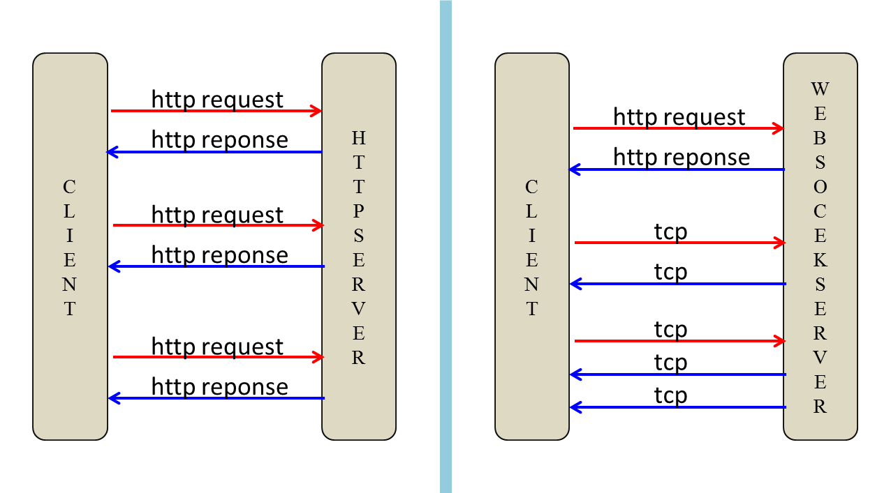
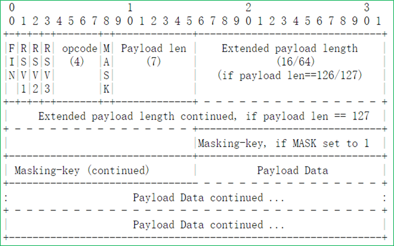

# WebSocket 通信


## 简介

Websocket是html5提出的一个协议规范，参考rfc6455。

websocket约定了一个通信的规范，通过一个握手的机制，`客户端`（浏览器）和`服务器`（webserver）之间能建立一个类似tcp的连接，从而方便c－s之间的通信。在websocket出现之前，web交互一般是基于http协议的短连接或者长连接。

WebSocket是为解决客户端与服务端实时通信而产生的技术。websocket协议本质上是一个基于tcp的协议，是先通过HTTP/HTTPS协议发起一条特殊的http请求进行握手后创建一个用于交换数据的TCP连接，此后服务端与客户端通过此TCP连接进行实时通信。


## 优点

以前web server实现推送技术或者即时通讯，用的都是轮询（polling），在特点的时间间隔（比如1秒钟）由浏览器自动发出请求，将服务器的消息主动的拉回来，在这种情况下，我们需要不断的向服务器发送请求，然而HTTP request 的header是非常长的，里面包含的数据可能只是一个很小的值，这样会占用很多的带宽和服务器资源。

而最比较新的技术去做轮询的效果是Comet – 用了AJAX。但这种技术虽然可达到全双工通信，但依然需要发出请求(reuqest)。

WebSocket API最伟大之处在于服务器和客户端可以在给定的时间范围内的任意时刻，相互推送信息。 浏览器和服务器只需要要做一个握手的动作，在建立连接之后，服务器可以主动传送数据给客户端，客户端也可以随时向服务器发送数据。 此外，服务器与客户端之间交换的标头信息很小。

WebSocket并不限于以Ajax(或XHR)方式通信，因为Ajax技术需要客户端发起请求，而WebSocket服务器和客户端可以彼此相互推送信息；



因此从服务器角度来说，websocket有以下好处：

节省每次请求的header

 http的header一般有几十字节

Server Push服务器可以主动传送数据给客户端


## 基本原理

此章节讲述websocket原理, 用于增强对websocket的理解(如果不关心原理,  请跳过进入客户端使用章节)

### 逻辑

与http协议不同的请求/响应模式不同，Websocket在建立连接之前有一个Handshake（Opening Handshake）过程，在关闭连接前也有一个Handshake（Closing Handshake）过程，建立连接之后，双方即可双向通信。 在websocket协议发展过程中前前后后就出现了多个版本的握手协议，这里分情况说明一下：


- 基于flash的握手协议

使用场景是IE的多数版本，因为IE的多数版本不都不支持WebSocket协议，以及FF、CHROME等浏览器的低版本，还没有原生的支持WebSocket。此处，server唯一要做的，就是准备一个WebSocket-Location域给client，没有加密，可靠性很差。

客户端请求：

```http
GET /ls HTTP/1.1
Upgrade: WebSocket
Connection: Upgrade
Host: www.tongxunmao.com
Origin: http://www.tongxunmao.com
```

服务器返回：

```http
HTTP/1.1 101 Web Socket Protocol Handshake
Upgrade: WebSocket
Connection: Upgrade
WebSocket-Origin: http://www.tongxunmao.com
WebSocket-Location: ws://www.tongxumao.com/ls
```


### 数据帧

Websocket协议通过序列化的数据帧传输数据。数据封包协议中定义了opcode、payload length、Payload data等字段。其中要求：

- 1.客户端向服务器传输的数据帧必须进行掩码处理：服务器若接收到未经过掩码处理的数据帧，则必须主动关闭连接。
- 2.服务器向客户端传输的数据帧一定不能进行掩码处理。客户端若接收到经过掩码处理的数据帧，则必须主动关闭连接。 针对上情况，发现错误的一方可向对方发送close帧（状态码是1002，表示协议错误），以关闭连接。 具体数据帧格式如下图所示：



**FIN**

- 标识是否为此消息的最后一个数据包，占 1 bit


**RSV1, RSV2, RSV3: 用于扩展协议，一般为0，各占1bit**

- 其中最重要的字段为opcode(4bit)和MASK(1bit)：
- MASK值，从客户端进行发送的帧必须置此位为1，从服务器发送的帧必须置为0。如果任何一方收到的帧不符合此要求，则发送关闭帧(Close frame)关闭连接。
- opcode的值： 0x1代表此帧为文本数据帧, 0x2代表此帧为二进制数据帧, 0x8为控制帧中的连接关闭帧(close frame), 0x9为控制帧中的Ping帧, 0xA(十进制的10)为控制帧中的Pong帧。
- Ping/Pong帧： Ping帧和Pong帧用于连接的保活(keepalive)或者诊断对端是否在线。这两种帧的发送和接收不对WEB应用公开接口，由实现WebSocket协议的底层应用(例如浏览器)来实现它。


**MASK：占1bits**

- 用于标识PayloadData是否经过掩码处理。如果是1，Masking-key域的数据即是掩码密钥，用于解码PayloadData。客户端发出的数据帧需要进行掩码处理，所以此位是1


**Payload length**

- Payload data的长度，占7bits，7+16bits，7+64bits：

  1.如果其值在0-125，则是payload的真实长度。 2.如果值是126，则后面2个字节形成的16bits无符号整型数的值是payload的真实长度。注意，网络字节序，需要转换。 3.如果值是127，则后面8个字节形成的64bits无符号整型数的值是payload的真实长度。注意，网络字节序，需要转换。 这里的长度表示遵循一个原则，用最少的字节表示长度（尽量减少不必要的传输）。举例说，payload真实长度是124，在0-125之间，必须用前7位表示；不 允许长度1是126或127，然后长度2是124，这样违反原则。


**Payload data**

应用层数据


**server解析client端的数据**

接收到客户端数据后的解析规则如下：


**1byte**

- 1bit: frame-fin，x0表示该message后续还有frame；x1表示是message的最后一个frame
- 3bit: 分别是frame-rsv1、frame-rsv2和frame-rsv3，通常都是x0
- 4bit: frame-opcode，x0表示是延续frame；x1表示文本frame；x2表示二进制frame；x3-7保留给非控制frame；x8表示关 闭连接；x9表示ping；xA表示pong；xB-F保留给控制frame


**2byte**

- 1bit: Mask，1表示该frame包含掩码；0表示无掩码
- 7bit、7bit+2byte、7bit+8byte: 7bit取整数值，若在0-125之间，则是负载数据长度；若是126表示，后两个byte取无符号16位整数值，是负载长度；127表示后8个 byte，取64位无符号整数值，是负载长度
- 3-6byte: 这里假定负载长度在0-125之间，并且Mask为1，则这4个byte是掩码
- 7-end byte: 长度是上面取出的负载长度，包括扩展数据和应用数据两部分，通常没有扩展数据；若Mask为1，则此数据需要解码，解码规则为- 1-4byte掩码循环和数据byte做异或操作。


### 连接关闭

任何一端发送关闭帧给对方，即可关闭连接。关闭连接时通常都带有关闭连接的状态码(status code)。常见状态码的含义如下：

- 1000 连接正常关闭
- 1001 端点离线，例如服务器down，或者浏览器已经离开此页面
- 1002 端点因为协议错误而中断连接
- 1003 端点因为受到不能接受的数据类型而中断连接
- 1004 保留
- 1005 保留, 用于提示应用未收到连接关闭的状态码
- 1006 端点异常关闭
- 1007 端点收到的数据帧类型不一致而导致连接关闭
- 1008 数据违例而关闭连接
- 1009 收到的消息数据太大而关闭连接
- 1010 客户端因为服务器未协商扩展而关闭
- 1011 服务器因为遭遇异常而关闭连接
- 1015 TLS握手失败关闭连接


## 客户端使用

micropython的uwebsocket客户端使用, 只需要关注其连接和接收即可, 别的都进行了封装处理


### 客户端连接

#### uwebsocket.Client.connect

```python
ws_client = uwebsocket.Client.connect(url, headers=None, debug=False)
```

**参数描述：**:

* `url` -  str类型,  websocket的连接地址, 一般以"ws://xxx/"或"wss://xxx/"形式存在
* `headers` - dict类型,  额外需要添加的headers, 用于除了标准连接头之外, 允许用户自己传额外的头部
* `debug` - bool类型,  默认False, 当为True的情况下, 会输出日志


### send发送数据

#### ws_client.send

```python
ws_client.send(msg)
```

**参数描述：**

* `msg` - str类型, 需要发送的数据


### recv接收数据

#### ws_client.recv

```python
ws_client.recv()
```

**返回值描述：**

* `result `- str类型， recv接受返回的结果, 当接受空值或None的时候, 为连接被关闭


### 关闭连接

#### ws_client.close

```python
ws_client.close()
```


**示例：**：

```python
import uwebsocket
import _thread


def recv(cli):
    while True:
        # 死循环接收数据
        recv_data = cli.recv()
        print("recv_data = {}".format(recv_data))
        if not recv_data:
            # 服务器关闭连接或客户端关闭连接
            print("cli close")
            client.close()
            break


# 创建客户端, debug=True输出日志, ip和端口需要自己填写, 或者是域名
client = uwebsocket.Client.connect('ws://xxx/', debug=True)

# 线程接收数据
_thread.start_new_thread(recv, (client,))

# 发送数据
client.send("this is a test msg")
```

