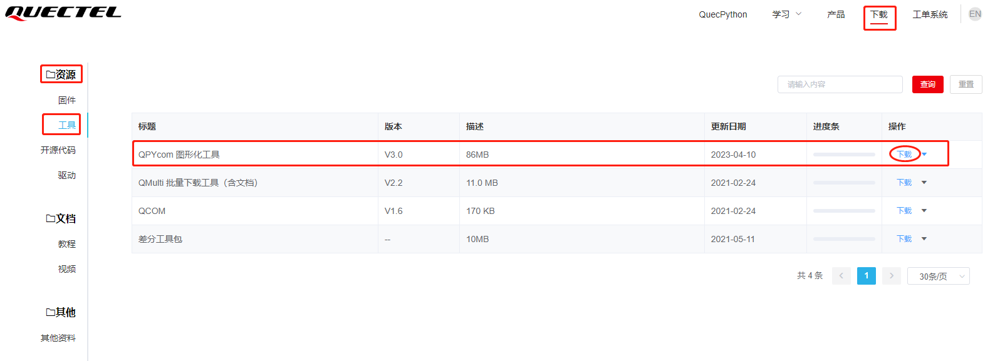
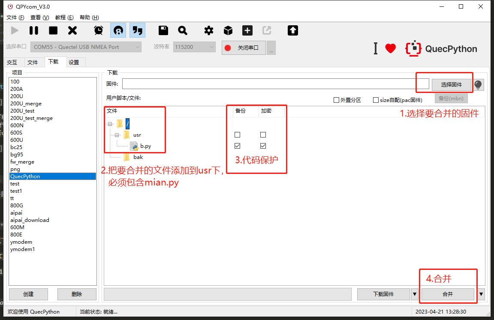

## 加密方式介绍

在 python 中，可以将 py 文件编译为 pyc 文件。编译后的 pyc 文件是二进制格式，一是可以加快加载速度， 更重要的是可以保护原始代码。在 micropython 中同样提供了这个功能，只是它将 pyc 改名为 mpy，编译出的文件扩展名是.mpy。这一加密过程正是通过 mpy-cross 工具来完成。 

**使用mpy-cross保护py文件** 

- py 文件 

  python 源代码文件后缀 。

- pyc 文件 

  pyc 是一种二进制文件，是由 py 文件经过编译后，编译后的pyc文件是二进制格式，一是可以加快加载速度，更重要的是可以保护原始代码。而且 pyc 是一种跨平台的字节码，是由 Python 虚拟机来执行。 

- mpy 文件 

  Micropython 中提供了将.py 文件编译成.mpy 文件，和.pyc 文件一样是二进制文件。如：user.py加密后，就会变成user.mpy，我们可以直接用user.mpy代替原有的user.py文件，使用起来和原来一样。

## 使用工具加密

- 登录官方网站“[资源下载](https://python.quectel.com/download)”，在一级分类“资源”，二级分类“工具”栏中找到【QPYcom 图形化工具】，具体位置如下图：

- 打开QPYcom工具后，在**“下载”**选项卡中有【加密】的选项，加密功能用于保护用户的应用代码，加密后使源代码.py编译成.mpy二进制代码；

​			注意：工具的加密功能在合并产生固件时生效

## 单独文件加密

使用 mpy-cross-amd64.exe 工具，在工具同目录下编写 user.py 文件，如：

打开 windows 下 cmd 命令行，进入 mpy-cross-amd64.exe 工具所在目录，使用如下命令及参数生成 mpy 文件，如： 

`mpy-cross-amd64.exe -mno-unicode user.py`

user.py加密后，就会变成user.mpy，我们可以直接用user.mpy代替原有的user.py文件，使用起来和原来一样。

## 文件读保护

## 更多mpy-cross资料

 <a href="https://pypi.org/project/mpy-cross/1.9.3/">mpy-cross官方资料</a>
