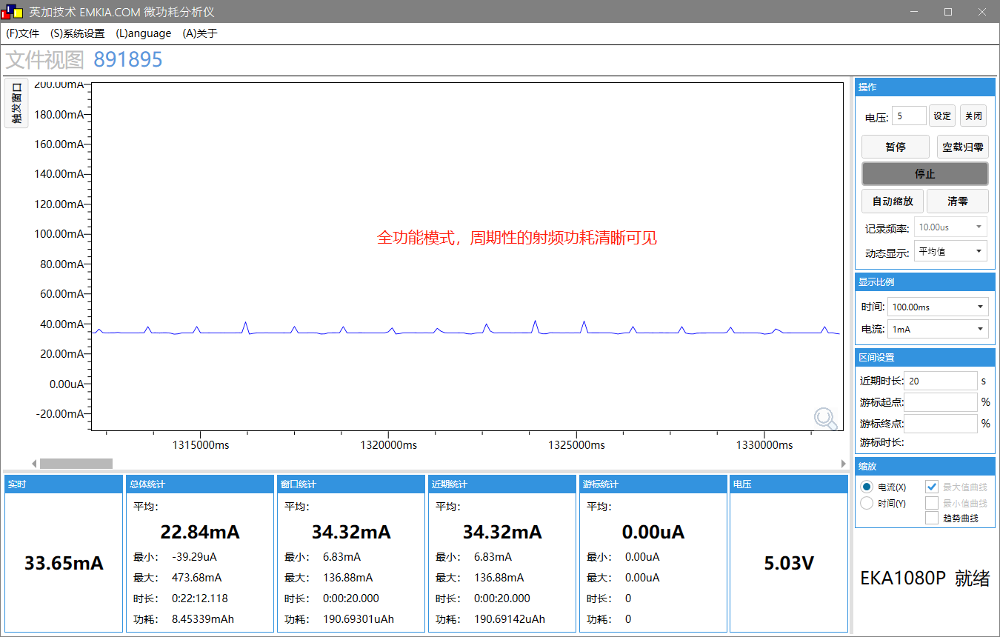
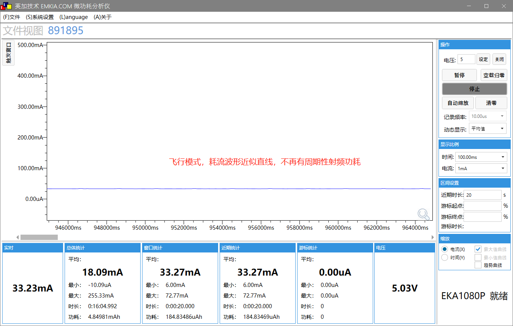
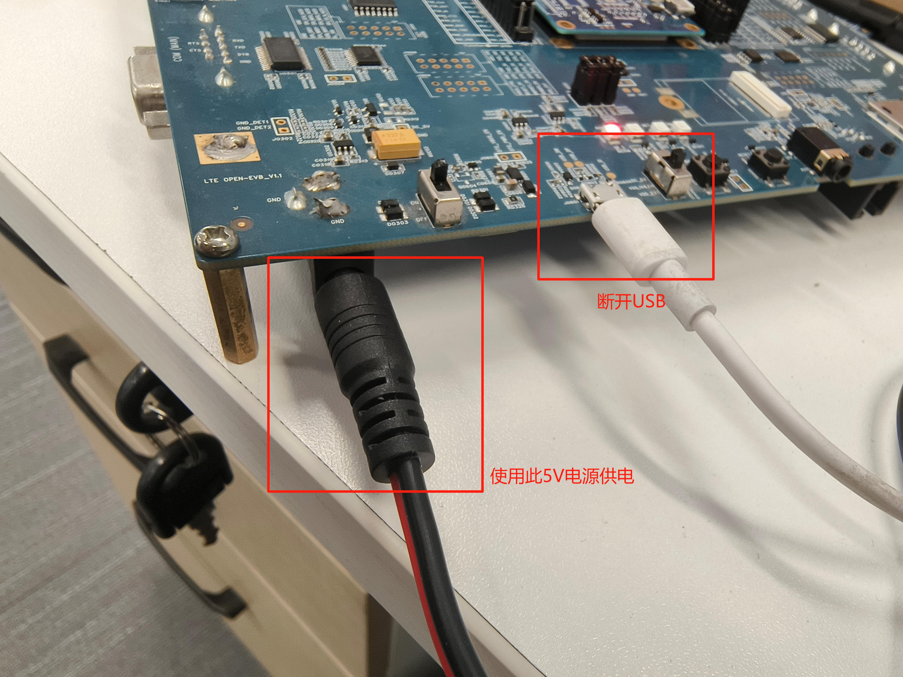
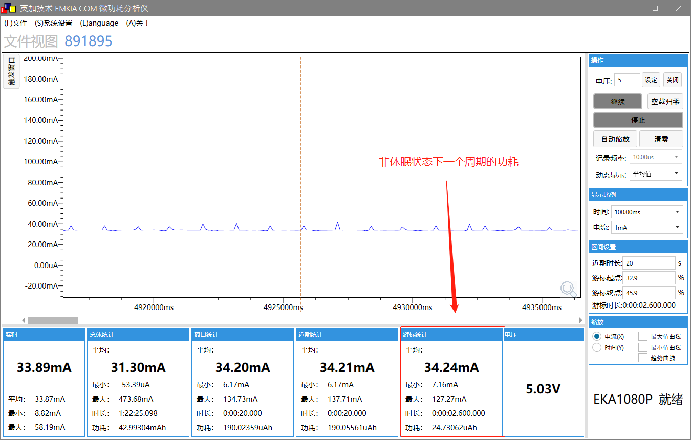
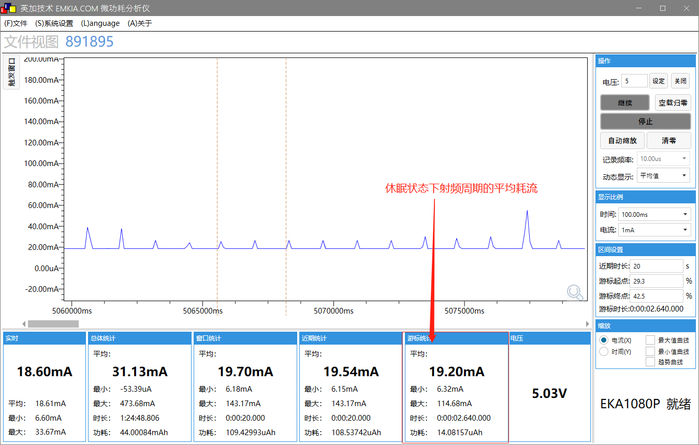

# Pm - 功耗管理

本文主要介绍什么是功耗管理、怎么使用功耗管理等相关问题。

## 功耗管理简介

Quecpython的功耗控制可分为模组功耗和射频功耗两部分。

### 射频功耗管理

模块的射频工作状态可分为，全功能开启(默认)，全功能关闭，飞行模式。

```py
# 获取工作模式
import net
net.getModemFun()

# 设置飞行模式
net.setModemFun(4)
```

注意：开启飞行模式时，射频将会被关闭，此时模块处于断网阶段，无法进行任何网络通信。

全功能和飞行模式的功耗对比：





### 模组功耗管理

#### Cat1的PM

在Quecpython中，低功耗的配置是基于锁的，即有锁则不休眠，无锁则自动休眠。此方法在使用过程中常用于锁住业务，当业务执行时，对锁进行上锁操作，防止芯片进入休眠状态，当业务结束后对锁进行解锁操作，通知底层用户业务已结束，可以调度休眠以降低功耗。

#### NBIOT的PM

因为NBIOT网络结构的特殊性，所以NB模块的休眠设置会更加繁琐一些，NBIOT的休眠寻呼模式有三种，分别是PSM EDRX DRX，三者的功耗是上升排列，Quecpython目前支持PSM模式的休眠控制，即用户只需要去设置PSM相关定时器就可以完成模块的在网休眠。

PSM模式休眠有两个休眠控制定时器需要用户来配置，一个是TAU(T3412)，另一个是ACT(T3324)，ACT是终端在idle态的超时时间，TAU是终端在PSM态的超时时间，当TAU超时后，终端将进入connect态进行联网寻呼。

### 硬件设计
串口、外部中断、SPI、I2C等外设均处于空闲状态，才能进入低功耗

### 软件设计

接口可参考[pm功能API说明文档](..\..\..\API_reference\zh\QuecPython_classlib\pm.md).

定时器不触发、线程全部处于IDEL、功耗锁全部释放，才能进入低功耗

## 模组功耗管理功能应用实例

在本文中，我们将使用 QuecPython 开发板，演示低功耗功能。

### 准备工作

Quecpython开发板，功耗仪

### 代码实现

```python
import pm
import utime

# 创建wakelock锁
lpm_fd = pm.create_wakelock("test_lock", len("test_lock"))
# 设置自动休眠模式
pm.autosleep(1)

# 模拟测试，通过功耗锁每20S切换一次休眠/非休眠状态，实际开发请根据业务场景选择使用
while 1:
    utime.sleep(20)  # 休眠20S
    res = pm.wakelock_lock(lpm_fd) #加锁唤醒
    print("ql_lpm_idlelock_lock, g_c1_axi_fd = %d" %lpm_fd)
    utime.sleep(20) # 唤醒20S
    res = pm.wakelock_unlock(lpm_fd) #解锁，再次进入休眠
    print(res)
    print("ql_lpm_idlelock_unlock, g_c1_axi_fd = %d" %lpm_fd)
    num = pm.get_wakelock_num()  # 获取已创建锁的数量，此数目大于0时无法进入休眠
    print(num)
```

### 功耗测试



如上图，使用功耗仪由5V电源供电，断开USB，运行以上脚本，可比较休眠和非休眠状态下的功耗

功耗如下：





可见，耗流会有明显下降（一般在10mA以上）

注意，本例测试的是Quecpython开发板的整体功耗，只是对比休眠/非休眠模式下同种硬件的耗流水准，不能反映模组的真实功耗。模组的实际功耗水平请参阅对应的硬件设计手册。

## 总结

功耗管理功能在此做了详细的介绍，如有疑问或更好的建议欢迎联系我们，也可以直接向我们提交文档贡献，后续本文将继续完善和补充更多应用案例。