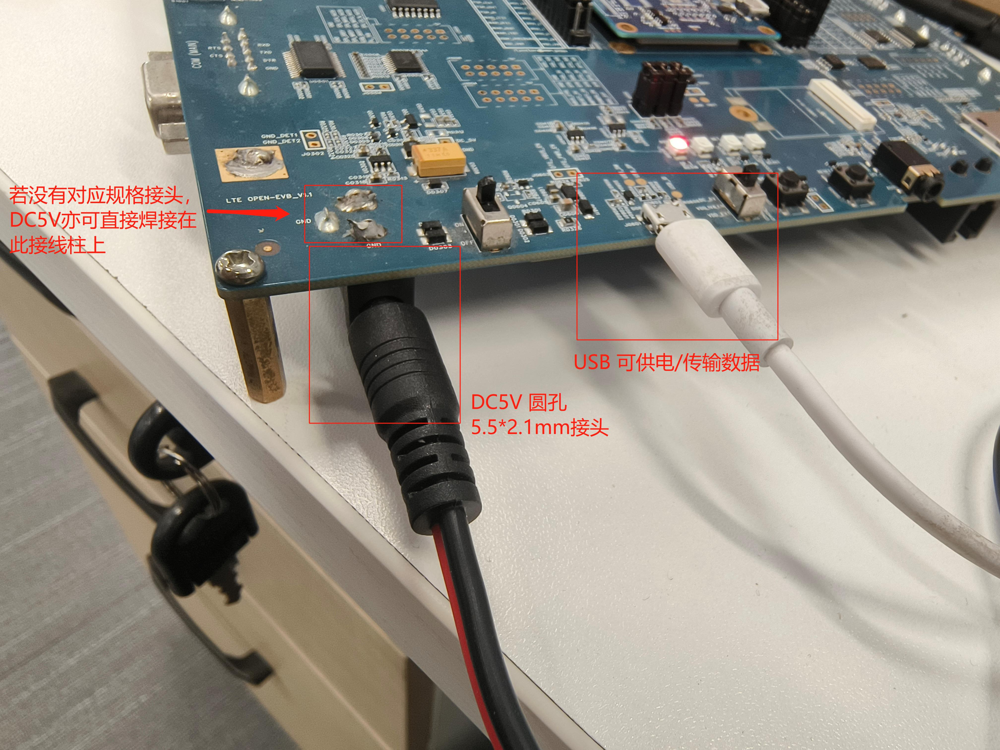
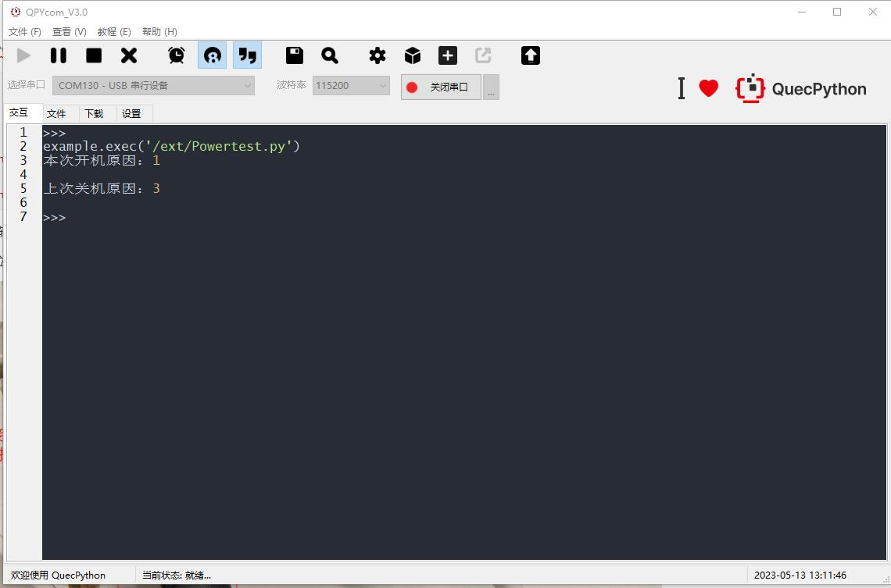
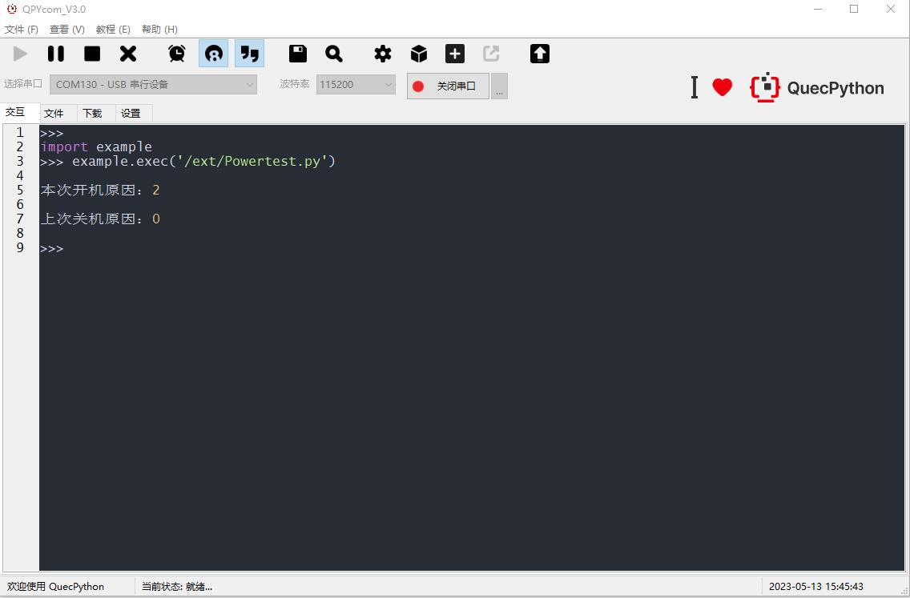
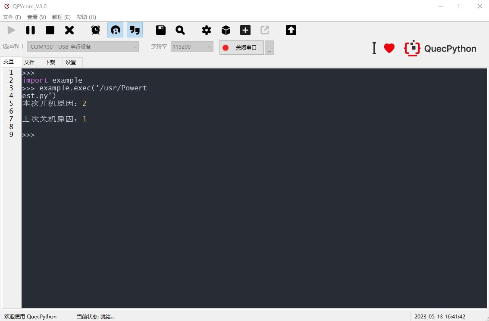
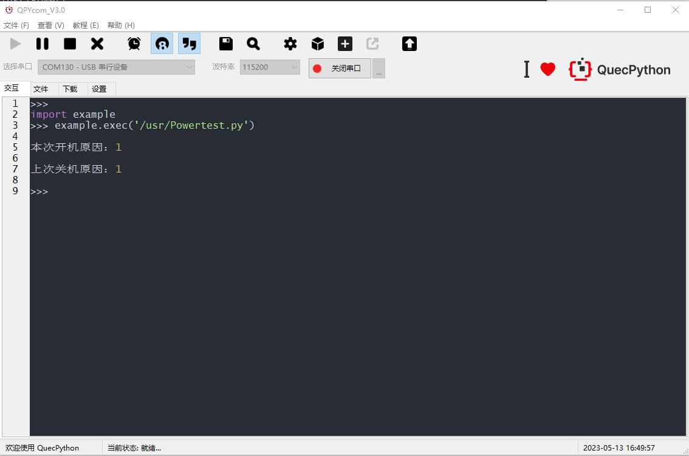
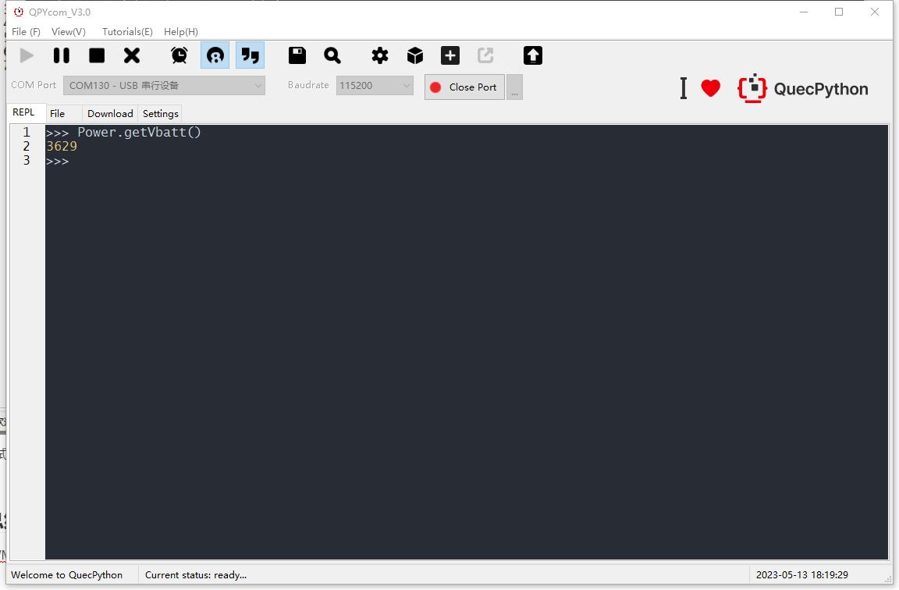
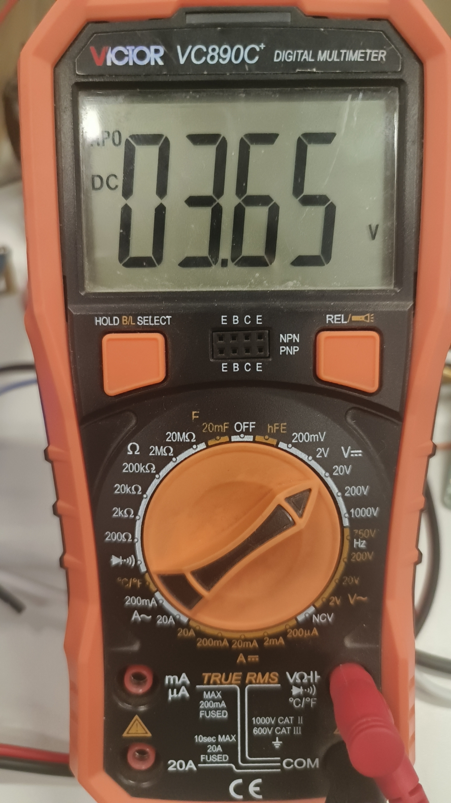

# Power - 电源管理
本文主要介绍电源管理功能的使用
## 电源管理简介

### 什么是电源管理

电源管理是模组本身控制电源状态的功能集合，包括一系列硬件外设和软件接口。藉由这些硬、软件，我们可以实现对模组电源状态的控制和查询。

### 怎么使用电源管理

电源管理功能一般由模组的PMIC（或称PMU，电源管理单元）实现，此单元对于模组是不可或缺的存在，其软件接口可在[misc.Power功能API文档](..\..\..\API_reference\zh\QuecPython_classlib\misc.Power.md)中查阅，硬件则需要参阅对应模块的硬件设计文档。

### 硬件设计

电源管理设计的硬件主要是Powekey和Reset引脚（部分平台会有额外的功能引脚）根据模组的硬件设计文档（从 [下载区](/download/) 获取）设计好硬件电路即可。设计硬件电路时，注意严格遵循硬件设计文档内的设计规范，防止硬件问题造成模组电源状态异常，这种问题往往是软件难以补救的。

不同平台的模组PMIC功能会有差别，软件接口都做了统一处理，其使用方法如下。

### 软件应用

当使用电源管理功能时：

```python
>>>from misc import Power
>>>Power.powerDown()#软关机
>>>Power.powerRestart()#软重启
>>>Power.powerOnReason()#查询开机原因
>>>Power.powerDownReason()#查询关机原因
>>>Power.getVbatt()#查询当前模组Vbat引脚电压,单位为mV(毫伏)
```

### 电源管理功能测试

在命令行中可通过调用以上关机/重启接口，观察模组实际电源状态是否和接口对应功能一致。获取开关机原因可以与最近一次开关机时的状态相对照。Vbat引脚电压可以使用电压表实际测试Vbat引脚电压，与接口获取到的值比较。

## Power功能应用实例

在本文中，我们将使用 QuecPython 板载的PowerKey&Reset，实现上述测试项目，并模拟上电开机的硬件解决方案。

### 准备工作

我们需要使用 QuecPython 开发板、电压表或万用表一个、杜邦线或跳线帽若干、5V直流电源一个。开发板上需用到的器件如下图：


### 代码实现

以下是输出开关机原因的 QuecPython 代码。代码中的注释将帮助您理解代码的工作原理。

```python
# 导入所需模块
from misc import Power

#打印本次开机原因
print("本次开机原因：{0}\r\n".format(Power.powerOnReason()))
#打印上次关机原因
print("上次关机原因：{0}\r\n".format(Power.powerDownReason()))
```

这段代码通过使用 `misc` 模块来输出开关机原因，我们以此段代码，来测试控制电源状态的软/硬件接口。

### 实例测试

测试1：接通电源（开发板供电位置如下），打开DC电源开关，按下开关，待模组启动后打开交互口，运行以上代码



结果如下：



此时可见，开机原因为1，代表powerkey开机，关机原因为3，代表上次是掉电关机（具体原因可从[misc.Power功能API文档](..\..\..\API_reference\zh\QuecPython_classlib\misc.Power.md)中查询）。

测试2：按下Reset，待模组启动后打开交互口，运行以上代码



此时可见，开机原因为重启，关机原因则不在列表内。

测试3：运行软重启，待模组启动后打开交互口，运行以上代码



此时可见，开机原因为重启，关机原因为正常关机。

测试4：运行软关机，然后通过powerkey开机，待模组启动后打开交互口，运行以上代码



此时可见，开机原因为powerkey，关机原因为正常关机。

测试5：长按Powerkey关机，然后通过powerkey开机，待模组启动后打开交互口，运行以上代码


此时可见，开机原因为powerkey，关机原因为正常关机。

测试6：上电自启动的硬件构型

关闭电源，将powerkey按钮右侧的两个通孔短接，然后上电，可以观察到模组自启动，启动原因为powerkey


测试7：读取VBAT电压，在VBAT测试点上测试模组电压





会略有一些误差，可在软件上做补偿

## 总结

电源管理功能在此做了详细的介绍，如有疑问或更好的建议欢迎联系我们，也可以直接向我们提交文档贡献，后续本文将继续完善和补充更多应用案例。