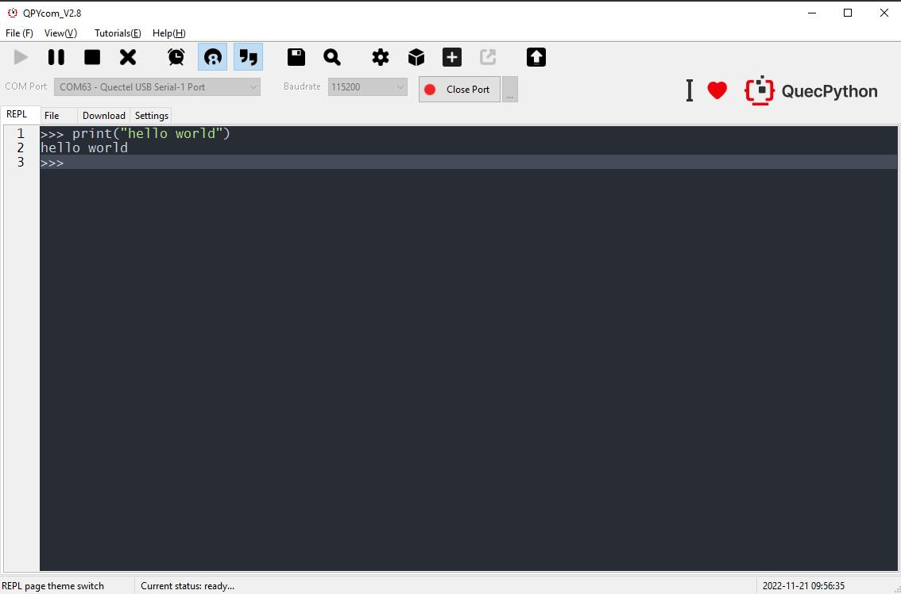

### 上电

> 首先需要有一台运行有 Windows 7、Windows 10 或 Windows 11 操作系统的个人计算机

**Step1：**安装开发板配套的天线,安装位置为LTE天线座位置,并将SIM卡插入开发板上的SIM卡座

**Step2：**使用USB Type-C数据线连接开发板的Type-C接口和电脑USB口即可完成供电

**Step3：**开发板上USB和DC的电源选择开关拨到USB处,开发板上的PWK_ON跳帽短接(上电自动开机)

**Step4：**按住PWK直至主板上电源指示灯亮（主板上丝印为POW的灯）,如果上一步短接PWK_ON则无需长按PWK

<font color='red'>**执行以上操作后POW灯常亮即开机成功**</font>

### 连接

REPL全称为<font color='red'>**Read-Eval-Print-Loop (交互式解释器)**</font>，可以在REPL中进行QuecPython程序的调试

运行 **QPYcom** 工具后，选择正确的串口（波特率无需指定）并打开，即可开始 Python 命令行交互。

**Step1：**打开QPYcom工具，端口选 交互口，选择“交互”界面

**Step2：**点击“打开串口”按钮，在交互界面输入**print(‘hello world’)**，按回车后可以看到执行的结果信息

```python
>>> print('hello world')
hello world
```




<font color='red'>*注意：工具交互页面输入时需要输入英文字符，中文字符将会被屏蔽*</font>

<div STYLE="page-break-after: always;"></div>


### <a id="info_8">QPYcom无法打开怎么解决?</a>

1. 前往官网[下载](https://python.quectel.com/download)最新版本QPYcom
2. 确保工具解压目录没有空格,关闭电脑上的杀毒软件后,以管理员权限运行重试
3. 请在 QQ 交流群（445121768）中咨询技术支持人员,并提供工具目录下log文件夹中的运行日志文件
