## 固件烧录

模组在出厂时通常烧录有标准 AT 固件或 QuecOpen 固件，如需基于 QuecPython 对模块进行开发，需要手动为其重新烧录专门的 QuecPython 固件。

### 获取固件

官网固件下载地址：**<https://python.quectel.com/download>** ，根据模组的型号下载对应的固件即可。

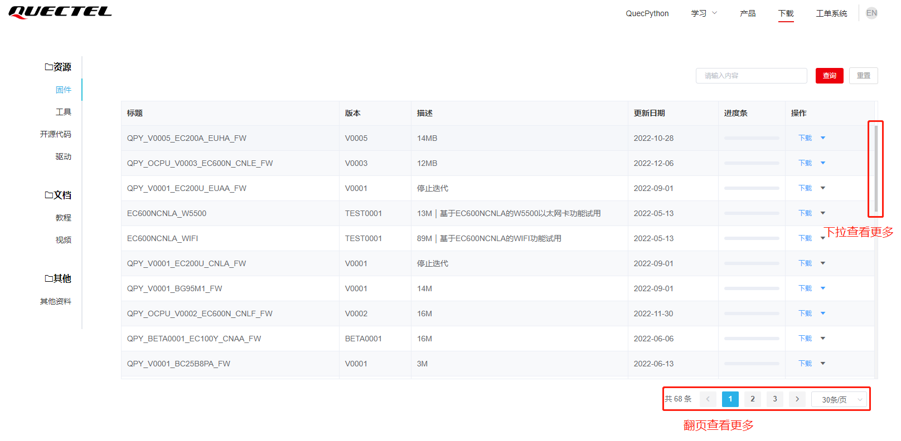

> 固件压缩包下载到本地后，需进行解压。解压后可获得两个文件，其中 .bin 、.lod或 .pac 格式的是 QuecPython 固件本体，.md 格式的是更新日志。

> 请务必将压缩包内容解压至一个**不包含中文、空格和其他特殊字符**的路径下，否则下载工具可能无法正常识别到固件，同时下载工具路径也**不可包含中文、空格和其他特殊字符**。

### 烧录固件

#### 使用QPYcom下载固件

**Step1：**首先确保模组连接正常并已开机，打开工具进入下载页面，点击**"创建"**项目，新建要下载的固件，如图所示:

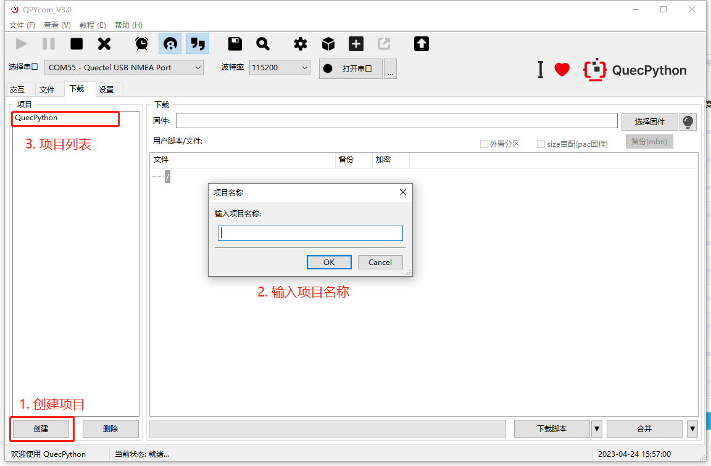

**Step2：**选择要下载到模组的固件(根据要下载的模组型号选择对应的固件)，如图所示:

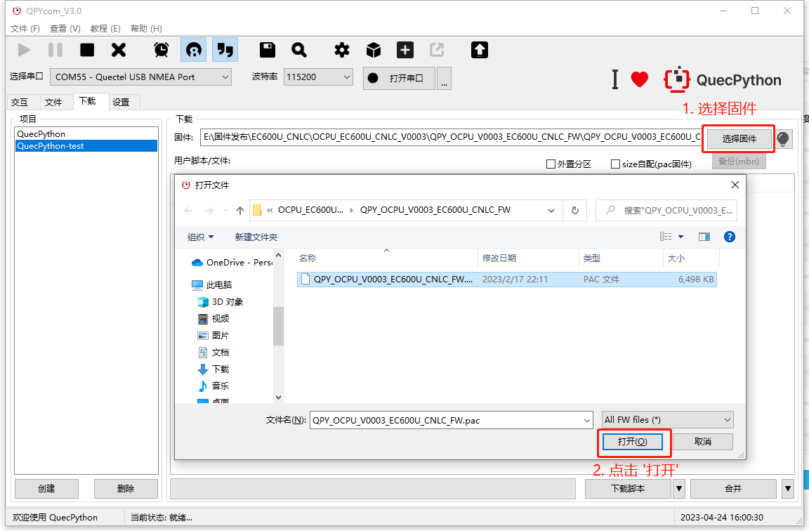

**Step3：**单击**“下载脚本”**右侧的下拉选择箭头，选择**"下载固件"**, 如图所示:

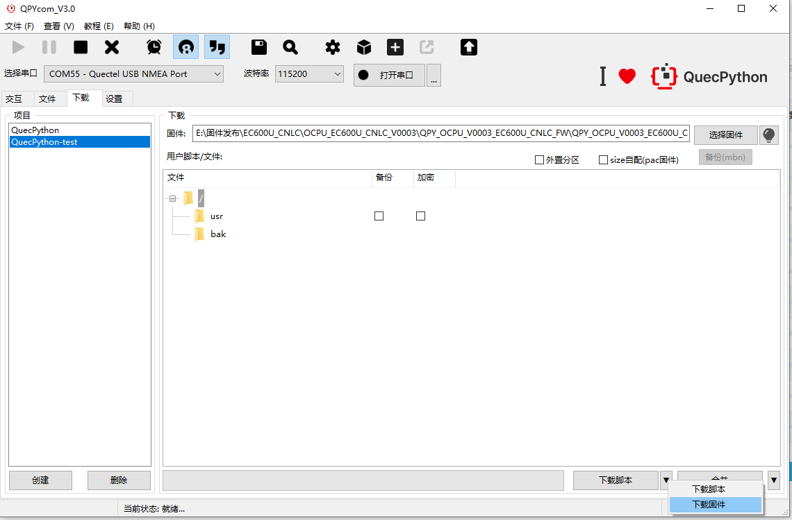

**Step4：**点击**"下载固件"**，开始下载固件,下载过程会有进度条和进度百分比显示，等待下载完毕会有弹窗提示下载成功,如图所示:

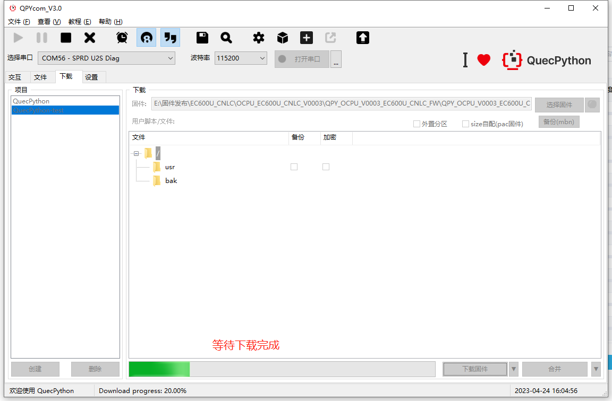

#### 使用Qflash下载固件

为了保证固件烧录的成功率，建议在开始烧录前，手动控制模块进入下载模式。

对于运行正常的模块，可以向 Quectel USB AT Port 串口发送 `AT+QDOWNLOAD=1` 指令。打开设备管理器，可以看到原有的多个 Quectel 相关串口均已消失，同时会新增一个 **Quectel Download Port** 串口或 **SPRD U2S Diag** 串口。说明模块已经进入下载模式，该新增串口即为固件烧录口。

*对于运行异常的模块如何进入下载模式：<a href="#info_3">**强制进入下载模式**</a>*

上文提到，从 QuecPython 官网下载到的的固件为一个 .zip 格式的压缩包，如果解压后得到的是.bin 格式的固件本体，为了使 QFlash 能够正常识别固件，请手动将固件的后缀从 .bin **重命名**为 .zip。

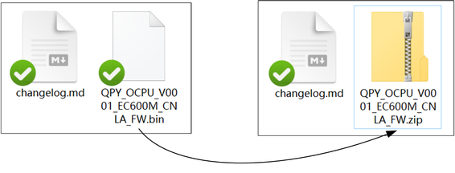

**Step1：**点击 *COM Port* 右侧的下拉列表，选择 **Quectel Download Port** 串口或 **SPRD U2S Diag** 串口所对应的串口号（可打开设备管理器确认），如图所示：

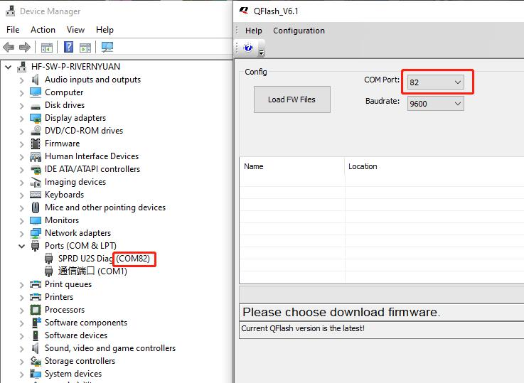

**Step2：**点击 *Load FW Files* 按钮，选中模块的 QuecPython 固件（.pac 文件或 .zip 文件）。QFlash 工具会自动对固件进行解析并做好烧录准备。

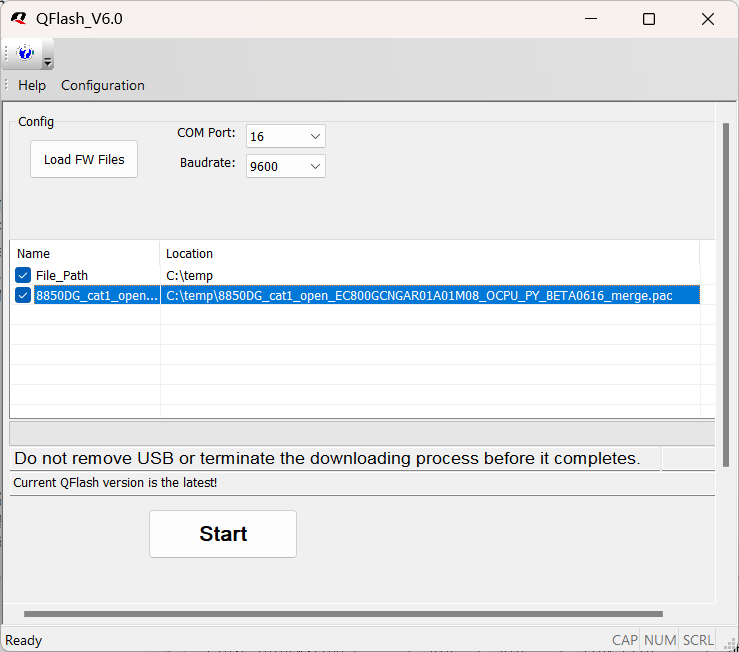

**Step3：**当 QFlash 工具的信息栏中没有错误提示，同时 *Start* 按钮变为黑色时，说明可以进行烧录。点击 *Start* 按钮，稍等片刻，进度条将开始滚动，如图所示：

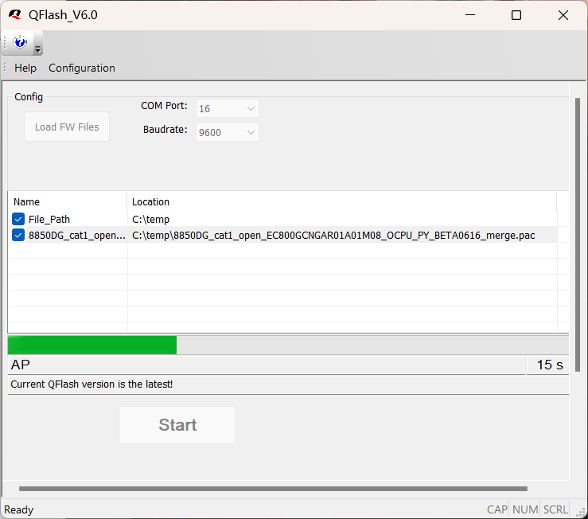

**Step4：**等待待进度条跑满，同时出现 PASS 字样时，说明固件烧录成功。

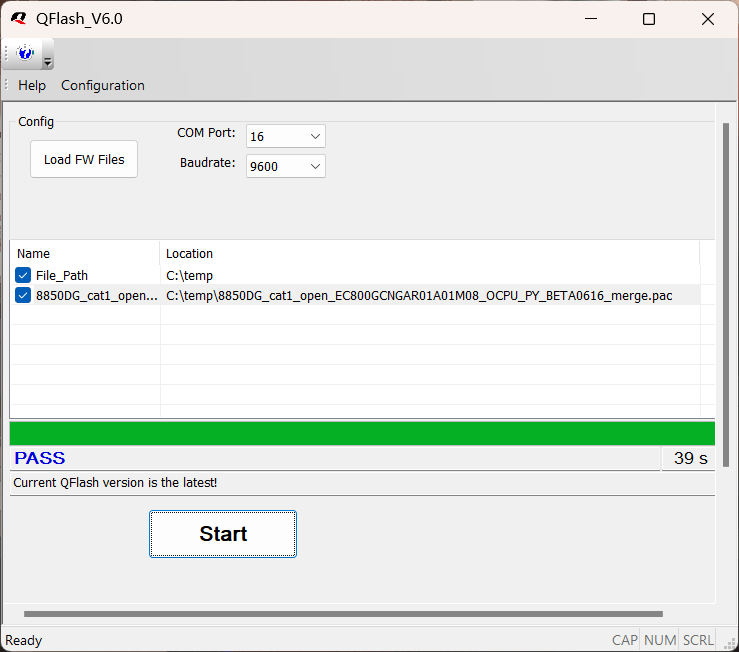

### <a id="info_4">固件烧录需要注意什么?</a>

1. 不同模组对应不同的固件，不支持交叉烧录，如果误烧，一定要重新烧录成对应固件，否则无法正常使用。例如：EC600S分为EC600SCNAA、EC600SCNLA、EC600SCNLB等等，这些模组之间都不支持交叉烧录。
2. 关于固件包的说明，由于官网下载的固件压缩文件包含固件包与changelog，所以官网下载的固件压缩文件需要解压一层，才可以得到可烧录的固件包，注意不同型号的模组固件包后缀名称不一样。
3. 下载固件前，建议优先需要确认固件版本，以免降级或者下错版本。 下载固件后，所有用户区的内容都将被清空。
4. 使用QPYcom下载固件时，无需选择串口，工具将自动选择并开始下载 
5. 请勿同时插入两个或两个以上的开发板，以免工具无法识别，导致下载出错
6. QPYcom工具支持烧录QuecPython固件，不建议使用QPYcom烧C固件或者AT标准固件
7. 下载固件过程中，请勿退出工具，或者拔掉串口，可能致使模块变砖。 如果模块确已变砖，可见“[QuecPython救砖处理](https://python.quectel.com/doc/doc/FAQ/zh/QP_recovery/QP_recovery.html)”

### <a id="info_5">下载固件失败怎么处理?</a>

如果在**QPYcom**里面升级失败或者升级过程中断开连接，请按照如下步骤执行：

1.模组断电，短接VDD_EXT 和USB_BOOT,或者可以直接短接开发板的BOOT和1V8

2.查看设备管理是否会出现DOWNLOAD口或者SPRD U2S Diag口,如下图所示:

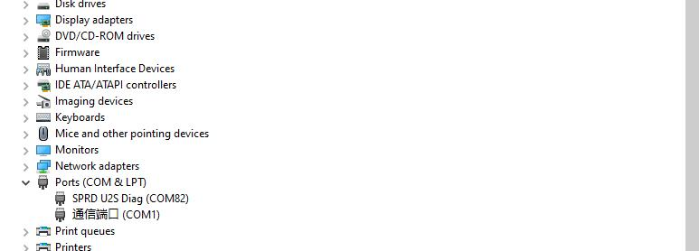

3.打开QPYcom或者Qflash,按照上文所说下载固件流程重新开始下载固件。