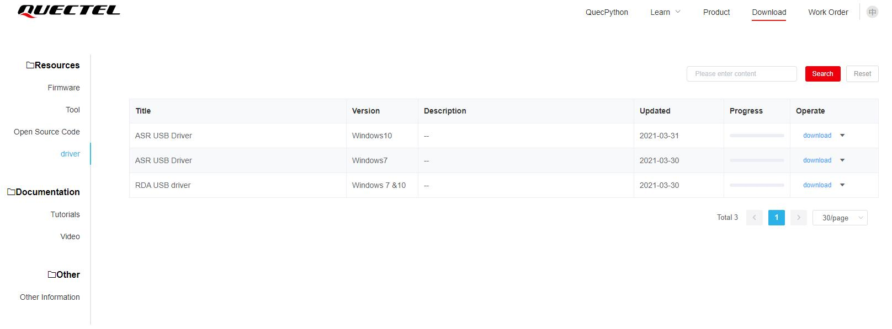

## 开发环境搭建

### 驱动下载

驱动程序（device driver）全称为“设备驱动程序”，是一种可以使计算机和设备通信的特殊程序，操作系统只能通过这个接口，才能控制硬件设备的工作。

打开[驱动下载链接](https://python.quectel.com/download)，选择与自己模组型号和电脑系统匹配的驱动，点击下载按钮即可，如果未看见下载按钮，向右拖动箭头位置直至按钮显示。

### 获取工具

[QPYcom](https://python.quectel.com/download) : 适用于QuecPython开发的一站式工具

[Qflash](https://www.quectel.com/cn/download-zone): Quectel专用固件烧录工具

*注意:建议提前手动关闭系统中安装的防病毒软件，以避免潜在的误报导致工具被误删或者无法使用。*

### 驱动安装

下载后解压驱动压缩包，找到**“setup.exe"** 或者是**“setup.bat"**，双击运行即可，安装完之后打开设备管理器就可以看到设备管理器中端口的黄色感叹号消失了，说明安装成功，能够正常通信。

*出现 Mobile ECM Network Adapter 或 CDC Ethernet Control Modle (ECM) 等设备未被识别属于正常现象，不影响固件烧录和后续开发，无需理会。*

右键打开【**我的电脑**】——选择【**管理**】——选择【**设备管理器**】,然后在设备管理器中选择 【**端口**】

**安装驱动后:**

### <a id="info_1">驱动下载需要注意什么?</a>

1. 官网提供的驱动的分类主要分为两大类：

   第一种：基于模组支持的平台分类：ASR平台（EC600S、EC600N、EC200A、EC100Y等）和RDA平台（EC600U、EC200U）更多模组的平台信息可见：[硬件支持](https://python.quectel.com/doc/Quecpython_intro/zh/Qp_Product_intro/Hardware_Support.html)

   *开发板命名中的EC600X的“X”是一个未知数，可指EC600S、EC600U等，并不代表实际的平台。*

   第二种：基于PC的系统分类：RDA USB驱动下载后压缩包里包含Windows7和Windows10的驱动，根据系统选择即可。win11选择win10系统的驱动即可

### <a id="info_2">驱动安装失败怎么解决?</a>

1. 重启电脑后重试,以管理员权限运行驱动安装程序
2. 开发板是否正确连接到电脑（数据线损坏，或者插口损坏、供电不足等）
3. 开发板是否正确开机(可以通过开发板上POW和NET灯状态判断)
4. USB驱动是否正确安装
5. 电脑是否正确安装主板驱动。
6. 若出现其他异常情况，请在 QQ 交流群（445121768）中咨询技术支持人员。