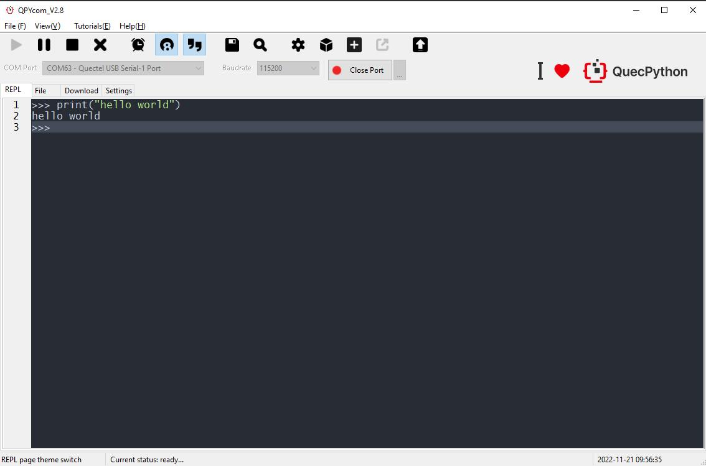
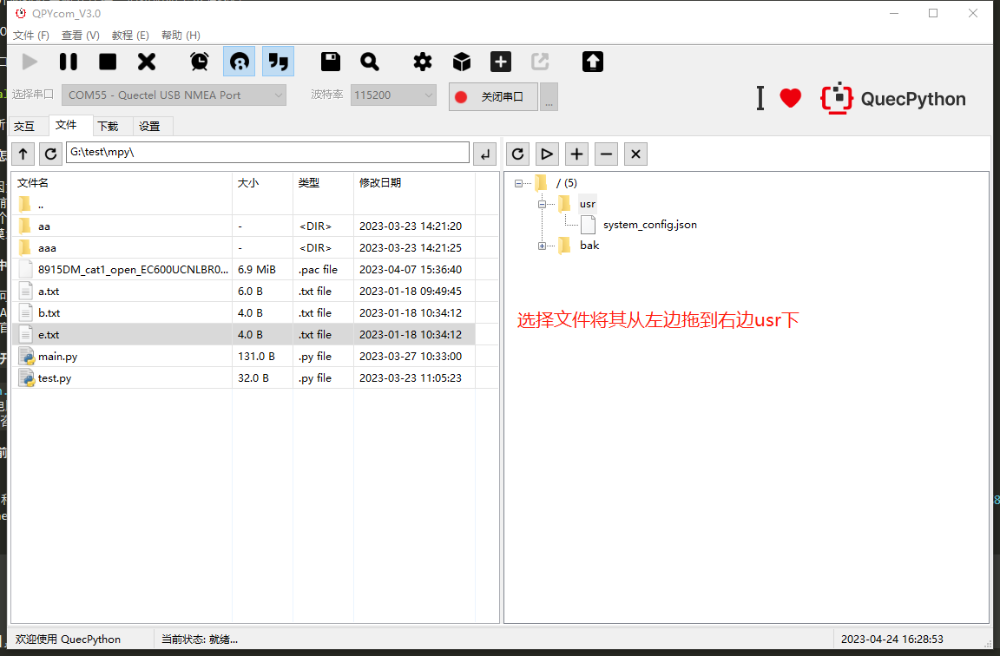
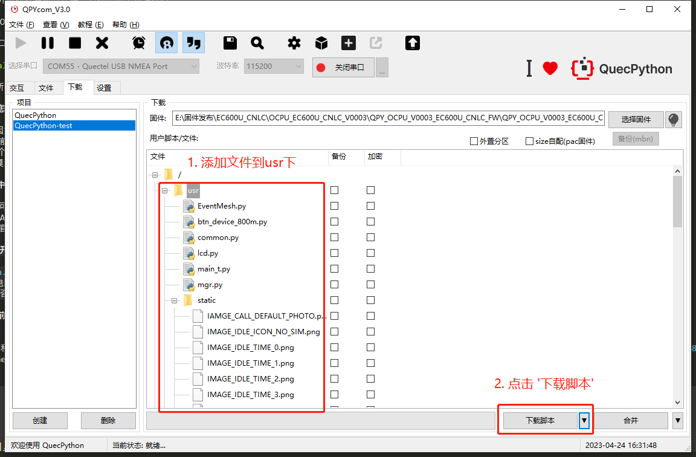
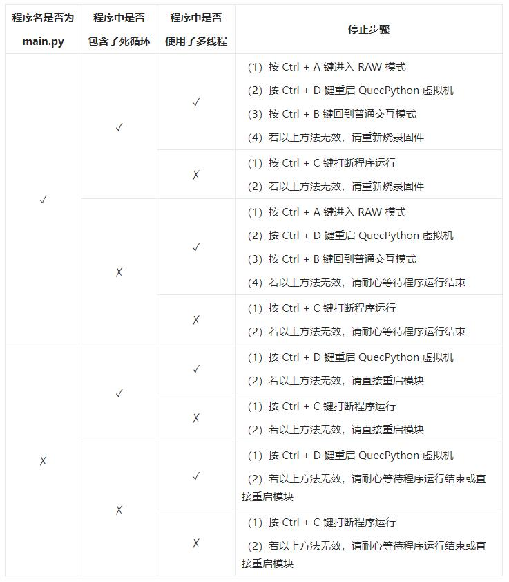
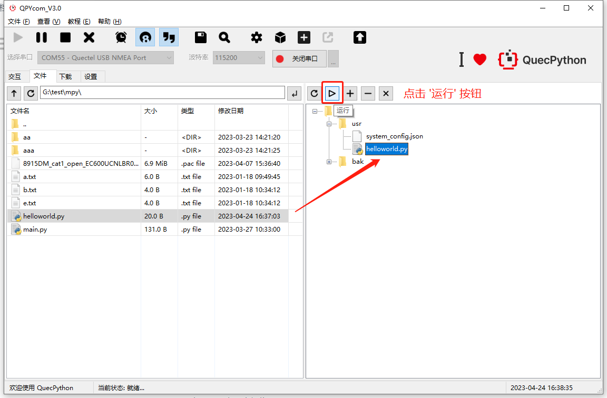
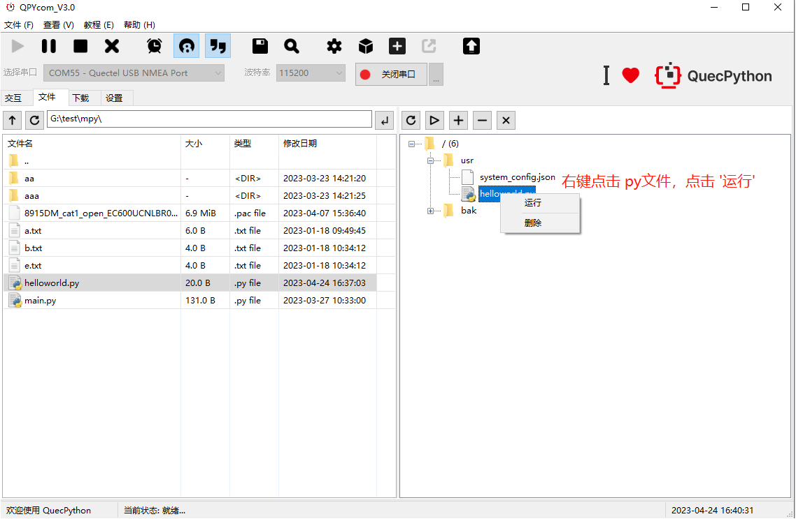
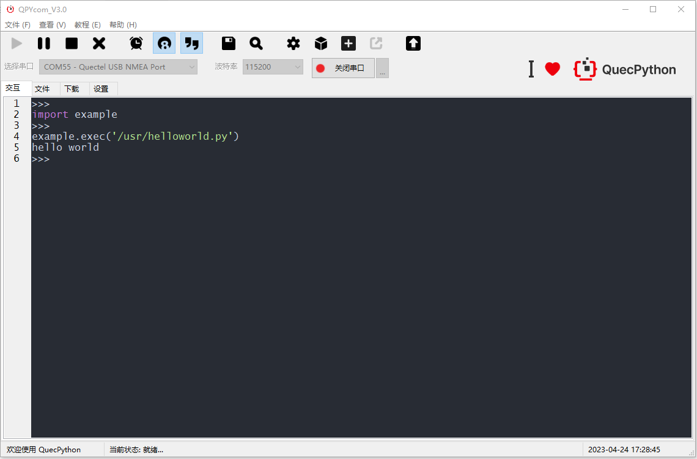
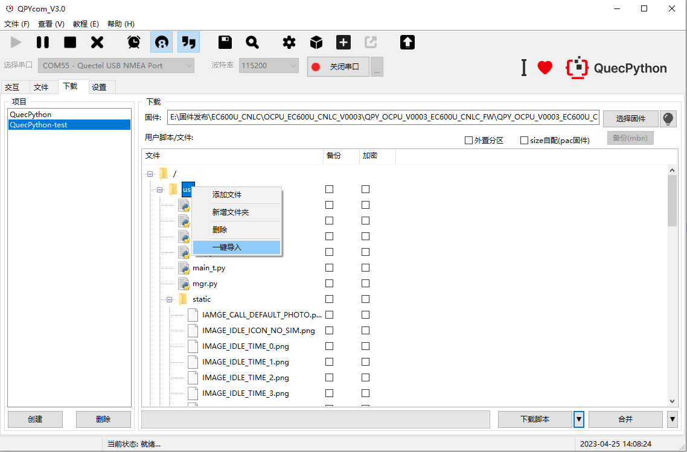

## REPL输出"Hello World"

REPL全称为<font color='red'>**Read-Eval-Print-Loop (交互式解释器)**</font>，可以在REPL中进行QuecPython程序的调试

运行 **QPYcom** 工具后，选择正确的串口（波特率无需指定）并打开，即可开始 Python 命令行交互。

**Step1：**打开QPYcom工具，端口选择 交互口，选择“交互”界面

**Step2：**点击“打开串口”按钮，在交互界面输入**print(‘hello world’)**，按回车后可以看到执行的结果信息

```python
>>> print('hello world')
hello world
```



<font color='red'>*注意：工具交互页面输入时需要输入英文字符，中文字符将会被屏蔽*</font>

<div STYLE="page-break-after: always;"></div>

## PC与模组间的文件传输

**下载方法一:**



**Step1：**首先选择模组的交互口,点击"打开串口"按钮

**Step2：**可以通过文件页面右侧上面的 "**+**","**-**" 按钮来上传和删除文件

**Step3：**也可以通过拖拽的方式将文件页面左侧显示的本地文件直接拖拽到右侧模组中去（也可以拖拽文件夹）

**Step4：**下载过程中会在状态栏显示下载文件名和下载进度

**下载方法二:**



**Step1：**根据需求，创建用户项目（点击"创建"按钮）,步骤同上文烧录固件

**Step2：** 选择需要下载到模块的用户脚本(在"用户脚本"区域通过右键菜单添加)

**Step3：**左击下拉选择箭头，选择"下载脚本"

**Step4：**点击"下载脚本"开始下载脚本，下载过程中有进度条提示

[以上下载文件到模组的详细方法说明指导见QPYcom使用说明](https://python.quectel.com/doc/Advanced_development/zh/QuecPythonTools/QPYcom.html#%E4%B8%8B%E8%BD%BD%E8%84%9A%E6%9C%AC)


### <a id="info_6">下载文件失败怎么处理?</a>

1. 下载开始前弹窗提示语法错误,是因为python代码存在语法错误,可根据语法提示debug即可
2. 下载后文件大小显示为0,或者下载前提示空间不足,是因为要下载的文件大于模块的剩余空间,可以先清除一下模组内文件确认空间足够再下载
3. 提示Python代码语法缩进错误（4个空格缩进和tab缩进混用导致）,建议只使用其中一种
4. 下载文件后交互口堵塞,建议重启模块后重试


## 执行脚本文件&停止程序运行

#### 执行脚本文件

**Step1：**将要执行的脚本文件下载到模组中去

**Step2：**打开串口之后，在QPYcom交互页面输入以下代码执行脚本文件

```python
import example
example.exec("/usr/helloworld.py") # filePath为要执行的脚本文件路径
```

**Step3：**或者通过QPYcom文件页面 **执行** 按钮执行脚本文件,在工具的文件页面选择要执行的脚本文件然后点击 "▷"按钮

[wiki 执行python脚本文件api](https://python.quectel.com/wiki/#/zh-cn/api/QuecPythonClasslib?id=example-%e6%89%a7%e8%a1%8cpython%e8%84%9a%e6%9c%ac)

#### 停止程序运行

如何停止正在运行的程序,根据运行的脚本文件类型有以下方法:



<div STYLE="page-break-after: always;"></div>

## 脚本文件输出"Hello World"

创建*helloworld.py*文件输出“hello world”，打印“hello world”，编写脚本如下所示：

```python
print("hello world")
```

通过QPYcom将上面编辑好的文件下载到模组中去并运行



或者



执行结果如图



<div STYLE="page-break-after: always;"></div>


## 脚本文件打包进固件

使用QPYcom工具，可以实现本地python脚本文件与固件合并生成量产文件功能，操作步骤为：

**Step1：**打开QPYcom工具,选择**"下载"**页面，在左侧导航栏创建项目(详细步骤参见上文)

**Step2：**点击**"选择固件"**从本地选择固件(步骤同烧录固件)

**Step3：**通过图示位置选择要合并的脚本，可以通过点击脚本文件进行指定删除，可以一键导入整个目录结构来实现合并具有复杂目录结构的项目

**Step4：**可以勾选加密和备份按钮来实现脚本文件备份和加密功能,详见[代码加密](https://python.quectel.com/doc/Advanced_development/zh/Mass_production/CodeEncryption.html)

**Step5：**点击**"合并"**按钮,选择合并生成文件的路径后点击确认等待合并完成



[*详细使用说明*](https://python.quectel.com/doc/Advanced_development/zh/QuecPythonTools/QPYcom.html#%E5%9B%BA%E4%BB%B6%E8%84%9A%E6%9C%AC%E5%90%88%E5%B9%B6)

<div STYLE="page-break-after: always;"></div>

