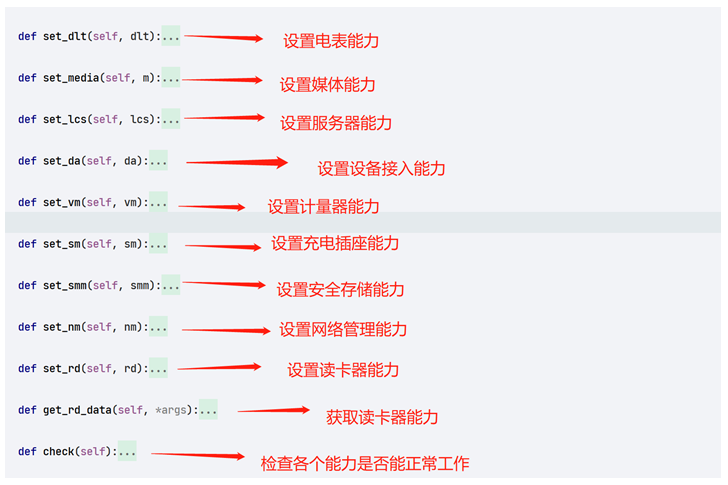
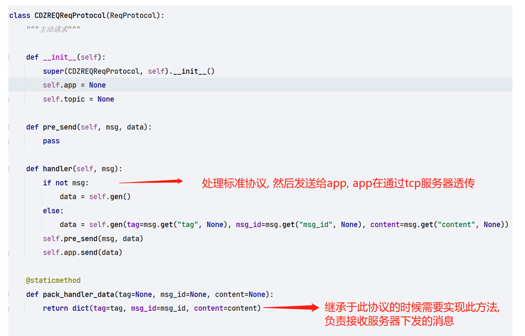

# QuecPython充电桩软件使用指导

## 概述

QuecPython充电桩方案使用sys_bus框架开发，此文档主要描述充电桩软件设计框架,包含核心组件功能描述，系统初始化流程的介绍等，方便更快理解本框架，并且介绍使用QuecPython完整运行充电桩软件框架，包括相应配置项该如何配置以及如何基于该demo进行二次开发等

> 完整代码和文档见GitHub仓库
>
> [充电桩方案GitHUb仓库](https://github.com/QuecPython/solution-eleBicycleChargingPile)

## 系统框架

### 硬件系统框架

系统框架如下：

Module侧支持SIM，GPIO，UART, codec, LED等功能。

### 软件系统框架

1. 软件系统框架如下:

   1. APP层实现处理充电桩核心业务，解析上下行数据

   2. sys_bus为事件处理器，通过支持事件订阅发布的机制来完成功能流转

   3. Module侧接收外部事件或数据通过sys_bus驱动来处理执行

## 系统组件

### sys_bus

模块功能: 用于消息的订阅和发布广播, 多线程处理等,用于一对多的广播, 类似于内部的mqtt

代码使用：

### VoltaMeter

- 功能描述

负责读取BL0939的计量芯片数据

- 实现原理

### DeviceApplication

- 功能描述

该功能设备的功能的集合类, 负责设备的启动和关闭, 设备检查数据传递等

### CDZREQReqProtocol

- 功能描述

协议的处理对象, 所有继承于此对象的都是传输协议。

### DLT645

- 功能描述

该功能负责读取电表的数据

### CDZServer

- 功能描述

充电桩服务器, 负责服务器的连接启动和控制, 链路维持等

### NetManager

- 功能描述

该功能用于管理网络执事检测网络状态, 恢复网络

### DeviceActionManager

- 功能描述

此模块用于设备状态控制，可以控制设备开关机，重启，待机状态，以及外设控制等。

- 实现原理

1. 初始化类方法后将对外暴露的方法通过事件注册到EventMesh中。
   
2. 外部业务调用通过对应的事件主题来调用对应的功能接口
   

### SocketManage

- 功能描述

充电插座,负责检查和设置A/B插座状态和开启充电模式等, 及检测过压等

### Socket

- 功能描述

充电插座,负责检查和设置A/B插座状态和开启充电模式等, 及检测过压等

### Socket

- 功能描述

充电策略的选择和管理

## 系统初始化流程

## 业务流程

