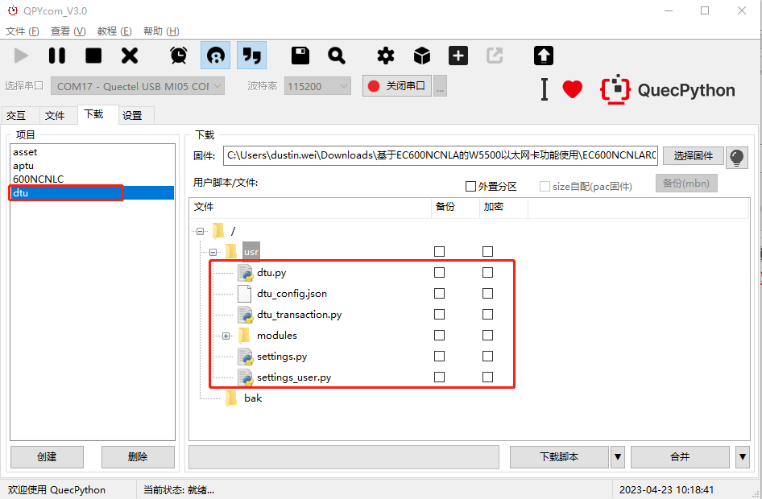
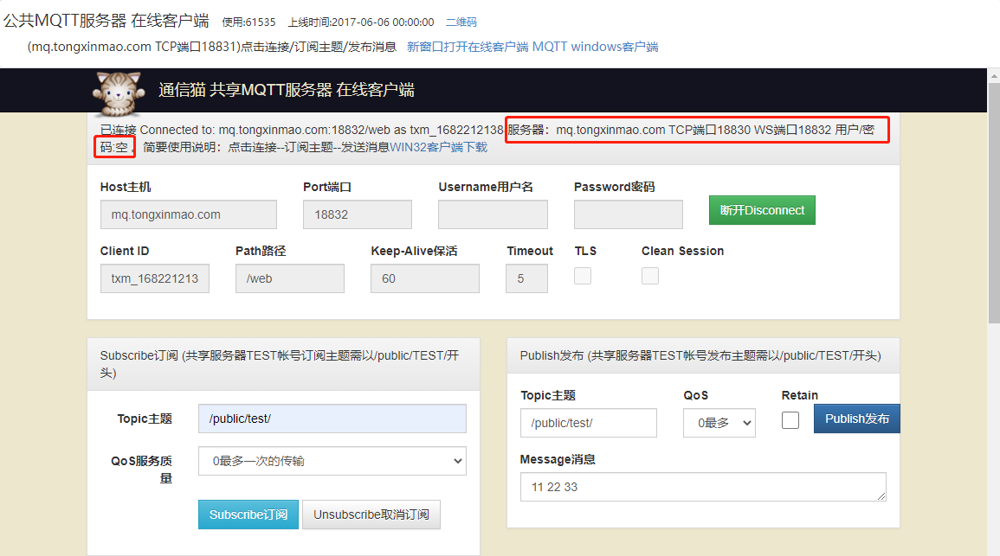

## 基本概述

本文档旨在指导用户如何基于我司的QuecPython开发板进行DTU功能开发。

## 模块型号

本项目可在所有支持QuecPython的模块上进行运行，此文档的实验案例基于EC600N模组（如下图）运行。

> 注意事项：
>
> 1. 在SIM卡座中插入SIM卡。
> 2. 接入天线。
> 3. 使用USB数据线连接开发板至电脑USB接口。
> 4. 连接串口至电脑。

## 下载脚本

### 获取实验代码

本实验项目代码仓库：`https://github.com/QuecPython/solution-DTU`。

> 注意：本实验基于`v2.0`分支代码。

### 编写配置文件

DTU配置文件路径：`solution-DTU/code/dtu_config.json`。

本实验案例，基于mqtt私有云做如下配置：

1. 系统配置

   

2. mqtt私有云配置

   

### 下载代码到设备

接上数据线，连接至电脑，短按开发板上的**PWRKEY**按键启动设备，并在QPYcom上选择MI05接口连接。

#### 创建下载项目

切换到下载选项卡，点击创建项目，并输入任意项目名称。

> 此处我们创建名为`dtu`的项目。

#### 选择导入文件

右击`usr`目录，在弹出的选择框中点击**一键导入**，继而选择我们DTU代码仓库中的**code**文件夹 —— 即将code中的所有代码一键导入至模组。如下图所示：

#### 导入脚本

点击右下角`下载脚本`按钮，即可开始导入脚本。

### 运行DTU

切换至"文件"选项卡，在右边选中"dtu.py"，点击运行按钮，即可开始dtu调试运行，如果需要上电自动运行，只需要将"dtu.py"更名为"main.py"即可实现上电自动运行。

DTU运行成功，在QPYcom的"交互"窗口中，可观察到打印如下。

> 解释：可以看到，打印出的日志信息中，`mqtt start`和`get_status(): True`表面设备启动成功。

## 私有云MQTT案例演示

本案例演示采用`http://www.tongxinmao.com/App/Detail/id/126`公共mqtt私有云。

### 向云端发送消息

> 本实验案例实验串口调试工具为`QCOM`。下载连接：`https://python.quectel.com/download`。

1. 打开串口调试工具，选择并打开串口。

2. 在串口调试工具中按指定格式传入`<topic_id>,<msg_length>,<msg>`值, 需要发送的数据，并点击"Send Command"。

   

3. DTU收到数据，并发送至云端

   

4. 云端接收到的消息

   

### 云端向设备发送信息

在mqtt公共服务器web页面中订阅之前配置的主题。通过`Publish发布`按钮，发送消息。

串口收到透传消息。

