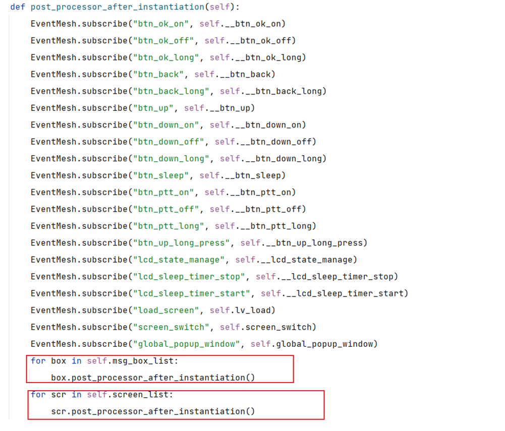

# Quecpython Poc应用指导文档


`POC获取地址`: [源代码](https://github.com/QuecPython/solution-POC)

## 概述

此文档用于描述POC软件设计框架,包含核心组件功能描述，系统初始化流程的介绍等，方便更快理解本框架。

## 系统框架

### 硬件系统框架

系统框架如下：

1. Module侧支持SIM，GPIO，UART, codec, keypad, Lcd, ADC, LED等功能。

2. Module通过keypad和uart来出发事件通知


### 软件系统框架

软件系统框架如下:

 

1. APP层实现处理POC核心业务，解析上下行数据

2. EventMesh为事件处理器，通过支持事件订阅发布的机制来完成功能流转

3. Module侧接收外部事件或数据通过EventMesh驱动来处理执行


## 关键组件

组件对象关系描述:

下图用于描绘项目软件代码中各组件对象之间的依赖关系与继承关系，图中以POC作为总对象，将POC所依赖的功能对象联系到一起，核心的对象拥有哪些方法，依赖哪些功能类，具体如下图所示


### EventMesh

**功能描述：**

EventMesh是一种动态基础中间件, 在事件驱动架构语境中,事件指的是系统中的变更、操作或观察,他们会生成通知, 然后响应到各个对事件做出响应的处理器函数中

 

服务和驱动通过EventMesh进行数据通信, 所有的Event都是从EventStore里面过来的, 服务提供方将接口和topic注册到EventMesh中，服务调用方通过topic从EventMesh中调用对应的接口，通过以上订阅和发布事件（topic）的行为来代替直接调用函数，不同业务之间的消息流转都通过EventMesh来完成

以下组件部分代码参考 [POC方案]()

订阅事件：

```python
from usr import EventMesh

def test(event, msg):
	return msg

# 订阅事件
EventMesh.subscribe("test_event", test)
```

发布事件：

```python
# 发布事件
EventMesh.publish("test_event", "TEST_OK")
```


### BtnDevice

**功能描述：**

该功能主要用于按键功能处理。

**实现原理：**

1. 监听按键消息,
2. 判断事件发布对应的事件消息


### PocUi

**功能描述**：

该功能主要主要添加UI管理所有的界面, 添加界面, 跳转界面, 通知界面事件等

**实现原理**：

1. 初始化类方法时会去订阅, 获取电量事件用户可以通过发布事件来获取

2. btn_ok_on ok键按下的消息

3. btn_ok_off ok键松开的消息

4. btn_ok_long ok键长按的消息

5. btn_back back键长按的消息

6. btn_back_long back键长按的消息

7. btn_up 上键按下触发

8. btn_down_on 下键按下触发

9. btn_down_off 下键松开触发

10. btn_down_long 下键长按触发

11. btn_sleep 睡眠按键触发

12 btn_ptt_on ptt按键按下触发

13 btn_ptt_off ptt按键松开触发

14 btn_up_long_press up键长按触发

15. lcd_state_manage lcd休眠状态管理事件
16. 16 lcd_sleep_timer_stop 停止lcd休眠定时器

17 lcd_sleep_timer_start 开启lcd休眠定时器

18 load_screen 加载页面

19 screen_switch 切换页面

20 global_popup_window 全局弹框



添加页面,然后初始化页面


界面跳转逻辑


### BatteryManager

**功能描述**：

该功能主要用于电池电量管理的，获取当前当吃电量的方法，通过该方法与系统VBAT进行交互。

**实现原理**：

初始化类方法时会去订阅, 获取电量事件用户可以通过发布事件来获取


### ConfigStoreManager

**功能描述**：

该功能主要用于处理设备参数持久化保存，提供参数读取于参数更新的方法，通过该方法与模组文件系统交互。

**实现原理**：

1. 初始化类方法时会判断配置文件是否存在，不存在则创建一个JSON文件，文件创建成功后将默认参数写入文件中。

2. 若文件已存在，则会比对默认参数有无新增，若有新增同步更新到配置文件

3. 该类方法对外通过EventMesh注册读取和写入两个事件


### MediaManager

**功能描述**：

该功能主要用于媒体管理器。主要负责PA和音量的控制

**实现原理**：

screen_vol_add 音量加

screen_vol_set 音量设置

screen_vol_reduce 音量减

get_mic_det_state 获取PA的状态

audio_tone 播放tone音 


### NetManager

**功能描述**：

该功能用于管理网络执事检测网络状态, 恢复网络

**实现原理**：

判断sim卡是否存在,存在则等待网络连接,网络连接成功或失败等消息再发布推送消息network_state推送给客户处理 


### LowPowerManager

**功能描述：**

该功能主要为对低功耗处理

**实现原理：**

1. 当屏幕息屏时候我们需要进入低功耗, lvgl低功耗加模组低功耗模式。

2. 当屏幕亮屏的时候我们需要解除低功耗


### DeviceInfoManager

**功能描述**：

该功能用于获取设备的一些基础信息，例如设备IMEI，SIM card的ICCID等。

**实现原理**：

提供对外事件

screen_get_ope获取运营商

screen_get_sig 获取信号

about_get_imei 获取imei

screen_get_time 获取时间

about_get_phonenum 获取手机号

screen_get_battery 获取电池电量

get_poc_fw_version 获取固件版本号

get_poc_version 获取poc版本号

get_standby_time 获取存活时间

sim_slot_get 获取对应卡槽上面是否存在sim卡

sim_slot_switch sim卡切换

ptt_battery_state ptt按下需要停止电量推送直至ptt松开后再推送


### LedManager

**功能描述**：

该功能用于控制LED灯操作, 用于控制灯的启停和变化

**实现原理**：

订阅start_led_timer, 启动led灯定时器

订阅stop_led_timer, 停止led灯定时器

订阅reset_led_timer, 重置led灯定时器

订阅ptt_led, ptt按下led灯变换

订阅ptt_receive_led, 接收到别人呼叫led等灯变换


开启定时器定时调度


### PocManager

功能描述：

该功能用于控制poc对讲和获取控制poc信息等状态

实现原理：

对象实例化后会订阅下面一些操作事件

screen_speak  触发ptt对讲操作

screen_speak_end 触发关闭对讲操作

main_get_group_cur 获取当前用户所在组

about_get_user 获取当前用户

group_get_list 获取所有组群信息

group_enterbtn_click 进入群组

member_speakbtn_click 群员界面拉临时群组

check_call_member_status 检查呼叫状态主要判断ptt的状态

exit_call_member 退出成员呼叫状态

member_get_list 获取成员列表

group_count 获取群组总数

member_count 获取成员总数

media-tts-play 媒体播放tts信息

set_poc_low_power_mode 设置低功耗模式

get_poc_low_power_mode 获取低功耗模式

set_lcd_sleep_mode 设置lcd息屏时间模式

get_lcd_sleep_mode 获取LCD息屏时间模式

get_single_call_quit_time 获取单呼退出时间

set_single_call_quit_time 设置单呼退出时间

request_lbs_info 获取lbs位置信息

request_weather_info 获取当前位置信息

std_write_iccid 写号写入iccid

get_poc_platform 获取所在平台

set_poc_platform 设置平台

get_Version_No 设置版本号

set_poc_ptt_hint_tone 设置是否关闭ptt tone音

get_poc_ptt_hint_tone 获取ptt tone音是否被关闭

set_poc_keypad_tone 设置keypad 按键音是否关闭

get_poc_keypad_tone 获取keypad按键音是否关闭

get_sim_mode 获取sim卡模式

set_sim_mode 设置sim卡模式

get_login_state 获取登录状态

get_speaker_state 获取播放状态

get_gps_img_state 获取gps图标是否显示

about_get_rocker_arm 获取是否进入摇臂模式

get_poc_cloud_state 获取poc的连接状态

reset_login_status_cb 重新登录平台

close_speaker 关闭对讲摇臂功能下有作用

publish_net_show 获取当前的net模式4G/5G 

set_net_show 设置当前的网络模式4G/5G


## 系统初始化流程


### 说明


## 业务流程


如上图中我们首先创建了一个功能类方法，这个类方法继承了一个公共基类Abstract，这个基类是用来约束开发者在功能实现上保持一致性；然后我们在类方法中重新实现了基类的post_processor_after_instantiation()方法，为什么要实现该方法呢，因为我们新增的这个功能在实现完之后需要加入到APP中去注册启动，APP类会将每一个继承于Abstract类的功能类下初始化方法调用执行，也就是post_processor_after_instantiation()方法，所以我们需要在该方法中将需要对外暴露的方法订阅到EventMesh中去。