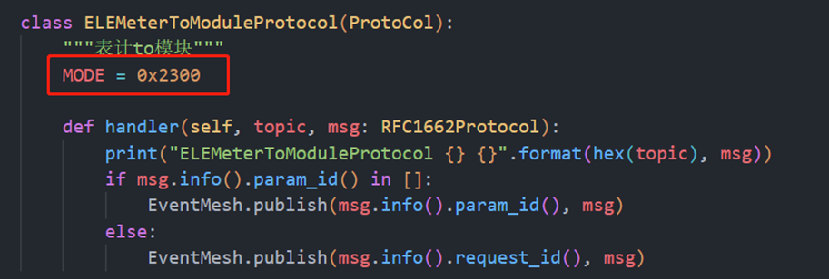
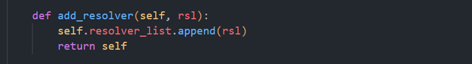
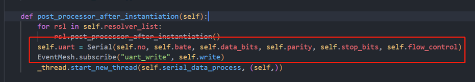

QuecPython电表软件使用指导
================

## 概述

QuecPython电表方案使用EventMesh框架开发，此文档主要描述电表软件设计框架,包含核心组件功能描述，系统初始化流程的介绍等，方便更快理解本框架，包括相应配置项该如何配置以及如何基于该demo进行二次开发等。

**注意：**此方案只包含基础通信框架以及协议解析功能，具体业务功能需要自行补充

> 完整代码和文档见GitHub仓库
>
> [电表方案GitHUb仓库](https://github.com/QuecPython/solution-electricMeter)

系统框架
--------

### 硬件系统框架

系统框架如下：

- Module侧支持SIM，GPIO，UART等功能。
- Module通过UART与MCU通信完成数据交互。


### 软件系统框架

软件系统框架如下:

- APP层实现处理电表核心业务，解析上下行数据
- EventMesh为事件处理器，通过支持事件订阅发布的机制来完成功能流转
- Module侧接收外部事件或数据通过EventMesh驱动来处理执行


### 功能组件

组件对象关系描述:

下图用于描绘项目软件代码中各组件对象之间的依赖关系与继承关系，图中以电表作为总对象，将电表所依赖的功能对象联系到一起，核心的对象拥有哪些方法，依赖哪些功能类，具体如下图所示：


## 系统组件

### EventMesh

服务和驱动通过EventMesh进行数据通信, 所有的Event都是从EventStore里面过来的, 服务提供方将接口和topic注册到EventMesh中，服务调用方通过topic从EventMesh中调用对应的接口，通过以上订阅和发布事件（topic）的行为来代替直接调用函数，不同业务之间的消息流转都通过EventMesh来完成

以下组件部分代码参考 [电表方案](https://github.com/QuecPython/solution-electricMeter)

订阅事件：

```python
from usr import EventMesh

def test(event, msg):
	return msg

# 订阅事件
EventMesh.subscribe("test_event", test)
```

发布事件：

```python
# 发布事件
EventMesh.publish("test_event", "TEST_OK")
```

### RFC1662ProtocolResolver

- 功能描述

  RFC1662协议数据的解析器，用于解析处理业务中传输的RFC1662协议数据，对该类数据进行解包组包的功能。

- 实现原理

  - 实例化创建RFC1662协议解析器后将协议指令事件添加到List数组中

    

    

  - 该类函数在初始化的时候将添加进来的协议指令事件MODE与对应的handler处理函数注册到EventMesh组件中去，如设备接收到MODE指令然后通过EventMesh去发布执行。

    

    MODE指令函数示例：

    

  -  收到表计发送给模组的数据后检查匹配协议帧格式

    RFC1662协议帧固定格式：

    

    判断协议帧是否满足格式：

    

  - 判断数据是否能解析，返回解析状态和解析到的截止下标

    

  - 数据解析是由RFC1662Protocol类方法中的build方法执行，该方法按照协议帧格式使用struct依次读取数据，并将解析出的数据分别保存在RFC1662Protocol类属性中，解析完成后将RFC1662Protocol类作为对象返回

    图一：

    

    图二：

    

    rfs对象作为build函数的结果返回，数据解析完成后rfs对象中包含所有数据信息，在通过EventMesh去发布该条指令，找到对应的处理函数执行。

    EventMesh.publish(rfs.protocol(), rfs) = EventMesh.publish(指令MODE,
    rfs),该指令在类函数在初始化的时候已经被注册，详见步骤2中描述。

### ConfigStoreManager

配置文件管理模块主要用于处理设备参数持久化保存，提供参数读取于参数更新的方法，通过该方法与模组文件系统交互

- 功能描述

配置文件一般读、写两个接口,在业务的各个部分中都有读取和写入的需求,所以为了让业务模块可以调用到这两个接口，在业务模块初始化之前就需要初始化配置文件管理模块 

- 实现原理

  - 初始化类方法时会判断配置文件是否存在，不存在则创建一个JSON文件，文件创建成功后将默认参数写入文件中。

  - 若文件已存在，则会比对默认参数有无新增，若有新增同步更新到配置文件

  - 该类方法对外通过EventMesh注册读取和写入两个事件

     

### NetStateManager

- 功能描述

  该功能主要用于模组网络初始化以及网络状态管理，设备默认为自动拨号注网，如需调整为手动拨号或者需要使用设置的APN进行拨号请参考wiki文档进行修改，下面做简要描述。

- 实现原理

  - 该类方法初始化时会等待设备注网完成，且注册网络变化回调函数，通过checkNetAPI返回值判断设备找网状态，找网成功后会通过事件发布的方式启动TCP连接，若找网失败则会尝试重新找网
  - checkNetAPI可在wiki中心查找到详细描述
    

  - 切换到手动拨号

    

  - 配置用户APN

    

  - 网络状态异常处理

    当设备网络状态发生变化时我们可以通过注册回调的方式来通知到应用层，如下所示：

    

    

    网络状态出现异常重连的示例：

    网络异常后会先尝试使用Cfun切换来重新找网，若cfun失败可考虑重启模组，若需要做次数限制则通过文件记录一个值来控制

    

### TcpModeManager

- 功能描述

  该功能用于管理设备支持的两种TCP连接模式，客户端和服务端，根据对应的模式在注网成功后启动TCP连接。

- 实现原理

  - 该类方法对外提供一个TCP启动的事件，在设备找网成功后通过发布该事件来启动TCP连接

    

  - TCP start方法会根据配置文件中的模式来选择启动客户端还是服务端

    

### MainUartManager

- 功能描述

  该功能主要为对设备串口的初始化，串口消息数据的收发处理。

- 实现原理

  - 因模组和表计通信是通过串口使用RFC1662协议通信，故需要给串口对象装载协议解析器用于数据解析

    

    

  - 类函数初始化时会创建一个串口对象，通过该对象可以对串口进行读写操作，且对外提供往该串口写数据的功能

    

  - 启动一个串口数据监听的任务，当串口收到表计发来的数据后会匹配解析器来判断该条数据是否能被解析，如果能解析则通过解析器去将数据返回，若该条数据有回复则会在将结果打包好返回给表计

    

    

### DeviceInfoManager

- 功能描述

  该功能用于获取设备的一些基础信息，例如设备IMEI，SIM card的ICCID等。

- 实现原理

  - 类函数初始化时会将获取设备信息的函数注册成事件对外提供，可直接通过事件发布的方式使用

    

  - 类似查询iccid

    

### FtpOtaManager

- 功能描述

  该功能用于对APP应用程序代码通过FTP远程升级更新

- 实现原理

  - FTP远程升级需要提供服务端地址信息以及user和password

  - 类方法初始化时对外提供下载入口，通过事件发布的方式调用该方法

  - 

  - 与FTP服务端建立连接，连接建立成功后登陆到FTP服务器，获取到升级包路径

    

  - 开始下载升级包到模组，下载完成后需要将升级包进行解压，完成解压后设置升级标志，设备重启后完成升级。

    

系统初始化流程
--------------

- 系统初始化流程说明：

  - 创建RFC1662解析器对象，将需要使用到该解析器的类方法都注册到解析器对象中，此处的类方法指的是我们定义的指令功能实现。

  - 创建串口对象，用于和表计通信，通过需要将解析器注册到串口对象中，因为串口会一直监听表计发送过来的数据，当有数据时使用解析器对象进行解析返回结果。

  - 所有的类方法都会约定必须有初始化前后或实例化前后要完成的事件注册或功能处理，所以我们通过一个APP类将所有的类方法在装载时和start时会将每个类方法的初始化前后动作执行完。


业务流程
--------


功能示例
--------

本章节介绍如何基于项目代码进行二次开发，例如新增功能，修改代码功能逻辑等，可以参照下面的示例帮助快速上手，熟悉代码流程。

在准备调整代码前需要先了解当前代码中功能是如何流转运行的，下面会做步骤描述：

- 首先整个项目中实现的功能函数都采取的是使用EventMesg来进行事件驱动，通俗的讲就是我们现在实现了一个功能功函数，然后将这个函数定义一个事件名称，例如查询设备IMEI，我们将事件名称与对应的事件函数以键值对的方式做映射(”Get\_Imei”:
  Function),这种创建映射关系的动作理解成订阅事件。而EventMesh会保存这些订阅事件，当我们需要查询设备IMEI的时候只需要去发布Get\_Imei这个事件即可拿到返回结果。这样我们每个功能都可以独立开发，独立调试，达到解耦合的效果。

- 新增一个功能类函数，我们先实现该功能函数，如图


- 如上图中我们首先创建了一个功能类方法，这个类方法继承了一个公共基类Abstract，这个基类是用来约束开发者在功能实现上保持一致性；然后我们在类方法中重新实现了基类的post\_processor\_after\_instantiation()方法，为什么要实现该方法呢，因为我们新增的这个功能在实现完之后需要加入到APP中去注册启动，APP类会将每一个继承于Abstract类的功能类下初始化方法调用执行，也就是post\_processor\_after\_instantiation()方法，所以我们需要在该方法中将需要对外暴露的方法订阅到EventMesh中去。

- Abstract基类

  

- APP类

  

- 将新增的类方法加入到main.py入口函数中

  - 导入新增的类方法

    

  - 将类方法添加到App类中

    

  - 使用新增的类方法

    通过事件发布的方式找到已经订阅好的事件，执行对应的事件函数

    