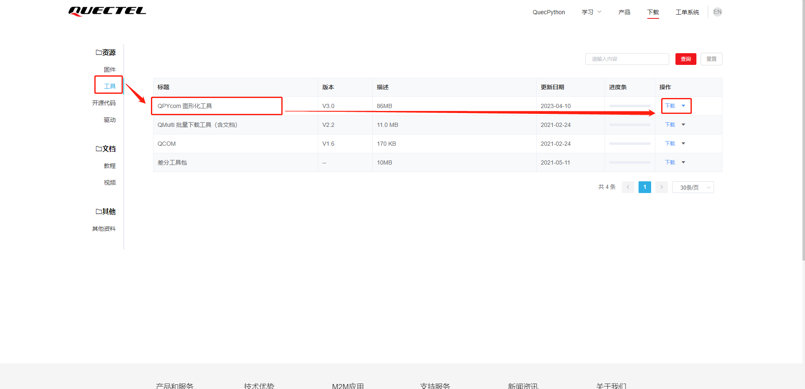

## 引言

当客户购买我们的QuecPython, EC600N, EC200U, EC800E开发板时, 通过本项目可以更直观在PC端查看设备上报数据。

项目会定期维护更新, 本说明仅供参考, 不排除后期有功能改动不符合本说明内容描述。

## 运行环境及外设介绍

### 模块型号

本项目可在所有支持QuecPython的模块上进行运行, 但根据不同模块的支持功能所有不同, 需要做相应的功能调整, 如

- EC600N, EC800E不支持内置GNSS定位, 需外挂GNSS模块才可使用GNSS定位功能。
- EC200U支持内置GNSS定位功能, 可无需外挂GNSS模块直接使用GNSS定位功能。
- 不同传感器需根据实际设备支持今天选择支持。

此文档中描述的实验基于EC600N运行。模块外形展示如下图:

### 外设型号

- 外挂GNSS: LC86L, L76K
- 温湿度传感器: HDC2080

### 固件版本

请使用 EC600N V0003 及以上版本进行调试开发。

固件下载地址: [https://python.quectel.com/download](https://python.quectel.com/download)

## 支持平台简介

本项目支持多平台数据上报, 目前支持ThingsBoard(QuecPython私有平台), 阿里云等不同平台的数据交互。

### ThingsBoard平台操作说明

平台地址: [http://106.15.58.32:8080/login](http://106.15.58.32:8080/login)

#### 1. 用户账户申请

如需对接该平台, 需向本司提交申请, 审核通过后会下发使用账户进行功能对接。

#### 2. 添加设备

#### 3. 获取认证信息

#### 4. 设备功能启动后查看上报数据

### 阿里云物联网平台操作说明

#### 1. 注册账户与产品设备创建

阿里云物联网平台功能介绍与功能描述(产品设备创建)详见[阿里云文档中心](https://help.aliyun.com/document_detail/131611.html?spm=a2c4g.130816.0.0.7e193e06DaU4Mu)

#### 2. 获取设备认证信息

创建好产品设备后, 根据选择的认证模式, 一机一密或一型一密, 在`settings_cloud.py`中填写对应的配置参数。

- 一机一密需填写`product_key`, `device_name`, `device_secret`
- 一型一密需填写`product_key`, `product_secret`, `device_name`

#### 3. 运行项目后查看上报数据

## 项目运行说明

### 1. 项目代码下载

本项目已开源至GitHub, 直接使用Git下载到本地即可进行二次开发, 开源项目中有详细的软件功能架构说明与功能模块使用说明。

GitHub 开源地址: [https://github.com/QuecPython/solution-tracker](https://github.com/QuecPython/solution-tracker)

### 2. 调整项目配置文件

- `settings_cloud.py` 用于配置连接ThingsBoard或阿里云的配置参数
- `settings_loc.py` 用于配置定位模块的配置参数
- `settings_user.py` 用于配置软件业务相关配置参数

配置参数具体含义见[tracker公版方案功能接口](https://github.com/QuecPython/solution-tracker/blob/master/docs/tracker%E5%85%AC%E7%89%88%E6%96%B9%E6%A1%88%E5%8A%9F%E8%83%BD%E6%8E%A5%E5%8F%A3.md)

### 3. 使用它QPYCom工具进行软件烧录

- 测试可直接选中`tracker_ali.py`或`tracker_tb.py`, 点击运行, 即可启动项目, 可在交互中进行查看设备运行状态与日志。

- 还可以烧入`main.py`脚本, 烧入完成后, 重启设备, 项目即可自动运行, 以后每次设备上电即可自动运行。

> QPYCom软件下载地址: [https://python.quectel.com/download](https://python.quectel.com/download)

## 常见问题处理

1. 设备注册时返回注册失败, 产品信息查询不到时请检查配置的产品ID以及产品密钥是否匹配。
2. 数据采集为空或者失败应检查对应的传感器参数是否配置正确, 传感器的型号不同导致的配置参数可能会有差异。
3. MQTT在尝试与云端进行连接时出现`MQTTEXException: 4`时请检查连接参数是否正确配置, MQTT服务地址是否正确。 如遇到域名解析失败时可尝试使用`usocket.getaddrinfo()`方法先尝试解析再进行连接。
4. 查看代码中遇到存在疑惑的API时可查看我们的[QuecPython API 参考手册](https://python.quectel.com/doc/API_reference/zh/index.html), 里面有详细的方法介绍。
