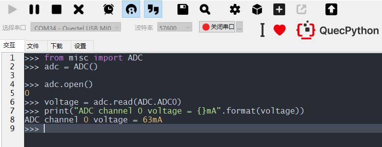

# BSP-ADC应用开发

## 什么是ADC

ADC(Analog to Digital Converter)即模拟数字转换器即[A/D转换器](https://baike.baidu.com/item/A%2FD转换器/4883848?fromModule=lemma_inlink)，对于嵌入式应用开发来说，可以简单理解为：在单片机或我们的模组上有一个引脚可以读取电路中的电压值。一般软件开发人员主要关注如何读出ADC引脚的电压值，并将电压值做一些运算从而间接得出外部传感器当前所测量的环境值，如温度值、亮度值等。

## 怎么使用ADC

### 硬件设计

对于嵌入式产品开发来说，可靠的硬件电路是软件开发的前提条件。

ADC相关电路设计需要参考每个型号模组的硬件设计手册和参考设计手册，可以在主页的[下载区](/download/)检索下载，但具体功能引脚仍需以QuecPython的[ADC功能API](/../../API_reference/zh/QuecPython类库/machine.ADC.html)介绍的引脚号为准。关于ADC功能常见的应用电路也可以通过搜素引擎了解更多信息。简单应用电路也可参考QuecPython的学习开发板，开发板可以通过天猫旗舰店、京东旗舰店等移远通信官方销售渠道获取，开发板的硬件设计同样是参考的上述硬件文档，开发板的原理图也可以在主页的[下载区](/download/)检索下载。

### 软件应用

使用QuecPython开发的模组，想要读取ADC引脚的电压需要先完成QuecPython开发环境的搭建，再参考[ADC功能的API介绍文档](/../../API_reference/zh/QuecPython类库/machine.ADC.html)进行如下命令行测试即可打印出ADC通道0引脚当前的电压值，单位为毫安(mA)。

```python
from misc import ADC
adc = ADC()
adc.open()
voltage = adc.read(ADC.ADC0) 
print("ADC channel 0 voltage = {}mA".format(voltage))
```

## ADC功能测试

使用QPYcom工具和模组进行交互，下面实例是基于ADC0。



## ADC功能应用实例

[读取环境光照强度](../外设应用开发/外设-亮度传感器应用开发.html)

[读取环境温度值](../外设应用开发/外设-温度传感器应用开发.html)

