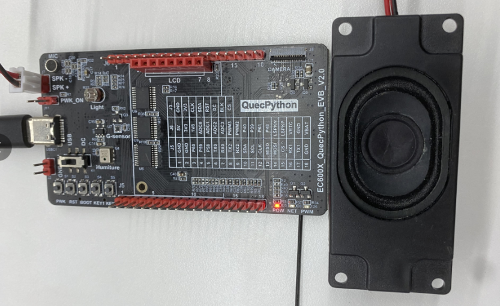
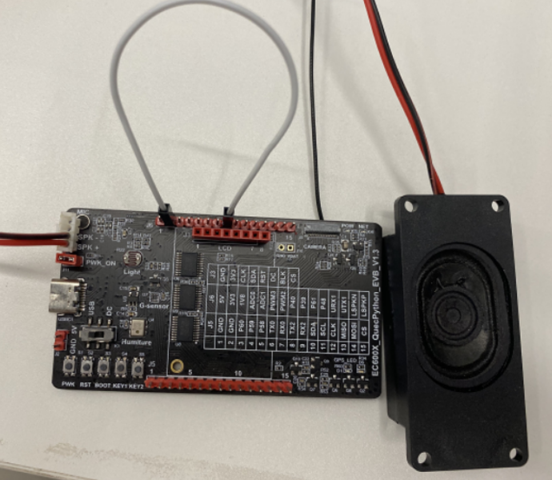
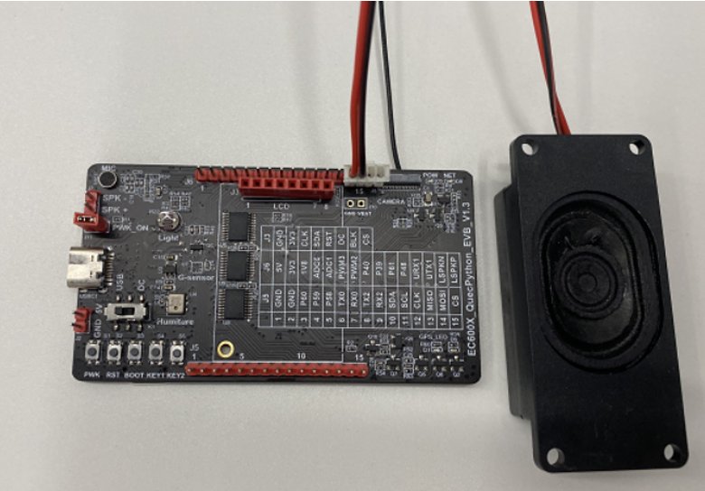
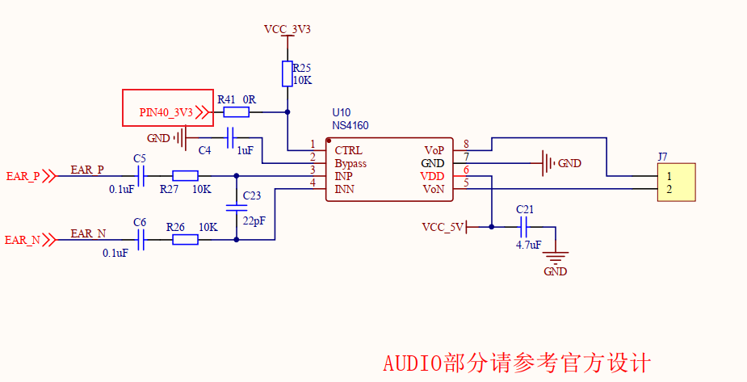
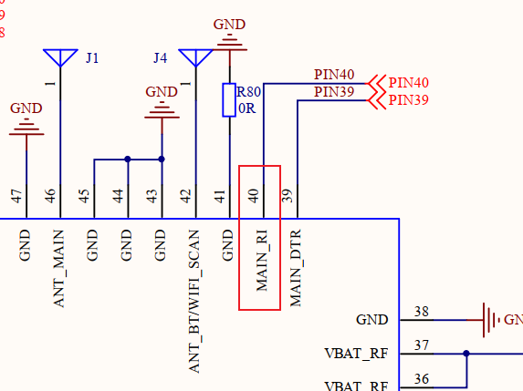
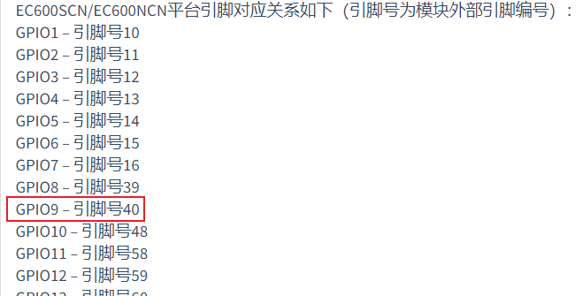

# BSP-Audio应用开发

## 硬件连接

| 开发板型号                                               | 开发板对应PIN脚                | 开发板上对应的连接位置 | 对应的音频通道 |
| -------------------------------------------------------- | ------------------------------ | ---------------------- | -------------- |
| EC600N_QuecPython_EVB_V2.0<br>EC600N_QuecPython_EVB_V3.1 | PIN21、PIN22                   | J7                     | 通道0          |
| EC600U_QuecPython_EVB_V2.0                               | PIN21、PIN22<br>PIN109、PIN110 | J7<br>J6的PIN14、PIN15 | 通道0<br>通道2 |

针对EC600N_QuecPython_EVB_2.0和EC600N_QuecPython_EVB_3.1 通道0的硬件连接图如下：

喇叭直接开发板的SPK-、SPK+



针对EC600U_QuecPython_EVB_2.0 通道0的硬件连接图如下：

喇叭直接开发板的SPK-、SPK+，另外短接PIN40引脚



针对EC600U_QuecPython_EVB_2.0 通道2的硬件连接图如下：

喇叭直接开发板的J6的PIN14、PIN15引脚



## GPIO查找

Q：拉高GPIO，PIN引脚如何查找对应的GPIO？

A：请认真查看下面步骤。

注：不同型号对应PIN脚可能不同，对应的GPIO也不同，以原理图和wiki为准，以下以EC600N为例步骤查询：

①查看原理图，找到AUDIO模块的CTRL对应的引脚。





②在原理图找到PIN40，然后移步到wiki上面查找对应的GPIO口即可。




## 软件实现

### Audio

下载验证：

1. 根据测试场景,调整下面代码的注释。

   ```python
   import utime as time
   import audio
   from machine import Pin
   import utime
   
   #以EC600NCNLF为例：
   def example_audio_mp3():    
       aud = audio.Audio(0)  # 配置通道0
       # aud = audio.Audio(2)  # 配置通道2
       aud.setVolume(2) #设置音量大小
       # 使能外接喇叭播放
       gpio=Pin(Pin.GPIO9, Pin.OUT, Pin.PULL_PD, 1)  #GPIO配置拉高
       print(gpio.read()) #查看引脚电平状态
       # U: 表示用户目录, 将文件下载到 /usr 文件下
       # 以下格式选一种来演示  
       aud.play(2, 1, "U:/audio_audio_haixiu.mp3")  #mp3格式
       #aud.play(2, 1, "U:/audio_audio_connect_ok.amr") #amr格式
       # aud.play(2, 1, "U:/audio_audio_haixiu.wav")  #wav格式
       pass
   
   if __name__ == "__main__":
       example_audio_mp3()
   
   ```
   
2. 将随包的 audio_audio_haixiu.mp3 和修改好的 example_audio_file.py 文件下载到开发板中。

3. 运行 example_audio_file.py 脚本即可。


注意：

以EC600N和EC600U为例验证（注意各个开发板引脚不同）

- 对于EC600N的3.1V版本的开发板，配置通道0，需要GPIO拉高
- 对于EC600N的2.0V版本的开发板，配置通道0，需要GPIO拉高
- 对于EC600U的通道0的话,代码注释掉配置通道2，短接PIN40，需要GPIO拉高
- 对于EC600U的通道2的话,代码注释掉配置通道0，接引脚J6的14、15引脚，需要GPIO拉高


### TTS

下载验证：

1.根据测试场景,调整下面代码的注释。

参数及详情请看wiki链接：[QuecPython 类库 (quectel.com)](https://python.quectel.com/wiki/#/zh-cn/api/QuecPythonClasslib?id=tts)

以下以EC600NCNLF_QuecPython_EVB_3.1 版本测试

```python
# -*- coding: UTF-8 -*-
#注意，python文件开头需要加上“-- coding: UTF-8 --”
import audio
import utime
from machine import Pin
# tts = audio.TTS(0)
tts = audio.TTS(2)
#参数具体看wiki
#tts播放中文示例：
gpio=Pin(Pin.GPIO9, Pin.OUT, Pin.PULL_PD, 1) #GPIO配置拉高
print(gpio.read())
tts.play(1, 1, 2, '移联万物，志存高远')  

#以下是各种场景使用，用到可以去掉注释，用不到可以忽略
# 1.
#TTS引擎自动决定是以号码形式播放还是以数值的形式播放
#TTS引擎以数值形式播放
# tts.play(1,1,2, '[n2]12345')
# utime.sleep(2)
# #TTS引擎以号码形式播放
# tts.play(1,1,2, '[n1]12345')
# utime.sleep(2)

# 2.
#TTS引擎以默认语速5播放语音
#TTS引擎以默认语速的0.5倍速播放语音
# tts.play(1,1,2, '[s0]12345')
# utime.sleep(2)
# #TTS引擎以默认语速的2倍语速播放语音
# tts.play(1,1,2, '[s10]12345')
# utime.sleep(3)

# 3.
# 语调设置：
#TTS引擎以默认语调基频减64Hz播放语音
# tts.play(1,1,2, '[t0]12345')
# utime.sleep(2)
# #TTS引擎以默认语调基频加128Hz播放语音
# tts.play(1,1,2, '[t10]12345')

# 4.
# 汉字指定拼音：
#汉字：声调用后接一位数字 1 ~ 5 分别表示阴平、阳平、上声、去声和轻声 5 个声调。
# tts.play(1,1,2, '乐[=le4]')
# utime.sleep(2)
# tts.play(1,1,2, '乐[=yue4]')
# utime.sleep(2)

# 5.
#变声，默认女声
# tts.play(1, 1, 2, '[m51]移远通信，移联万物')  #男生
# utime.sleep(3)
# tts.play(1, 1, 2, '[m53]移远通信，客户第一')  #女声
# utime.sleep(3)
# tts.play(1, 1, 2, '[m54]移远通信，以人为本')  #童声
# utime.sleep(3)


```

2.将随包的example_tts_file.py 文件下载到开发板中。

3.运行example_tts_file.py 脚本即可。


### Record

下载验证：

1.根据测试场景,调整下面代码的注释。

参数及详情请看wiki链接：[QuecPython 类库 (quectel.com)](https://python.quectel.com/wiki/#/zh-cn/api/QuecPythonClasslib?id=record)

以下以EC600NCNLF_QuecPython_EVB_3.1 版本测试

```python
import utime
import audio
from machine import Pin


flag = 1
'''
外接喇叭播放录音文件，EC600N参数通道选择0，EC600U参数通道选择0或者2
'''
aud = audio.Audio(0)
tts = audio.TTS(0)

aud.setVolume(11)
#使能把电平拉高，GPIO的选择根据各个模块的audio引脚不同在wiki上选择不同的GPIO
audio_EN = Pin(Pin.GPIO9, Pin.OUT, Pin.PULL_PD, 1)#GPIO配置拉高

def record_callback(args):
    global flag
    print('file_name:{}'.format(args[0]))
    print('file_size:{}'.format(args[1]))
    print('record_sta:{}'.format(args[2]))

    record_sta = args[2]
    if record_sta == 3:
        print('The recording is over, play it')
        tts.play(1, 0, 2, '录音结束,准备播放录音文件')
        aud.play(1, 0, record.getFilePath(path))
        flag = 0
    elif record_sta == -1:
        print('The recording failure.')
        tts.play(1, 0, 2, '录音失败')
        flag = 0

record = audio.Record()
record.start('U:/recordfile.wav',5)
record.end_callback(record_callback)
path='U:/recordfile.wav'

while 1:
    utime.sleep(1)
    if flag:
        pass
    else:
        break

```

2.将随包的example_record_file.py 文件下载到开发板中。

3.运行example_record_file.py 脚本即可。


