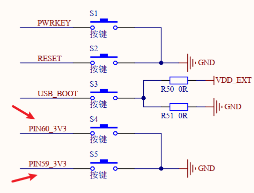
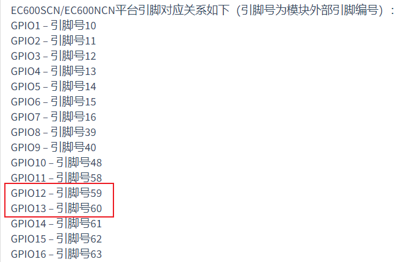
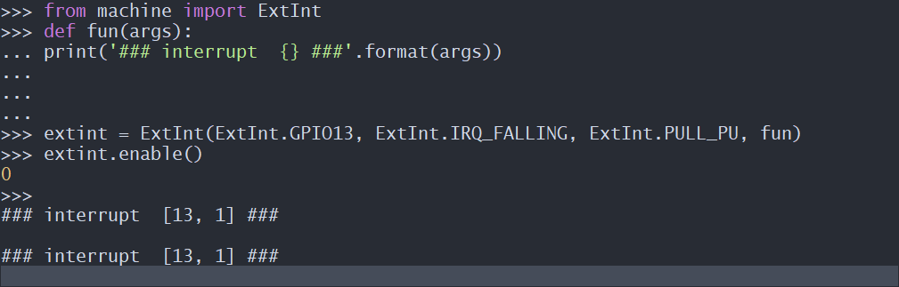
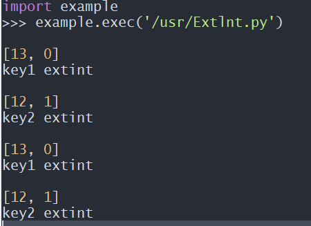

# BSP-ExtInt引脚中断应用开发

## Extlnt概述	

​		GPIO介绍过后，接着介绍外部中断，普通GPIO可以随时查询Pin引脚的电平状态，但却不能及时发现电平的变化，而外部中断就能完美的解决这个问题。若设定了上升沿触发外部中断时，当电平从低电平上升到高电平瞬间，就会触发外部中断，从而在电平变化时立马执行回调函数。

### 功能描述

用于配置I/O引脚在发生外部事件时中断

### API介绍

[QuecPython 类库 (quectel.com)](https://python.quectel.com/wiki/#/zh-cn/api/QuecPythonClasslib?id=extint)

### 快速开发

#### PIN对应关系

示列：

①查看原理图，找出按键PIN脚。(可咨询FAE获取或者Q群文件获取)



②查看wiki里的machine-硬件功能模块下的Pin模块，可查找到PIN脚对应的GPIO。



#### 命令行操作

使用QPYcom工具和模组进行交互，示例如下：

以EC600NCNLF为例，详情Extlnt接口链接：[QuecPython 类库 (quectel.com)](https://python.quectel.com/wiki/#/zh-cn/api/QuecPythonClasslib?id=extint)




#### 代码操作

```python
from machine import ExtInt 
import utime    
def fun1(args):  
	print(args)  
	print("key1 extint")   
def fun2(args):  
	print(args)  
	print("key2 extint")   
extint1 = ExtInt(ExtInt.GPIO13, ExtInt.IRQ_RISING, ExtInt.PULL_PD, fun1) #S4 kye1 
extint2 = ExtInt(ExtInt.GPIO12, ExtInt.IRQ_FALLING, ExtInt.PULL_PU, fun2) #S5 kye2
extint1.enable()
extint2.enable()
while True:  
	utime.sleep_ms(200)  
```

把上面的代码编写成.py文件，使用QPYcom工具下载到模组里面运行，按键按下key1、key2，即可看到以下结果显示：



## 名词解释

低电平：通常用0来表示低电平

高电平：通常用1来表示高电平

上升沿：从低电平上升到高电平的边沿

下降沿：从高电平上升到低电平的边沿

回调函数：一个普通函数，在满足设定条件下被触发执行这个函数

浮空：Pin引脚直出，没有默认电平，处于不稳定状态

上拉：Pin引脚内部有个电阻拉到VCC，默认为高电平

下拉：Pin引脚内部有个电阻拉到GND，默认为低电平

中断：停止执行当前的程序去执行另一段程序，这个过程叫中断

