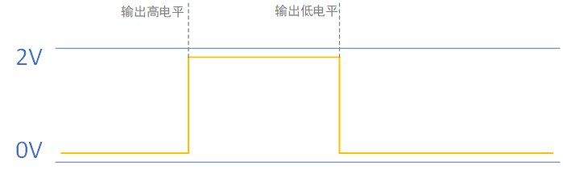
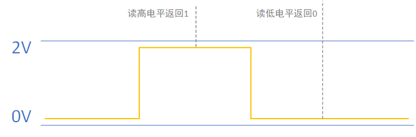
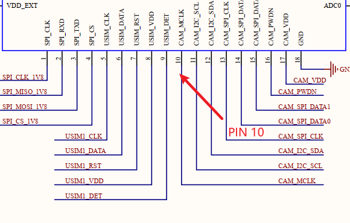
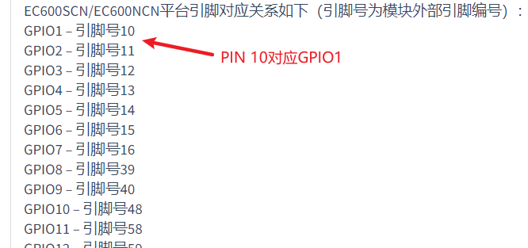
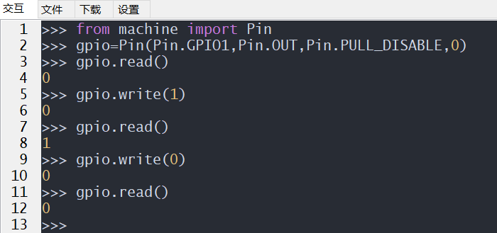
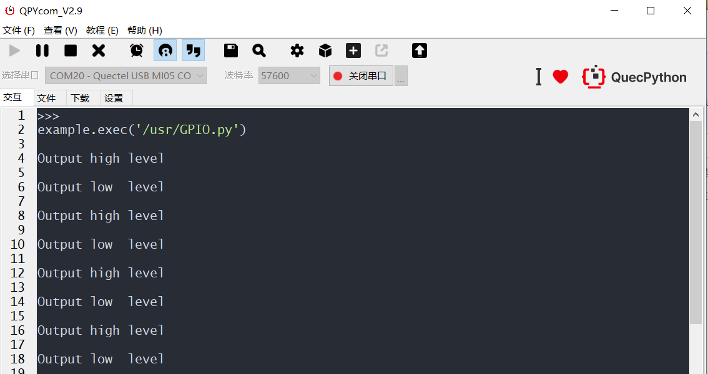

# BSP-GPIO应用开发

## GPIO概述	

​		GPIO：（General-purpose input/output），通用型之输入输出的简称。本文介绍如何使用QuecPython里的GPIO，GPIO通常用于连接驱动LED、蜂鸣器、继电器、读取外部IC的引脚电平状态等等.

### 功能描述

GPIO可以输出高电平、低电平两种状态，设置为1即高电平，0即为低电平



GPIO可以读取外部电平状态，读到高电平返回1，读到低电平返回0




###  API介绍

API链接：[PIN_API库](https://python.quectel.com/wiki/#/zh-cn/api/QuecPythonClasslib?id=pin)

### 快速开发

#### PIN对应关系

示列：

①查看原理图，找出按键PIN脚。(可咨询FAE获取或者Q群文件获取)



②查看wiki里的machine-硬件功能模块下的Pin模块，可查找到PIN脚对应的GPIO。




#### 命令行操作

使用QPYcom工具和模组进行交互，示例如下：

以EC600NCNLF为例，详情Pin接口链接：[QuecPython 类库 (quectel.com)](https://python.quectel.com/wiki/#/zh-cn/api/QuecPythonClasslib?id=pin)




#### 代码操作

```python
from machine import Pin
import utime

gpio1 = Pin(Pin.GPIO1, Pin.OUT, Pin.PULL_DISABLE, 0)
gpio2 = Pin(Pin.GPIO2, Pin.OUT, Pin.PULL_DISABLE, 0)
gpio3 = Pin(Pin.GPIO3, Pin.OUT, Pin.PULL_DISABLE, 0)

while True:
    gpio1.write(1)
    gpio2.write(1)
    gpio3.write(1)
    print('Output high level')
    utime.sleep_ms(500)
    gpio1.write(0)
    gpio2.write(0)
    gpio3.write(0)
    print('Output low  level')
    utime.sleep_ms(500)
```

把上面的代码编写成.py文件，使用QPYcom工具下载到模组里面运行，即可看到以下结果显示。




## 名词解释

低电平：通常用0来表示低电平

高电平：通常用1来表示高电平

浮空：Pin引脚直出，没有默认电平，处于不稳定状态

上拉：Pin引脚内部有个电阻拉到VCC，默认为高电平

下拉：Pin引脚内部有个电阻拉到GND，默认为低电平

输入：Pin引脚的电平状态随外部变化

输出：Pin引脚的电平驱动外围电路

