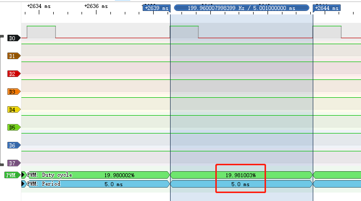

# BSP-PWM应用开发

## 什么是PWM

[PWM](https://baike.baidu.com/item/脉冲宽度调制/10813756?fromtitle=PWM&fromid=3034961&fr=aladdin)代表脉冲宽度调制（Pulse Width Modulation），是一种常见的电子信号调制技术。它通过改变信号的脉冲宽度来控制电路或设备的输出功率或速度。PWM信号是一个周期性的信号，包含一个固定频率的基准信号和一个可变的占空比信号。占空比指的是脉冲宽度与周期之间的比率，它控制着信号的平均电平，从而控制电路或设备的输出功率或速度。

PWM技术在电子工程、控制系统和机械工程等领域得到广泛应用。例如，在电机控制中，PWM信号可以用来控制电机的转速和转向。在电源管理中，PWM信号可以用来调节直流-直流转换器的输出电压和电流。在LED灯控制中，PWM信号可以用来控制LED的亮度和颜色。

需要注意的是，在使用PWM技术时，需要选择适当的频率和占空比，以满足具体应用的需求。同时，还需要考虑PWM信号的稳定性和噪声等因素，以确保电路或设备的正常运行和可靠性。

## 怎么使用PWM

使用PWM技术需要通过特定的电路或芯片来生成PWM信号，支持QuecPython开发的模组大部分都具有此功能，具体可见[PWM功能API文档](../../API_reference/zh/QuecPython类库/PWM.html)确认是否支持此功能，可以按照以下步骤进行：

### 硬件设计

根据上述[PWM功能API文档](../../API_reference/zh/QuecPython类库/machine.PWM.html)介绍的引脚号和模组的硬件设计文档(从[下载区](/download/)获取)设计好硬件电路即可。设计硬件电路注意需要注意电平转换，以及电平转换电路的最大输出频率。

如模组本身不支持或支持的数量不够用，则可以使用模组支持的任意一个[GPIO](../../API_reference/zh/QuecPython类库/machine.Pin.html)结合[定时器](../../API_reference/zh/QuecPython类库/machine.Timer.html)来粗略模拟输出PWM信号,硬件设计相同，软件实现可见下文。

### 软件应用

当使用模组自带PWM功能时：

```python
>>>from misc import PWM
>>>pwm = PWM(PWM.PWM0, PWM.ABOVE_MS, 1, 5)
>>>pwm.open()
```

当自行模拟PWM功能时需要注意QuecPython对于时序控制并不是很精确，请自行根据需求实现相关代码。

### PWM功能测试

在命令行中执行上面三行代码即可让模组的PWM0引脚输出一个周期为5ms，占空比为20%的方波，借助[逻辑分析仪](https://baike.baidu.com/item/逻辑分析仪/2364388?fr=aladdin)我们可以看到输出的波形。交互界面及逻辑分析仪获取到的波形如下图。




如上图所示，填写的参数和实际抓取到的波形是能够对应上的，有关API具体参数含义可以仔细阅读API介绍文档进行理解。

对于QuecPython的PWM API需要注意的是，填的参数不能超出填写范围，否则将会出现报错，这是常见问题。

一般使用PWM功能主要步骤是：

1. 设置PWM参数：根据具体应用需求，设置PWM信号的频率和占空比等参数。频率决定信号的周期，占空比决定信号的平均电平和电路或设备的输出功率或速度。对于QuecPython API，则需要填写高电平时间和周期来决定占空比和频率。即占空比=高电平时间/周期，频率=1秒/周期(单位：秒)。
2. 连接PWM输出：将PWM信号的输出端口连接到需要控制的电路或设备，如电机、LED等。通常需要使用适当的电路元件，如电容、电感、MOSFET或三极管等，来控制PWM信号的幅值和波形。
3. 调试和优化：根据实际情况，调试PWM电路或程序，以确保PWM信号的稳定性和准确性。可以通过示波器、数字万用表等仪器来监测PWM信号的波形和电平等参数，进行优化和调整。

需要注意的是，在使用PWM技术时，需要根据具体应用需求选择合适的PWM芯片或电路，即选择合适的模组，并合理设置参数和连接电路。同时，还需要注意PWM信号的稳定性、可靠性和噪声等因素，以确保电路或设备的正常运行和安全性。

### PWM功能应用实例

- 暂无。