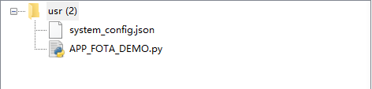
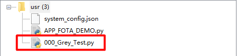

# OTA升级-文件

## 什么是OTA升级-文件

OTA：Over-the-Air Technology空中下载技术，是通过移动通信的空中接口实现对移动终端设备进行远程管理的技术。

OTA升级-文件就是利用这项技术对模块进行文件升级。在QuecPython中该功能接口为[APP_FOTA](../../../API_reference/zh/QuecPython类库/app_fota.html)。为阅读体验以下均命名为APP_FOTA。

## 怎么使用APP_FOTA

### 升级准备

在之前的引言中已经说到OTA升级需要使用到HTTP服务器作为升级内容的存放点。对于APP_FOTA而言，服务器需要存储客户需要升级文件内容。此部分工作由客户自主完成。目的就是得到一个可以访问下载到该文件的URL地址即可。

### 硬件设计

APP_FOTA升级主要为网络侧与模块内部交互，除前提条件模块需要组网成功外无需其他外围硬件支持。

### 软件应用

QuecPython中APP_FOTA功能支持单文件下载与批量文件下载。API接口分别为：**fota.download(url, file_name)**与**fota.bulk_download(info=[])**，有关API的详细介绍请参考[APP_FOTA](../../../API_reference/zh/QuecPython类库/app_fota.html)。

需要注意是：调用APP_FOTA接口后文件不是直接下载到**usr**分区（模块存放用户文件的分区），而是下载到一个临时的**.updater**文件夹中。该文件夹可能存在与**usr.updater**文件夹下，也可能存在于**./fota/usr/.updater**。但对于实际使用不需要关注这些。只需了解APP_FOTA后文件并非直接存在**usr**目录，需要**fota.set_update_flag()**设置升级标志位后重启模组才会自动将对应文件搬运至**usr**目录。

示例代码如下：

```python
import app_fota
from misc import Power
import utime as time


files = ["file_name"]
download_list = []
url = r"url"

for file in files:
    download_list.append({'url': (url + file), 'file_name': '/usr/%s' % file})

if download_list:
    print("downlist: %d\r\n" % len(download_list), download_list)
    fota = app_fota.new()
    result = fota.bulk_download(download_list)
    fota.set_update_flag()

    print("update ....", result)
    time.sleep(1)
    Power.powerRestart()  # 重启模块
```

注：`file_name`替换为需要下载的文件名加后缀一起。`url`替换为文件存放服务器的连接。

## APP_FOTA文件下载测试

使用QPYcom工具和模组进行交互，下载示例代码至模组进行运行。

APP_FOTA_DEMO运行前：



APP_FOTA_DEMO运行后：



