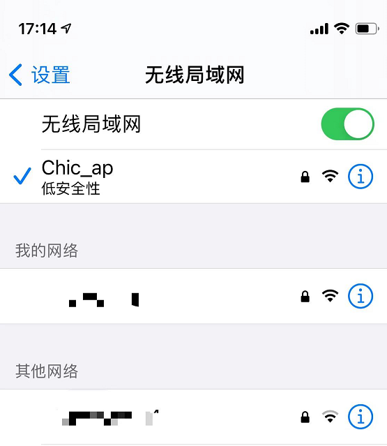

# 外挂WiFi应用开发

## 什么是外挂WiFi

由于模组主要功能是4G联网，自身并不具备WiFi联网功能，而对于某些应用场景既需要4G又需要WiFi，就可以用模组+外挂ESP8266来实现。

## 怎么使用外挂WiFi

### 硬件设计

准备一块模组和ESP8266，模组的UART：Rx、Tx、GND和ESP8266的Tx、Rx、GND交叉对接，注意电平需要匹配。本次实验使用的是“封”开发板，板子上的UART1和ESP8266已经连接好，可以直接使用。


应用电路可以参考QuecPython的开发板，开发板可以通过天猫旗舰店、京东旗舰店等移远通信官方销售渠道获取，开发板的硬件设计同样是参考的上述硬件文档。

### 软件应用

模组搭配ESP8266实现ap模式、station模式，还可以提供给用户配网的web模式。作为station模式时，还可以设置网卡走4G还是走WiFi。


## 外挂WiFi功能测试

以下逐个功能演示，
ap模式：

把ap.py和 WLAN.py文件下载到usr区，执行ap.py即可看到实验现象。

```python
from usr.WLAN import ESP8266
from machine import UART
import dataCall

# 初始化esp8266网卡
esp8266 = ESP8266(UART.UART1, ESP8266.AP)
# 启动esp8266以ap模式启动
esp8266.ap('Chic_ap', '123456999')
# 获取当前网卡状态 4表示网卡已启用，可以进行下一步操作
# 0: esp8266设备不存在
# 1: esp8266 station模式已连接
# 2: esp8266 station模式未连接
# 3: esp8266 web配网模式
# 4: esp8266 ap模式
esp8266.status()
# 获取拨号信息
Info = dataCall.getInfo(1, 0)
# 设置默认网卡
esp8266.set_default_NIC(Info[2][2])
# 添加路由信息，设置网卡转发规则，默认ap的网段192.168.4.0，子网掩码255.255.255.0
esp8266.router_add('192.168.4.0', '255.255.255.0')

# esp8266.ipconfig()
# esp8266.stop()

'''
UART.UART1
'''
```





station模式：

```python
from usr.WLAN import ESP8266
from machine import UART


# 初始化esp8266网卡
esp8266=ESP8266(UART.UART1, ESP8266.STA)
# 启动esp8266以staion模式启动
esp8266.station('iPhone 12 mini', '123456999')
# esp8266.station('QQ', '123456999')
# 获取当前网卡状态 4表示网卡已启用，可以进行下一步操作
# 0: esp8266设备不存在
# 1: esp8266 station模式已连接
# 2: esp8266 station模式未连接
# 3: esp8266 web配网模式
# 4: esp8266 ap模式
esp8266.status()
# 设置dns服务器地址
esp8266.set_dns('8.8.8.8', '114.114.114.114')
# 设置esp8266作为默认网卡，使用esp8266进行网络连接
ip = esp8266.ipconfig()[0]
esp8266.set_default_NIC(ip)

# esp8266.ipconfig()
# esp8266.stop()

'''
UART.UART1
'''
```


执行station.py后，可查询连接状态，返回1: esp8266 station模式已连接

```python
>>> esp8266.status()
1
>>> 
```


web模式：

```python
from usr.WLAN import ESP8266
from machine import UART

# 初始化esp8266网卡	
#若使用web配置ap模式，需把以下模式ESP8266设置为ESP8266.AP
esp8266=ESP8266(UART.UART1, ESP8266.STA)
# 使esp8266以web配网模式启动
esp8266.web_config('Chic_web','123456999')  # 配网网址：192.168.4.1
# 获取当前网卡状态 返回4表示已连接，可以使用esp8266进行下一步操作
# 0: esp8266设备不存在
# 1: esp8266 station模式已连接
# 2: esp8266 station模式未连接
# 3: esp8266 web配网模式
# 4: esp8266 ap模式
esp8266.status()
# 获取当前网卡状态 返回3表示web配网已启用，可以使用web配网模式

#使用手机等设备连接热点，使用浏览器进入网址192.168.4.1，进行配网

# esp8266.ipconfig()
# esp8266.stop()

'''
UART.UART1
'''
```

执行web.py之后，终端可以连接'Chic_web','123456999'，通过192.168.4.1进入web配网界面。
也可以通过http请求方式取代web界面，
使用get，http://192.168.4.1
使用post，http://192.168.4.1/ap_set 具体参数设置参考以下截图
使用post，http://192.168.4.1/station_set 具体参数设置参考以下截图

web配网之后ESP8266会自动重启连接，之后每次上电ESP8266就会自动连接。


## 外挂WiFi功能应用实例

[code](https://gitee.com/q767904101/quec-python_-code.git)

