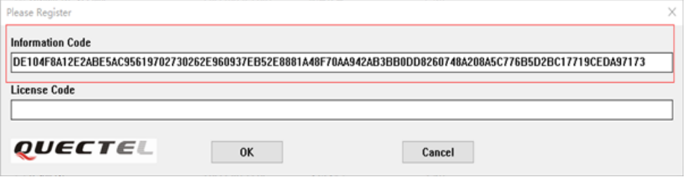

# 量产工具使用教程

量产工具使用教程主要介绍QMulti_DL_CMD 、Quectel_Customer_FW_Download_Tool这两个量产工具是如何使用的。

QMulti_DL_CMD 、Quectel_Customer_FW_Download_Tool这两个工具是多串口固件升级工具，最多可支持 8 个模块同时升级，且不需要特定夹具，通过Hub连接多个设备之后开机即可对[合并固件](https://python.quectel.com/doc/doc/Advanced_development/zh/Mass_production/index.html#%E5%90%88%E5%B9%B6%E6%9D%A1%E4%BB%B6)进行批量烧录，该工具无需安装便可直接运行，首次运行需注册与授权后方可正常使用。请[下载](https://python.quectel.com/download)之后运行工具弹出如下图所示提示框时，请复制并提供“Information Code”给技术支持人员申请“License Code”；申请成功后请输入“License Code”并点击“**OK**”完成工具授权。

注意事项：

1、工具和固件的存储路径不应包含任何空格、中文和特殊符号，否则可能导致升级失败，推荐使用英文字符；

2、固件包的存储/载入路径需是本地路径，不能使用 U 盘或网盘路径；

3、ASR平台系列需要把固件后缀改为.zip，RDA平台系列则不用修改固件后缀；

# 量产工具文档目录

[QMulti_DL使用教程](./QMulti_DL使用教程.md)

[Quectel_Customer_FW_Download_Tool使用教程](./Quectel_Customer_FW_Download_Tool使用教程.md)